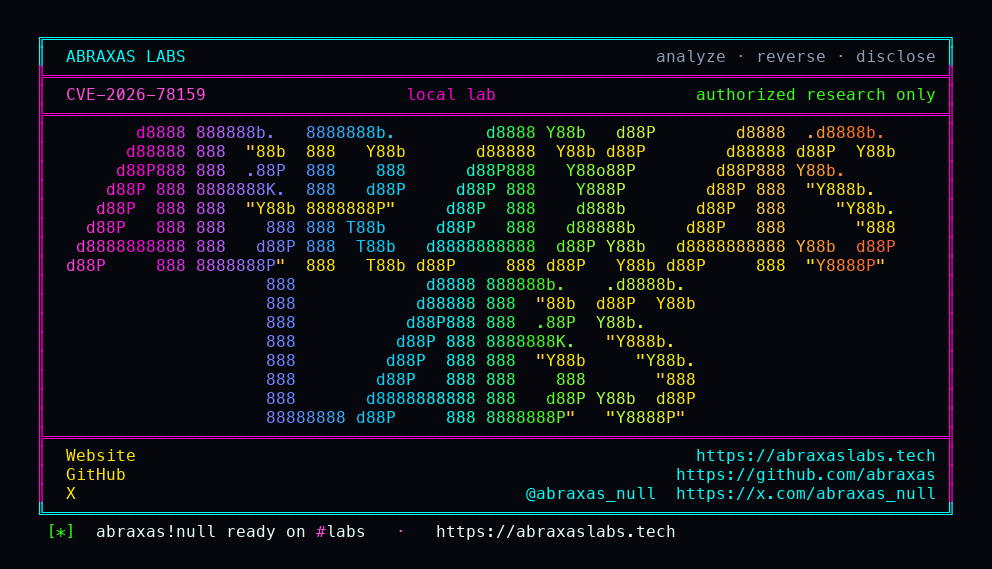

## 核对与使用边界

本文已按保存的全文审阅记录进行文字校订；本轮仅静态核对，未运行 PoC、请求目标或逐图验证。

适用条件与版本记录（来源主张，未列为明确更正的部分仍待权威资料核对）：&lt;=6.17.3fixed6.17.3.1;classictheme,V1singleevent path,comments/pendingpreview,emptyfeaturedlistbranch; canarymuplugin labonly

- **适用与权限边界（1）**：清楚说实验canary不是实际gadget且普通200不算命中，证据边界优于泛化RCE文章，应保留。按此限制解释本文结论，版本相同不足以证明所需角色、入口、配置、依赖或可控参数均已满足；原操作和失败记录一并保留。

- **结论使用边界（2）**：实际攻击不自带poc_witness函数，canary只证明任意可调用函数路径，需另有天然gadget才能完整RCE。此项限制直接适用于下文对应结论；现有正文不足以作更宽泛推论，所列方法和原始证据均保留。

- **结论使用边界（3）**：legacy-widget样例是伪JSON记法而非合法块标记，需标为示意。此项限制直接适用于下文对应结论；现有正文不足以作更宽泛推论，所列方法和原始证据均保留。

- **操作与副作用边界（4）**：6.17.3.1单漏洞修复与6.17.4.1覆盖另一漏洞已区分；应保留经典主题/空列表支路前提。保留原步骤及请求方法。执行条件包括隔离且获授权的可恢复环境、预先记录相关文件/账号/配置/业务记录状态；响应完成不能等同无副作用，恢复时须核对该操作涉及的实际对象。

- **证据待核（5）**：图片是封面非复现证据，本审未视觉核验；来源较完整。保留原引用、截图位置和实验叙述；本项所缺材料未被补造，截图存在或作者宣称成功都不等于已核验其内容。

历史原文标识：下文原技术材料按来源保留；仅本节明确确认的更正替代相应旧说法，标为待核的观察仍不是事实确认。

# （CVE-2026-78159）The Events Calendar未授权远程代码执行漏洞

一、漏洞简介
------------

2026年9月12日公开的 The Events Calendar 插件未授权远程代码执行漏洞（CVE-2026-78159，CVSS 3.1 9.8）。NVD 描述：该 WordPress 插件在 6.17.3 及之前所有版本中，经由 `parse_array` 函数存在远程代码执行漏洞。原因是 widget `classes` 映射校验不足，允许 plain-array 载荷绕过 `is_safe_widget_instance()` 的对象检查，到达 `Element_Classes::parse_array()` 中的 callable 调用 sink。利用要求目标站点的 tribe_events 文章开启评论，且已提交至少一条包含精心构造的 `wp:legacy-widget` 块的评论；当 `do_blocks()` 处理包含评论区的单 event HTML 时触发攻击链。



*上图：PoC 仓库封面（来源：abraxas/CVE-2026-78159，已本地化保存）。*

二、漏洞影响
------------

-   产品：The Events Calendar（WordPress 插件，厂商 stellarwp）
-   版本：**6.17.3 及之前所有版本**（修复版：**6.17.3.1** 及更新；PoC 作者注 Wordfence 建议 **6.17.4.1** 以同时覆盖 CVE-2026-78006）
-   组件/攻击向量：`Element_Classes::parse_array()`（`common/src/Tribe/Utils/Element_Classes.php`），经 `POST /wp-comments-post.php` 提交恶意评论触发
-   前提条件：**无认证**；需目标 tribe_events 文章开启评论、存在一条待审（unapproved）评论可被 moderation-hash 预览；实验环境要求经典主题（Twenty Twenty-One，区块主题会跳过该渲染路径）
-   CVSS：3.1 **9.8**（Critical），`AV:N/AC:L/PR:N/UI:N/S:U/C:H/I:H/A:H`；CWE-94（代码生成控制不当）

三、复现过程
------------

### 漏洞分析

以下为 PoC 仓库 README 的 Advisory 与调用链原文的忠实翻译整理（来源：https://github.com/abraxas/CVE-2026-78159）：

**Advisory（from the source map）**：`parse_array` 是 sink，而不是某个 ajax action。HTTP 路径是先 `POST /wp-comments-post.php`，再 `GET` moderation-preview URL。Widget 的 idBase 是 `tribe-widget-events-list`，不是 `events-list`。

**调用链（Call chain）**：

-   `GET /event/lab-event/` 仅用于采集 `comment_post_ID`；
-   `POST /wp-comments-post.php`，评论内容为 `<!-- wp:legacy-widget {idBase tribe-widget-events-list, instance.encoded php-serialize-base64, instance.hash 0} /-->`；
-   返回 `302`，`Location` 中包含 `unapproved=COMMENT_ID&moderation-hash=wp_hash(comment_date_gmt)`；
-   `GET` 该 `Location`：`comments_template` 会包含这条待审评论；
-   `Template_Bootstrap::get_v1_single_event_template_html` 执行 `do_blocks($html)`；
-   `Service_Provider::enable_rendering_widget_copied`（`render_block_data`）：以 `allowed_classes=false` 反序列化，`is_safe_widget_instance` 只拒绝对象、放行了 plain array，并对该数组做 `wp_hash`；
-   `render_block_core_legacy_widget` → `the_widget('tribe-widget-events-list')`；
-   `Widget_List::setup_arguments` 经 `array_merge` 合并 instance（`classes` 得以保留）；
-   特色 event 列表为空 → 进入 `widget-events-list.php` 的 else 分支 → `components/messages.php`；
-   `tec_classes($classes)` → `Element_Classes::parse_array`：字符串键 + `is_callable` 的值被直接调用 → 实验中的 `poc_witness_78159($results)` 回显 `POCWitness78159`，即为命中。

**判定标准（Witness）**：moderation-preview 的 `GET` 响应体中出现 `POCWitness78159` 才算成功；不带该字符串的普通 200 event HTML 不算命中。

### PoC（来源：https://github.com/abraxas/CVE-2026-78159，仅限授权测试）

该仓库为披露包（disclosure pack），非扫描器，包含 Python PoC 与本地复现实验栈：

```bash
# 启动本地实验环境（仅绑定 127.0.0.1）
cd lab
docker compose up --force-recreate

# 运行 PoC（目标仅限本地回环，如 http://127.0.0.1:8088）
python3 CVE-2026-78159-Abraxas-Labs.py
```

PoC 内置 `poc_witness_78159` 实验 canary（mu-plugin 函数，仅回显 `POCWitness78159`，不是真正的 gadget 链/反弹 shell），成功标志为响应体出现 witness 字符串。仓库 README 明确：不要把该脚本指向公网目标。

四、修复建议
------------

1.  立即将 The Events Calendar 升级到 **6.17.3.1** 或更新版本（PoC 作者注：Wordfence 建议 **6.17.4.1**，以同时覆盖 CVE-2026-78006）；
2.  升级后验证：对已 patch 的构建重跑 PoC，确认 witness 不再出现；核对部署树中的厂商 advisory / changeset；
3.  WAF 特征只能做延迟处置，不能替代补丁；无法立即升级时，禁用或隔离受影响组件（tribe_events 评论功能）。

### 附录

参考链接：

-   公开 PoC：https://github.com/abraxas/CVE-2026-78159
-   Wordfence：https://www.wordfence.com/threat-intel/vulnerabilities/id/cc2ccfeb-6df6-4fee-96a5-94f8dd131f7c?source=cve
-   NVD：https://nvd.nist.gov/vuln/detail/CVE-2026-78159
-   GHSA：https://github.com/advisories/GHSA-9c57-9fxg-8x9j
