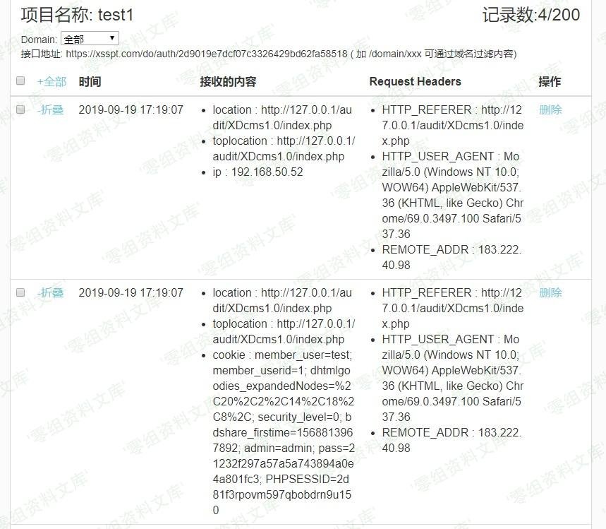

## 核对与使用边界

本文已按保存的全文审阅记录进行文字校订；本轮仅静态核对，未运行 PoC、请求目标或逐图验证。

适用条件与版本记录（来源主张，未列为明确更正的部分仍待权威资料核对）：permissiontotemplateedit;controlledfooterHTML renderedtovictims

- **适用与权限边界（1）**：管理员原本可编辑模板HTML插script可能是预期功能，未证明权限边界/CSRF，不足独立XSS定性。按此限制解释本文结论，版本相同不足以证明所需角色、入口、配置、依赖或可控参数均已满足；原操作和失败记录一并保留。

- **事实待核（2）**：前两图引用后台文件读目录，与606同图，需视觉核是否错配。该项尚不能从转载本身确定外部事实；下文相应编号、版本或修复说法只作为来源记录，不能据此判定部署受影响或已修复。明确更正另列于本节。

- **适用与权限边界（3）**：无版本外的角色/请求/payload/源码和修复来源，只有平台收信息结论。按此限制解释本文结论，版本相同不足以证明所需角色、入口、配置、依赖或可控参数均已满足；原操作和失败记录一并保留。

历史原文标识：下文原技术材料按来源保留；仅本节明确确认的更正替代相应旧说法，标为待核的观察仍不是事实确认。

# XDCMS 1.0 xss漏洞

一、漏洞简介
------------

二、漏洞影响
------------

XDCMS 1.0

三、复现过程
------------

漏洞文件：`system\modules\xdcms\template.php`，URL：`index.php?m=xdcms&c=template&f=edit&file=footer.html`

插入xss平台代码

成功接受到信息

