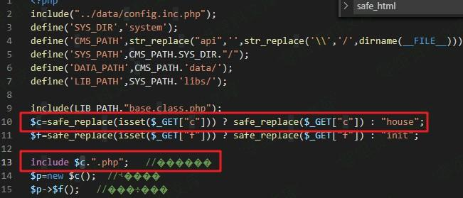
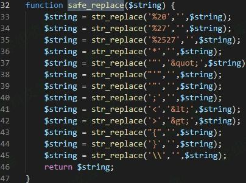

## 核对与使用边界

本文已按保存的全文审阅记录进行文字校订；本轮仅静态核对，未运行 PoC、请求目标或逐图验证。

适用条件与版本记录（来源主张，未列为明确更正的部分仍待权威资料核对）：legacyPHPnull-bytefilehandling; controllablec andexistingincludablefile; config/permissionsunknown

- **适用与权限边界（1）**：要求PHP&lt;5.3过粗，具体空字节修复边界需核，不能按整个5.3排除/包含。按此限制解释本文结论，版本相同不足以证明所需角色、入口、配置、依赖或可控参数均已满足；原操作和失败记录一并保留。

- **证据待核（2）**：c=xxxxxx%00dama.php既未给有效目标文件也未示PHP前后缀逻辑，无法独立证明任意包含。保留原引用、截图位置和实验叙述；本项所缺材料未被补造，截图存在或作者宣称成功都不等于已核验其内容。

- **事实待核（3）**：源码全图且安全过滤说明不通，无请求响应/修复/出处。该项尚不能从转载本身确定外部事实；下文相应编号、版本或修复说法只作为来源记录，不能据此判定部署受影响或已修复。明确更正另列于本节。

- **结论使用边界（4）**：需区分本地包含与远程包含，不因任意字样自动支持远程。此项限制直接适用于下文对应结论；现有正文不足以作更宽泛推论，所列方法和原始证据均保留。

历史原文标识：下文原技术材料按来源保留；仅本节明确确认的更正替代相应旧说法，标为待核的观察仍不是事实确认。

# XDCMS 1.0 任意文件包含漏洞

一、漏洞简介
------------

要求PHP版本小于5.3，否则无法使用%00截断

二、漏洞影响
------------

XDCMS 1.0

三、复现过程
------------

漏洞文件：`api\index.php`

安全过滤函数 发生鸡肋

很明显 %00截断

    http://www.0-sec.org/api/index.php?c=xxxxxx%00dama.php  
