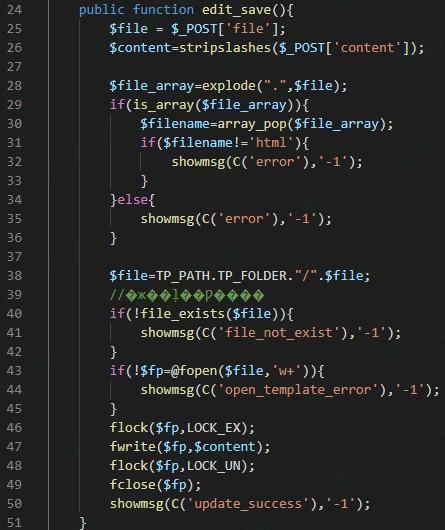
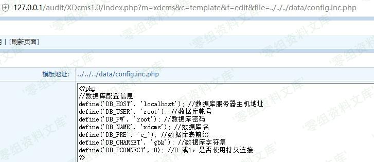

## 核对与使用边界

本文已按保存的全文审阅记录进行文字校订；本轮仅静态核对，未运行 PoC、请求目标或逐图验证。

适用条件与版本记录（来源主张，未列为明确更正的部分仍待权威资料核对）：installerpresent; validDBcredentials/permissions; attackercontrolsinsLockfile; destructiveinstallstep4

- **结论使用边界（1）**：文称重置锁变量0而PoCxyz0sec，其本质应是不存在锁路径，需完整extract/锁检查源码。此项限制直接适用于下文对应结论；现有正文不足以作更宽泛推论，所列方法和原始证据均保留。

- **结论使用边界（2）**：说step4及所需DB字段但URL未带，当前PoC只演示锁绕过非完整重装。此项限制直接适用于下文对应结论；现有正文不足以作更宽泛推论，所列方法和原始证据均保留。

- **事实待核（3）**：图均引用后台文件读目录606，可能复制错配需视觉核，不判资源缺失。该项尚不能从转载本身确定外部事实；下文相应编号、版本或修复说法只作为来源记录，不能据此判定部署受影响或已修复。明确更正另列于本节。

- **适用与权限边界（4）**：DB密码前提有明确说明应保留，重装可破坏现有数据；无来源/修复。按此限制解释本文结论，版本相同不足以证明所需角色、入口、配置、依赖或可控参数均已满足；原操作和失败记录一并保留。

历史原文标识：下文原技术材料按来源保留；仅本节明确确认的更正替代相应旧说法，标为待核的观察仍不是事实确认。

# XDCMS 1.0 重装系统漏洞

一、漏洞简介
------------

需要知道db密码

二、漏洞影响
------------

XDCMS 1.0

三、复现过程
------------

漏洞文件：`install/index.php` ，`line：12`

造成重装漏洞是由于12-14行存在变量覆盖漏洞，可以将`$insLockfile`变量重置为0

让step=4执行安装数据库，提供其中需要的变量。dbhost dbname dbuser dbpass
dbpre dblang adminuser adminpwd 。构造

    http://www.0-sec.org/install/?insLockfile=xyz0sec

不过db的用户及口令还需要借助其他方法获得。

