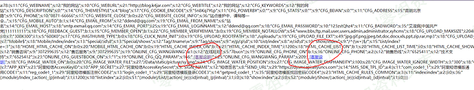
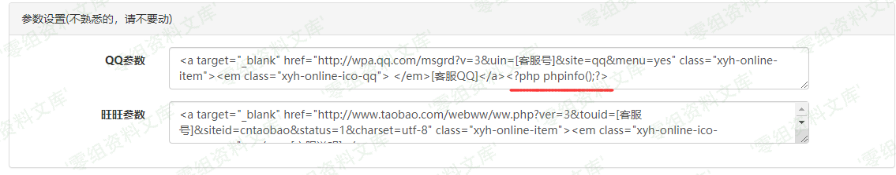
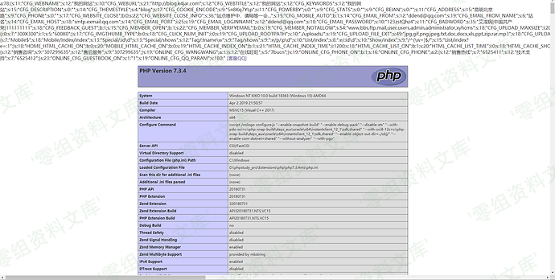

## 核对与使用边界

本文已按保存的全文审阅记录进行文字校订；本轮仅静态核对，未运行 PoC、请求目标或逐图验证。

适用条件与版本记录（来源主张，未列为明确更正的部分仍待权威资料核对）：backendconfigaccess; writablegeneratedsite.php; distinctunfilteredwritepoint unspecified

- **证据待核（1）**：所有具体源码/绕过参数仅图，文字只称另一写点没有定位，不能独立复现。保留原引用、截图位置和实验叙述；本项所缺材料未被补造，截图存在或作者宣称成功都不等于已核验其内容。

- **证据待核（2）**：图片后重复路径残片；来源为裸IP博客需原始CNVD公告核映射。保留原引用、截图位置和实验叙述；本项所缺材料未被补造，截图存在或作者宣称成功都不等于已核验其内容。

- **结论使用边界（3）**：与616/617同configPHP家族但本篇说未过滤另一写点，未可判同文重复。此项限制直接适用于下文对应结论；现有正文不足以作更宽泛推论，所列方法和原始证据均保留。

- **适用与权限边界（4）**：没有补丁/固定版本/最低角色。按此限制解释本文结论，版本相同不足以证明所需角色、入口、配置、依赖或可控参数均已满足；原操作和失败记录一并保留。

历史原文标识：下文原技术材料按来源保留；仅本节明确确认的更正替代相应旧说法，标为待核的观察仍不是事实确认。

XYHCMS 3.6 后台代码执行漏洞（一）
=================================

一、漏洞简介
------------

（CNVD-2020-03899）
XYHCMS后台存在代码执行漏洞，攻击者可利用该漏洞在site.php中增加恶意代码，从而可以获取目标终端的权限。

二、漏洞影响
------------

XYHCMS 3.6

三、复现过程
------------

搜索site.php 打开发现是一堆配置文件,这让我想起了前不久看到的一个漏洞所以就全局去找写入点

/media/rId24.png)

/media/rId25.png)

很显然这里是可以写入的,不过却没有这么简单

/media/rId26.png)

有过滤,所以我暂时放弃了'但是我找到一个其他的写入点并没有过滤

/media/rId27.png)

/media/rId28.png)

/media/rId29.png)

参考链接
--------

> http://101.200.56.59/cnvd-2020-03899%E5%88%86%E6%9E%90/
