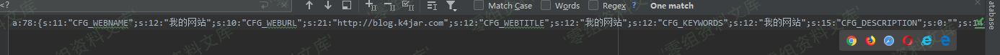
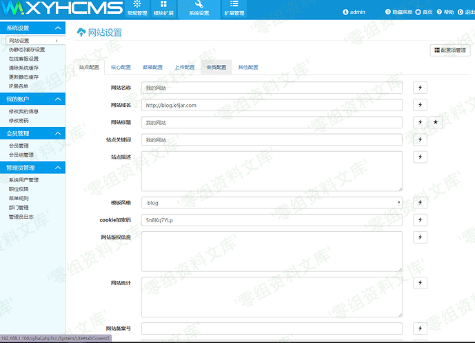

## 核对与使用边界

本文已按保存的全文审阅记录进行文字校订；本轮仅静态核对，未运行 PoC、请求目标或逐图验证。

适用条件与版本记录（来源主张，未列为明确更正的部分仍待权威资料核对）：backend role andwritablePHPlocation notshown; shortechotag supported

- **证据待核（1）**：全文技术只有&lt;?=phpinfo();?&gt;及两张图，无接口/参数/流程/结果文本。保留原引用、截图位置和实验叙述；本项所缺材料未被补造，截图存在或作者宣称成功都不等于已核验其内容。

- **证据待核（2）**：两图直接复用615前两图，需视觉核是否提供不同绕过而非错误复制。保留原引用、截图位置和实验叙述；本项所缺材料未被补造，截图存在或作者宣称成功都不等于已核验其内容。

- **事实待核（3）**：不可因shortecho与617shortopen不同就断定同文；缺CVE/CNVD原源与修复。该项尚不能从转载本身确定外部事实；下文相应编号、版本或修复说法只作为来源记录，不能据此判定部署受影响或已修复。明确更正另列于本节。

- **事实待核（4）**：短echo在不同PHP版本行为应说明，不等同依short_open_tag的&lt;?。该项尚不能从转载本身确定外部事实；下文相应编号、版本或修复说法只作为来源记录，不能据此判定部署受影响或已修复。明确更正另列于本节。

历史原文标识：下文原技术材料按来源保留；仅本节明确确认的更正替代相应旧说法，标为待核的观察仍不是事实确认。

# XYHCMS 3.6 后台代码执行漏洞（三）

一、漏洞简介
------------

二、漏洞影响
------------

XYHCMS 3.6

三、复现过程
------------

    <?=phpinfo();?>

/media/rId24.png)

/media/rId25.png)
