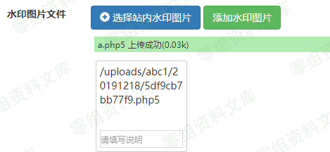

## 核对与使用边界

本文已按保存的全文审阅记录进行文字校订；本轮仅静态核对，未运行 PoC、请求目标或逐图验证。

适用条件与版本记录（来源主张，未列为明确更正的部分仍待权威资料核对）：admincanchangeallowedextensions; alternatePHPsuffixhandlerconfigured; uploadwriteable

- **适用与权限边界（1）**：明确php3/php4/php5/phtml需服务器解析是重要前提应保留。按此限制解释本文结论，版本相同不足以证明所需角色、入口、配置、依赖或可控参数均已满足；原操作和失败记录一并保留。

- **适用与权限边界（2）**：称只有.htaccess自动解析才行过窄，也可主服务器/vhost/PHPhandler配置；实际不限htaccess。按此限制解释本文结论，版本相同不足以证明所需角色、入口、配置、依赖或可控参数均已满足；原操作和失败记录一并保留。

- **证据待核（3）**：不点设置提交即上传的行为需区分扩展已保存与异步上传，完整请求未给。保留原引用、截图位置和实验叙述；本项所缺材料未被补造，截图存在或作者宣称成功都不等于已核验其内容。

- **事实待核（4）**：源码黑名单范围有用但缺修复/来源，图片后转换噪声。该项尚不能从转载本身确定外部事实；下文相应编号、版本或修复说法只作为来源记录，不能据此判定部署受影响或已修复。明确更正另列于本节。

历史原文标识：下文原技术材料按来源保留；仅本节明确确认的更正替代相应旧说法，标为待核的观察仍不是事实确认。

# XYHCMS 3.6 后台文件上传getshell（一）

一、漏洞简介
------------

对后缀过滤不严，未过滤php3-5，phtml（老版本直接未过滤php）

二、漏洞影响
------------

XYHCMS 3.6

三、复现过程
------------

### 漏洞分析

`/App/Manage/Controller/SystemController.class.php` Line 246-255

    if (!empty($data['CFG_UPLOAD_FILE_EXT'])) {
                    $data['CFG_UPLOAD_FILE_EXT'] = strtolower($data['CFG_UPLOAD_FILE_EXT']);
                    $_file_exts = explode(',', $data['CFG_UPLOAD_FILE_EXT']);
                    $_no_exts = array('php', 'asp', 'aspx', 'jsp');
                    foreach ($_file_exts as $ext) {
                        if (in_array($ext, $_no_exts)) {
                            $this->error('允许附件类型错误！不允许后缀为：php,asp,aspx,jsp！');
                        }
                    }
                }

### 漏洞复现

1.  进入后台

2.  系统设置-\>网站设置-\>上传配置-\>允许附件类型

3.  添加类型 `php3`或 `php4`或 `php5` 或 `phtml`

4.  点击下面的
    `水印图片上传`上传以上后缀shell，此时点不点提交都已经传入服务器

5.  之后会在图片部分显示上传路径    /media/rId26.png){width="5.833333333333333in"
    height="2.686567147856518in"}

6.  访问连接即可，只有网站配置了.htaccess自动解析php3-5与phtml的才能解析。
