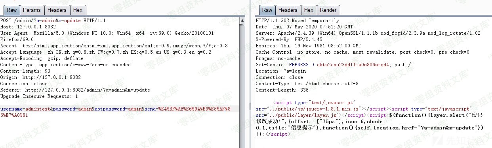
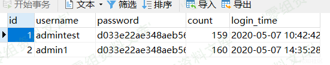

## 核对与使用边界

本文已按保存的全文审阅记录进行文字校订；本轮仅静态核对，未运行 PoC、请求目标或逐图验证。

适用条件与版本记录（来源主张，未列为明确更正的部分仍待权威资料核对）：routeaccessiblewithoutloginclaimed; POSTsend/name/password/notpassword; fixedadminID1

- **结论使用边界（1）**：标题任意管理员账号实际SQLWHEREid=1，只改固定首管理员，不是任意选定ID。此项限制直接适用于下文对应结论；现有正文不足以作更宽泛推论，所列方法和原始证据均保留。

- **证据待核（2）**：根因为授权缺失，不是拼SQL本身即可证明任意改密；空prepare不能防SQLi但那是额外未演示原语。保留原引用、截图位置和实验叙述；本项所缺材料未被补造，截图存在或作者宣称成功都不等于已核验其内容。

- **证据待核（3）**：完整更新函数有价值但外层路由鉴权未展示，URL/POST包只图。保留原引用、截图位置和实验叙述；本项所缺材料未被补造，截图存在或作者宣称成功都不等于已核验其内容。

- **凭据与会话边界（4）**：账号SHA1并非主要漏洞，需区分凭据更新影响与实现；原文xz精准无补丁。抓包中的会话不能视为未认证访问证明；可识别的真实会话值按中段星号遮罩处理，默认演示值和攻击语法保留。需重新取得授权测试会话，不能复用文中值。

历史原文标识：下文原技术材料按来源保留；仅本节明确确认的更正替代相应旧说法，标为待核的观察仍不是事实确认。

# YCCMS 3.4 未授权更改管理员账号密码

一、漏洞简介
------------

二、漏洞影响
------------

YCCMS 3.4

三、复现过程
------------

首先来看一下漏洞利用过程，在未登录的情况下构造url,只需要更改username
password notpassword的值即可更改数据库中admin账号的相关信息去数据库中查看发现已经更改了账号密码根据url来定位一下漏洞函数，函数位于controller\\AdminAction.class.php中的update函数

    public function update(){
            if(isset($_POST['send'])){
                if(validate::isNullString($_POST['username'])) Tool::t_back('用户名不能为空','?a=admin&m=update');
                if(validate::isNullString($_POST['password'])) Tool::t_back('密码不能为空!','?a=admin&m=update');
                if(!(validate::checkStrEquals($_POST['password'], $_POST['notpassword']))) Tool::t_back('两次密码不一致!','?a=admin&m=update');
                $this->_model->username=$_POST['username'];
                $this->_model->password=sha1($_POST['password']);
                $_edit=$this->_model->editAdmin();
                if($_edit){
                    tool::layer_alert('密码修改成功!','?a=admin&m=update',6);
                    }else{
                    tool::layer_alert('密码未修改!','?a=admin&m=update',6);
                }
            }

                $this->_tpl->assign('admin', $_SESSION['admin']);
                $this->_tpl->display('admin/public/update.tpl');
        }

可以看到前面都是一些判断，重点关注下editAdmin()函数，该函数位于model\\AdminModel.class.php

    public function editAdmin(){
            $_sql="UPDATE
                        my_admin
                    SET
                        username='$this->username',
                        password='$this->password'
                    WHERE
                        id=1
                    LIMIT 1";
            return parent::update($_sql);
        }

该函数的父类为Model, 位于model\\Model.class.php，看一下update函数

    protected function update($_sql){
            return $this->execute($_sql)->rowCount();
        }

调用execute函数去执行sql语句

    protected function execute($_sql){
            try{
                $_stmt=$this->_db->prepare($_sql);
                $_stmt->execute();
            }catch (PDOException $e){
                exit('SQL语句:'.$_sql.' 错误信息:'.$e->getMessage());
            }
            return $_stmt;
        }
    }

这一系列的操作主要是用来生成SQL语句然后执行SQL语句，editAdmin函数直接把传进来的username
password拼接到sql语句中，然后去更新相关表中id=1的数据，这也就造成了任意更改管理员账号密码

参考链接
--------

> https://xz.aliyun.com/t/7748\#toc-2
