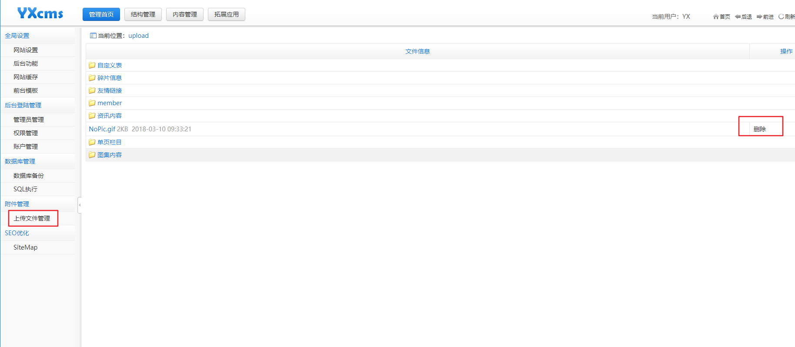
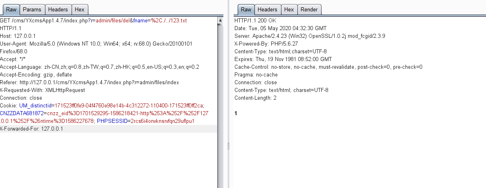

# YXCMS 1.4.7任意文件删除（一）

### 1.影响版本 ###
YXcms 1.4.7
###2. 复现过程 ###
这个漏洞是在后台

看到了这里有一个删除的按钮

点击删除，进行抓包：

通过控制fname参数可以实现任意文件删除的功能

**代码分析**

代码位置protected/apps/admin/controller/filesController.php：

    public function del()
    {
       $dirs=in($_GET['fname']);
       $dirs=str_replace(',','/',$dirs);
       $dirs=ROOT_PATH.'upload'.$dirs;
       if(is_dir($dirs)){del_dir($dirs); echo 1;} 
       elseif(file_exists($dirs)){
            if(unlink($dirs)) echo 1;
       }else echo '文件不存在'; 
    }
对fname进行替换操作str_replace(',','/',$dirs);
讲参数最前面的分号(%2C)替换为/

然后完整的拼接路径，看文件是否存在，存在就进行删除
这里没有读传入的参数进行过滤，
可以及逆行上跳目录，从而达到任意文件删除的效果

---

> 来源：白阁文库 BaizeSec/bylibrary
