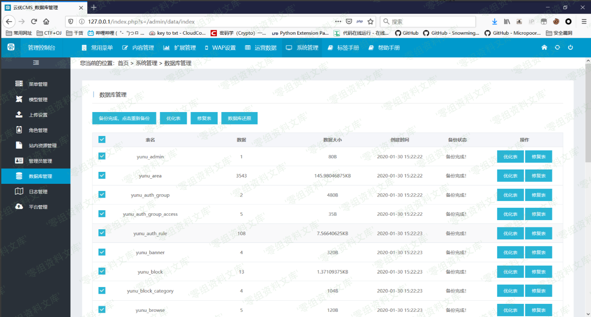
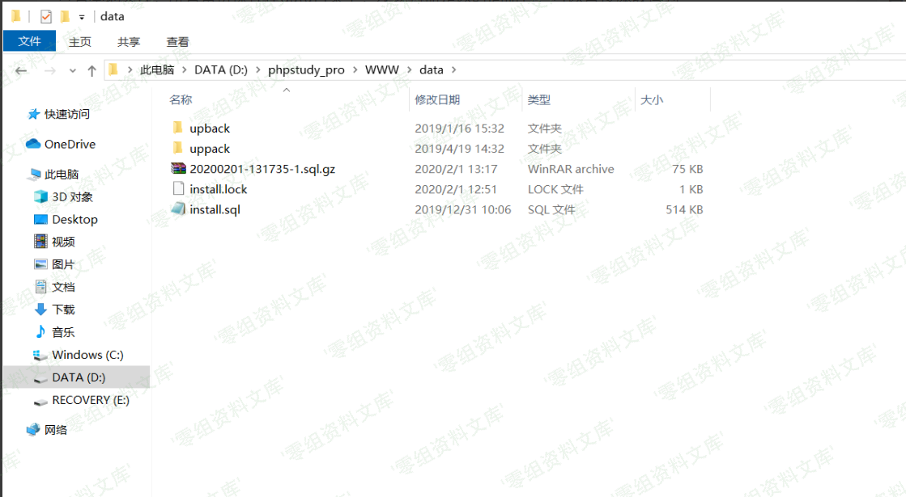
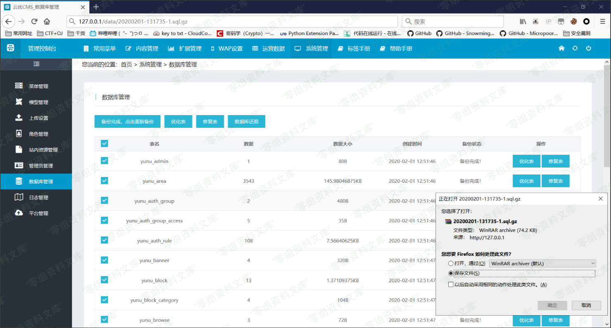
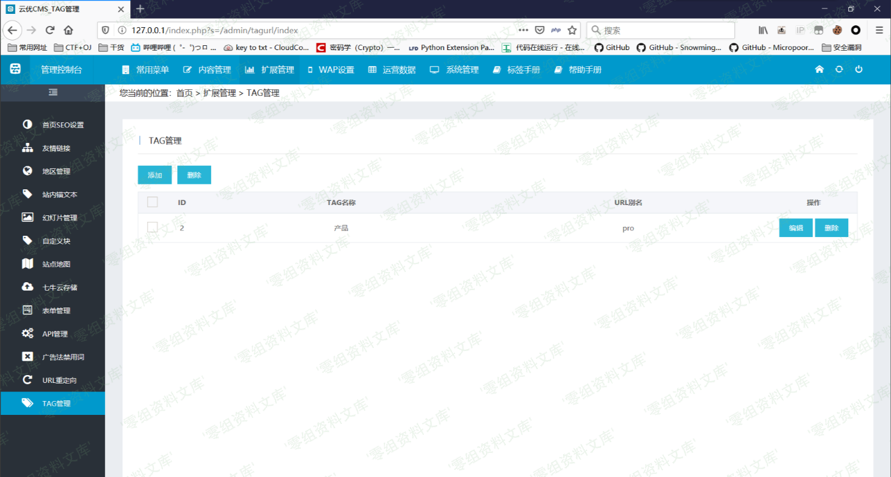
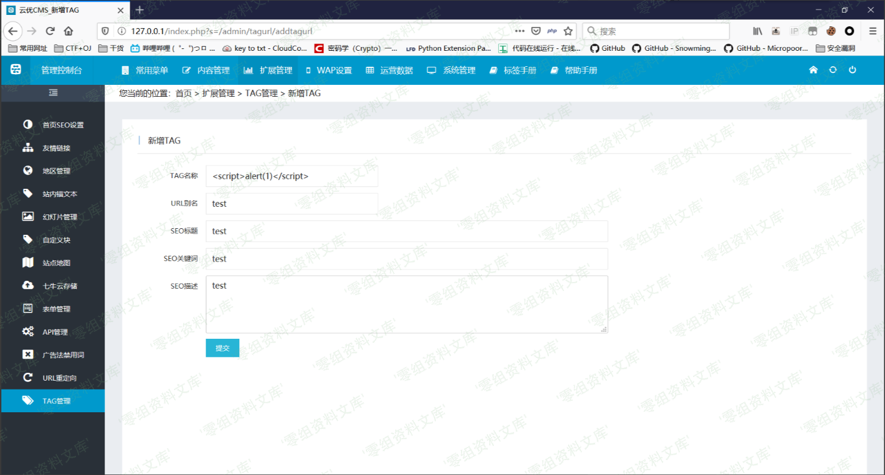
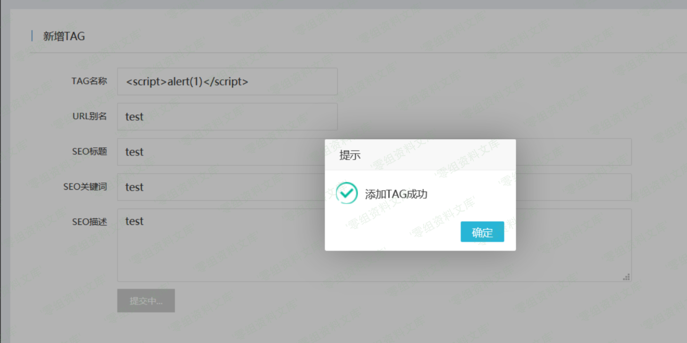
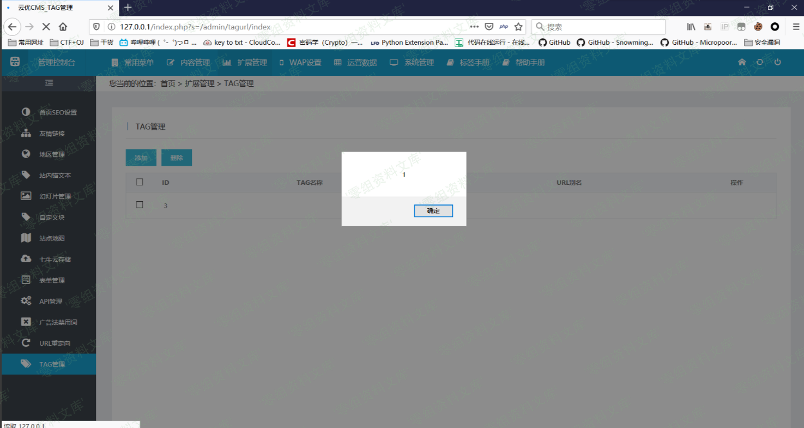
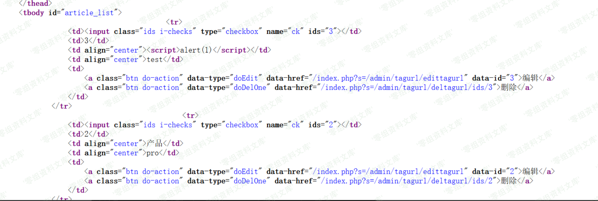

## 核对与使用边界

本文已按保存的全文审阅记录进行文字校订；本轮仅静态核对，未运行 PoC、请求目标或逐图验证。

适用条件与版本记录（来源主张，未列为明确更正的部分仍待权威资料核对）：backendtagmanage; victimrendersTAGlist; outputtemplateescapingnotshown

- **证据待核（1）**：一路追PDO参数绑定不能证明XSS，根因还需要TAG列表输出上下文/转义，缺该关键源码。保留原引用、截图位置和实验叙述；本项所缺材料未被补造，截图存在或作者宣称成功都不等于已核验其内容。

- **证据待核（2）**：官网链接错挂xz.aliyun.com/t/www.yunucms.com/...应校正。保留原引用、截图位置和实验叙述；本项所缺材料未被补造，截图存在或作者宣称成功都不等于已核验其内容。

- **证据待核（3）**：安装图复用数据库泄漏条目可属共用环境，但不能当XSS证据；末尾image缺结果。保留原引用、截图位置和实验叙述；本项所缺材料未被补造，截图存在或作者宣称成功都不等于已核验其内容。

- **适用与权限边界（4）**：payload仅截图，缺最低角色/修复/原始源。按此限制解释本文结论，版本相同不足以证明所需角色、入口、配置、依赖或可控参数均已满足；原操作和失败记录一并保留。

历史原文标识：下文原技术材料按来源保留；仅本节明确确认的更正替代相应旧说法，标为待核的观察仍不是事实确认。

# Yunucms v2.0.7 后台xss

一、漏洞简介
------------

云优CMS是一款基于TP5.0框架为核心开发的一套免费+开源的城市分站内容管理系统。云优CMS前身为远航CMS。云优CMS于2017年9月上线全新版本，二级域名分站，内容分站独立，七牛云存储，自定义字段，自定义表单，自定义栏目权限，自定义管理权限等众多功能深受用户青睐。

二、漏洞影响
------------

Yunucms v2.0.7

三、复现过程
------------

### 环境搭建

从[官网](https://xz.aliyun.com/t/www.yunucms.com/Buy/program.html)下载源码并进行过安装

需要注意的是需要填云账号，我去官网注册了一个随便填上了，账号testqwe，密码123456，手机号利用的在线短信注册的

填上MySQL密码即可

前台界面

### 漏洞分析

    http://www.0-sec.org/index.php?s=/admin/tagurl/addtagurl

该cms路由为`目录/文件/方法`，直接查看方法

    public function addTagurl()
        {
            if(request()->isAjax()){ # 判断是否是ajax请求
                $param = input('post.'); # 获取参数
                $tagurl = new TagurlModel();
                $flag = $tagurl->insertTagurl($param); # 将结果进行保存并返回响应
                return json(['code' => $flag['code'], 'data' => $flag['data'], 'msg' => $flag['msg']]);
            }
            return $this->fetch();
        }

跟进insertTagurl方法

    public function insertTagurl($param)
        {
            try{
                $result = $this->allowField(true)->save($param); # 保存当前数据对象
                if(false === $result){            
                    return ['code' => -1, 'data' => '', 'msg' => $this->getError()];
                }else{
                    return ['code' => 1, 'data' => '', 'msg' => '添加TAG成功'];
                }
            }catch( PDOException $e){
                return ['code' => -2, 'data' => '', 'msg' => $e->getMessage()];
            }
        }

继续跟进save方法

    if (!empty($data)) {
                // 数据自动验证
                if (!$this->validateData($data)) { # 验证集为空，直接返回true
                    return false;
                }
                // 数据对象赋值
                foreach ($data as $key => $value) {
                    $this->setAttr($key, $value, $data); # 将参数赋值给$this->data数组
                }
                if (!empty($where)) {
                    $this->isUpdate = true;
                }
            }

    ......        

    $result = $this->getQuery()->insert($this->data);

    ......
    ``

validateData方法需要验证集，而本身没有传入

    protected function validateData($data, $rule = null, $batch = null)
        {
            $info = is_null($rule) ? $this->validate : $rule;

            if (!empty($info)) {
                ......
            }
            return true;
        }

且`$this->validate`参数为空，因此直接返回true

跟进insert方法

    .....
            // 生成SQL语句
            $sql = $this->builder->insert($data, $options, $replace);
            $bind = $this->getBind();
            if ($options['fetch_sql']) {
                // 获取实际执行的SQL语句
                return $this->connection->getRealSql($sql, $bind);
            }

            // 执行操作
            $result = $this->execute($sql, $bind);

fetch\_sql变量为false，跟进execute方法

    ......
        if ($procedure) { # false
                    $this->bindParam($bind);
                } else {
                    $this->bindValue($bind);
                }
    ......

最后跟进参数绑定方法

    protected function bindValue(array $bind = [])
        {
            foreach ($bind as $key => $val) {
                // 占位符
                $param = is_numeric($key) ? $key + 1 : ':' . $key;
                if (is_array($val)) {
                    if (PDO::PARAM_INT == $val[1] && '' === $val[0]) {
                        $val[0] = 0;
                    }
                    $result = $this->PDOStatement->bindValue($param, $val[0], $val[1]);
                } else {
                    $result = $this->PDOStatement->bindValue($param, $val);
                }
                if (!$result) {
                    throw new BindParamException(
                        "Error occurred  when binding parameters '{$param}'",
                        $this->config,
                        $this->getLastsql(),
                        $bind
                    );
                }
            }
        }

可以看到最后是调用PDO对象对参数进行的绑定，除此之外并没有任何过滤，因此XSS代码可插入并执行

### 漏洞复现

后台TAG管理模块

进行添加TAG

在名称处填入XSS代码并提交

返回模块即可看到效果

查看源码，发现已经插入

查看数据库

image
