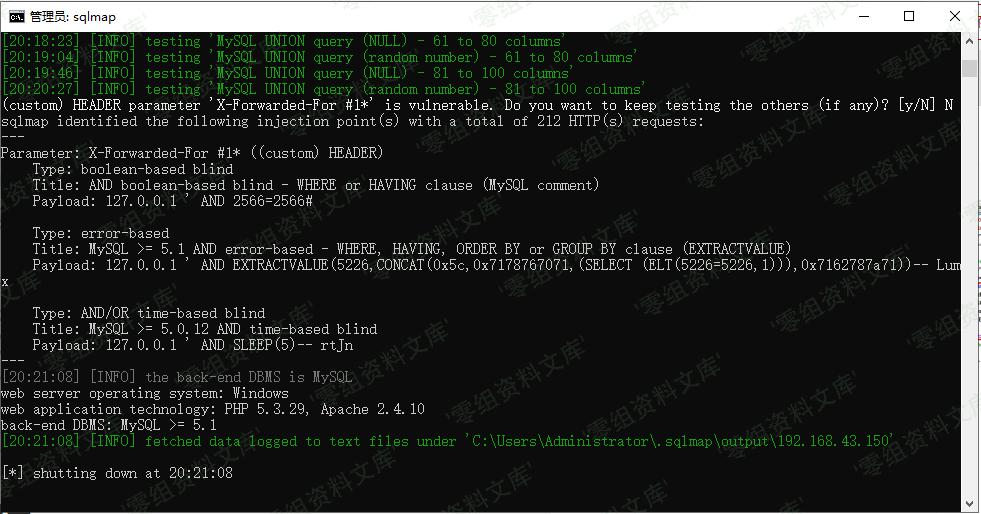

## 核对与使用边界

本文已按保存的全文审阅记录进行文字校订；本轮仅静态核对，未运行 PoC、请求目标或逐图验证。

适用条件与版本记录（来源主张，未列为明确更正的部分仍待权威资料核对）：publicadminlogin; getiptrustsattackerheader; DBerrorvisible; ratefailcheckreachable

- **证据待核（1）**：关键getip取哪个头只截图，正文未给XFF/Client-IP等字段，不能独立重放。保留原引用、截图位置和实验叙述；本项所缺材料未被补造，截图存在或作者宣称成功都不等于已核验其内容。

- **证据待核（2）**：有SQL拼接ip但完整报文/结果仅图；sqlmap-r依赖未提供文件。保留原引用、截图位置和实验叙述；本项所缺材料未被补造，截图存在或作者宣称成功都不等于已核验其内容。

- **证据待核（3）**：URL?c=login&amp;=换行1残缺；图片尾部路径重复。保留原引用、截图位置和实验叙述；本项所缺材料未被补造，截图存在或作者宣称成功都不等于已核验其内容。

- **事实待核（4）**：前台含义是未登录后台入口非普通前台页面，应精确命名；无修复，来源转载。该项尚不能从转载本身确定外部事实；下文相应编号、版本或修复说法只作为来源记录，不能据此判定部署受影响或已修复。明确更正另列于本节。

历史原文标识：下文原技术材料按来源保留；仅本节明确确认的更正替代相应旧说法，标为待核的观察仍不是事实确认。

# Yunyecms V2.0.2 前台注入漏洞（一）

一、漏洞简介
------------

云业CMS内容管理系统是由云业信息科技开发的一款专门用于中小企业网站建设的PHP开源CMS，可用来快速建设一个品牌官网(PC，手机，微信都能访问)，后台功能强大，安全稳定，操作简单。

二、漏洞影响
------------

yunyecms 2.0.2

三、复现过程
------------

### 漏洞分析

下载源码，搭建起来，打开登录页面。

    http://127.0.0.1/yunyecms_2.0.2/admin.php?c=login&=
    1

打开Seay源Code Auditing工具，分析代码。经过一番寻找与"提示"，发现getip()方法获取ip没有进行过滤，可能有戏。

/media/rId25.png)

搜索getip()函数，发现login.php调用了该函数，变量为\$logiparr。

/media/rId26.png)

跟踪该变量，发现CheckLoginTimes函数调用该变量。

/media/rId27.png)

去到该函数定义处，发现我们的ip变量没有进行任何过滤直接由GetCount函数执行。

/media/rId28.png)

### 漏洞发现

    $cnt=$this->db->GetCount("select count(*) as total from `#yunyecms_adminloginfail`  where ip='$ip' and failtimes>=".ADMLOGIN_MINUTES." and lastlogintime>$checktime limit 1");

可以看出，我们可以构造该ip变量达到注入目的，打开burp抓包。

/media/rId30.png)

发送到Repeater模块，构造参数，可以看到sql报错。

/media/rId31.png)

进一步利用，得到数据库名称，漏洞存在。

/media/rId32.png)

### 漏洞利用

将抓的包保存下来，使用sqlmap去跑就可以了。

    sqlmap.py -r C:\Users\Administrator\Desktop\yunye.txt --batch

/media/rId34.png)

参考链接
--------

> http://www.freesion.com/article/7074313754/
