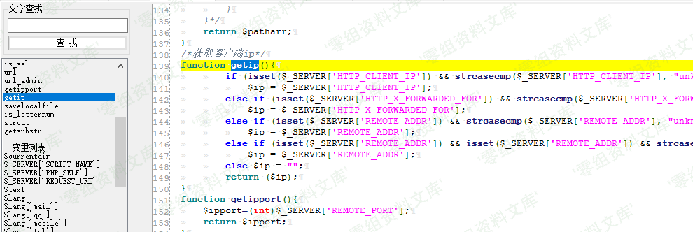
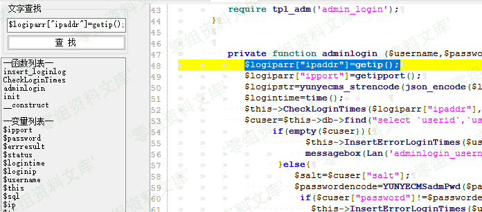
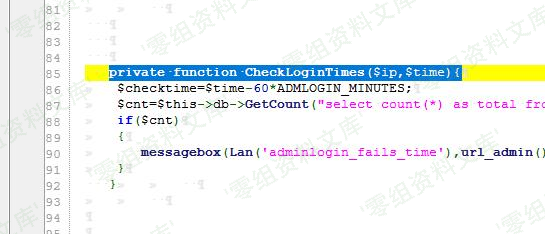
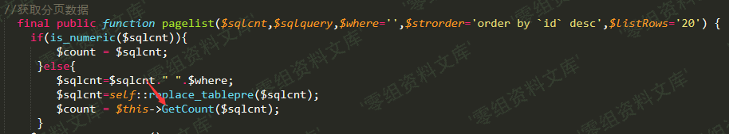
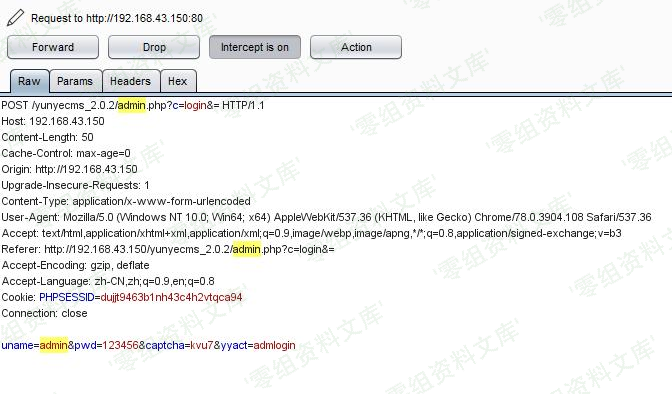
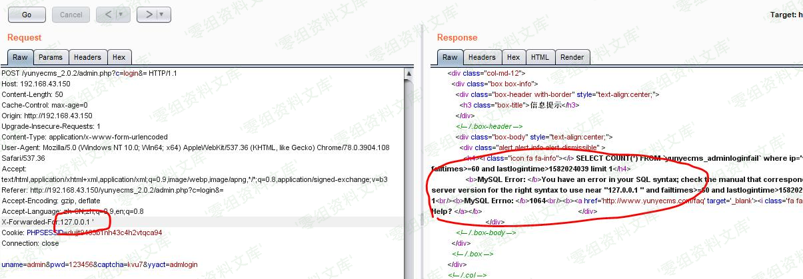

## 核对与使用边界

本文已按保存的全文审阅记录进行文字校订；本轮仅静态核对，未运行 PoC、请求目标或逐图验证。

适用条件与版本记录（来源主张，未列为明确更正的部分仍待权威资料核对）：backenddepartmentedit;newdepartmentname differsold; rawid;DBerrorvisibility

- **适用与权限边界（1）**：明确新旧部门名不同才进入查询，是关键前提应保留。按此限制解释本文结论，版本相同不足以证明所需角色、入口、配置、依赖或可控参数均已满足；原操作和失败记录一并保留。

- **代码与转录边界（2）**：源码路径deparment拼写需核；完整请求/payload仅图，sqlmap-r文件未提供。相应原代码作为存在此问题的历史样本保留，不能直接当作可运行、成功复现的 PoC；缺失内容需回原稿核对，不据此补造可执行攻击链。

- **证据待核（3）**：多图借前台一/二目录，需核内容而非判缺失。保留原引用、截图位置和实验叙述；本项所缺材料未被补造，截图存在或作者宣称成功都不等于已核验其内容。

- **事实待核（4）**：641同函数/id根因的缩略稿，宜合并此更完整版本；缺修复源。该项尚不能从转载本身确定外部事实；下文相应编号、版本或修复说法只作为来源记录，不能据此判定部署受影响或已修复。明确更正另列于本节。

历史原文标识：下文原技术材料按来源保留；仅本节明确确认的更正替代相应旧说法，标为待核的观察仍不是事实确认。

# Yunyecms V2.0.2 后台注入漏洞（一）

一、漏洞简介
------------

云业CMS内容管理系统是由云业信息科技开发的一款专门用于中小企业网站建设的PHP开源CMS，可用来快速建设一个品牌官网(PC，手机，微信都能访问)，后台功能强大，安全稳定，操作简单。

二、漏洞影响
------------

yunyecms 2.0.2

三、复现过程
------------

### 漏洞分析

废话不多说，又经过一番寻找与"提示"，发现core/admin/deparment.php文件，其中id值是通过post直接获取的，然后被edit\_admin\_department()调用。

/media/rId25.png)

去到edit\_admin\_department()函数定义处，发现过滤语句。

/media/rId26.png)

但是仔细一看，发现代码只是过滤了departmentname和olddepartmentname两个变量，放过了我们的id变量，只是判断id值是否为空。

    if($departmentname!=$olddepartmentname){
            $num=$this->db->GetCount("select count(*) as total from `#yunyecms_department` where departmentname='$departmentname' and departmentid<>$id limit 1");
            if($num){ messagebox(Lan('department_already_exist'),url_admin('department_add','','',$this->hashurl['usvg']),"warn"); }
    }

从代码可以看出，如果departmentname的值不等于olddepartmentname，就执行sql语句，我们的id值没有任何过滤出现在sql语句中，应该有注入无疑了。

### 漏洞复现

来到core/admin/deparment.php所在的页面，即后台的部门管理处。

/media/rId28.png)

修改部门名字，只要前后名字不一致即可，使用burp抓包。

/media/rId29.png)

发送到Repeater模块，构造参数，可以看到sql报错。

/media/rId30.png)

不想动手，就扔到sqlmap去跑就完事了。

    sqlmap.py -r C:\Users\Administrator\Desktop\yunye.txt --batch

/media/rId31.png)

参考链接
--------

> http://www.freesion.com/article/9029315473/
