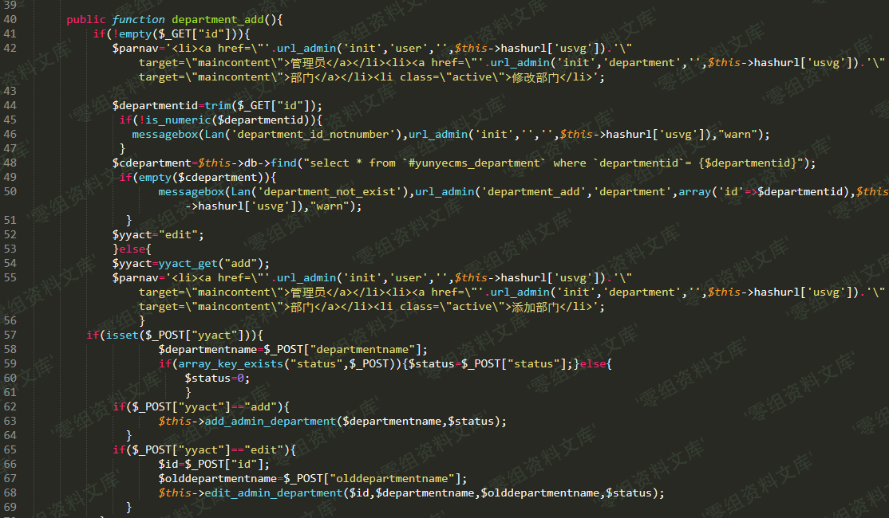

## 核对与使用边界

本文已按保存的全文审阅记录进行文字校订；本轮仅静态核对，未运行 PoC、请求目标或逐图验证。

适用条件与版本记录（来源主张，未列为明确更正的部分仍待权威资料核对）：backenddepartmentedit;idunfiltered; conditionalnewnamebranchomitted

- **适用与权限边界（1）**：与640同edit_admin_department/id根因，没有独立新增入口证据。按此限制解释本文结论，版本相同不足以证明所需角色、入口、配置、依赖或可控参数均已满足；原操作和失败记录一并保留。

- **证据待核（2）**：入口文件/函数被***掩码，三张截图无payload/结果文字。保留原引用、截图位置和实验叙述；本项所缺材料未被补造，截图存在或作者宣称成功都不等于已核验其内容。

- **结论使用边界（3）**：遗漏640新旧名不一致必要分支，合并时应取640。此项限制直接适用于下文对应结论；现有正文不足以作更宽泛推论，所列方法和原始证据均保留。

- **事实待核（4）**：图借其他条目且尾路径重复，无来源/修复。该项尚不能从转载本身确定外部事实；下文相应编号、版本或修复说法只作为来源记录，不能据此判定部署受影响或已修复。明确更正另列于本节。

历史原文标识：下文原技术材料按来源保留；仅本节明确确认的更正替代相应旧说法，标为待核的观察仍不是事实确认。

# Yunyecms V2.0.2 后台注入漏洞（二）

一、漏洞简介
------------

云业CMS内容管理系统是由云业信息科技开发的一款专门用于中小企业网站建设的PHP开源CMS，可用来快速建设一个品牌官网(PC，手机，微信都能访问)，后台功能强大，安全稳定，操作简单。

二、漏洞影响
------------

yunyecms 2.0.2

三、复现过程
------------

漏洞出现在在后台文件de`***.php中，`de`***_add`函数对GET和POST参数先进行了是否empty判断，最终将传入的几个参数传给了edit\_admin\_department。

/media/rId24.png)

跟入edit\_admin\_department，对参数依次进行了处理，但是发现只有`$departmentname,$olddepartmentname`进行了usafestr安全过滤，漏网的`$id`拼接到了sql语句中执行。

/media/rId25.png)

最终导致了SQL注入。

/media/rId26.png)
