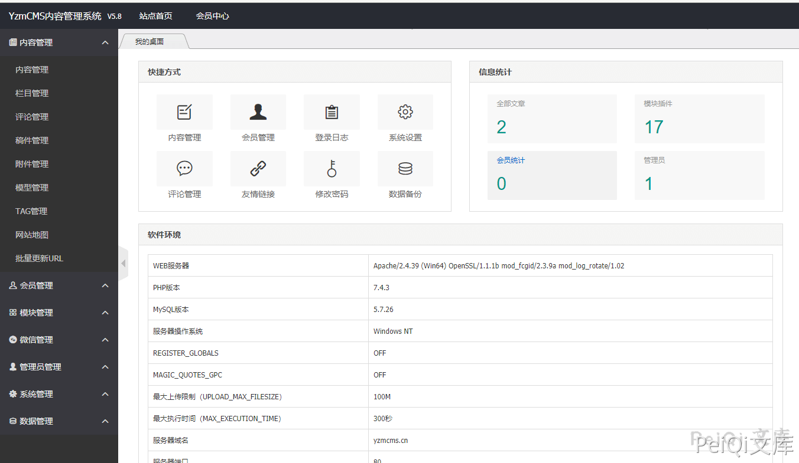
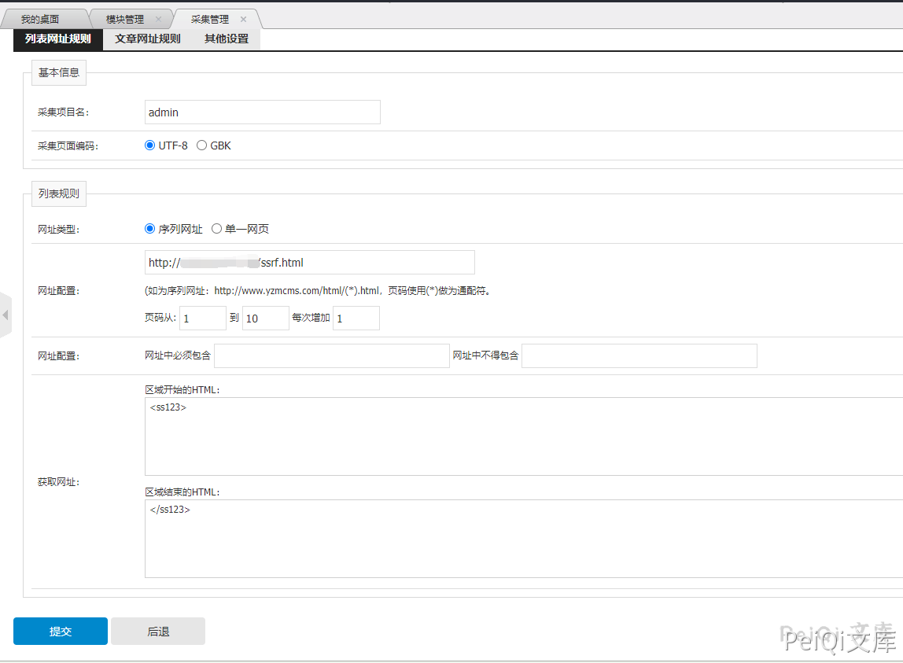
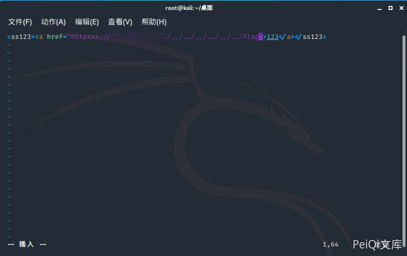
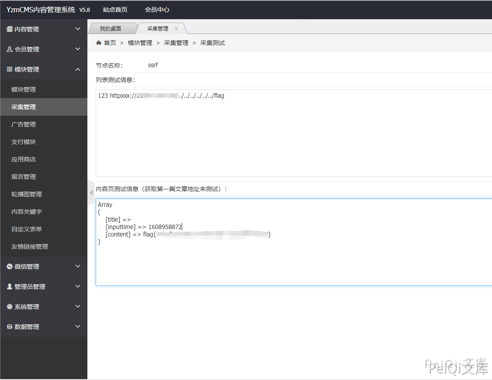
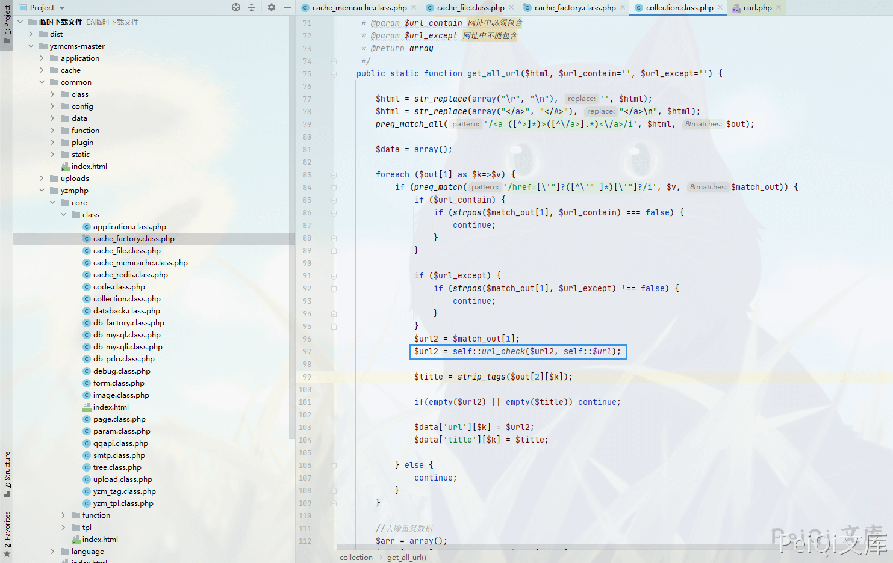
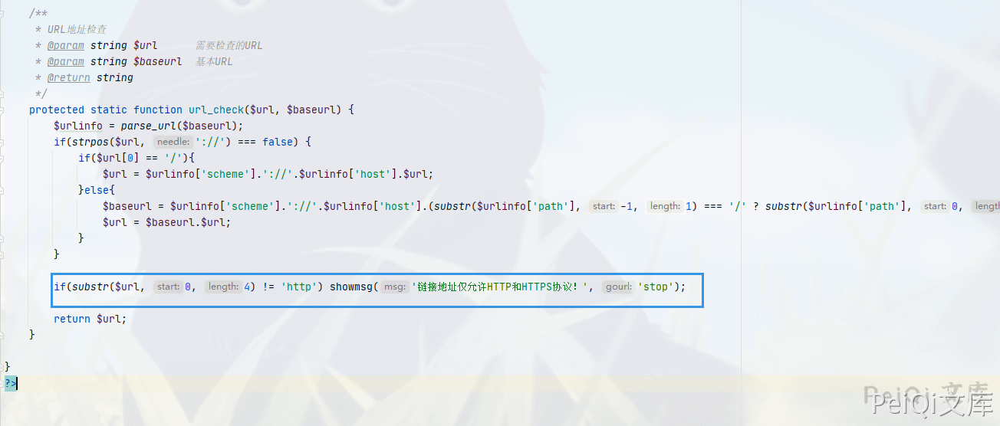

## 核对与使用边界

本文已按保存的全文审阅记录进行文字校订；本轮仅静态核对，未运行 PoC、请求目标或逐图验证。

适用条件与版本记录（来源主张，未列为明确更正的部分仍待权威资料核对）：backendcollection;controlledremoteHTML; nonstandardprefix/localpath handling mustverify

- **证据待核（1）**：只说httpxxx通过前四字符检查不等于有效受支持wrapper或可读本地文件，缺真正payload/规范化路径。保留原引用、截图位置和实验叙述；本项所缺材料未被补造，截图存在或作者宣称成功都不等于已核验其内容。

- **结论使用边界（2）**：漏洞位置写cache_factory.class.php与采集url_check职责不一致，需核原issue。此项限制直接适用于下文对应结论；现有正文不足以作更宽泛推论，所列方法和原始证据均保留。

- **适用与权限边界（3）**：配置/HTML/结果全图无请求或Flag路径文本，缺完整复现。按此限制解释本文结论，版本相同不足以证明所需角色、入口、配置、依赖或可控参数均已满足；原操作和失败记录一并保留。

- **事实待核（4）**：与643同家族不同版本/过滤，应保留区分，有GitHubissue53原始定位。该项尚不能从转载本身确定外部事实；下文相应编号、版本或修复说法只作为来源记录，不能据此判定部署受影响或已修复。明确更正另列于本节。

历史原文标识：下文原技术材料按来源保留；仅本节明确确认的更正替代相应旧说法，标为待核的观察仍不是事实确认。

# YzmCMS Version 小于V5.8正式版 后台采集模块 SSRF漏洞

## 漏洞描述

[YzmCMS内容管理系统](https://www.yzmcms.com/)是一款**轻量级开源内容管理系统**，它采用自主研发的框架**YZMPHP**开发。程序基于PHP+Mysql架构，并采用MVC框架式开发的一款高效开源的内容管理系统，可运行在Linux、Windows、MacOSX、Solaris等各种平台上。

源码存在协议识别的缺陷，导致存在SSRF漏洞

参考阅读：

- [There are SSRF vulnerabilities in background collection management](https://github.com/yzmcms/yzmcms/issues/53)

## 漏洞影响

```
YzmCMS version <  V5.8正式版
```

## 环境搭建

https://github.com/yzmcms/yzmcms

按照文档安装即可




## 漏洞复现

登录后台 --> 模块管理 --> 采集管理

添加采集规则




在你的服务器上编辑HTML代码




- 根目录可能不同，payload需要更改

点击采集读取根目录下的 Flag





出现漏洞的代码位置 `yzmcms/yzmphp/core/class/cache_factory.class.php`




这里调用 ***url_check*** 函数




可以看到这里只检测了前4位是否为 http，使用 httpxxx 即可绕过


---

> 来源：Threekiii/Vulnerability-Wiki（https://github.com/Threekiii/Vulnerability-Wiki）
