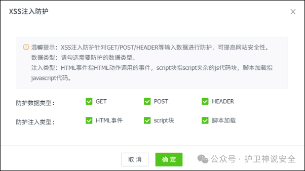

## 核对与使用边界

本文已按保存的全文审阅记录进行文字校订；本轮仅静态核对，未运行 PoC、请求目标或逐图验证。

适用条件与版本记录（来源主张，未列为明确更正的部分仍待权威资料核对）：message.tpl gourl;authentication/outputcontextunspecified

- **事实待核（1）**：把CMS称插件，产品层级错词；最新/尚无补丁需2025-05-09历史基准。该项尚不能从转载本身确定外部事实；下文相应编号、版本或修复说法只作为来源记录，不能据此判定部署受影响或已修复。明确更正另列于本节。

- **来源与引用处置（2）**：防护系统对所有XSS有效是无证据绝对广告，不能当修复。保留这部分来源材料并与技术结论分开；其引用或宣传内容不能补足本文漏洞的证据。

- **事实待核（3）**：没有路由/payload/源码/原始CNVD或CVE链接，只有gourl线索。该项尚不能从转载本身确定外部事实；下文相应编号、版本或修复说法只作为来源记录，不能据此判定部署受影响或已修复。明确更正另列于本节。

- **结论使用边界（4）**：影响7.1单版不是已核全部范围。此项限制直接适用于下文对应结论；现有正文不足以作更宽泛推论，所列方法和原始证据均保留。

历史原文标识：下文原技术材料按来源保留；仅本节明确确认的更正替代相应旧说法，标为待核的观察仍不是事实确认。

#  YzmCMS最新跨站脚本漏洞及解决方法（CNVD-2025-08792、CVE-2025-3397）   
原创 护卫神  护卫神说安全   2025-05-09 02:05  
  
  
  
YzmCMS是一款轻量级开源内容管理系统，基于PHP+MySQL架构开发，采用MVC模式。它具有源码简洁、体积小巧、安全性高、易于部署等特点。系统支持多平台运行，如Linux、Windows等，适合搭建企业网站、个人博客、门户网站等各类站点。其后台操作便捷，即使无专业技术也能快速上手，还提供方便的二次开发体系，能满足多样化的建站需求，是一款高效实用的全能型建站系统。  
  
  
国家信息安全漏洞共享平台于2025-04-24公布该插件存在XSS跨站脚本漏洞漏洞。  
  
**漏洞编号**  
：CNVD-2025-08792、CVE-2025-3397  
  
**影响产品**  
：YzmCMS 7.1  
  
**漏洞级别**  
：  
中  
  
**公布时间**  
：2025-04-24  
  
**漏洞描述**  
：该漏洞源于message.tpl中gourl参数处理不当，攻击者利用该漏洞可以通过注入恶意代码执行任意Web脚本或HTML。  
  
  
  
**解决办法：**  
  
目前厂商尚未发布修复补丁。可以使用『护卫神·防入侵系统』的XSS注入防护模块来解决该问题，不止对该漏洞有效，对所有XSS跨脚本漏洞都可以防护。  
  
  
  
**1、XSS跨站脚本攻击防护**  
  
『护卫神·防入侵系统』的XSS注入防护模块（如下图一），专门用于拦截跨站脚本攻击，默认已开启。  
  
  
  
  
（图一：YzmCMS XSS注入防护模块）  
  
  

---

> 来源：gelusus/wxvl（微信公众号漏洞文章自动归档，原文见文首链接）
