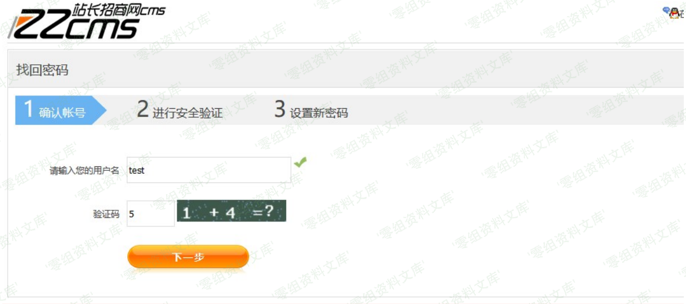
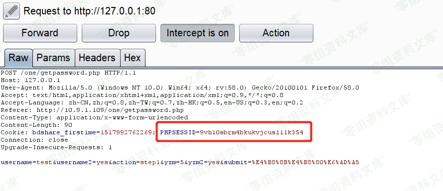
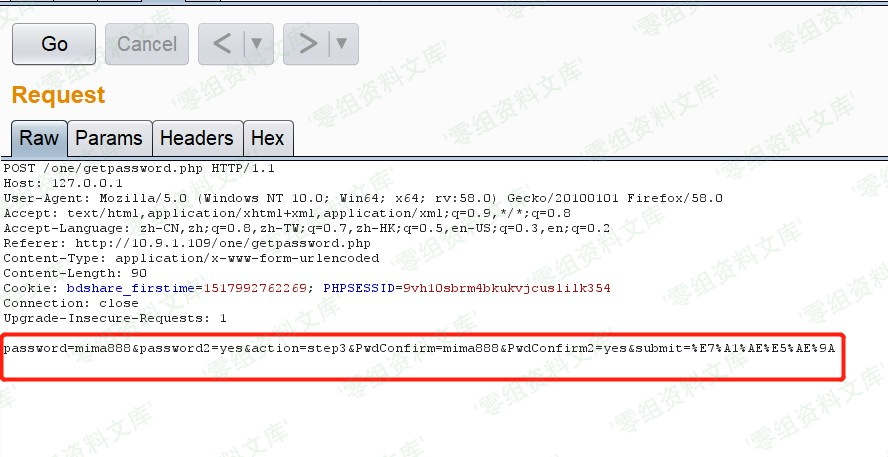
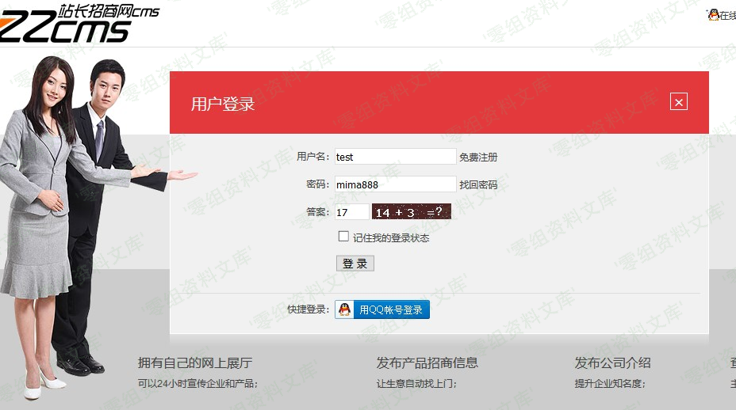
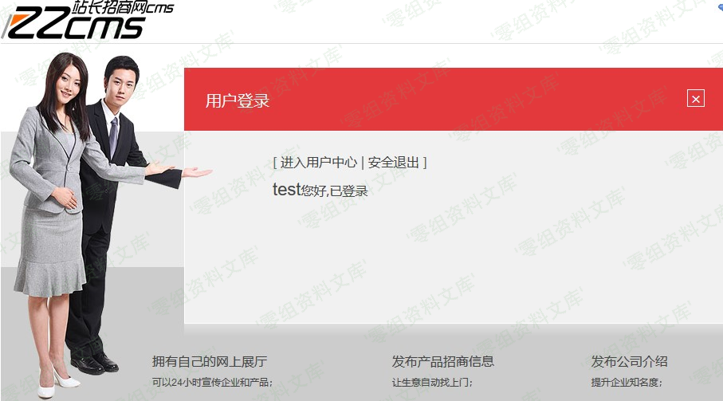

## 核对与使用边界

本文已按保存的全文审阅记录进行文字校订；本轮仅静态核对，未运行 PoC、请求目标或逐图验证。

适用条件与版本记录（来源主张，未列为明确更正的部分仍待权威资料核对）：knownusername; samePHPsession acrossstep1/3; step2proofnotrequired; captchaevaluationorder

- **证据待核（1）**：核心step1设置username后直接step3缺验证状态门槛，链解释清楚。保留原引用、截图位置和实验叙述；本项所缺材料未被补造，截图存在或作者宣称成功都不等于已核验其内容。

- **凭据与会话边界（2）**：$_SESSION在checkyzm之前赋值，验证码是否真必要须核失败退出/会话保存；不能只说取session即可。抓包中的会话不能视为未认证访问证明；可识别的真实会话值按中段星号遮罩处理，默认演示值和攻击语法保留。需重新取得授权测试会话，不能复用文中值。

- **代码与转录边界（3）**：关键UPDATE代码在SESSIONusername字符串中途截断，文章末尾利用此漏洞只需也截断。相应原代码作为存在此问题的历史样本保留，不能直接当作可运行、成功复现的 PoC；缺失内容需回原稿核对，不据此补造可执行攻击链。

- **证据待核（4）**：完整请求全图，passwordtrue明文存储是可见次要风险但不等同主重置缺陷。保留原引用、截图位置和实验叙述；本项所缺材料未被补造，截图存在或作者宣称成功都不等于已核验其内容。

- **事实待核（5）**：缺修复/原始源。该项尚不能从转载本身确定外部事实；下文相应编号、版本或修复说法只作为来源记录，不能据此判定部署受影响或已修复。明确更正另列于本节。

历史原文标识：下文原技术材料按来源保留；仅本节明确确认的更正替代相应旧说法，标为待核的观察仍不是事实确认。

# Zzcms 8.2 任意用户密码修改

一、漏洞简介
------------

Zzcms是一款企业建站程序。 zzcms
8.2版本/one/getpassword.php文件存在漏洞，攻击者可利用该漏洞修改任意用户密码。

二、漏洞影响
------------

Zzcms 8.2

三、复现过程
------------

### 漏洞分析

/one/getpassword.php文件第 73行，触发漏洞的关键代码。

    }elseif($action=="step3" && @$_SESSION['username']!=''){

    $passwordtrue = isset($_POST['password'])?$_POST['password']:"";

    $password=md5(trim($passwordtrue));

    query("update zzcms_user set password='$password',passwordtrue='$passwordtrue' where username='".@$_SESSION['username

    $strout=str_replace("{step4}","",$strout) ;

    $strout=str_replace("{/step4}","",$strout) ; 

    $strout=str_replace("{step1}".$step1."{/step1}","",$strout) ;

    $strout=str_replace("{step2}".$step2."{/step2}","",$strout) ;

    $strout=str_replace("{step3}".$step3."{/step3}","",$strout) ;

    $strout=str_replace("{#username}",@$_SESSION['username'],$strout) ;

这里仅仅判断了 action参数为
step3，并且\$\_SESSION\[\'username\'\]不为空，就进入密码修改的逻辑，直接执

行sql语句执行update操作。那么这里的\$\_SESSION\[\'username\'\]从哪里来的，我们继续看代码，在

/one/getpassword.php文件第 31行，可以看到

    $_SESSION['username']。

    if ($action=="step1"){

    $username = isset($_POST['username'])?$_POST['username']:"";

    $_SESSION['username']=$username;

    checkyzm($_POST["yzm"]);

    $rs=query("select mobile,email from zzcms_user where username='" . $username . "' ");

    $row=fetch_array($rs);

    $regmobile=$row['mobile'];

    $regmobile_show=str_replace(substr($regmobile,3,4),"****",$regmobile);

    $regemail=$row['email'];

    $regemail_show=str_replace(substr($regemail,1,2),"**",$regemail);

这里username是从step1不做中 post传递过来的
username参数，也就是我们要修改的用户名。那么漏洞就很

明显了，在第一步输入要修改的用户名，然后获取session值，直接跳到第三步，修改密码就可以打到任意

用户密码修改。

### 漏洞复现

第一步先在找回密码页面输入要修改的用户名，点击下一步，burp拦截。

抓包获取session值

这里我们获取到了
session值，然后根据上面的描述，修改数据包，直接进入修改密码操作。

这里session就是上面获取到的，只需要修改
post-data值就可以。这里改成mima888。action值要改成step3

才可以进去 数据库
update语句的操作。然后重放数据包，就可以完成任意密码修改了。

前台登录试试，是否修改成功。

成功修改密码，登录成功。

利用此漏洞，只需
