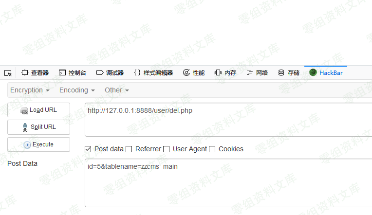
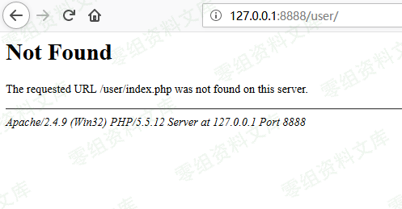

## 核对与使用边界

本文已按保存的全文审阅记录进行文字校订；本轮仅静态核对，未运行 PoC、请求目标或逐图验证。

适用条件与版本记录（来源主张，未列为明确更正的部分仍待权威资料核对）：userrouteauth/parameter/permissionsunspecified

- **操作与副作用边界（1）**：全文除版本/接口只有两图和成功删除user/残句，没有参数/请求/源码。保留原步骤及请求方法。执行条件包括隔离且获授权的可恢复环境、预先记录相关文件/账号/配置/业务记录状态；响应完成不能等同无副作用，恢复时须核对该操作涉及的实际对象。

- **操作与副作用边界（2）**：标题任意文件而结论可能删除目录，原语范围不明。保留原步骤及请求方法。执行条件包括隔离且获授权的可恢复环境、预先记录相关文件/账号/配置/业务记录状态；响应完成不能等同无副作用，恢复时须核对该操作涉及的实际对象。

- **事实待核（3）**：图片后重复路径，缺原始CVE来源/修复；未视觉看图只能标证据缺口。该项尚不能从转载本身确定外部事实；下文相应编号、版本或修复说法只作为来源记录，不能据此判定部署受影响或已修复。明确更正另列于本节。

历史原文标识：下文原技术材料按来源保留；仅本节明确确认的更正替代相应旧说法，标为待核的观察仍不是事实确认。

（CVE-2018-13056）Zzcms 任意文件删除
====================================

一、漏洞简介
------------

二、漏洞影响
------------

版本：zzcms8.3 user / del.php

三、复现过程
------------

Zzcms8.3任意文件删除/media/rId24.png)

Zzcms8.3任意文件删除/media/rId25.png)

成功删除user /
