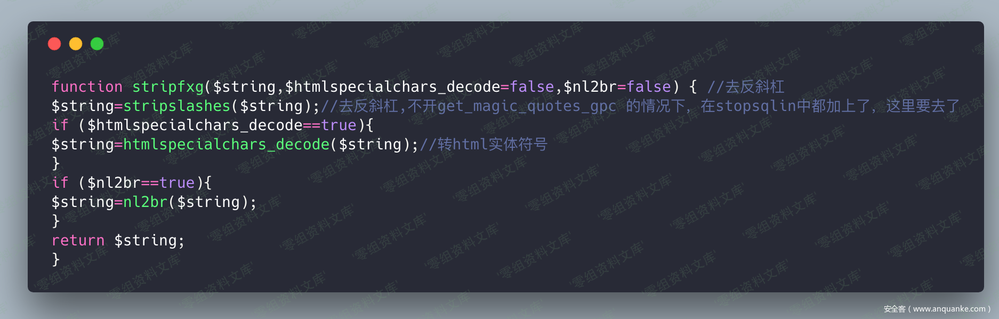
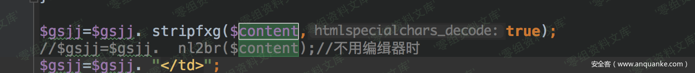
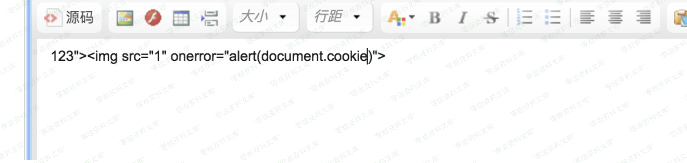

## 核对与使用边界

本文已按保存的全文审阅记录进行文字校订；本轮仅静态核对，未运行 PoC、请求目标或逐图验证。

适用条件与版本记录（来源主张，未列为明确更正的部分仍待权威资料核对）：membercaneditcompanyintro;publiczt/showrendersunescaped

- **证据待核（1）**：stripfxg消除过滤的具体编码/反转义实现仅图，需文本支撑。保留原引用、截图位置和实验叙述；本项所缺材料未被补造，截图存在或作者宣称成功都不等于已核验其内容。

- **结论使用边界（2）**：无payload/提交字段/响应文字，id1只是样例不可泛用。此项限制直接适用于下文对应结论；现有正文不足以作更宽泛推论，所列方法和原始证据均保留。

- **适用与权限边界（3）**：图片后路径重复；有共用原研究来源但需最小角色/修复。按此限制解释本文结论，版本相同不足以证明所需角色、入口、配置、依赖或可控参数均已满足；原操作和失败记录一并保留。

- **证据待核（4）**：同659/661同源不同漏洞，勿按文章来源强合并实体。保留原引用、截图位置和实验叙述；本项所缺材料未被补造，截图存在或作者宣称成功都不等于已核验其内容。

历史原文标识：下文原技术材料按来源保留；仅本节明确确认的更正替代相应旧说法，标为待核的观察仍不是事实确认。

（CVE-2018-14962）Zzcms 8.3 储存型xss
=====================================

一、漏洞简介
------------

二、漏洞影响
------------

Zzcms 8.3

三、复现过程
------------

一个存储型xss，最底层的原因还是因为调用了`stripfxg`函数，消除了自己的过滤，然后在输出的时候，导致了xss漏洞。

Zzcms8.3储存型xss/media/rId24.png)

先看一下输出位置，在/zt/show.php 的211 行：

Zzcms8.3储存型xss/media/rId25.png)

然后追踪这个变量的值，找到了是在用户在修改自己公司简介处添加的数据
然后我们来测试一下：

Zzcms8.3储存型xss/media/rId26.png)

保存，然后访问一下/zt/show.php?id=1，就可以看到效果：

Zzcms8.3储存型xss/media/rId27.png)

参考链接
--------

> <https://www.anquanke.com/post/id/156660>
