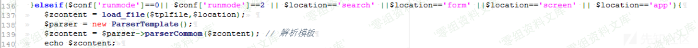
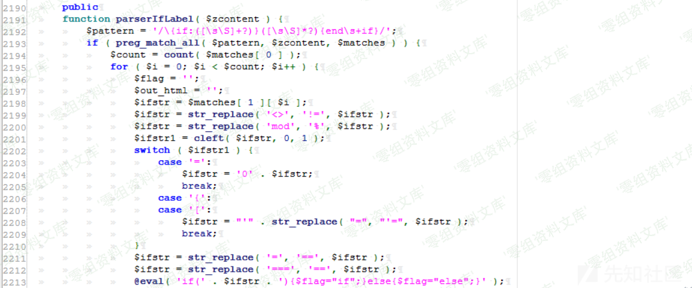
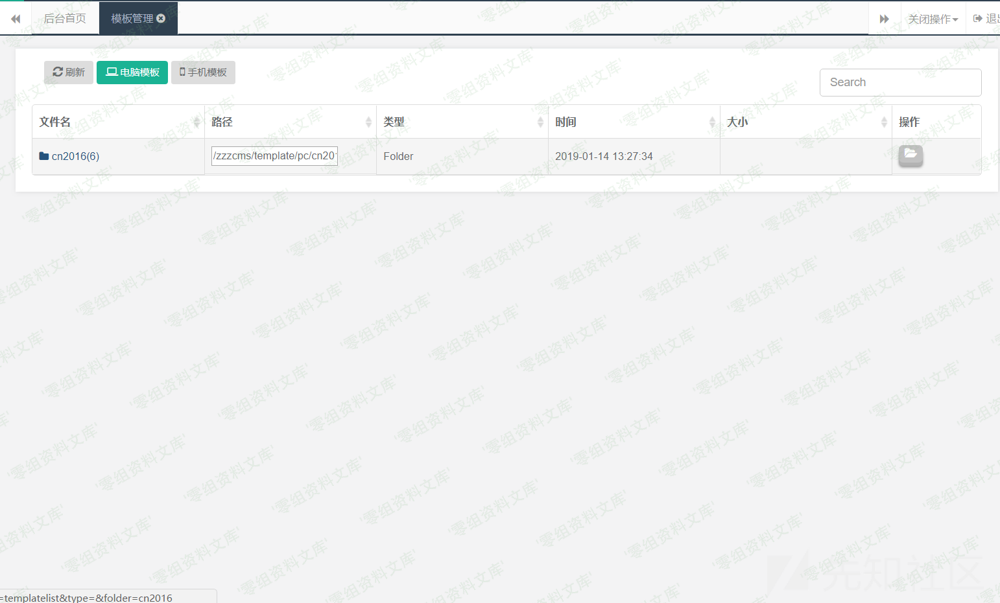
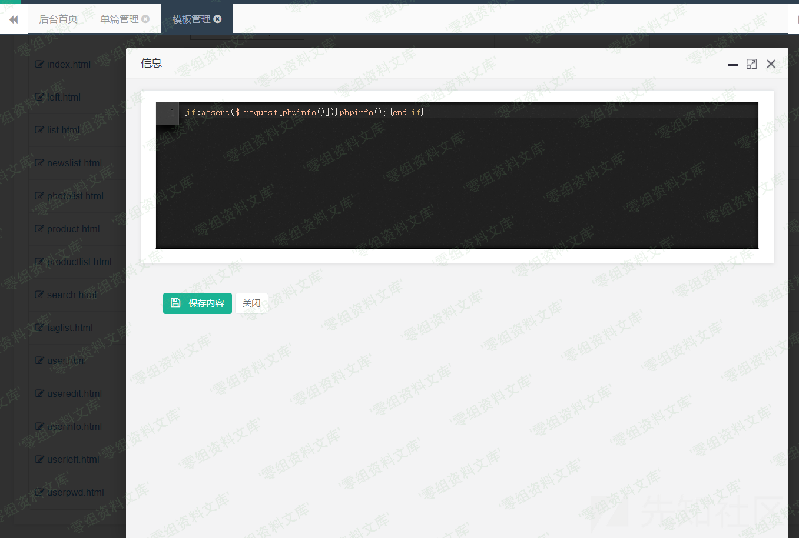

## 核对与使用边界

本文已按保存的全文审阅记录进行文字校订；本轮仅静态核对，未运行 PoC、请求目标或逐图验证。

适用条件与版本记录（来源主张，未列为明确更正的部分仍待权威资料核对）：admincaneditsearchtemplate; vulnerableifparser; PHPassertbehavior

- **证据待核（1）**：evel应为eval、ParsetTemplate/ParserTemplate不一致，核心过滤源码全图。保留原引用、截图位置和实验叙述；本项所缺材料未被补造，截图存在或作者宣称成功都不等于已核验其内容。

- **证据待核（2）**：payload$_request大小写不正确非$_REQUEST；phpinfo()作为数组键求值仍可能执行，截图不能证明assert字符串执行链完整。保留原引用、截图位置和实验叙述；本项所缺材料未被补造，截图存在或作者宣称成功都不等于已核验其内容。

- **适用与权限边界（3）**：后台模板编辑权限必须保留，不能归匿名远程命令执行。按此限制解释本文结论，版本相同不足以证明所需角色、入口、配置、依赖或可控参数均已满足；原操作和失败记录一并保留。

- **事实待核（4）**：缺具体修复/版本区间，有xz精确来源，需统一zzzcms/zzzphp产品别名。该项尚不能从转载本身确定外部事实；下文相应编号、版本或修复说法只作为来源记录，不能据此判定部署受影响或已修复。明确更正另列于本节。

历史原文标识：下文原技术材料按来源保留；仅本节明确确认的更正替代相应旧说法，标为待核的观察仍不是事实确认。

# Zzzcms 1.61 后台远程命令执行漏洞

一、漏洞简介
------------

zzzphp cms
，远程代码执行漏洞存在的主要原因是页面对模块的php代码过滤不严谨，导致在后台可以写入php代码从而造成代码执行。

二、漏洞影响
------------

Zzzcms 1.61

三、复现过程
------------

### 漏洞分析

打开/search/index.php

    require dirname(dirname(__FILE__)). '/inc/zzz_client.php';

发现是跳到/inc/zzz\_client.php，那么我们就来到/inc/zzz\_client.php

发现解析模块是通过ParsetTemplate来解析的，那么我们找到ParserTemplate类的php文件zzz\_template.php。在zzz\_template.php中我们发现一个IF语句

    $zcontent = $this->parserIfLabel( $zcontent ); // IF语句

那么我们来到zzz\_template.php中对parserIfLabel的定义

发现\$ifstr
经过一连串的花里胡哨的过滤最后进了evel函数，然后使用了evel函数执行，最后造成了本次远程代码执行漏洞。

### 漏洞复现

在后台模块管理中的电脑模块找到cn2016

然后在cn2016文件中到html文件，然后在html文件中找到search.html，然后将其的代码修改为

    {if:assert($_request[phpinfo()])}phpinfo();{end if}

然后打开`http://xxxx.com/zzzcms/search/`就可以看到我们刚刚输入的phpinfo()执行了。

参考链接
--------

> https://xz.aliyun.com/t/4471
