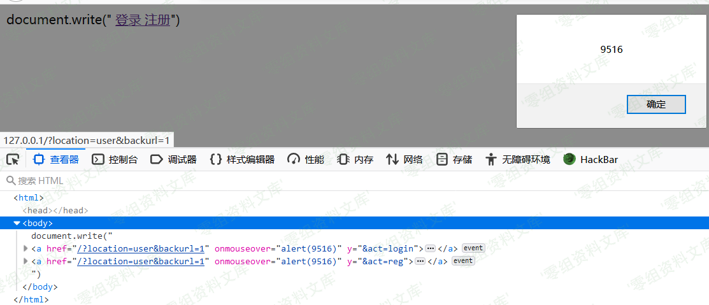

## 核对与使用边界

本文已按保存的全文审阅记录进行文字校订；本轮仅静态核对，未运行 PoC、请求目标或逐图验证。

适用条件与版本记录（来源主张，未列为明确更正的部分仍待权威资料核对）：victimopenscraftedbackurl andhovers login/register

- **结论使用边界（1）**：明确onmouseover需交互应保留，非自动执行。此项限制直接适用于下文对应结论；现有正文不足以作更宽泛推论，所列方法和原始证据均保留。

- **事实待核（2）**：缺输出HTML上下文/源码/原始来源/修复，只有URL和截图。该项尚不能从转载本身确定外部事实；下文相应编号、版本或修复说法只作为来源记录，不能据此判定部署受影响或已修复。明确更正另列于本节。

- **证据待核（3）**：末尾image残片，backurl未防护绝对说法需代码核。保留原引用、截图位置和实验叙述；本项所缺材料未被补造，截图存在或作者宣称成功都不等于已核验其内容。

历史原文标识：下文原技术材料按来源保留；仅本节明确确认的更正替代相应旧说法，标为待核的观察仍不是事实确认。

# Zzzcms 1.75 xss漏洞

一、漏洞简介
------------

二、漏洞影响
------------

Zzzcms 1.75

三、复现过程
------------

    http://www.0-sec.org/plugins/template/login.php?backurl=1%20onmouseover%3dalert(9516)%20y%3d

该onmouseover事件在移动到登录注册时会触发

对传入的backurl并没有做任何防护

image
