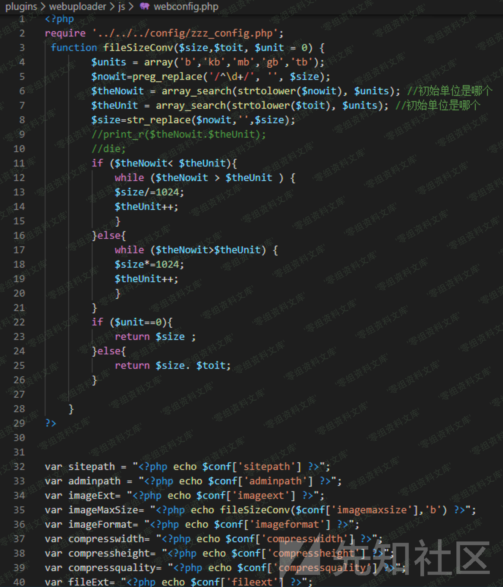
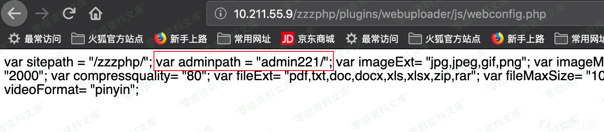

## 核对与使用边界

本文已按保存的全文审阅记录进行文字校订；本轮仅静态核对，未运行 PoC、请求目标或逐图验证。

适用条件与版本记录（来源主张，未列为明确更正的部分仍待权威资料核对）：publicplugins/webuploader/js/webconfig.php

- **证据待核（1）**：具体泄露接口清楚，但未给响应字段/源码，不能扩大为全部zzz_config内容。保留原引用、截图位置和实验叙述；本项所缺材料未被补造，截图存在或作者宣称成功都不等于已核验其内容。

- **适用与权限边界（2）**：后台路径泄露不是认证绕过；admin+3位只是默认模式，不保证所有部署。按此限制解释本文结论，版本相同不足以证明所需角色、入口、配置、依赖或可控参数均已满足；原操作和失败记录一并保留。

- **事实待核（3）**：有xz研究来源，缺影响下界/修复及原始响应文本。该项尚不能从转载本身确定外部事实；下文相应编号、版本或修复说法只作为来源记录，不能据此判定部署受影响或已修复。明确更正另列于本节。

历史原文标识：下文原技术材料按来源保留；仅本节明确确认的更正替代相应旧说法，标为待核的观察仍不是事实确认。

# Zzzcms 1.75 后台地址泄露

一、漏洞简介
------------

二、漏洞影响
------------

Zzzcms 1.75

三、复现过程
------------

存在一个比较奇葩的文件直接将一些属于不可访问的zzz\_config.php的内容直接给回显了，该信息泄露文件位于plugins\\webuploader\\js\\webconfig.php，可以直接获取到管理后台的管理路径名称，再也不用去爆破admin加3位数字了

参考链接
--------

> https://xz.aliyun.com/t/7414
