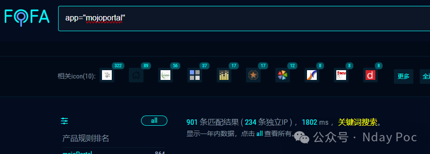
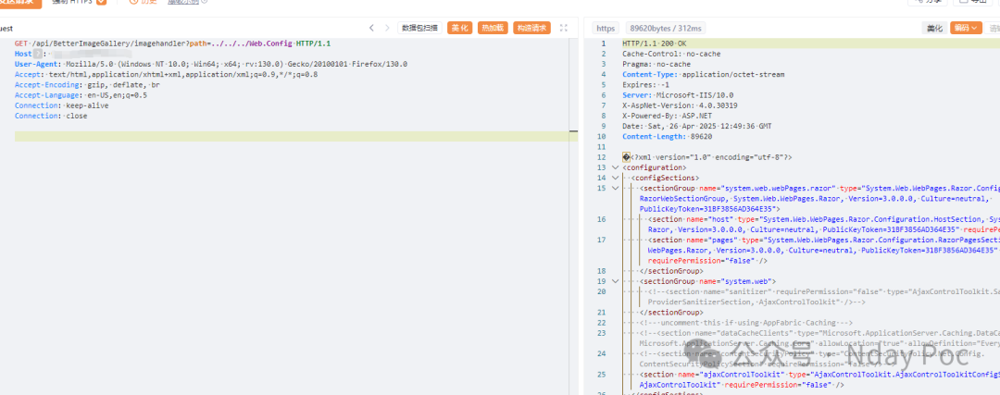
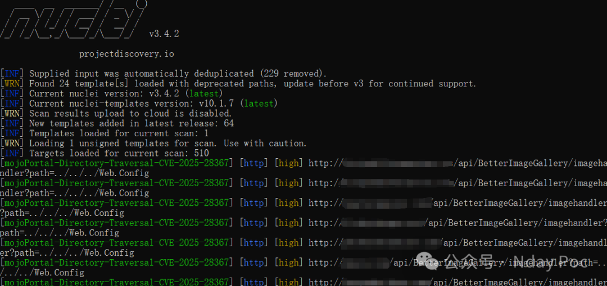
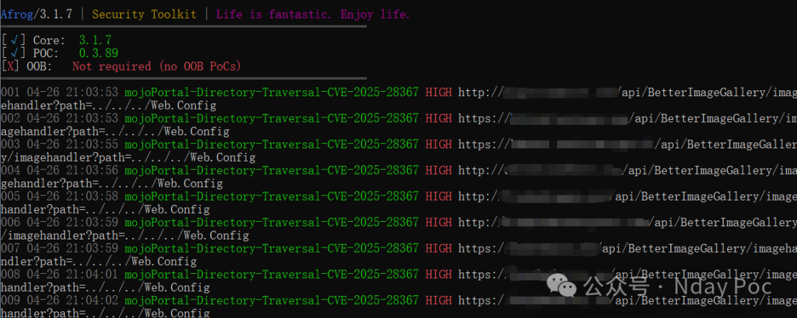
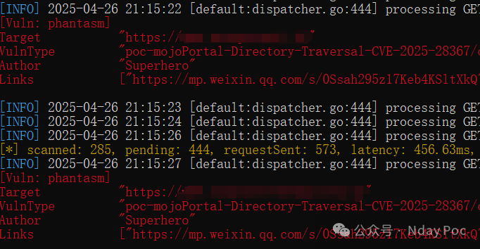

## 核对与使用边界

本文已按保存的全文审阅记录进行文字校订；本轮仅静态核对，未运行 PoC、请求目标或逐图验证。

适用条件与版本记录（来源主张，未列为明确更正的部分仍待权威资料核对）：&lt;=2.9.0.1claimed; readableweb.config withstaticmachineKey; compatibleViewState/gadget/pagecontext

- **结论使用边界（1）**：简介应用程序的文件/包含用于验证的文件为翻译丢关键名，应恢复web.config/machineKey。此项限制直接适用于下文对应结论；现有正文不足以作更宽泛推论，所列方法和原始证据均保留。

- **适用与权限边界（2）**：文件读→ViewStateRCE需静态可用密钥及页面/算法/gadget条件，不能自动等同。按此限制解释本文结论，版本相同不足以证明所需角色、入口、配置、依赖或可控参数均已满足；原操作和失败记录一并保留。

- **事实待核（3）**：复现和三个工具全图，缺接口/参数/请求/修复版本/原始公告。该项尚不能从转载本身确定外部事实；下文相应编号、版本或修复说法只作为来源记录，不能据此判定部署受影响或已修复。明确更正另列于本节。

- **来源与引用处置（4）**：付费圈子广告较长，标题仅穿越而正文含第二阶段应关系化。保留这部分来源材料并与技术结论分开；其引用或宣传内容不能补足本文漏洞的证据。

历史原文标识：下文原技术材料按来源保留；仅本节明确确认的更正替代相应旧说法，标为待核的观察仍不是事实确认。

#  mojoPortal 路径穿越漏洞 (CVE-2025-28367)   
Superhero  Nday Poc   2025-04-26 13:18  
  
  
  
  
  
  
  
内容仅用于学习交流自查使用，由于传播、利用本公众号所提供的  
POC  
信息及  
POC对应脚本  
而造成的任何直接或者间接的后果及损失，均由使用者本人负责，公众号Nday Poc及作者不为此承担任何责任，一旦造成后果请自行承担！  
  
  
**01**  
  
**漏洞概述**  
  
  
在 mojoPortal CMS 版本 <=2.9.0.1 中发现了一个导致 ViewState 反序列化的目录遍历漏洞。通过利用此问题，未经身份验证的攻击者可以泄露 Web 根目录中的敏感文件，包括应用程序的文件。此配置文件包含用于验证和解密 ViewState 数据的文件。知道此密钥后，网络攻击者可以构建恶意 ViewState 有效负载，从而导致在底层服务器上执行远程代码。  
**02******  
  
**搜索引擎**  
  
  
FOFA:  
```
app="mojoportal"
```  
  
  
  
  
**03******  
  
**漏洞复现**  
  
  
  
  
**04**  
  
**自查工具**  
  
  
nuclei  
  
  
  
afrog  
  
  
  
xray  
  
  
  
  
**05******  
  
**修复建议**  
  
  
1、关闭互联网暴露面或接口设置访问权限  
  
2、  
升级至安全版本  
  
  
**06******  
  
**内部圈子介绍**  
  
  
【Nday漏洞实战圈】🛠️   
  
专注公开1day/Nday漏洞复现  
 · 工具链适配支持  
  
 ✧━━━━━━━━━━━━━━━━✧   
  
🔍 资源内容  
  
 ▫️ 整合全网公开  
1day/Nday  
漏洞POC详情  
  
 ▫️ 适配Xray/Afrog/Nuclei检测脚本  
  
 ▫️ 支持内置与自定义POC目录混合扫描   
  
🔄 更新计划   
  
▫️ 每周新增7-10个实用POC（来源公开平台）   
  
▫️ 所有脚本经过基础测试，降低调试成本   
  
🎯 适用场景   
  
▫️ 企业漏洞自查 ▫️ 渗透测试 ▫️ 红蓝对抗   
▫️ 安全运维  
  
✧━━━━━━━━━━━━━━━━✧   
  
⚠️ 声明：仅限合法授权测试，严禁违规使用！  
  
  
  
  


---

> 来源：gelusus/wxvl（微信公众号漏洞文章自动归档，原文见文首链接）
