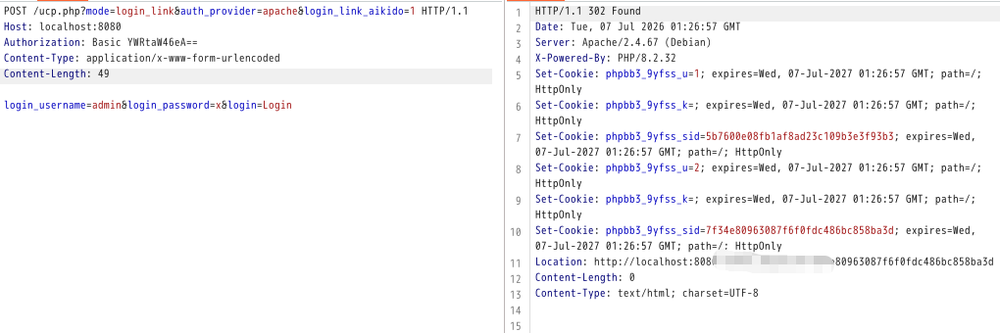

## 核对与使用边界

本文已按保存的全文审阅记录进行文字校订；本轮仅静态核对，未运行 PoC、请求目标或逐图验证。

适用条件与版本记录（来源主张，未列为明确更正的部分仍待权威资料核对）：&lt;=3.3.16/4.0a2claimed;login-link auth_providerpath/config notshown; fixed3.3.17stable

- **事实待核（1）**：存在10年与所有&lt;=版本范围不协调，应补引入下界/开发分支修复commit。该项尚不能从转载本身确定外部事实；下文相应编号、版本或修复说法只作为来源记录，不能据此判定部署受影响或已修复。明确更正另列于本节。

- **适用与权限边界（2）**：只一句auth_provider和截图，缺请求/源码/配置前提，已复现为作者声明。按此限制解释本文结论，版本相同不足以证明所需角色、入口、配置、依赖或可控参数均已满足；原操作和失败记录一并保留。

- **适用与权限边界（3）**：禁未使用认证方式和ucp头加拦截无具体安全规则，不能确保缓解。按此限制解释本文结论，版本相同不足以证明所需角色、入口、配置、依赖或可控参数均已满足；原操作和失败记录一并保留。

- **来源与引用处置（4）**：有NVD链接但欠厂商补丁，长广告宜剥离。保留这部分来源材料并与技术结论分开；其引用或宣传内容不能补足本文漏洞的证据。

历史原文标识：下文原技术材料按来源保留；仅本节明确确认的更正替代相应旧说法，标为待核的观察仍不是事实确认。

#  【已复现】漏洞通告 | phpBB认证绕过漏洞(CVE-2026-48611)  
安全实验室
                    安全实验室  中成信息   2026-07-07 09:05  
  
  
  
**1**  
  
  
**漏洞描述**  
  
phpBB认证绕过漏洞（CVE-2026-48611）是phpBB论坛软件存在10年的高危漏洞，攻击者只需发送特定HTTP请求即可冒充任意用户（含管理员）登录，无需密码或交互。利用后可读取私信、修改内容、安装恶意插件等。官方已在3.3.17版本修复，建议立即升级，并禁用未使用的认证方式。漏洞成因是login link功能对auth_provider参数校验存在缺陷，攻击者通过构造参数直接跳过密码验证。  
  
2  
  
  
**影响范围**  
  
phpBB ≤ 3.3.16  
  
phpBB 开发分支：≤ 4.0.0-a2  
  
  
3  
  
  
**漏洞详情**  
<table><tbody><tr><td colspan="4" data-colwidth="143,144,143,143"><section style="text-align: center;">漏洞详情</section></td></tr><tr><td data-colwidth="143"><section style="text-align: center;">漏洞编号</section></td><td colspan="3" data-colwidth="144,143,143"><section style="text-align: center;">CVE-2026-48611</section></td></tr><tr><td data-colwidth="143"><section style="text-align: center;">漏洞名称</section></td><td colspan="3" data-colwidth="144,143,143"><section style="text-align: center;">phpBB认证绕过漏洞</section></td></tr><tr><td data-colwidth="143"><section style="text-align: center;">评级</section></td><td data-colwidth="144"><section style="text-align: center;">高危</section></td><td data-colwidth="143"><section style="text-align: center;">CVSS 3.1分数</section></td><td data-colwidth="143"><section style="text-align: center;">9.8</section></td></tr><tr><td data-colwidth="143"><section style="text-align: center;">威胁类型</section></td><td data-colwidth="144"><section style="text-align: center;">认证绕过</section></td><td data-colwidth="143"><section style="text-align: center;">利用情况</section></td><td data-colwidth="143"><section style="text-align: center;">更可能被利用</section></td></tr><tr><td data-colwidth="143"><section style="text-align: center;">公开状态</section></td><td data-colwidth="144"><section style="text-align: center;">POC、EXP已公开</section></td><td data-colwidth="143"><section style="text-align: center;">在野利用</section></td><td data-colwidth="143"><section style="text-align: center;">未发现</section></td></tr><tr><td colspan="4" data-colwidth="143,144,143,143"><section>危害描述：攻击者仅需发送构造HTTP请求即可直接登录任意用户账号（含管理员），无需密码及交互。</section></td></tr><tr><td colspan="4" data-colwidth="143,144,143,143"><section style="line-height: 1.6em;margin-bottom: 0px;margin-top: 0px;">参考链接: </section><section style="line-height: 1.6em;margin-bottom: 0px;margin-top: 0px;">https://nvd.nist.gov/vuln/detail/CVE-2026-48611</section></td></tr></tbody></table>  
  
4  
  
  
**漏洞复现**  
  
中成信息安全实验室已复现phpBB认证绕过漏洞，验证如下。  
  
  
  
  
5  
  
  
**修复建议**  
  
请立即升级至以下或更高版本。  
  
phpBB ≥ 3.3.17，对于使用开发分支的用户，请及时关注并应用官方发布的最新安全补丁或代码提交修复。  
  
临时缓解措施包括：  
  
通过Nginx/Apache拦截恶意路由、在ucp.php文件头部增加拦截代码。  
  
  
  
  
  
  
  
  
  
  
关于我们  
  
  
漳州中成信息科技有限公司是一家专注于网络安全实战防护的创新型服务提供商。我们深刻理解网络安全的核心在于攻防对抗的持续较量，并以此独特视角为基石，致力于为客户构建动态、主动、智能化的纵深防御体系。区别于传统的被动防御，我们坚信“未知攻，焉知防”。公司汇聚了顶尖的渗透测试专家（红队）、应急处置精英（蓝队）及经验丰富的安全服务工程师，形成了一支具备完整攻防对抗能力的专业团队。我们的渗透测试团队模拟真实攻击者的思维与手段，深入挖掘系统、应用及网络中的深层次漏洞与风险点；应急处置团队则能在安全事件发生时快速响应、精准定位、有效遏制损失并溯源根因；安服工程师团队则致力于将攻防对抗中获得的宝贵经验转化为常态化的安全策略、加固措施与运营流程。  
  
  
  
  
  
  
**点击名片**  
  
  
  
**关注我们**  
  
  
  
**扫描官网二维码**  
  
  
**了解更多**  
  
  
  
  
  
  
  
  
  
  
  

---

> 来源：gelusus/wxvl（微信公众号漏洞文章自动归档，原文见文首链接）
