## 核对与使用边界

本文已按保存的全文审阅记录进行文字校订；本轮仅静态核对，未运行 PoC、请求目标或逐图验证。

适用条件与版本记录（来源主张，未列为明确更正的部分仍待权威资料核对）：remoteavatarsenabled(nondefault); adminreturnsfrontendwithSID; referrerpolicyleaksfullquery; victimACPsession;BBCodeCSRFno-submit

- **适用与权限边界（1）**：现代跨源Referrer-Policy默认可能仅发origin，SID泄漏依浏览器/站点策略，历史条件需明确。按此限制解释本文结论，版本相同不足以证明所需角色、入口、配置、依赖或可控参数均已满足；原操作和失败记录一并保留。

- **凭据与会话边界（2）**：cookie key安装后固定不等于session值固定，正文对此有区分应保留。抓包中的会话不能视为未认证访问证明；可识别的真实会话值按中段星号遮罩处理，默认演示值和攻击语法保留。需重新取得授权测试会话，不能复用文中值。

- **适用与权限边界（3）**：IP绑定阻止直接session接管但借受害浏览器CSRF绕过，是重要链边界。按此限制解释本文结论，版本相同不足以证明所需角色、入口、配置、依赖或可控参数均已满足；原操作和失败记录一并保留。

- **证据待核（4）**：缺完整恶意头像PHP/最终GET或CSRF请求，关键代码全图，不能独立重放。保留原引用、截图位置和实验叙述；本项所缺材料未被补造，截图存在或作者宣称成功都不等于已核验其内容。

- **适用与权限边界（5）**：13376可能对应CSRF链核心，SID泄漏和后续XSS不应默认都获同CVE；有原xz可核。按此限制解释本文结论，版本相同不足以证明所需角色、入口、配置、依赖或可控参数均已满足；原操作和失败记录一并保留。

- **事实待核（6）**：无修复版本且图片尾路径噪声。该项尚不能从转载本身确定外部事实；下文相应编号、版本或修复说法只作为来源记录，不能据此判定部署受影响或已修复。明确更正另列于本节。

历史原文标识：下文原技术材料按来源保留；仅本节明确确认的更正替代相应旧说法，标为待核的观察仍不是事实确认。

（CVE-2019-13376）PhpBB从session id泄露到CSRF到XSS
==================================================

一、漏洞简介
------------

该漏洞源于WEB应用未充分验证请求是否来自可信用户。攻击者可利用该漏洞通过受影响客户端向服务器发送非预期的请求。

二、漏洞影响
------------

PhpBB 3.2.7

三、复现过程
------------

首先来看一下phpBB的后台，也就是ACP页面

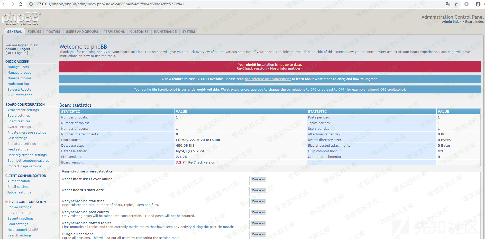PhpBB从sessionid泄露到CSRF到XSS/media/rId24.png)

可以发现所有后台功能的url中都会携带着sid（session id）参数：

    http://www.0-sec.org/phpbb/phpBB/adm/index.php?sid=9c4869b4054e9ff8d4d588c32ffcf7e7&i=1

如果url中sid值错误，即使已经登录后台也无法正常的访问后台页面

phpbb程序这样做的确有着这样做的优点，但也存在着很严重的安全隐患

优点：

在后台功能url中加入sid，相当于增加了一层安全屏障，降低了后台页面出现CSRF漏洞的几率，为什么这样说呢？假使因为开发疏忽，一个表单提交页面没有利用随机数对用户提交的表单进行保护，这通常会导致CSRF漏洞的产生。但是在phpbb应用中，所有的后台功能url中都加入了sid参数且phpbb对sid参数值合法性进行校验，即使攻击者在后台发现了一处没有随机数保护的表单提交页面，但在不知道管理

员sid值的情况下，也无法构造出一个有效的恶意表单提交页面地址

安全隐患：

这样的操作相当于在url中存放了本来只应该出现在cookie中的session
id。如果url中的sid被泄露，攻击者有机会利用这个值伪造管理员身份进行登录后台操作（但不一定可以直接利用，这里涉及到phpBB的一个安全机制，后文会讲到）。

注意看，url中的sid值与cookie中的值完全一样，它们都是此用户的session id值

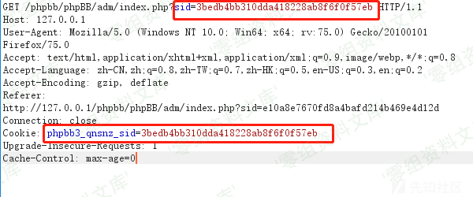PhpBB从sessionid泄露到CSRF到XSS/media/rId25.png)

至于cookie中session值的key ：phpbb3\_qnsnz\_sid

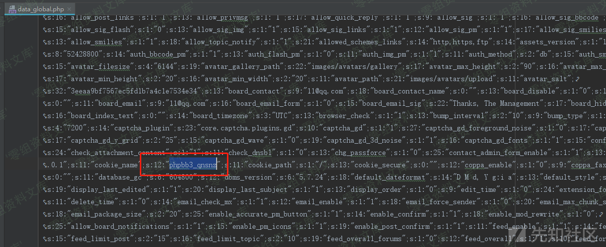PhpBB从sessionid泄露到CSRF到XSS/media/rId26.png)

这个值在系统安装完成之后是固定的，无论什么身份的用户访问都是这个值

因此，如果管理员访问的url中sid值被泄露，攻击者可以有机会利用这个值构造cookie以便使用管理员身份登录后台

但是如何获取这个暴露在url中sid值呢?

由于phpbb的设计特色：当管理员使用完后台功能后想要切换到前台，后台页面中提供了一个跳转到前台地址的按钮

当管理员点击这个按钮切换到前台时，url中会带有sid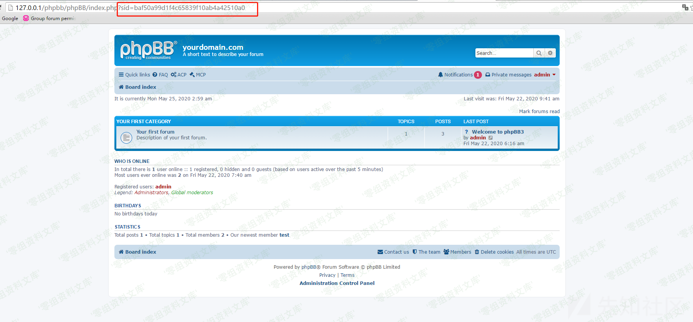PhpBB从sessionid泄露到CSRF到XSS/media/rId27.png)

其实前台页面的访问并不需要在url中使用sid，但从后台切换过来后url中会默认带上这个值。这就导致本应该只在后台功能url中出现的管理员sid泄露到了管理员访问的前台功能url中，而这个存在于url中的sid值很容易在前台页面加载远程资源时在HTTP\_REFERER中被泄露

例如：在一些phpbb站点中可能会开启远程头像选项

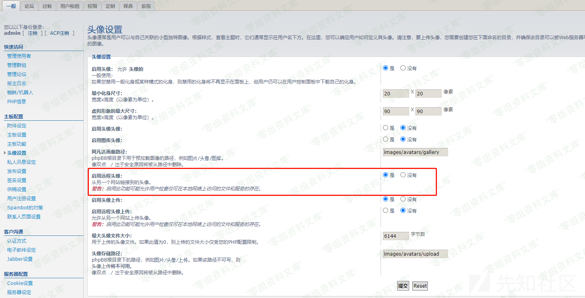PhpBB从sessionid泄露到CSRF到XSS/media/rId28.png)

这个功能并不是默认开启的，当此功能开启后，用户可以设置远程头像

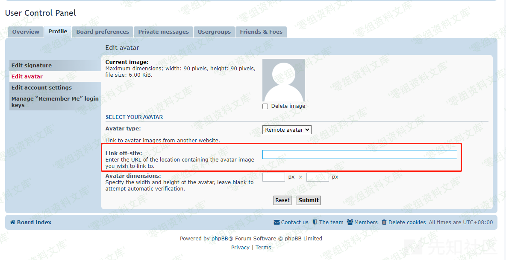PhpBB从sessionid泄露到CSRF到XSS/media/rId29.png)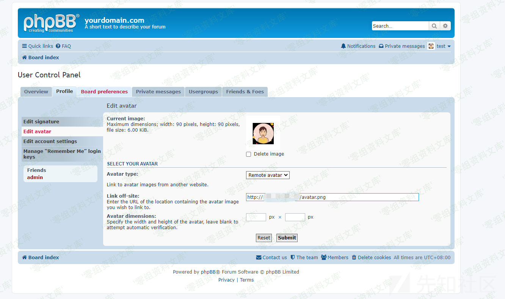PhpBB从sessionid泄露到CSRF到XSS/media/rId30.png)程序会在使用这个远程头像的时候将其加载进来

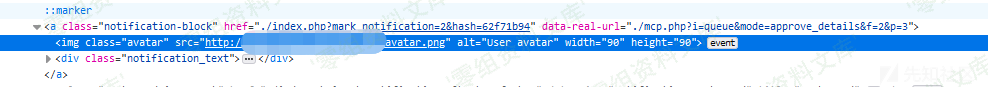PhpBB从sessionid泄露到CSRF到XSS/media/rId31.png)

如果管理员此时访问的页面在渲染时加载了攻击者的远程头像，且此时管理员访问的url中带有sid，sid将会被泄露

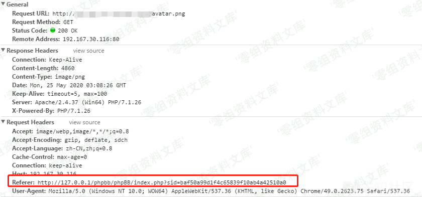PhpBB从sessionid泄露到CSRF到XSS/media/rId32.png)

我们是否可以构造一个恶意的远程图片链接poc，用以接收管理员的sid呢？

首先看一下phpBB在后台程序如何校验远程图片链接，phpBB使用getImageSize对用户添加的远程图片链接进行校验

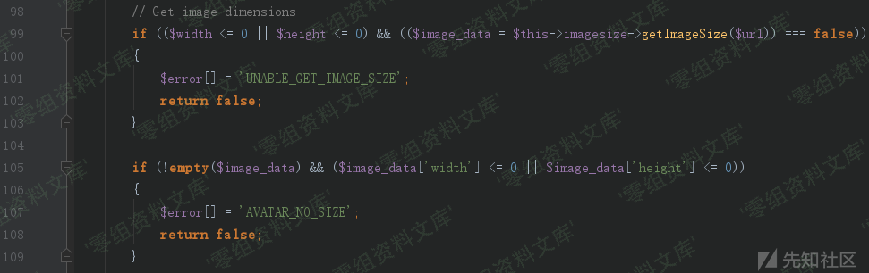PhpBB从sessionid泄露到CSRF到XSS/media/rId33.png)因此我们可以构造如下poc

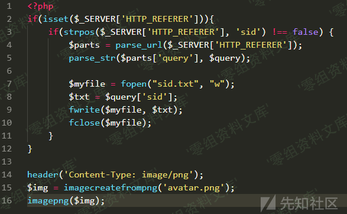PhpBB从sessionid泄露到CSRF到XSS/media/rId34.png)

poc.php除了需要记录加载该图片请求中的HTTP\_REFERER，同时需要将图片进行返回展示

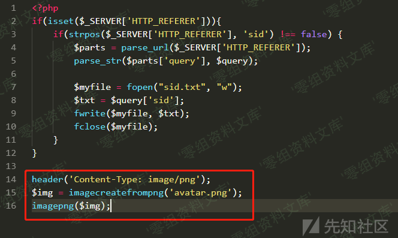PhpBB从sessionid泄露到CSRF到XSS/media/rId35.png)

构造远程图片链接

    http://wwww.0-sec.org/poc.php?avatar.png

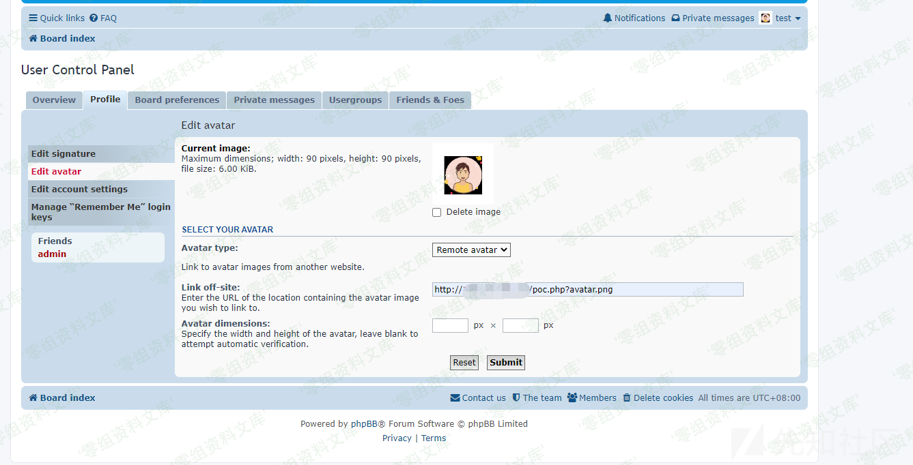PhpBB从sessionid泄露到CSRF到XSS/media/rId36.png)

攻击者的头像加载成功

但是如何使得管理员加载这个头像资源呢？

只要给管理员留言，或者评论管理员发布的文章即可

以评论文章为例：当针对管理员发布的文章发表一条评论之后，管理员在前端页面即可收到一个消息提示

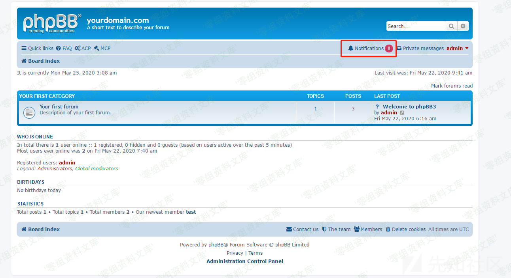PhpBB从sessionid泄露到CSRF到XSS/media/rId37.png)

点看之后可以看到被加载的头像

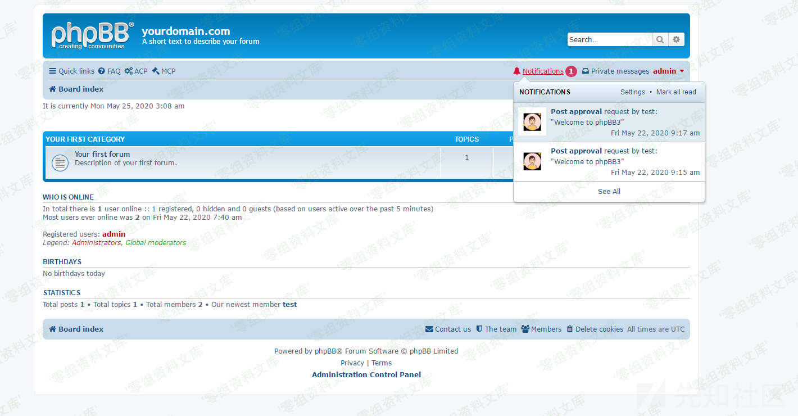PhpBB从sessionid泄露到CSRF到XSS/media/rId38.png)

但无论管理员点开与否，在phpbb首页加载时，都会远程加载这个资源，HTTP\_REFERER都会被发送到攻击者的服务器上

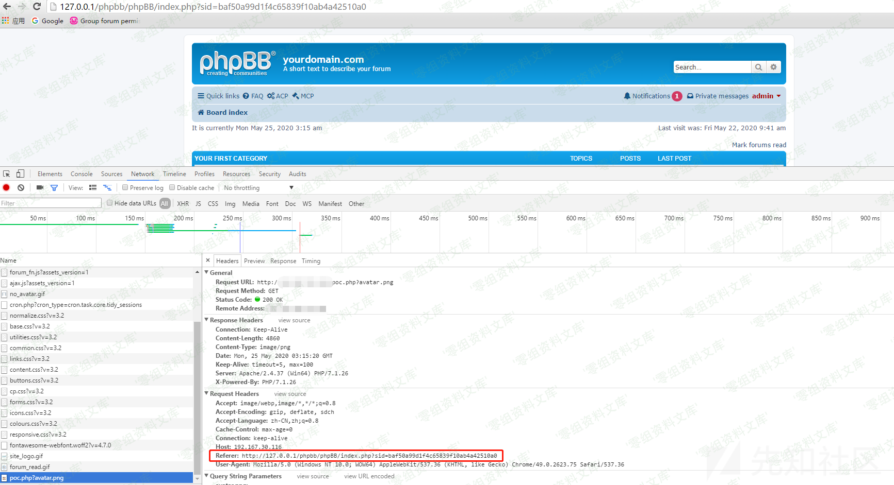PhpBB从sessionid泄露到CSRF到XSS/media/rId39.png)

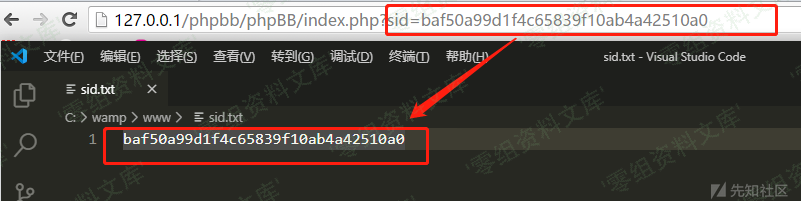PhpBB从sessionid泄露到CSRF到XSS/media/rId40.png)

到此为止，攻击者可以顺利获得sid值。但为什么上文说获取了sid值也不一定可以盗用管理员身份登录系统呢？

在phpBB中有如下的安全策略

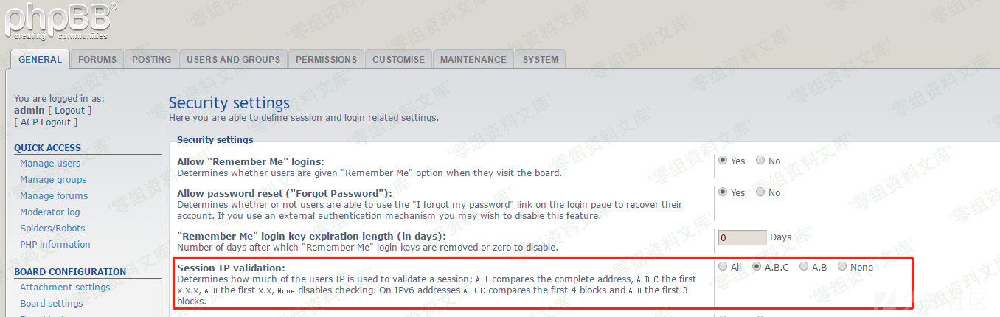PhpBB从sessionid泄露到CSRF到XSS/media/rId41.png)

Session IP
validation选项用来验证当前用户会话绑定的IP；All选项代表匹配完整地址，A.B.C选项匹配前面的x.x.x段，A.B选项匹配x.x，None选项关闭IP检查。

这项安全策略是用来检验用户sid与IP的绑定关系，系统默认采用A.B.C选项，因此攻击者在获取了管理员sid后，想要冒用身份也是很困难的。

然而这也不是无解的：

phpBB后台管理中包含着编辑BBCode的功能。

BBCode是Bulletin Board
Code的缩写，也有译为「BB代码」的，属于轻量标记语言（Lightweight Markup
Language）的一种，如字面上所显示的，它主要是使用在BBS、论坛、Blog等网络应用上。BBcode的语法通常为
\[标记\]
这种形式，即语法左右用两个中括号包围，以作为与正常文字间的区别。系统解译时遇上中括号便知道该处是BBcode，会在解译结果输出到用户端时转换成最为通用的HTML语法。

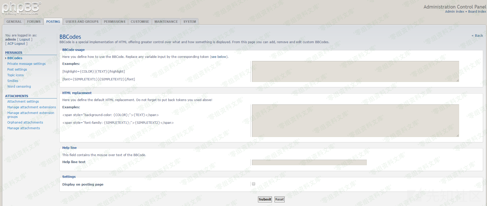PhpBB从sessionid泄露到CSRF到XSS/media/rId42.png)

当然，作为后台管理功能，访问此处url也需要sid

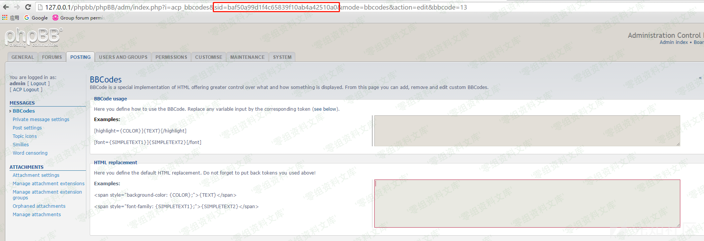PhpBB从sessionid泄露到CSRF到XSS/media/rId43.png)由于上文的利用，攻击者可以获取sid，因此这里可以确定管理员此处后台功能的确切url

在此页面上，管理员可以添加，删除和编辑自定义BBCode。假如定义了这样的BBCode

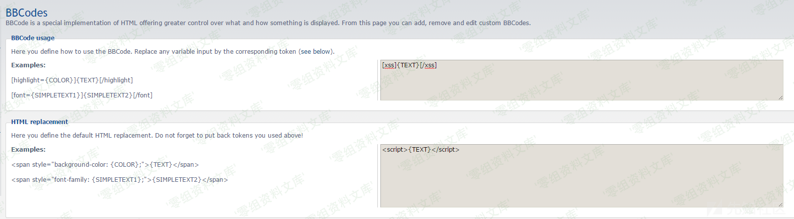PhpBB从sessionid泄露到CSRF到XSS/media/rId44.png)用户可以在PM、话题或者帖子中使用这个BBCode

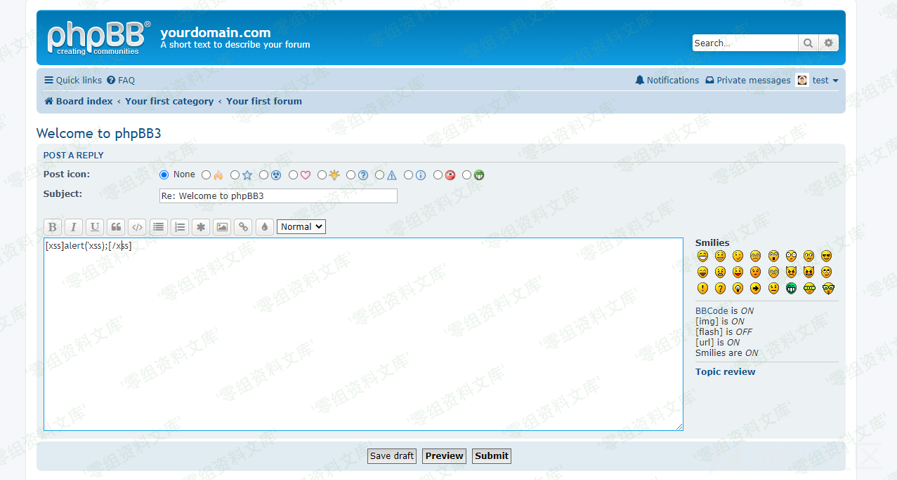PhpBB从sessionid泄露到CSRF到XSS/media/rId45.png)

结果如下

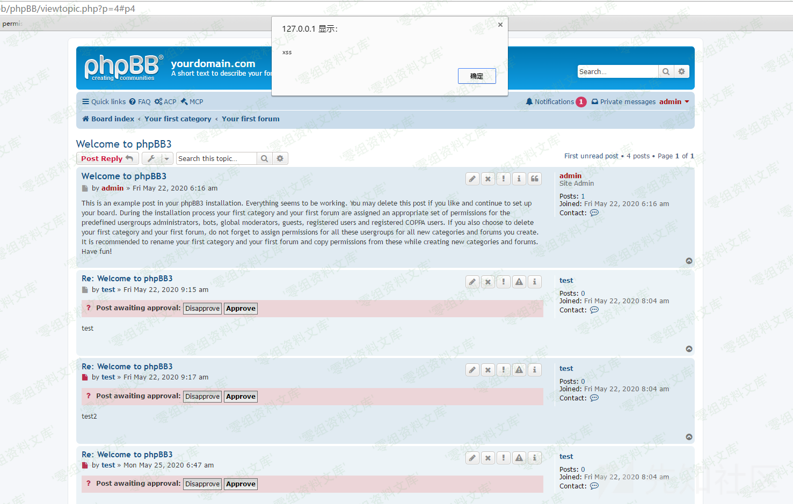PhpBB从sessionid泄露到CSRF到XSS/media/rId46.png)

然而phpBB中编辑BBCode的功能存在CSRF问题，首先看一下编辑BBCode功能的后台代码

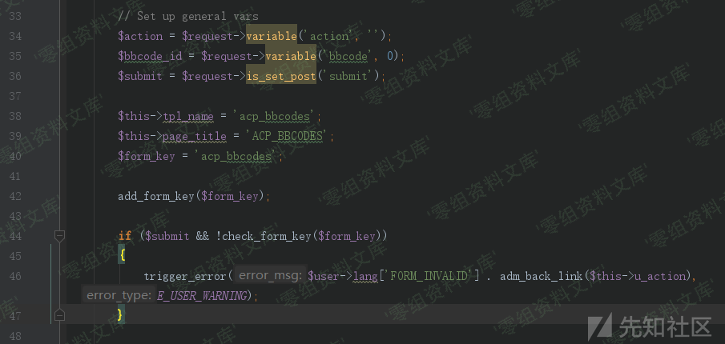PhpBB从sessionid泄露到CSRF到XSS/media/rId47.png)

可以看到，这里的确有对csrf进行防范

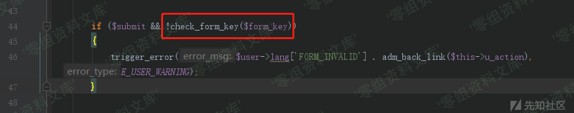PhpBB从sessionid泄露到CSRF到XSS/media/rId48.png)

但是问题出在了前面的\$submit参数：

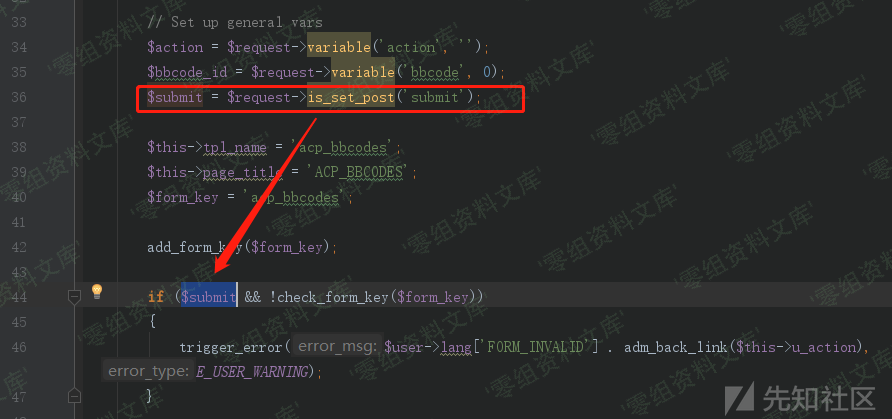PhpBB从sessionid泄露到CSRF到XSS/media/rId49.png)

只有提交的POST请求中存在submit参数，系统才会检查CSRF nonce。反之不会

因此，只要构造csrf时，请求中不带submit参数即可

\$action、\$bbcode\_id、\$bbcode\_match与\$bbcode\_tpl参数均有\$request-\>variable方式获取而来

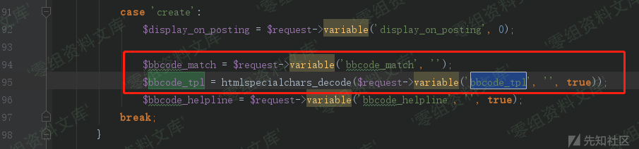PhpBB从sessionid泄露到CSRF到XSS/media/rId50.png)

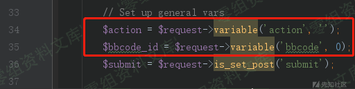PhpBB从sessionid泄露到CSRF到XSS/media/rId51.png)

variable方法不仅会获取POST中提交的变量，也会获取通过GET提交的变量，这意味着攻击者可以通过GET参数传参来进行CSRF攻击。

当csrf攻击成功后，恶意的bbcode将会被添加。之后攻击者可以滥用这个bbcode短代码，在消息、话题、帖子、回复中执行任意XSS代码。

参考链接
--------

> https://xz.aliyun.com/t/7829
