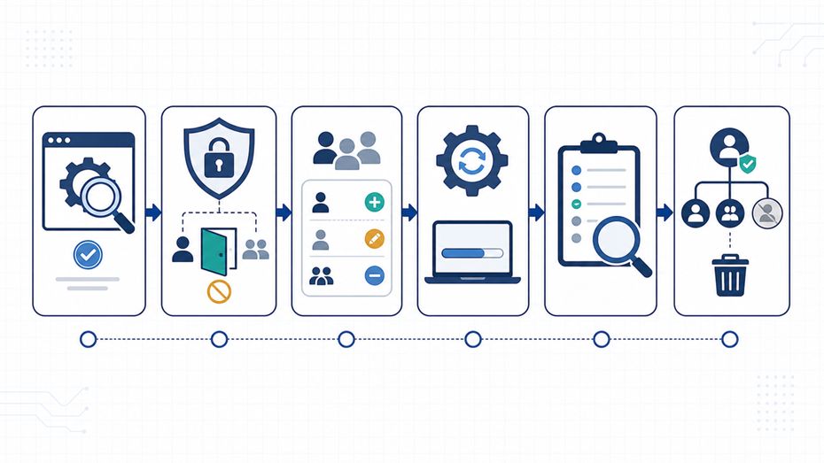

## 核对与使用边界

本文已按保存的全文审阅记录进行文字校订；本轮仅静态核对，未运行 PoC、请求目标或逐图验证。

适用条件与版本记录（来源主张，未列为明确更正的部分仍待权威资料核对）：authenticatedlocalapplicationaccount;4.1.4/relatedversionsunclear; group/permissionmanagement

- **证据待核（1）**：明确不提供接口/复现、事实推测观点分离较好，应当公告评论不按缺PoC硬判错误。保留原引用、截图位置和实验叙述；本项所缺材料未被补造，截图存在或作者宣称成功都不等于已核验其内容。

- **适用与权限边界（2）**：元数据漏主CVE/GHSA；本地账号应说明应用本地登录非需要OS本地权限。按此限制解释本文结论，版本相同不足以证明所需角色、入口、配置、依赖或可控参数均已满足；原操作和失败记录一并保留。

- **事实待核（3）**：受影响4.1.4或相关版本、修复尽快升级都不够可执行，需官方范围/安全版。该项尚不能从转载本身确定外部事实；下文相应编号、版本或修复说法只作为来源记录，不能据此判定部署受影响或已修复。明确更正另列于本节。

- **事实待核（4）**：CVE/GHSA同步可能不同已说明但无核验日期；三个原始/权威链接清晰。该项尚不能从转载本身确定外部事实；下文相应编号、版本或修复说法只作为来源记录，不能据此判定部署受影响或已修复。明确更正另列于本节。

历史原文标识：下文原技术材料按来源保留；仅本节明确确认的更正替代相应旧说法，标为待核的观察仍不是事实确认。

#  phpMyFAQ 权限漏洞提醒：后台账号不是“可信内网”，权限变更也要审计  
原创 tcode
                    tcode  字节脉搏实验室   2026-06-22 02:34  
  
  
  
事件概述  
  
    过去 24 小时的漏洞信息流中，phpMyFAQ 权限管理问题继续被多个漏洞情报源收录和传播。NVD 页面将其标识为 CVE-2026-56396，GitHub 安全公告对应 GHSA-985r-q3qp-299h。公开描述显示，受影响版本中存在权限管理不当问题，已登录的本地账号可能绕过预期授权，影响其他用户的用户组或权限设置。  
  
    需要特别说明：不同漏洞平台对 CVE 与 GHSA 的同步状态可能存在时间差。GitHub 公告页可能仍显示“无已知 CVE”，而 NVD 与聚合平台已使用 CVE-2026-56396 标识。企业在处置时应同时记录 CVE 与 GHSA，并以官方项目公告、NVD 与实际版本为准。  
  
    本文不提供接口名称、请求路径、复现步骤或利用细节。对公众号读者来说，更重要的是理解这类漏洞背后的治理问题：只要后台系统允许普通账号影响权限配置，内部授权边界就已经被打穿了一部分。  
  
  
  
  
核心事实  
  
    第一，漏洞类别属于权限管理不当。它不是传统意义上的远程命令执行，也不是直接的数据库泄露，但可能让低权限账号影响更高权限或其他账号的访问范围。  
  
    第二，受影响目标是开源 Web 知识库系统 phpMyFAQ。很多企业会把 FAQ、知识库、客服问答、内部文档放在类似系统中，里面往往包含产品信息、运维流程、客户问题和内部链接。  
  
第三，这类问题的风险高度依赖部署场景。如果系统只在内网开放、账号严格管理、后台操作有审计，影响会低一些；如果系统面向公网、账号众多、权限长期不清理，风险会明显上升。  
  
影响分析  
  
    对中小团队来说，知识库系统常被看作“低风险应用”，因为它不像支付系统或核心数据库那样敏感。但攻击者并不一定只寻找高价值系统，他们也会寻找能帮助理解组织结构、产品架构、客户问题和内部流程的入口。  
  
对运维人员来说，权限漏洞最大的麻烦是“看似后台内的小问题，实际影响信任边界”。如果一个普通账号能够影响用户组或权限，后续就可能扩大访问范围、查看不该看的内容、改变内容可信度，甚至配合其他漏洞形成更复杂的攻击链。  
  
    对安全团队来说，这类漏洞提醒我们：开源应用的风险管理不能只盯严重度评分。权限相关漏洞即使没有炫目的攻击效果，也可能在真实环境中变成横向移动和权限升级的支点。  
  
应对建议  
  
    立即确认版本。排查是否运行 phpMyFAQ 4.1.4 或相关受影响版本，并关注项目官方安全公告、NVD 与发行说明。  
  
    尽快升级或应用官方修复。不要依赖网络边界或 WAF 作为唯一缓解措施，因为授权逻辑问题通常需要应用本身修复。  
  
    收紧后台访问。将管理入口限制在可信网络或 VPN 后面，启用多因素认证，减少长期有效的共享账号。  
  
    审计用户组和权限变更。重点检查近期是否出现异常角色调整、陌生管理员、权限突然扩大的账号，以及不符合岗位需要的访问范围。  
  
    做最小权限清理。停用离职人员账号、测试账号和长期未登录账号；把编辑、审核、管理权限拆开，避免“一把钥匙开所有门”。  
  
    保留日志并设置告警。对用户组变更、权限升级、管理员新增、批量内容修改等动作做集中记录。  
  
    把知识库纳入资产管理。知识库、FAQ、文档站、工单系统都应进入漏洞扫描、补丁窗口和安全基线检查。  
  
事实、推测与观点区分  
  
    事实：NVD 已为 phpMyFAQ 权限管理问题建立 CVE-2026-56396 页面，GitHub 安全公告标识为 GHSA-985r-q3qp-299h，公开描述指向用户组或权限变更相关的授权缺陷。  
  
    合理推测：如果系统账号较多、权限管理混乱、后台暴露范围较大，该漏洞的实际影响会被放大。  
  
    本文观点：后台系统的“已登录用户”不应被等同为可信用户。权限变更必须像代码发布一样，被控制、记录和复核。  
  
结语  
  
    很多安全事故不是从最核心的系统开始，而是从一个“大家平时不太看”的后台开始。对开源 Web 应用来说，补丁是第一步，权限治理才是让补丁长期有效的基础。  
  
关键来源  
  
• NVD, CVE-2026-56396, phpMyFAQ Improper Privilege Management: https://nvd.nist.gov/vuln/detail/CVE-2026-56396  
  
• GitHub Security Advisory, GHSA-985r-q3qp-299h: https://github.com/thorsten/phpMyFAQ/security/advisories/GHSA-985r-q3qp-299h  
  
• VulnCheck, CVE-2026-56396: https://vulncheck.com/advisories/phpmyfaq-improper-privilege-management  
  
  
  

---

> 来源：gelusus/wxvl（微信公众号漏洞文章自动归档，原文见文首链接）
