## 核对与使用边界

本文已按保存的全文审阅记录进行文字校订；本轮仅静态核对，未运行 PoC、请求目标或逐图验证。

适用条件与版本记录（来源主张，未列为明确更正的部分仍待权威资料核对）：vulnerablepost-2019patchversion;unauthcallRenderPOST;tabbedcontainerincludeswidgetphp; furtherOScommandsdependruntime

- **事实待核（1）**：主漏洞17496与16759补丁绕过关系清楚，其余CVE仅Sora传播背景，不应归vBulletin实体。该项尚不能从转载本身确定外部事实；下文相应编号、版本或修复说法只作为来源记录，不能据此判定部署受影响或已修复。明确更正另列于本节。

- **结论使用边界（2）**：$_REQUESTS应$_REQUEST、file_put_content应file_put_contents，PHP片段智能引号/\[code\]转义无法原用。此项限制直接适用于下文对应结论；现有正文不足以作更宽泛推论，所列方法和原始证据均保留。

- **事实待核（3）**：受影响/安全版本只有5.5.5前后旧补丁和2020-08-10日期，没有17496精确分支范围。该项尚不能从转载本身确定外部事实；下文相应编号、版本或修复说法只作为来源记录，不能据此判定部署受影响或已修复。明确更正另列于本节。

- **证据待核（4）**：PoC报文与恶意流量全图；原Unit42链接精准可补可检索证据。保留原引用、截图位置和实验叙述；本项所缺材料未被补造，截图存在或作者宣称成功都不等于已核验其内容。

- **结论使用边界（5）**：明确Sora请求方法错误导致无效是重要负结果，不能将样本全计成功在野利用。此项限制直接适用于下文对应结论；现有正文不足以作更宽泛推论，所列方法和原始证据均保留。

- **来源与引用处置（6）**：IOC和10万安装需历史时间基准，广告/超长标题线清理。保留这部分来源材料并与技术结论分开；其引用或宣传内容不能补足本文漏洞的证据。

历史原文标识：下文原技术材料按来源保留；仅本节明确确认的更正替代相应旧说法，标为待核的观察仍不是事实确认。

# CVE-2020-17496 vBulletin Pre-Auth RCE 漏洞在野利用

<meta name="referrer" content="no-referrer"/>

> 本文由 [简悦 SimpRead](http://ksria.com/simpread/) 转码， 原文地址 [mp.weixin.qq.com](https://mp.weixin.qq.com/s/IDO7ptWRMBKX1rK\_XvRsog)

近日，Unit 42 研究人员发现了 vBulletin 预认证远程代码执行漏洞 CVE-2020-17496 的在野利用。该漏洞利用是对 CVE-2019-16759 漏洞补丁的绕过。由于有超过 10 万个基于 vBulletin 的网站，其中包括大企业和组织的论坛，研究人员建议用户尽快修复。

CVE-2020-17496 漏洞根源分析

============================================================================================================================================================================

模板渲染是 vBulletin 中的一个功能，可以将 XML 模板转化为 PHP 代码并执行。从 5.0 版本开始，vBulletin 开始接受 Ajax 的模板渲染请求。渲染是在函数 staticRenderAjax 中执行的。如图 1 所示，函数的参数值来源于 $\_REQUESTS，$\_GET 和 $\_POST。因为这些参数中的模板名和相关的配置都是用户可以控制的，因此可能会引发 CVE-2019-16759 漏洞。

函数 staticRenderAjax 中的值和参数来源于 $\_REQUESTS、$\_GET 和 $\_POST，如下图中红色箭头所示：

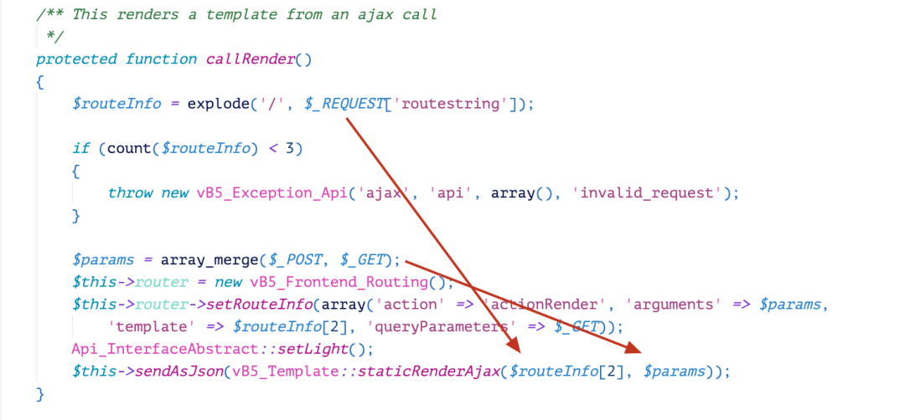

图 1. vBulletin <5.5.5 中的 callRender()

攻击者在操作参数 widgetConfig\[‘code’\] 中含有模板名 widget\_php 和恶意代码的 Ajax 请求时，渲染引擎就会将图 2 中的 XML 模板 widget\_php 转化为 PHP 代码中的字符串，然后由 eval 函数执行代码。因为生成的代码中有有一行 vB5\_Template\_Runtime::evalPhp(” . $widgetConfig\[‘code’\]，因此请求中的恶意代码就会执行。

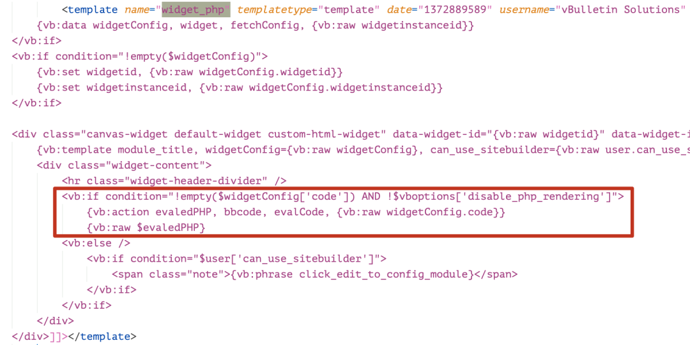

图 2. 模板 “widget\_php”

‍

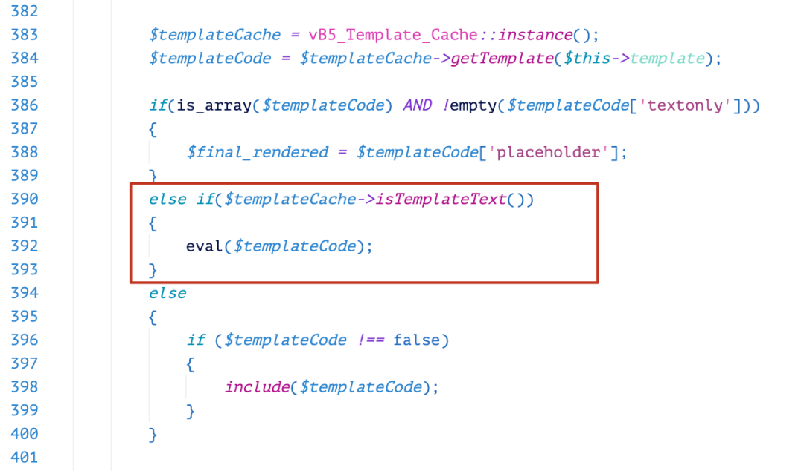

图 3. 从 XM‍p‍L 模板转化成的 PHP 代码‍

从 v5.5.5 版本开始，引入了函数 callRender()（如图 4 所示）来修复 CVE-2019-16759 漏洞。该函数引入了黑名单机制来检查模板名。如果名字是 widget\_php，模板就不会渲染请求的模板。

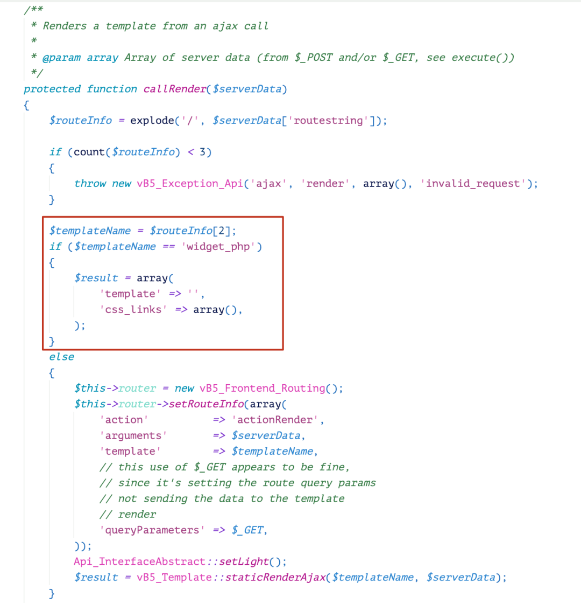

图 4. vBulletin ≥ 5.5.5 版本的 callRender()

另一个补丁是 evalPhp 函数会检查当前模板名。通过补丁，widget\_php 是唯一可以用来执行 PHP 代码的模板，如图 5 所示。

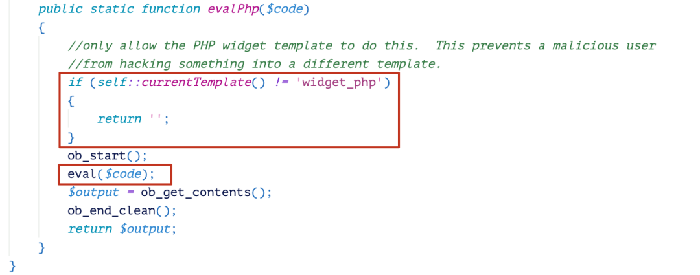  

图 5. 只有模板是 widget\_php 时，evalPhp() 才执行代码

该补丁使得 widget\_php 是唯一可以用于 PHP 代码执行的模板，同时还限制了对该模板的访问。但在最新的绕过中，研究人员发现还有一个模板可以用于加载该模板，即 widget\_tabbedcontainer\_tab\_panel 。

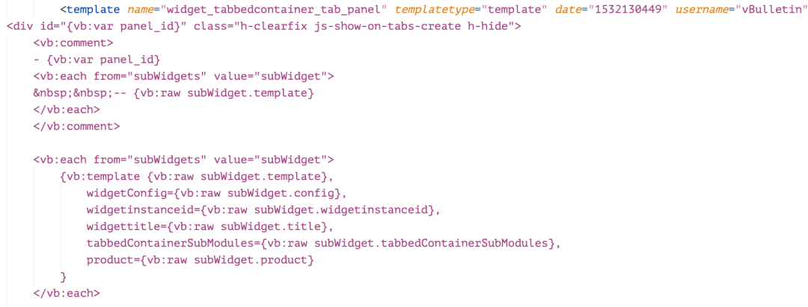

图 6. 模板 widget\_tabbedcontainer\_tab\_panel

模板 widget\_tabbedcontainer\_tab\_panel 如图 6 所示，是一个用来渲染多个子模板的模板。渲染该模板本身并不会直接导致远程代码执行。但模板渲染会引发其他子模板的渲染。

下面的代码是从 XML widget\_tabbedcontainer\_tab\_panel 模板渲染的 PHP 代码。之后，代码会被生成和执行。

\[code\]

$final\_rendered = ” . ”;

$panel\_id = ” . vB5\_Template\_Runtime::vBVar($id\_prefix).vB5\_Template\_Runtime::vBVar($tab\_num) . ”;

$final\_rendered .= ” . ” . ” . ‘ ‘ . ”;

if (isset($subWidgets) AND (is\_array($subWidgets) OR $subWidgets instanceof ArrayAccess))

{

foreach ($subWidgets AS $subWidget)

{

$final\_rendered .= ‘ ‘ . vB5\_Template\_Runtime::includeTemplate($subWidget\[‘template’\],array(‘widgetConfig’ => $subWidget\[‘config’\], ‘widgetinstanceid’ => $subWidget\[‘widgetinstanceid’\], ‘widgettitle’ => $subWidget\[‘title’\], ‘tabbedContainerSubModules’ => $subWidget\[‘tabbedContainerSubModules’\], ‘product’ => $subWidget\[‘product’\])) . ‘ ‘;

}

}$final\_rendered .= ” . ‘’;

\[/code\]

在 PHP 代码中，可以看出渲染引擎会遍历 subWidget 和 $subWidgets 中的配置，并生成一新的模板对象，然后渲染会生成其 PHP 代码。此时，如果字符串 widget\_php 被分配给变量 subWidget，恶意代码就会放置在 $widgetConfig\[‘code’\] 中，恶意代码就会像 CVE-2019-16759 漏洞一样执行。

**PoC**

基于以上分析，研究人员构造了一个漏洞利用代码来证明该功能。函数 callRender 的调用需要 POST HTTP 方法，如图 7 所示。

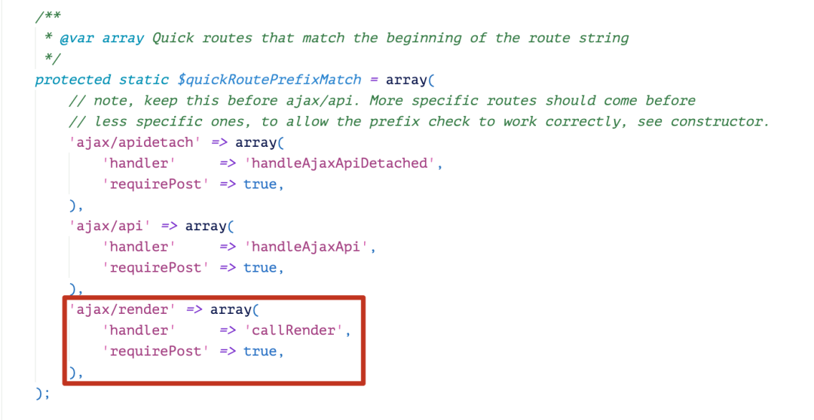

 图 7. 调用 callRender()

图 8 是含有 phpinfo() 运行结果的被黑页面，图 9 和图 10 是有类型效果的被操作的请求。在 URL 中，子模板名 widget\_php 和恶意代码 phpinfo();exit(); 都是数组 subWidget 的第一个元素。当后端处理该 URL 时，恶意代码就会执行。

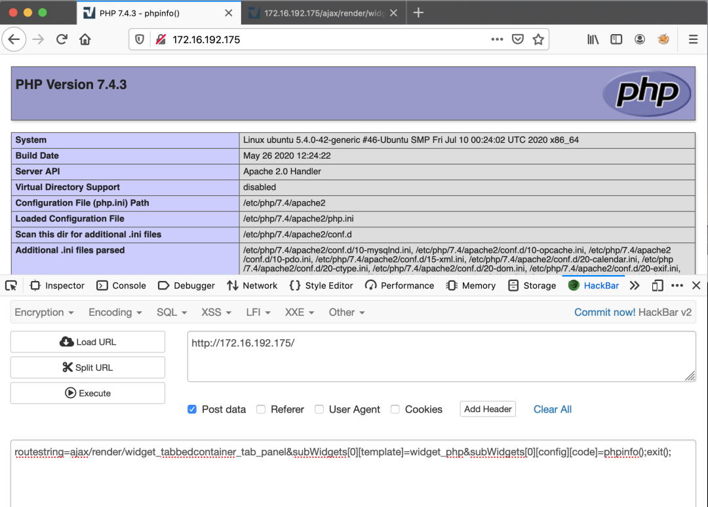

图 8. 漏洞利用复现 1

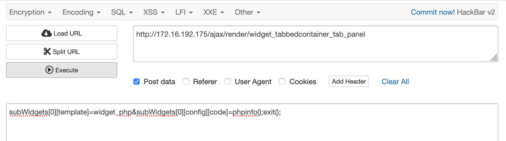

图 9. 漏洞利用复现 2

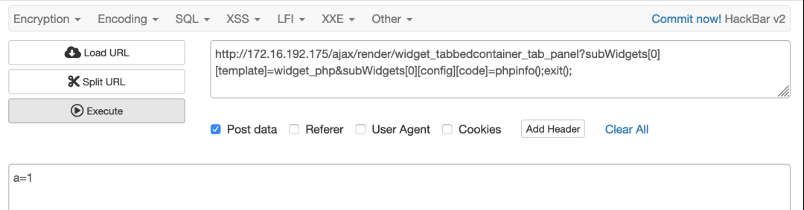

图 10. 漏洞利用复现 3

CVE-2020-17496 漏洞在野利用

============================================================================================================================================================================

研究人员在 8 月 10 日首次发现了该漏洞的在野漏洞，之后发现了来自不同 IP 地址的利用。

**扫描活动**

研究人员根据捕获的恶意流量分析发现，有多个源 IP 在进行扫描。扫描的目的是尝试找出有漏洞的站点并收集相关的信息，如图 11-15 所示。这些 payload 会尝试执行系统命令 echo and id，攻击者根据响应可以判断目标是否受该漏洞的影响。

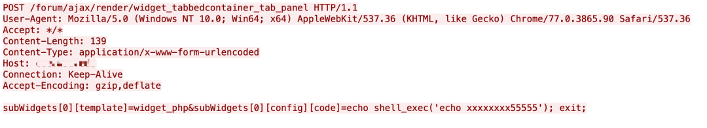

图 11. 在野漏洞利用 – 1

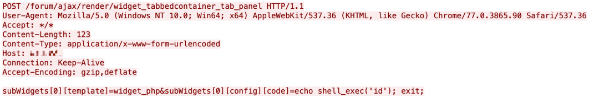

图 12. 在野漏洞利用 – 2

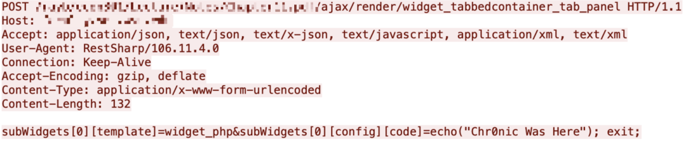

图 13. 在野漏洞利用 – 3

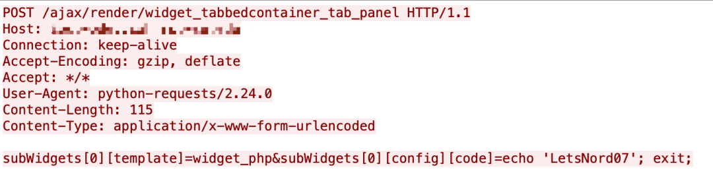

 图 14. 在野漏洞利用  – 4

**敏感文件读取**

也有攻击者尝试利用该漏洞来读取服务器端的文件。Payload 中含有 PHP 函数 shell\_exec() 来执行任意系统命令，用系统命令 cat ../../../../../../../../../../etc/passwd 来读取 / etc/passwd 的内容。流量如图 15 所示。一旦攻击成功，来自目标的敏感信息就会泄露。

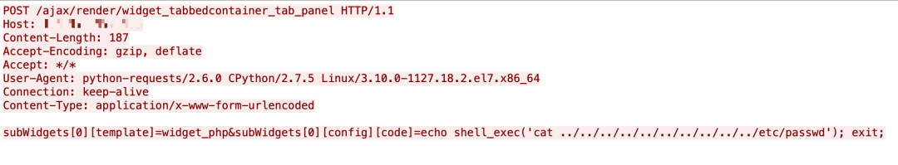

图 15. 在野漏洞利用– 5

**Web Shell**

也有攻击者利用该漏洞来安装 web shell。如图 16 所示，漏洞利用尝试用 PHP 函数 file\_put\_content() 将基于 PHP 的 web shell。

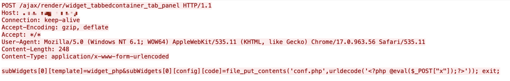

图 16. 在野漏洞利用  – 6

如图 17 所示，漏洞利用尝试下载一个 PHP 脚本到受害者服务器。Web shell 的代码如下所示。代码是一个上传页面，攻击者可以上传任意文件并执行随后的攻击活动。

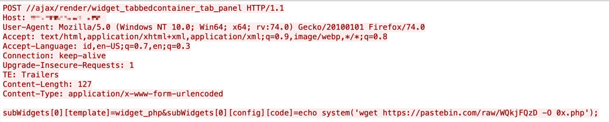

 图 17. 在野漏洞利用– 7

如图 18 所示，漏洞利用尝试写入一个 base64 编码的 PHP 代码到 web host 目录中。新页面会引发任意文件上传，然后攻击者可以执行随后的攻击步骤。

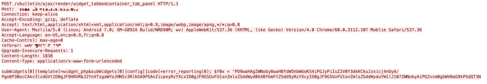

图 18. 在野漏洞利用  – 8

**下载 Shellbot**

也有攻击者利用该漏洞来下载基于 Perl 的脚本恶意软件 Shellbot，用 PHP 函数 shell\_exec() 来执行系统命令 wget，从 http://178\[.\]170\[.\]117\[.\]50/bot1 下载并运行恶意软件，payload 如图 19 所示：

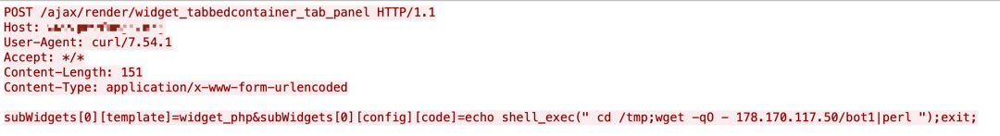

图 19. 在野漏洞利用– 9

脚本执行后，就连接到基于 IRC 的 C2 服务器，地址为 66\[.\]7\[.\]149\[.\]161:6667，加入 IRC 信道 < afk ，然后保持回复服务器的 ping，流量如图 20 所示。一旦从聊天信道中接收到命令，就可以执行相关的端口扫描代码、下载文件、执行系统命令、开始洪泛攻击等。

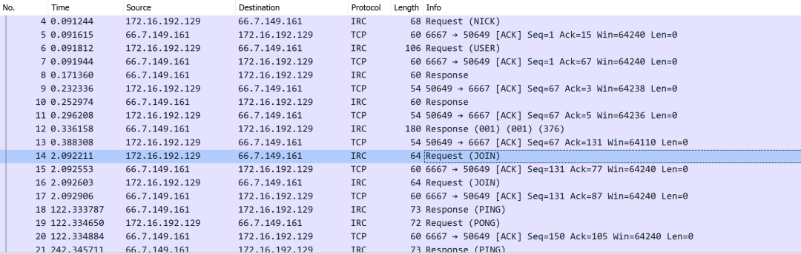

图 20. ShellBot 脚本执行期间的流量

**下载 Sora**

另外一个漏洞利用是从攻击者的服务器下载 Mirai 变种——Sora。但是由于使用的错误的 HTTP 方法，因此该 payload 是无效的。

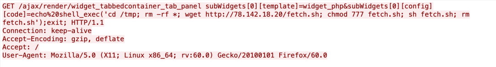

图 21. 在野漏洞利用– 10

根据对样本的分析，研究人员漏洞利用在传播过程中融合了 CVE-2020-5902、CVE-2020-1937、CVE-2020-10173、CVE-2020-10987、Netgear R700 RCE、Netlink GPON Router 1.0.11 RCE 和 CVE-2020-17496 漏洞利用等多个漏洞。

总结

=========================================================================================================================================================

目前已经有多个针对 vBulletin 预认证远程代码执行漏洞 CVE-2020-17496 的在野利用攻击。由于 vBulletin 的普及以及用户基数，使得其成为攻击者的主要目标。vBulletin 已于 2020 年 8 月 10 日发布了漏洞补丁，研究人员建议相关用户尽快更新补丁。

参考及来源：https://unit42.paloaltonetworks.com/cve-2020-17496/

---

> 来源：MrWQ/vulnerability-paper（https://github.com/MrWQ/vulnerability-paper）
