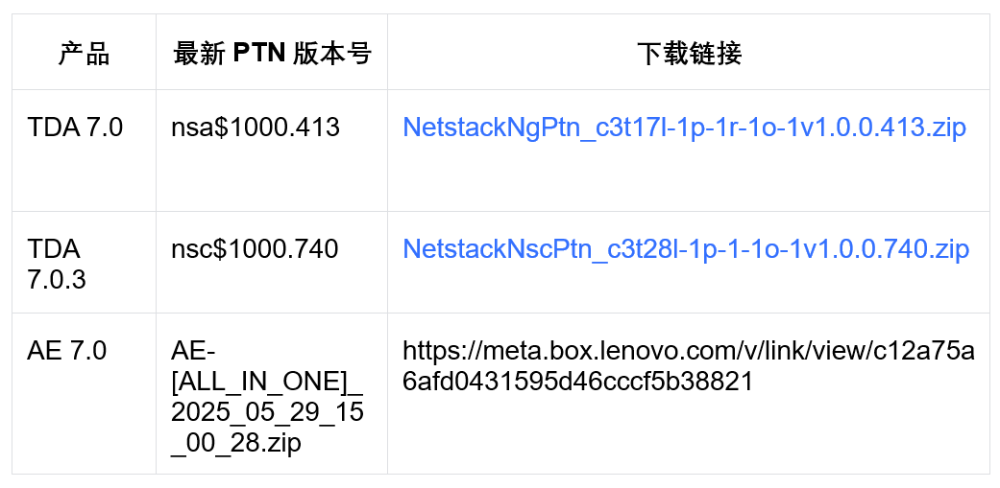

## 核对与使用边界

本文已按保存的全文审阅记录进行文字校订；本轮仅静态核对，未运行 PoC、请求目标或逐图验证。

适用条件与版本记录（来源主张，未列为明确更正的部分仍待权威资料核对）：5.1.0–6.0.3claimed; APIprotectedmethodaccess+templateinjection; PHPversion/confignotgiven

- **结论使用边界（1）**：元数据漏48828；两漏洞并列称独立RCE，需核是否前者访问绕过需串后者才完整RCE。此项限制直接适用于下文对应结论；现有正文不足以作更宽泛推论，所列方法和原始证据均保留。

- **结论使用边界（2）**：表格未发现在野与所引2025-05-28Qualys URL标题exploited-in-wild矛盾，文章6月3日需核状态。此项限制直接适用于下文对应结论；现有正文不足以作更宽泛推论，所列方法和原始证据均保留。

- **事实待核（3）**：版本范围扁平跨5/6且原厂公告提5.7.5安全补丁，须具体补丁级别/PHP依赖。该项尚不能从转载本身确定外部事实；下文相应编号、版本或修复说法只作为来源记录，不能据此判定部署受影响或已修复。明确更正另列于本节。

- **事实待核（4）**：CVSS3.0的10/9没有分别对应编号或向量来源。该项尚不能从转载本身确定外部事实；下文相应编号、版本或修复说法只作为来源记录，不能据此判定部署受影响或已修复。明确更正另列于本节。

- **来源与引用处置（5）**：有官方修复/研究/双方NVD链接但无请求，厂商规则广告非验证证据。保留这部分来源材料并与技术结论分开；其引用或宣传内容不能补足本文漏洞的证据。

历史原文标识：下文原技术材料按来源保留；仅本节明确确认的更正替代相应旧说法，标为待核的观察仍不是事实确认。

#  CVSS10分！vBulletin远程代码执行漏洞安全风险通告   
应急响应中心  亚信安全   2025-06-03 10:03  
  
  
  
  
今日，亚信安全CERT监控到安全社区研究人员发布安全通告，vBulletin 存在两个远程代码执行漏洞，编号为 CVE-2025-48827和CVE-2025-48828。  
  
  
这两个漏洞虽然在原理上有所不同，但都可以导致执行任意代码，并允许攻击者通过发送特制的请求进行利用。具体而言，CVE-2025-48827 允许未经身份验证的用户访问受保护的 API 控制器方法，从而实现任意代码执行，而 CVE-2025-48828 则利用模板条件的漏洞，通过代码注入实现远程代码执行。  
  
  
**目前官方已发布安全更新，亚信安全CERT建议受影响的客户尽快升级至最新版本。**  
  
  
vBulletin 是一个由 vBulletin Solutions, Inc. 开发的论坛软件平台，广泛用于构建在线社区和讨论论坛。自 2000 年推出以来，vBulletin 凭借其强大的功能和灵活的自定义选项，成为全球最受欢迎的论坛软件之一。它在用户体验和管理效率方面表现出色，支持多种模板和插件，适用于各种应用场景，包括个人博客、大型商业论坛及社交网站。  
  
  
**漏洞编号、类型、等级和评分**  
  
  
  
- CVE-2025-48827  
  
- CVE-2025-48828  
  
- 远程代码执行漏洞  
  
- 紧急  
  
- CVSS3.0： 10分  
  
- CVSS3.0： 9分  
  
  
  
  
**漏洞状态**  
  
  
  
<table><tbody><tr style="box-sizing: border-box;"><td data-colwidth="20.0000%" width="20.0000%" style="border-width: 1px;border-color: rgb(62, 62, 62);border-style: solid;background-color: rgb(145, 145, 145);box-sizing: border-box;padding: 0px;"><section style="margin: 5px 0%;box-sizing: border-box;"><section style="text-align: justify;padding: 0px 5px;font-size: 14px;color: rgb(255, 255, 255);box-sizing: border-box;">
<strong style="box-sizing: border-box;">细节</strong>
</section></section></td><td data-colwidth="117" width="20.0000%" style="border-width: 1px;border-color: rgb(62, 62, 62);border-style: solid;background-color: rgb(145, 145, 145);box-sizing: border-box;padding: 0px;"><section style="margin: 5px 0%;box-sizing: border-box;"><section style="padding: 0px 5px;font-size: 14px;color: rgb(255, 255, 255);box-sizing: border-box;">
<strong style="box-sizing: border-box;">PoC</strong>
</section></section></td><td data-colwidth="20.0000%" width="20.0000%" style="border-width: 1px;border-color: rgb(62, 62, 62);border-style: solid;background-color: rgb(145, 145, 145);box-sizing: border-box;padding: 0px;"><section style="margin: 5px 0%;box-sizing: border-box;"><section style="padding: 0px 5px;font-size: 14px;color: rgb(255, 255, 255);box-sizing: border-box;">
<strong style="box-sizing: border-box;">EXP</strong>
</section></section></td><td data-colwidth="20.0000%" width="20.0000%" style="border-width: 1px;border-color: rgb(62, 62, 62);border-style: solid;background-color: rgb(145, 145, 145);box-sizing: border-box;padding: 0px;"><section style="margin: 5px 0%;box-sizing: border-box;"><section style="padding: 0px 5px;font-size: 14px;color: rgb(255, 255, 255);box-sizing: border-box;">
<strong style="box-sizing: border-box;">在野利用</strong>
</section></section></td><td data-colwidth="20.0000%" width="20.0000%" style="border-width: 1px;border-color: rgb(62, 62, 62);border-style: solid;background-color: rgb(145, 145, 145);box-sizing: border-box;padding: 0px;"><section style="margin: 5px 0%;box-sizing: border-box;"><section style="padding: 0px 5px;font-size: 14px;color: rgb(255, 255, 255);box-sizing: border-box;">
<strong style="box-sizing: border-box;">复现情况</strong>
</section></section></td></tr><tr style="box-sizing: border-box;"><td data-colwidth="20.0000%" width="20.0000%" style="border-width: 1px;border-color: rgb(62, 62, 62);border-style: solid;box-sizing: border-box;padding: 0px;"><section style="margin: 5px 0%;box-sizing: border-box;"><section style="padding: 0px 5px;font-size: 14px;color: rgb(62, 62, 62);box-sizing: border-box;">
未公开
</section></section></td><td data-colwidth="117" width="20.0000%" style="border-width: 1px;border-color: rgb(62, 62, 62);border-style: solid;box-sizing: border-box;padding: 0px;"><section style="margin: 5px 0%;box-sizing: border-box;"><section style="padding: 0px 5px;font-size: 14px;color: rgb(62, 62, 62);box-sizing: border-box;">
公开
</section></section></td><td data-colwidth="20.0000%" width="20.0000%" style="border-width: 1px;border-color: rgb(62, 62, 62);border-style: solid;box-sizing: border-box;padding: 0px;"><section style="margin: 5px 0%;box-sizing: border-box;"><section style="padding: 0px 5px;font-size: 14px;color: rgb(62, 62, 62);box-sizing: border-box;">
未公开
</section></section></td><td data-colwidth="20.0000%" width="20.0000%" style="border-width: 1px;border-color: rgb(62, 62, 62);border-style: solid;box-sizing: border-box;padding: 0px;"><section style="margin: 5px 0%;box-sizing: border-box;"><section style="padding: 0px 5px;font-size: 14px;color: rgb(62, 62, 62);box-sizing: border-box;">
未发现
</section></section></td><td data-colwidth="20.0000%" width="20.0000%" style="border-width: 1px;border-color: rgb(62, 62, 62);border-style: solid;box-sizing: border-box;padding: 0px;"><section style="margin: 5px 0%;box-sizing: border-box;"><section style="padding: 0px 5px;font-size: 14px;color: rgb(62, 62, 62);box-sizing: border-box;">
未复现
</section></section></td></tr></tbody></table>  
  
  
**受影响版本**  
  
  
  
- 5.1.0<=vBulletin<=6.0.3  
  
  
  
  
产品解决方案  
  
  
  
目前亚信安全怒狮引擎已第一时间新增了检测规则，支持CVE-2025-48827/48828漏洞的检测，请及时更新TDA产品的特征库到最新版本。规则编号：106066512，规则名称：vBulletin replaceAdTemplat远程代码执行漏洞(CVE-2025-48827/CVE-2025-48828)。  
  
  
更新方式如下：  
  
  
TDA产品在线更新方法：登录系统-》系统管理-》系统升级-》特征码更新；  
  
AE产品在线更新方法：登录系统-》管理-》更新-》特征码更新。  
  
TDA、AE产品离线升级PTN包下载链接如下：  
  
  
  
  
详细下载地址请后台咨询  
  
  
**修复建议**  
  
  
  
目前厂商已发布升级补丁以修复漏洞，补丁获取链接：  
  
  
https://forum.vbulletin.com/forum/vbulletin-announcements/vbulletin-announcements_aa/4491049-security-patch-released-for-vbulletin-6-x-and-5-7-5  
  
  
**参考链接**  
  
  
  
- https://vulners.com/cve/CVE-2025-48828  
  
- https://karmainsecurity.com/dont-call-that-protected-method-vbulletin-rce  
  
- https://nvd.nist.gov/vuln/detail/CVE-2025-48827  
  
- https://nvd.nist.gov/vuln/detail/CVE-2025-48828  
  
- https://threatprotect.qualys.com/2025/05/28/vbulletin-remote-code-execution-vulnerabilities-exploited-in-the-wild-cve-2025-48827-cve-2025-48828  
  
- https://vulners.com/cve/CVE-2025-48827  
  
  
  
  
本文发布的补丁下载链接均源自各原厂官方网站。尽管我们努力确保官方资源的安全性，但在互联网环境中，文件下载仍存在潜在风险。为保障您的设备安全与数据隐私，敬请您在点击下载前谨慎核实其安全性和可信度。  
  
  
  
  
了解亚信安全，请点击  
**“阅读原文”**  
  

---

> 来源：gelusus/wxvl（微信公众号漏洞文章自动归档，原文见文首链接）
