## 核对与使用边界

本文已按保存的全文审阅记录进行文字校订；本轮仅静态核对，未运行 PoC、请求目标或逐图验证。

适用条件与版本记录（来源主张，未列为明确更正的部分仍待权威资料核对）：IPloginfilter;membercookie; backenddepartmentnewname different; per-entryroles

- **适用与权限边界（1）**：第三/第四都是edit_admin_department未过滤id，同漏洞被包装为两篇，当前不应算四独立原语。按此限制解释本文结论，版本相同不足以证明所需角色、入口、配置、依赖或可控参数均已满足；原操作和失败记录一并保留。

- **代码与转录边界（2）**：部门SQL文本在where department处截断，缺关键id与闭合，639/640更完整。相应原代码作为存在此问题的历史样本保留，不能直接当作可运行、成功复现的 PoC；缺失内容需回原稿核对，不据此补造可执行攻击链。

- **凭据与会话边界（3）**：会员cookie篇称抓任何页面/直接加单引号，与639编码userid路线/2.0.2版本不同，需核2.0与2.0.2差异不能强合并。抓包中的会话不能视为未认证访问证明。需重新取得授权测试会话，不能复用文中值。

- **凭据与会话边界（4）**：IP与cookie段复用同数据库名截图、最后后台复用前台SQLmap图，需视觉核实证据归属。抓包中的会话不能视为未认证访问证明。需重新取得授权测试会话，不能复用文中值。

- **来源与引用处置（5）**：大量广告/来源聚合，目录文库应移Yunyecms；关联638–641但保留真实版本/编码差异。保留这部分来源材料并与技术结论分开；其引用或宣传内容不能补足本文漏洞的证据。

历史原文标识：下文原技术材料按来源保留；仅本节明确确认的更正替代相应旧说法，标为待核的观察仍不是事实确认。

# 文库yunyeCMS 漏洞合集

<meta name="referrer" content="no-referrer"/>

> 本文由 [简悦 SimpRead](http://ksria.com/simpread/) 转码， 原文地址 [mp.weixin.qq.com](https://mp.weixin.qq.com/s/43eW8OQ8fFtlqCTqbZM8HQ)

**高质量的安全文章，安全 offer 面试经验分享**

**尽在 # 掌控安全 EDU #**

**作者：掌控安全 - 柚子**

### 一、yunyeCMS 前台注入漏洞 (一)  

#### 环境搭建

云业 CMS 内容管理系统是由云业信息科技开发的一款专门用于中小企业网站建设的 PHP 开源 CMS，可用来快速建设一个品牌官网 (PC，手机，微信都能访问)，后台功能强大，安全稳定，操作简单。

源码下载：https://down.easck.com/code/60244.html

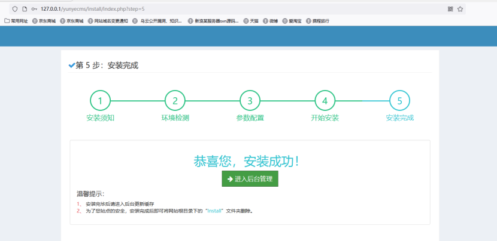

#### 漏洞寻找

下载源码，搭建起来，打开登录页面。

```
http://127.0.0.1/yunyecms/admin.php?c=login&=
```

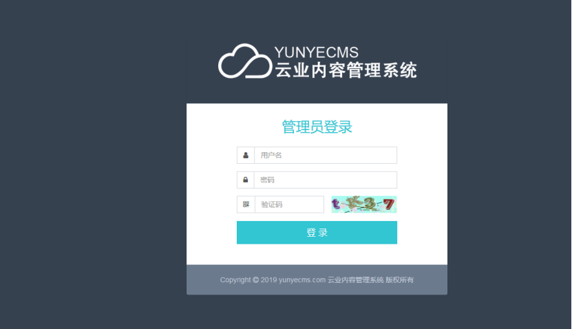

打开 Seay 源代码审计工具，分析代码。  

经过一番寻找与 “提示”，发现 getip() 方法获取 ip 没有进行过滤，可能有戏。

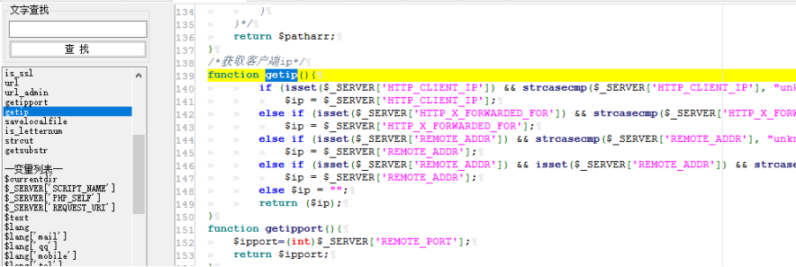  
  

搜索 getip() 函数，发现 login.php 调用了该函数，变量为 $logiparr。

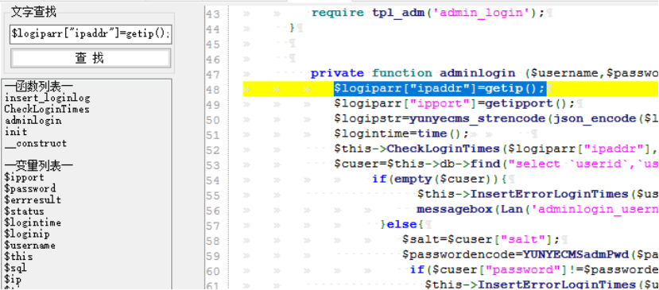  

跟踪该变量，发现 CheckLoginTimes 函数调用该变量。

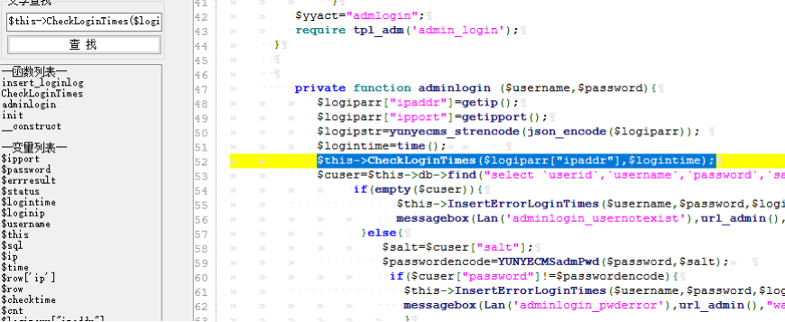  

去到该函数定义处，发现我们的 ip 变量没有进行任何过滤直接由 GetCount 函数执行。

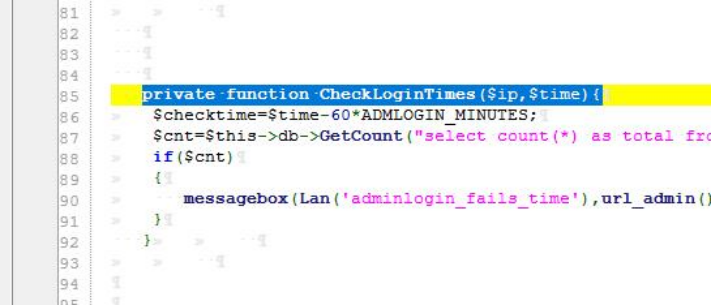

#### 漏洞复现

```
$cnt=$this->db->GetCount("select count(*) as total from `#yunyecms_adminloginfail`  where ip='$ip' and failtimes>=".ADMLOGIN_MINUTES." and lastlogintime>$checktime limit 1");
```

可以看出，我们可以构造该 ip 变量达到注入目的，打开 burp 抓包。

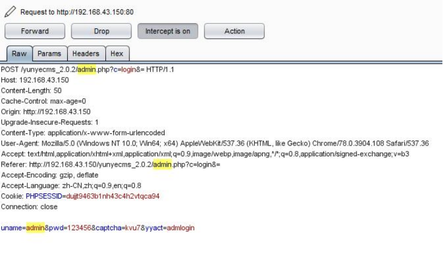  
发送到 Repeater 模块，构造参数，可以看到 sql 报错。

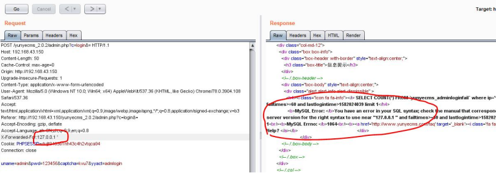  
  

进一步利用，得到数据库名称，漏洞存在。

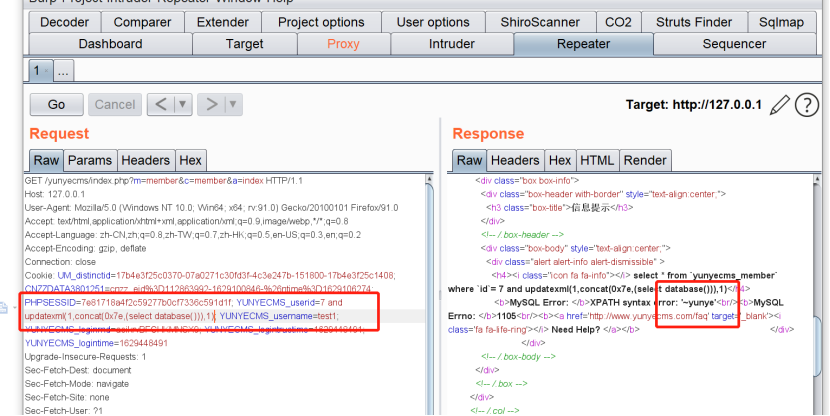

#### 漏洞利用

将数据包发送给 sqlmap 去跑可以拿到更多信息

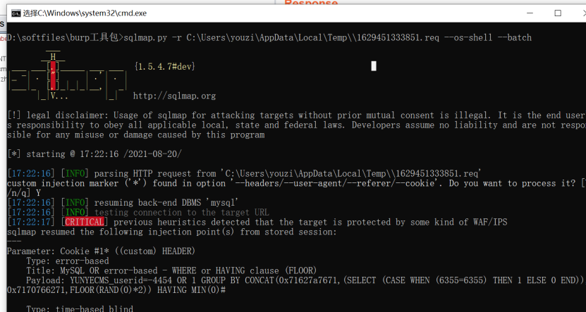

### 二、yunyeCMS 前台注入漏洞 (二)

#### 漏洞描述

云业 CMS 内容管理系统是由云业信息科技开发的一款专门用于中小企业网站建设的 PHP 开源 CMS，可用来快速建设一个品牌官网 (PC，手机，微信都能访问)，后台功能强大，安全稳定，操作简单。

yunyecms cookie 参数存在 sql 注入漏洞，攻击者可以通过利用漏洞获取数据库敏感信息。

#### 影响版本

#### yunyecms 2.0

#### 漏洞发现

1. 注册一个普通用户

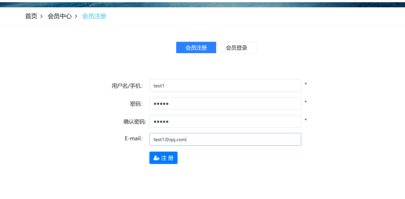

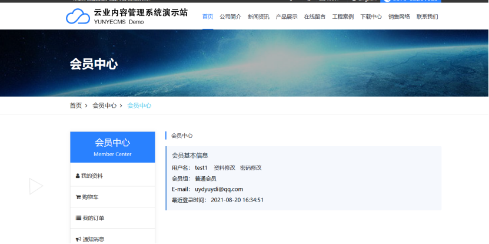

2. 然后直接进行抓包，抓任何页面的数据包都可行。

在 cookie 处 YUNYECMS_userid 参数这里找到存在 SQL 注入漏洞。

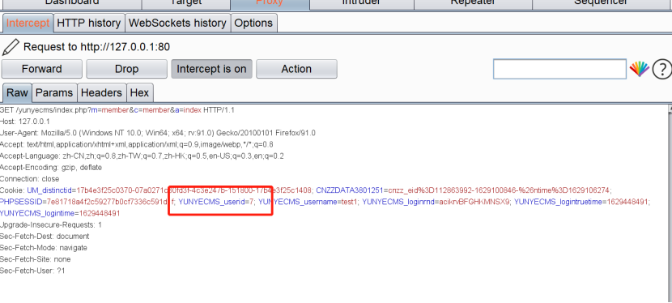  
用最简单的方法，在这里手注一个单引号，返回包里的报错信息都是与数据库相关的，所以可以判断是存在 sql 注入。

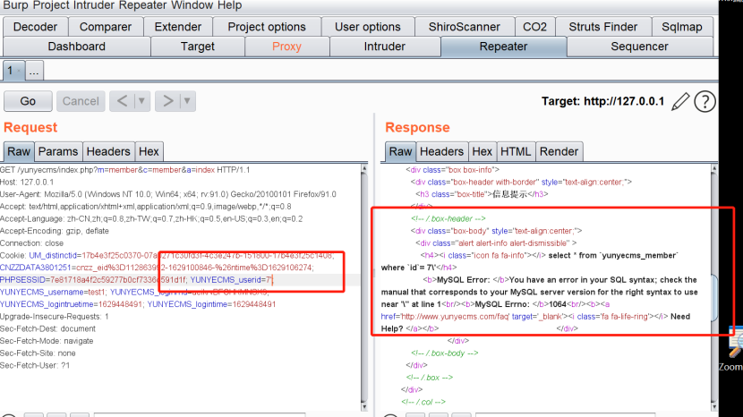  
尝试手工注入找到数据库库名

  
  

3. 也可以交给 sqlmap 跑一跑，把注入点的地方用 * 号标注

这样也能跑到其他数据库

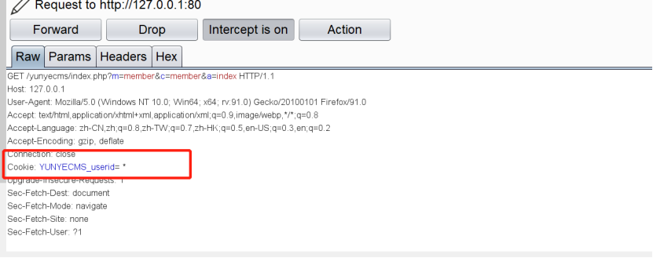

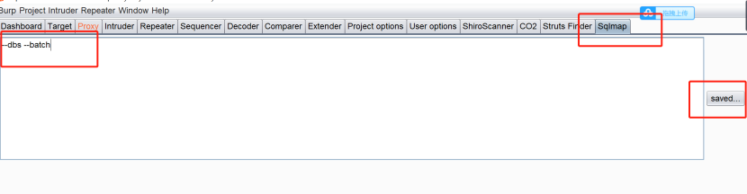

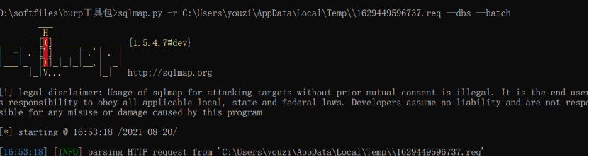

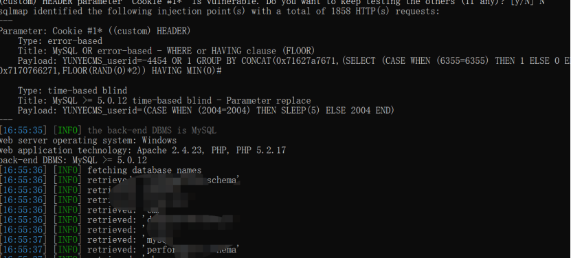

### 三、yunyeCMS 后台注入漏洞 (一)

#### 漏洞分析

发现 core/admin/deparment.php 文件，其中 id 值是通过 post 直接获取的

然后被 edit_admin_department() 调用。

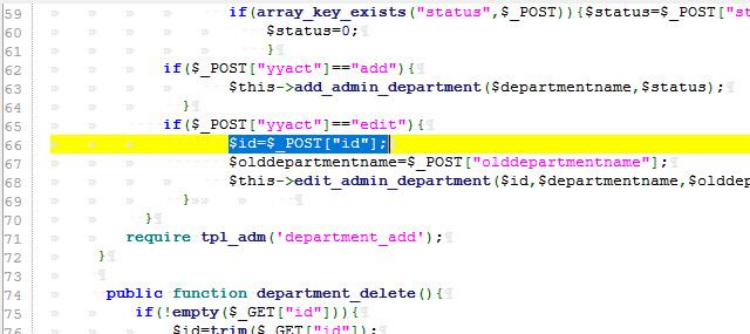  
  

去到 edit_admin_department() 函数定义处，发现过滤语句。

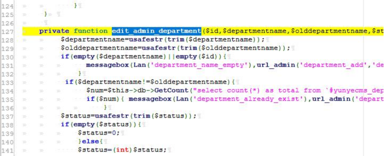  

但是仔细一看

发现代码只是过滤了 departmentname 和 olddepartmentname 两个变量

放过了我们的 id 变量，只是判断 id 值是否为空。  

```
if($departmentname!=$olddepartmentname){
        $num=$this->db->GetCount("select count(*) as total from `#yunyecms_department` where department);
if($num){ messagebox(Lan('department_already_exist'),url_admin('department_add','','',$this->hashurl['usvg']),"warn");}
}
```

从代码可以看出，如果 departmentname 的值不等于 olddepartmentname 就执行 sql 语句，我们的 id 值没有任何过滤出现在 sql 语句中，应该有注入无疑了。

#### 漏洞复现

找到 core/admin/deparment.php 所在的页面，即后台的部门管理处。

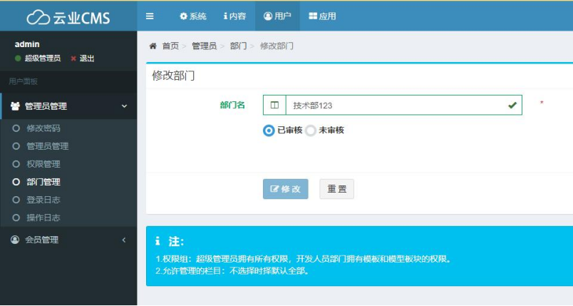  

随意修改部门名字，只要前后名字不一致就行，然后抓取数据包。

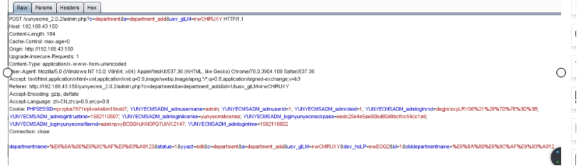  
  

发送到 Repeater 模块，构造参数，可以看到 sql 报错。  

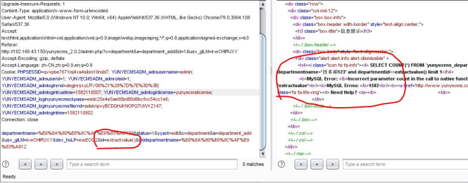

### 四、yunyeCMS 后台注入漏洞 (二)

#### 漏洞分析

漏洞出现在在后台文件 department.php 中，department_add 函数对 GET 和 POST 参数先进行了是否 empty 判断

最终将传入的几个参数传给了 edit_admin_department。

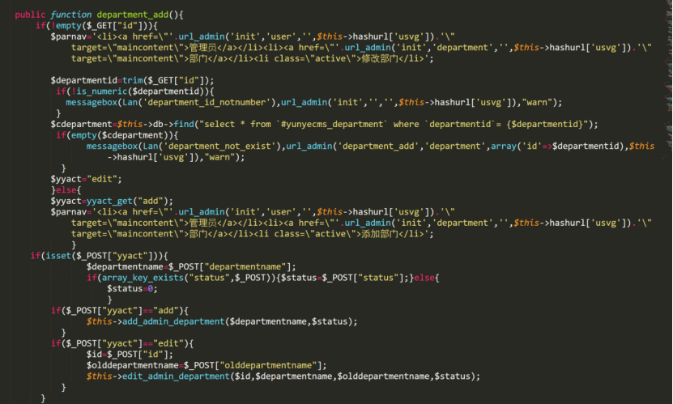  
  

跟入 edit_admin_department，对参数依次进行了处理，

但是发现只有 $departmentnam,$olddepartmentname 进行了 usafestr 安全过滤，漏网的 $id 拼接到了 sql 语句中执行。

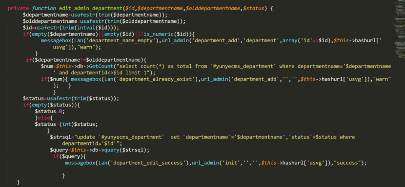  

最终导致了 sql 注入。

#### 漏洞复现

这个和上述三种情况相同，直接交给 sqlmap 去跑。


  

**回顾往期内容**

[Xray 挂机刷漏洞](http://mp.weixin.qq.com/s?__biz=MzUyODkwNDIyMg==&mid=2247504665&idx=1&sn=eb88ca9711e95ee8851eb47959ff8a61&chksm=fa6baa68cd1c237e755037f35c6f74b3c09c92fd2373d9c07f98697ea723797b73009e872014&scene=21#wechat_redirect)  

[POC 批量验证 Python 脚本编写](http://mp.weixin.qq.com/s?__biz=MzUyODkwNDIyMg==&mid=2247504664&idx=1&sn=e88c77671f252631de939c154de075db&chksm=fa6baa69cd1c237f1c1f35f8b434874341f7fe077452834dac0e289addf9ac56fcbf7df5a8a1&scene=21#wechat_redirect)

[实战纪实 | SQL 漏洞实战挖掘技巧](http://mp.weixin.qq.com/s?__biz=MzUyODkwNDIyMg==&mid=2247497717&idx=1&sn=34dc1d10fcf5f745306a29224c7c4008&chksm=fa6b8e84cd1c0792f0ec433310b24b4ccbe53354c11f334a1b0d5f853d214037bdba7ea00a9b&scene=21#wechat_redirect)  

[渗透工具 | 红队常用的那些工具分享](http://mp.weixin.qq.com/s?__biz=MzUyODkwNDIyMg==&mid=2247495811&idx=1&sn=122c664b1178d563ef5e071e0bfd7e28&chksm=fa6b89f2cd1c00e4327d6516c25fcfd2616cf7ae8ddef2a6e869b4a6ab6afad2a6788bf0d04a&scene=21#wechat_redirect)  

[代码审计 | 这个 CNVD 证书拿的有点轻松](http://mp.weixin.qq.com/s?__biz=MzUyODkwNDIyMg==&mid=2247503150&idx=1&sn=189d061e1f7c14812e491b6b7c49b202&chksm=fa6bb45fcd1c3d490cdfa59326801ecb383b1bf9586f51305ad5add9dec163e78af58a9874d2&scene=21#wechat_redirect)

 [代理池工具撰写 | 只有无尽的跳转，没有封禁的 IP！](http://mp.weixin.qq.com/s?__biz=MzUyODkwNDIyMg==&mid=2247503462&idx=1&sn=0b696f0cabab0a046385599a1683dfb2&chksm=fa6bb717cd1c3e01afc0d6126ea141bb9a39bf3b4123462528d37fb00f74ea525b83e948bc80&scene=21#wechat_redirect)
-----------------------------------------------------------------------------------------------------------------------------------------------------------------------------------------------------------------------------------------------------


扫码白嫖视频 + 工具 + 进群 + 靶场等资料


 **扫码白嫖****！**

 **还有****免费****的配套****靶场****、****交流群****哦！**

---

> 来源：MrWQ/vulnerability-paper（https://github.com/MrWQ/vulnerability-paper）
