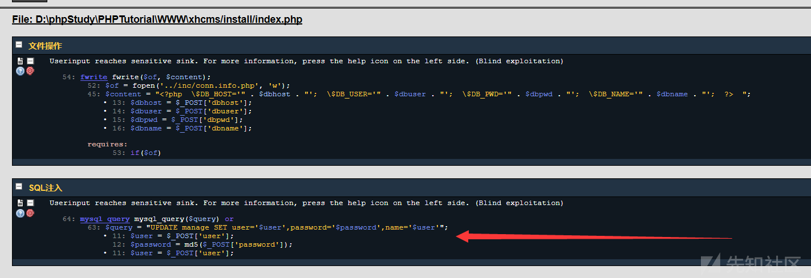
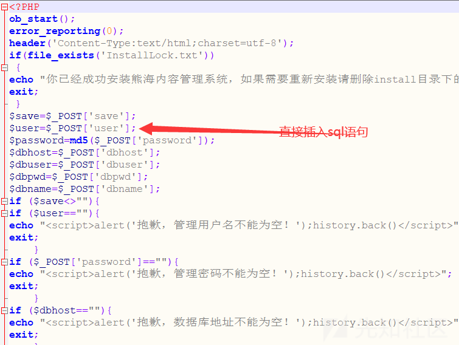
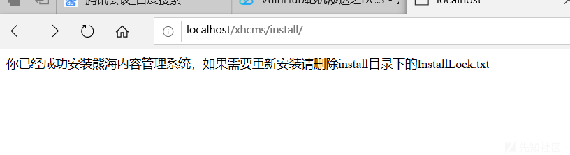
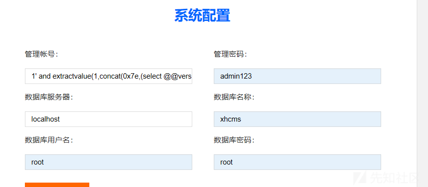
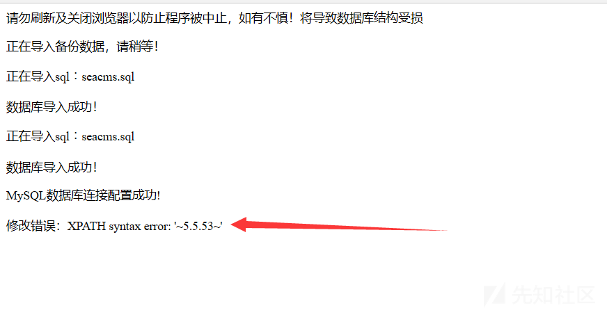

## 核对与使用边界

本文已按保存的全文审阅记录进行文字校订；本轮仅静态核对，未运行 PoC、请求目标或逐图验证。

适用条件与版本记录（来源主张，未列为明确更正的部分仍待权威资料核对）：installLockalreadyabsent orseparatearbitrarydelete;installerDBconnection; UPDATEusernameinjection

- **操作与副作用边界（1）**：明确先删除安装锁是额外独立能力，不能宣传直接匿名安装SQLi。保留原步骤及请求方法。执行条件包括隔离且获授权的可恢复环境、预先记录相关文件/账号/配置/业务记录状态；响应完成不能等同无副作用，恢复时须核对该操作涉及的实际对象。

- **代码与转录边界（2）**：载荷1' extractvalue(...)缺连接/运算符，需对实际UPDATE上下文核语法，源码仅图。相应原代码作为存在此问题的历史样本保留，不能直接当作可运行、成功复现的 PoC；缺失内容需回原稿核对，不据此补造可执行攻击链。

- **结论使用边界（3）**：后台安装会改数据，测试不应当普通查询验证。此项限制直接适用于下文对应结论；现有正文不足以作更宽泛推论，所列方法和原始证据均保留。

- **事实待核（4）**：缺完整请求/版本/修复，有xz7629共同来源；同703不同阶段保留。该项尚不能从转载本身确定外部事实；下文相应编号、版本或修复说法只作为来源记录，不能据此判定部署受影响或已修复。明确更正另列于本节。

历史原文标识：下文原技术材料按来源保留；仅本节明确确认的更正替代相应旧说法，标为待核的观察仍不是事实确认。

# 安装流程中存在SQL注入

#### 漏洞详情： ####
漏洞位置：/install/index.php

RIPS审计出现sql注入，跟进文件比对审计结果。

通读代码发现代码逻辑如下：

1.检测是否生成了InstallLock.txt文件

2.执行sql语句

审计发现这里sql语句确实没有经过过滤，直接插入update的sql语句，导致sql注入。

漏洞演示：
payload:

    
    1' extractvalue(1,concat(0x7e,(select @@version),0x7e))#
1.根据源码可知，我们首先需要删除安装目录下的installLock.txt文件（如果网站上存在一个任意文件删除漏洞）

2.删除后我们重新进入安装界面。

在管理账号一栏输入我们的payload，也就是我们常见的报错注入方法，

之后我们提交：

发现在修改错误一栏发现爆出我们的Mysql版本，证明漏洞存在。

### 参考链接 ###
https://xz.aliyun.com/t/7629

---

> 来源：白阁文库 BaizeSec/bylibrary
